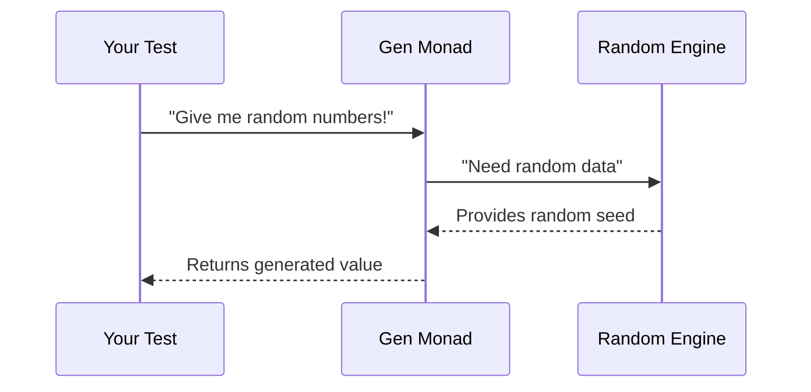

# Chapter 1: Gen Monad and Combinators

Welcome to property-based testing! Imagine you're testing a function that works with numbers. Instead of manually writing test cases like `testWith(5)` and `testWith(42)`, wouldn't it be great to automatically generate hundreds of test inputs? That's exactly what the `Gen` monad helps us do - it's like a magical factory that produces random test data!

## What is the Gen Monad?

Think of `Gen` as a recipe for creating random values. When you run a `Gen` recipe, it produces random outputs like numbers, strings, or even custom data structures. Here's the simplest generator:

```idris
-- Creates a generator that always returns 5
alwaysFive : Gen em Nat
alwaysFive = pure 5
```

But the real magic happens when we create *random* generators:

```idris
-- Generates any random integer
anyInt : Gen em Int
anyInt = chooseAny

-- Generates random numbers between 1-10
smallNumbers : Gen em Nat
smallNumbers = choose (1, 10)
```

Notice the `em` parameter? That's Idris tracking whether our generator might produce *no values* at all (`MaybeEmpty`) or will *always* produce values (`NonEmpty`). This helps prevent runtime errors!

## Basic Generators

Let's meet our toolbox starters:

```idris
-- Always succeeds with value 7
luckySeven : Gen NonEmpty Nat
luckySeven = pure 7

-- Might produce nothing
emptyGenerator : Gen0 String
emptyGenerator = empty

-- Random boolean (True/False)
randomBool : Gen NonEmpty Bool
randomBool = chooseAny
```

## Combining Generators

Here's where things get exciting! We can combine small generators into complex ones:

```idris
-- 50% chance of True, 50% chance of False
boolGenerator : Gen NonEmpty Bool
boolGenerator = elements [True, False]

-- Random number OR random boolean
numberOrBool : Gen NonEmpty (Either Nat Bool)
numberOrBool = oneOf [ Left <$> smallNumbers
                     , Right <$> randomBool ]
```

The `oneOf` combinator picks one generator from the list with equal probability. For weighted choices, use `frequency`:

```idris
-- 70% chance of number, 30% chance of boolean
weightedChoice : Gen NonEmpty (Either Nat Bool)
weightedChoice = frequency [ (7, Left <$> smallNumbers)
                           , (3, Right <$> randomBool) ]
```

## Running Generators

Generators don't do anything until we run them! Here's how to get values out:

```idris
-- Get one random number (guaranteed to succeed)
getNumber : IO Nat
getNumber = pick1 smallNumbers

-- Try getting a value (might fail if empty)
tryGetValue : IO (Maybe String)
tryGetValue = pick emptyGenerator
```

## Behind the Scenes

How does `Gen` work internally? Imagine it as an assembly line:



The `Gen` structure tracks:
1. How to generate values (`Pure`, `Raw`, `OneOf`)
2. Whether it might be empty (`Empty`)
3. Probability distributions (`frequency` weights)

## What We've Learned

Today we've discovered:
- `Gen` is a recipe for random data generation
- Basic generators (`pure`, `choose`, `chooseAny`)
- Combinators for building complex generators (`oneOf`, `frequency`)
- How to run generators with `pick1` and `pick`
- How Idris tracks emptiness with `NonEmpty`/`MaybeEmpty`

Ready to build more powerful generators? Let's explore the [Utility Toolkit](02_utility_toolkit_.md) next!

---

Generated by [AI Codebase Knowledge Builder](https://github.com/The-Pocket/Tutorial-Codebase-Knowledge)