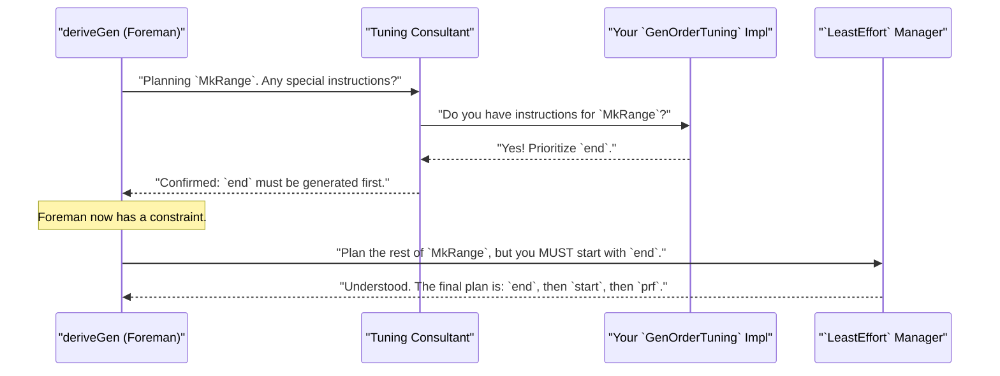
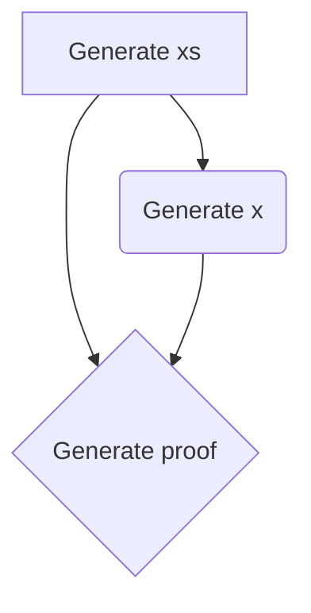
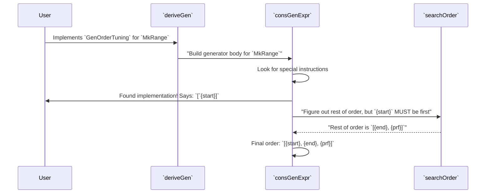

# Chapter 12: Derivation Tuning

## Introduction

Derivation Tuning provides fine-grained control over `DepTyCheck`'s automatic generator derivation process, allowing you to optimize generation strategies for specific testing needs.

While `deriveGen`'s automatic analysis works perfectly for most cases, sometimes you know something that the automatic strategy doesn't. Derivation Tuning gives you "control knobs" to fine-tune the derivation process, providing ultimate control over how your test data is generated.

## Core Concepts

### The Need for Tuning
- When default derivation strategies are inefficient
- When specific test data distributions are required
- When complex dependent types need custom generation orders

### Tuning Interfaces Overview
- `GenOrderTuning`: Controls argument generation sequence
- `ProbabilityTuning`: Adjusts constructor selection likelihood

## GenOrderTuning: Controlling Generation Order

### Purpose and Use Cases
- Optimizing generation for dependent types
- Resolving complex dependency constraints
- Improving generation performance

`deriveGen` is clever at figuring out generation order for constructor arguments, especially for dependent types. But sometimes data types are so constrained that automatic analysis struggles.

### The Problem: Inefficient Generation Order

Consider a type representing a pair where the first number must be less than the second:

```idris
data LtPair : Type where
  MkLtPair : (n : Nat) -> (m : Nat) -> (prf : n `LT` m) -> LtPair
```

The default strategy might be:
1. Generate a random `n` (say, `10`)
2. Generate a random `m` (say, `5`)
3. Try to generate proof `prf` for `10 < 5`

This third step is impossible! The generator will fail and have to try again. It might get lucky eventually, but it will waste a lot of time generating invalid pairs. This is like trying to build a house by putting on the roof before building the walls—the order is wrong!

A better strategy is:
1. Generate `m` first
2. Generate `n` guaranteed to be less than `m`
3. Generate the proof (now easy)

### Interface Definition

These interfaces are defined in `src/Deriving/DepTyCheck/Gen/Tuning.idr`:

```idris
-- From: src/Deriving/DepTyCheck/Gen/Tuning.idr

public export
interface GenOrderTuning (0 n : Name) where
  -- A check to make sure `n` is a real constructor.
  isConstructor : (con : IsConstructor n ** GenuineProof con)

  -- The function where you define the generation order.
  deriveFirst : (givenTyArgs : List ...) ->
                (givenConArgs : List ...) ->
                List (ConArg con.conInfo)
```

This interface allows you to "plug in" your tuning rules. Your implementation provides the logic for `deriveFirst`, which the derivation engine calls to get its instructions.

### Implementation Patterns

Here's how to implement `GenOrderTuning` for our `LtPair` example:

```idris
import Deriving.DepTyCheck.Gen.Tuning

-- For the `MkLtPair` constructor...
instance GenOrderTuning "MyApp.LtPair".MkLtPair where
  isConstructor = itIsConstructor
  -- Generate arg `{m}` first, then arg `2` (the proof). `n` will be handled later.
  deriveFirst _ _ = [`{m}, 2]
```

**Breaking down the implementation:**
- `instance GenOrderTuning "MyApp.LtPair".MkLtPair`: Targets the `MkLtPair` constructor
- `isConstructor = itIsConstructor`: Compile-time validation
- `deriveFirst _ _ = [`{m}, 2]`: Core instruction - generate `m` first, then argument at index 2 (the proof)

**Understanding the strategy:**
- `{m}`: Name literal referring to argument named `m`
- `2`: Argument index (starting from 0) - the proof `prf : n `LT` m`

By telling the engine to handle `m` and then the proof, we're giving it a strategy. The engine is smart enough to see that generating `prf` depends on `n` and `m`, and that we've prioritized `m`. It will adjust its plan:
1. Generate `m` first (as requested)
2. Generate `n` (the remaining argument)
3. **Crucially, it will use a special generator for `n` that is biased towards picking values less than `m`!**
4. Finally, generate the proof `prf`, which is now much more likely to be possible

### Examples

**Range type with proof constraints:**
```idris
-- Generate upper bound first for better distribution
GenOrderTuning "MkRange".dataCon where
  isConstructor = itIsConstructor
  deriveFirst _ _ = [`{end}]
```

**Swapped arguments with tricky dependency:**
```idris
data SwappedPair : Type where
  MkSP : (n : Nat) -> (prf : n `LT` m) -> (m : Nat) -> SwappedPair

-- Force generation of m first despite argument order
GenOrderTuning `{MkSP}.dataCon where
  isConstructor = itIsConstructor
  deriveFirst _ _ = [`{m}]
```

**Complex dependent type generation:**
- Specifying arguments by name using name literals
- Specifying arguments by index
- Partial ordering (not all arguments need to be specified)

**Performance-optimized generation sequences**

## ProbabilityTuning: Adjusting Data Distribution

### Purpose and Use Cases
- Emphasizing specific constructor cases
- Balancing test data distributions
- Stress testing with specific data shapes

`deriveGen` sets up a "lottery" to choose between constructors, with each getting a default weight of 1. For a `List`, this means `Nil` and `(::)` have a 50/50 chance. But what if you want longer lists or more empty lists?

### The Problem: Unbalanced Test Data

By default, list generators produce mostly short lists because `Nil` and `Cons` have equal weights. For testing functions that handle long lists, this distribution isn't ideal.

### Interface Definition
```idris
interface ProbabilityTuning (0 n : Name) where
  isConstructor : (con : IsConstructor n ** GenuineProof con)
  tuneWeight : Nat1 -> Nat1
```

### Weight Calculation

Let's tune the generator for `List a` to produce longer lists by giving `(::)` more weight:

```idris
import Deriving.DepTyCheck.Gen.Tuning

-- Give the list 'cons' constructor more weight
ProbabilityTuning "(::)".dataCon where
  isConstructor = itIsConstructor
  tuneWeight _ = 10
```

**Breaking down the implementation:**
- `ProbabilityTuning "(::)".dataCon`: Targets the `(::)` constructor
- `isConstructor = itIsConstructor`: Compile-time validation
- `tuneWeight _ = 10`: Changes weight from default 1 to 10

Now the generator uses:
```idris
genList (More fuel) =
  frequency
    [ (1,  genForNil)   -- Nil still has weight 1
    , (10, genForCons)  -- Cons now has weight 10
    ]
```

`Cons` is now 10 times more likely than `Nil`, producing much longer lists on average.

**Alternative approach - emphasizing empty lists:**
```idris
-- Make empty lists more common
ProbabilityTuning "Nil".con where
  isConstructor = itIsConstructor
  tuneWeight defaultW = 10
```

This gives `Nil` weight 10 vs `Cons` weight 1, making empty lists much more frequent.

- Default weights and probability calculations
- Relative weighting strategies
- Impact on test data distributions

### Examples

**List generation with emphasized non-empty cases:**
```idris
-- Make non-empty lists more common
ProbabilityTuning "Cons".dataCon where
  isConstructor = itIsConstructor
  tuneWeight = (*5)
```

**Tree structures with balanced leaf/branch distribution:**
```idris
-- Emphasize internal nodes for deeper trees
ProbabilityTuning "Node".dataCon where
  isConstructor = itIsConstructor
  tuneWeight = (*3)
```

**Enum types with specific probability distributions:**
```idris
data Choice = A | B | C

-- Custom distribution: A twice as likely, B four times as likely as C
ProbabilityTuning `{A}.dataCon where
  isConstructor = itIsConstructor
  tuneWeight = (*2)  -- A: weight 2

ProbabilityTuning `{B}.dataCon where
  isConstructor = itIsConstructor
  tuneWeight _ = 4   -- B: weight 4
-- C keeps default weight 1
```

Final weights: A=2, B=4, C=1 (total=7)
Probabilities: A=2/7, B=4/7, C=1/7

## Integration with Derivation Engine

### Compile-Time Discovery
- Interface resolution mechanism
- Integration with `deriveGen` macro
- Error handling and validation

### Interaction with Default Strategies

How does `DepTyCheck` know to use your special instructions? When it starts its work, it actively looks for them. Idris's `interface` mechanism lets it "search" for any implementations you've provided.

Think of the tuning interfaces as an "expert consultant" that `deriveGen` talks to before starting the main assembly process.

**The tuning process:**
1. `deriveGen` analyzes a constructor
2. Searches for `GenOrderTuning`/`ProbabilityTuning` implementations
3. Applies user instructions before default strategies
4. Combines custom tuning with automatic analysis

**Expert consultant analogy:**


#### Understanding the Least-Effort Tactic

The default strategy used by `deriveGen` is the **Least-Effort Derivation Tactic**. This tactic:
- Builds a dependency graph of constructor arguments
- Finds arguments with zero dependencies first
- Progressively handles arguments as their dependencies are satisfied
- Uses a simple "greedy" algorithm without backtracking

**Example dependency analysis:**
For a `SortedList` constructor `(x : Nat) -> (xs : SortedList) -> (So (canPrepend x xs)) => SortedList`:


The Least-Effort tactic would determine: `xs` -> `x` -> `proof`

#### Integration with Tuning

When tuning is applied, it works *with* the Least-Effort tactic:

**Example flow for `GenOrderTuning`:**


The system doesn't blindly follow automatic logic. It first checks for tuning implementations and uses them as a prefix for the final generation order.

- How tuning interfaces work with `LeastEffort` strategy
- Order of precedence between tuning and automatic analysis
- Combining custom instructions with automatic dependency resolution

### Implementation Flow

**Under the Hood: `findUserImposedDeriveFirst`**

The tuning logic lives in `src/Deriving/DepTyCheck/Gen/ForOneTypeConRhs/Impl.idr`. Before doing anything else, it tries to find your tuning instructions.

```idris
-- Simplified from LeastEffort's consGenExpr in src/Deriving/DepTyCheck/Gen/ForOneTypeConRhs/Impl.idr

consGenExpr sig con givs fuel = do
  -- ... (preparation part, analyzing arguments and their dependencies) ...

  -- New step: find user-imposed tuning for the order
  userImposed <- findUserImposedDeriveFirst

  -- Compute the order:
  -- 1. `nonDetermGivs`: Arguments whose generation order is not yet determined by dependencies.
  let nonDetermGivs = removeDeeply givs determ
  -- 2. `userImposed` is added, with strong determinations enriched.
  let userImposedList = enrichStrongDet nonDetermGivs userImposed
  -- 3. `theOrder`: The final order. User-imposed arguments come first,
  --    followed by arguments determined by `searchOrder` from the *remaining* arguments.
  let theOrder = userImposedList ++ searchOrder (removeDeeply userImposedList nonDetermGivs)

  -- ... (then proceed to generate code based on `theOrder`) ...
```

And `findUserImposedDeriveFirst` performs the search:

```idris
findUserImposedDeriveFirst : m $ List $ Fin con.args.length
findUserImposedDeriveFirst = do
  -- 1. Try to find an implementation of `GenOrderTuning` for the current constructor (`con.name`).
  --    `search` is an Idris meta-programming primitive to find type class instances.
  Just impl <- search $ GenOrderTuning $ Con.name con | Nothing => pure []

  -- 2. If an implementation is found, extract the `deriveFirst` function from it.
  let df = deriveFirst @{impl} (Prelude.toList sig.givenParams) (Prelude.toList givs)

  -- 3. Process the user's `df` list (remove duplicates, ignore already-given args).
  let userImposed = filter (not . contains' givs) $ nub $ conArgIdx <$> df
  pure userImposed
```

This shows the "listen first, then think" strategy. The user's input from `deriveFirst` is retrieved and prepended (`++`) to whatever the automatic `searchOrder` logic decides.

1. Constructor analysis phase
2. Tuning interface lookup
3. Strategy application
4. Code generation

## Practical Applications

### Complex Dependent Types
- Generation order optimization for proof-heavy types
- Performance improvements through strategic ordering
- Handling intricate dependency graphs

### Testing Scenario Optimization
- Exploratory testing distributions
- Edge case emphasis
- Performance testing configurations

### Real-World Examples
- Sorted data structure generation
- Valid range and constraint generation
- Complex algebraic data types

## Advanced Techniques

### Constructor-Specific Tuning
- Targeting specific constructors in complex types
- Combining multiple tuning strategies
- Hierarchical tuning approaches

### Performance Optimization
- Analyzing generation performance impact
- Balancing tuning complexity with benefits
- Memory and execution time considerations

### Testing Strategy Integration
- Tuning for different testing phases
- Adaptive tuning based on test results
- Combining tuning with coverage analysis

### Derivation Strategy Interfaces vs. Tuning Interfaces

While `GenOrderTuning` and `ProbabilityTuning` provide fine-grained control, `DepTyCheck` also offers more powerful **Derivation Strategy Interfaces** for complete customization:

**`DeriveBodyRhsForCon`** - The "Specific Robot":
- Provides custom generator logic for individual constructors
- Can return `empty` to completely suppress a constructor
- Gives ultimate control over constructor generation

**`DeriveBodyForType`** - The "Master Blueprint":
- Controls the entire derivation strategy for a type
- Can combine multiple custom robot implementations
- Allows complete override of default derivation logic

**Example: Creating a non-empty list generator:**
```idris
-- Custom robot that never generates MyNil
[NeverGenerate] DeriveBodyRhsForCon where
  consGenExpr _ _ _ _ = pure `(empty)

-- Strategy map that uses NeverGenerate for MyNil
[MyNonEmptyListStrategy]
DeriveBodyRhsForCon `{MyModule.MyNil}.dataCon where
  consGen = NeverGenerate

-- Final derivation strategy
MyNonEmptyDerivator : DeriveBodyForType
MyNonEmptyDerivator = MainCoreDerivator @{MyNonEmptyListStrategy}

-- Export for deriveGen to find
export
implementation DeriveBodyForType for MyList where
  derivator = MyNonEmptyDerivator
```

These interfaces provide the ultimate level of control when tuning alone isn't sufficient.

## Best Practices

### When to Use Tuning
- Clear performance or distribution requirements
- Complex dependency resolution needs
- Specific testing scenario requirements

### When to Avoid Tuning
- Simple types with adequate default behavior
- When automatic analysis produces acceptable results
- One-off testing scenarios

### Implementation Guidelines
- Compile-time safety considerations
- Error handling and validation
- Performance impact assessment

## Common Patterns and Recipes

### Pattern 1: Reverse Generation for Ranges
```idris
-- Generate upper bound first for better distribution
GenOrderTuning "MkRange".dataCon where
  isConstructor = itIsConstructor
  deriveFirst _ _ = [`{end}]
```

### Pattern 2: Emphasizing Complex Cases
```idris
-- Generate more complex structures for stress testing
ProbabilityTuning "Cons".dataCon where
  isConstructor = itIsConstructor
  tuneWeight = (*5)
```

### Pattern 3: Balanced Tree Generation
```idris
-- Balance leaf and node generation for comprehensive testing
ProbabilityTuning "Node".dataCon where
  isConstructor = itIsConstructor
  tuneWeight = (*2)
```

## Error Handling and Debugging

### Compile-Time Validation
- Constructor name validation
- Argument reference checking
- Type safety guarantees

### Runtime Considerations
- Generation failure patterns
- Performance monitoring
- Debugging tuned generators

### Common Issues and Solutions
- Invalid tuning specifications
- Performance regressions
- Distribution imbalances

## Integration with Testing Workflow

### Development Phase Tuning
- Iterative tuning based on test results
- Performance profiling integration
- Coverage analysis feedback

### Production Testing Configuration
- Optimized tuning for regression testing
- Performance-sensitive tuning strategies
- Balanced distribution for comprehensive coverage

### Continuous Integration Integration
- Automated tuning validation
- Performance regression detection
- Distribution quality monitoring

## Conclusion

Derivation Tuning provides essential control mechanisms for optimizing automatic generator derivation. By understanding when and how to apply tuning interfaces, developers can achieve:

- Improved generation performance for complex types
- Targeted test data distributions
- Effective handling of intricate dependency constraints

### Key Takeaways

**When to Use Derivation Tuning:**
- Complex dependent types with non-obvious generation orders
- Testing scenarios requiring specific data distributions
- Performance optimization of generator execution

**Core Interfaces:**
- **`GenOrderTuning`**: Controls argument generation sequence
- **`ProbabilityTuning`**: Adjusts constructor selection likelihood

**Integration Strategy:**
- Tuning works *with* default strategies, not against them
- User instructions take precedence over automatic analysis
- Compile-time discovery ensures efficiency

### The Power of Strategic Control

Derivation Tuning elevates `deriveGen` from a convenient automation tool to a truly powerful and flexible assistant. You are no longer limited to the default recipe; you become the head chef, providing crucial guidance based on your domain knowledge.

Whether you need to:
- Optimize generation for proof-heavy dependent types
- Create specific test data distributions for edge case testing
- Resolve complex dependency constraints efficiently

Derivation Tuning gives you the precise control needed while maintaining the convenience of automatic derivation.

The combination of automatic derivation with strategic tuning represents the optimal approach for property-based testing in dependent type systems, providing both convenience and precision.

## Exercise: Tuning a Binary Tree Generator

**Problem:** Create a generator for a binary tree type that produces more balanced trees for testing purposes.

```idris
data BinTree a = Leaf | Node a (BinTree a) (BinTree a)
```

By default, `deriveGen` gives equal weight to `Leaf` and `Node`, producing mostly unbalanced trees.

**Your Task:** Implement tuning to make `Node` three times more likely than `Leaf`.

**Solution:**
```idris
import Deriving.DepTyCheck.Gen.Tuning

ProbabilityTuning "Node".dataCon where
  isConstructor = itIsConstructor
  tuneWeight = (*3)
```

This tuning will produce more balanced trees by making internal nodes more frequent than leaves.