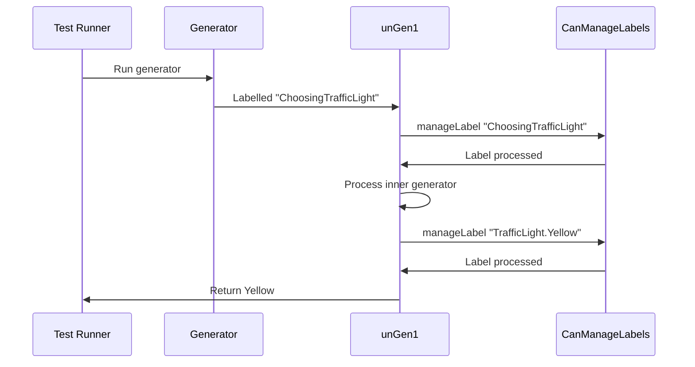
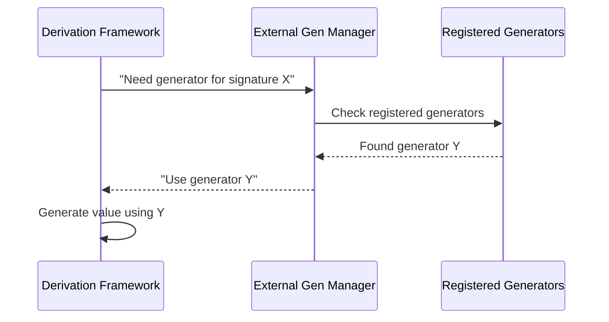

# Label Management - Debugging & Tracking

## Introduction

In this tutorial, we will learn how to use labels to track generator origins and debug generated values. Labels act like sticky notes that tell us where each part of generated data comes from.

**What we will accomplish:**
- Attach labels to generators for debugging
- Understand how labels flow through generator chains
- Use labels to trace value origins in tests

## Label System Overview

### Purpose and Benefits
Labels solve the problem of tracing generated values back to their origins. When complex generators produce thousands of values, labels help identify which specific generator component created problematic data.

### Core Components
The label system consists of:
- `Label` type for identifying generator parts
- `CanManageLabels` interface for flexible label handling
- Runtime processing through `unGen1` function
- Compile-time integration via `deriveGen` macro

## Label Types and Representation

### Label Data Structure
A `Label` is a simple wrapper around strings:

```idris
data Label : Type where
  StringLabel : String -> Label

FromString Label where
  fromString = StringLabel

Show Label where
  show (StringLabel x) = x

Eq Label where
  (StringLabel s1) == (StringLabel s2) = s1 == s2
```

**Exercise:** Create a label for tracking list generation
```idris
listLabel : Label
listLabel = "Generating integer list"
```

### Generator Labeling
Generators use the `Labelled` constructor to attach labels:

```idris
label : CanManageLabels m => Label -> Gen1 a -> Gen1 a
```

The `label` function implementation includes emptiness checking:

```idris
export
label : Label -> Gen em a -> Gen em a
label l g with (isEmpty g) proof 0 prf
  label _ Empty | True  = Empty
  label l g     | False = Labelled l g
```

When `deriveGen` creates generators, it automatically adds descriptive labels.

## CanManageLabels Interface

### Interface Definition
The `CanManageLabels` interface defines how labels are processed:

```idris
interface Monad m => CanManageLabels (0 m : Type -> Type) where
  manageLabel : Label -> m ()
```

Any monad implementing this interface can handle labels during generation.

### Default Implementations

**IgnoreLabels** - Default behavior that discards labels:
```idris
IgnoreLabels : Monad m => CanManageLabels m
IgnoreLabels = I where
  [I] CanManageLabels m where
    manageLabel _ = pure ()
```

**PrintAllLabels** - Debug mode that prints labels:
```idris
[PrintAllLabels] HasIO io => CanManageLabels io where
  manageLabel = putStrLn . show
```

**Exercise:** Create a custom label manager that counts labels
```idris
record LabelCounter where
  constructor MkLabelCounter
  count : Nat

[CountLabels] MonadState LabelCounter m => CanManageLabels m where
  manageLabel _ = modify (\c => record { count $= (+1) } c)
```

### How Labels Are Processed
The `unGen1` function processes labels during generation:

```idris
unGen1 : MonadRandom m => (labels : CanManageLabels m) => Gen1 a -> m a
unGen1 {labels} (Labelled l g) = do
  manageLabel l  -- Process the label
  unGen1 {labels} g  -- Continue with inner generator
```

## Practical Label Usage

### Basic Label Attachment
Let's see how to attach labels to generators:

```idris
genSomeStrings : Gen NonEmpty String
genSomeStrings = elements ["one", "two", "three"]

labeledGenMoreStrings : Gen NonEmpty String
labeledGenMoreStrings = oneOf
  [ label "Path A: Basic Words" genSomeStrings
  , label "Path B: Extra Words" $ elements ["more", "even more"]
  ]
```

**Exercise:** Run the labeled generator with different label managers
```idris
-- With PrintAllLabels
ioExample : HasIO io => io Unit
ioExample = do
  val <- unGen1 labeledGenMoreStrings @{PrintAllLabels}
  putStrLn $ "Generated: " ++ val

-- With IgnoreLabels (default)
ioExampleDefault : HasIO io => io Unit
ioExampleDefault = do
  val <- unGen1 labeledGenMoreStrings
  putStrLn $ "Generated: " ++ val
```

### Label Processing Sequence
The label processing follows a clear sequence:

1. Generator encounters `Labelled` constructor
2. `manageLabel` is called with the label
3. Inner generator continues execution

**Example output with PrintAllLabels:**
```
Path A: Basic Words
Generated: two
```

### Internal Label Implementation
The `Gen` data type includes a `Labelled` constructor:

```idris
data Gen : Emptiness -> Type -> Type where
  -- ... other constructors ...
  Labelled : Label -> (g : Gen em a) -> (0 _ : IsNonEmpty g) => Gen em a
```

The `label` function wraps generators with this constructor:

```idris
export
label : Label -> Gen em a -> Gen em a
label l g with (isEmpty g) proof 0 prf
  label _ Empty | True  = Empty
  label l g     | False = Labelled l g
```

## Runtime Label Management

### Label Processing in unGen1
The core `unGen1` function handles labels through pattern matching:

```idris
unGen1 $ Labelled l x = manageLabel l >> unGen1 x
```

This means labels are processed before the inner generator runs.

### Label Flow Example
Let's trace a complete generation:

```idris
data TrafficLight = Red | Yellow | Green

genTrafficLight : Gen NonEmpty TrafficLight
genTrafficLight = label "ChoosingTrafficLight" $
  oneOf (altsFromList
    [ label "TrafficLight.Red" $ Pure Red
    , label "TrafficLight.Yellow" $ Pure Yellow
    , label "TrafficLight.Green" $ Pure Green
    ])
```

When generating `Yellow`, the label flow would be:
- `ChoosingTrafficLight`
- `TrafficLight.Yellow`
- Value: `Yellow`

### Label Processing Visualization
The label processing sequence can be visualized as:



## Coverage Integration

### Label-Based Coverage Tracking
Labels integrate with coverage tracking to provide detailed statistics:

```idris
record ModelCoverage where
  constructor MkModelCoverage
  unModelCoverage : SortedMap Label Nat
```

**Exercise:** Create a labeled generator and track coverage
```idris
labeledNumber : Gen1 Int
labeledNumber = label "My Favorite Number" $ pure 42

main : IO ()
main = do
  (cov, num) <- pick1 $ withCoverage labeledNumber
  putStrLn "Number: {show num}"
  putStrLn "Coverage: {show cov}"
```

**Expected output:**
```
Number: 42
Coverage: [("My Favorite Number", 1)]
```

### Multiple Label Tracking
Nested generators accumulate multiple labels:

```idris
data Point = MkPoint Int Int

pointGen : Gen1 Point
pointGen = label "Point Factory" $
  [| MkPoint 
      (label "X Coordinate" anyInt) 
      (label "Y Coordinate" anyInt) 
  |]
```

Coverage report shows:
- `"X Coordinate"` for first integer
- `"Y Coordinate"` for second integer  
- `"Point Factory"` for the complete point

### Label Counting Mechanism
The coverage tracker maintains label counts:

```idris
-- When a label is recorded:
-- 1. Look up label in SortedMap
-- 2. If exists: increment count
-- 3. If new: add with count=1
```

**Exercise:** Implement a simple coverage tracker
```idris
simpleCoverage : Gen1 a -> IO (SortedMap Label Nat, a)
simpleCoverage gen = do
  counter <- newIORef (empty : SortedMap Label Nat)
  
  let labelManager : CanManageLabels IO
      labelManager = I where
        [I] CanManageLabels IO where
          manageLabel lbl = do
            modifyIORef counter $ \m => 
              case lookup lbl m of
                Just n => insert lbl (n + 1) m
                Nothing => insert lbl 1 m
    
  result <- unGen1 gen @{labelManager}
  coverage <- readIORef counter
  pure (coverage, result)
```

## Compile-Time Label System

### CTLabel Type
For compile-time label construction, `deriveGen` uses `CTLabel`:

```idris
data CTLabel = MkCTLabel TTImp

FromString CTLabel where
  fromString = MkCTLabel . primVal . Str

Semigroup CTLabel where
  MkCTLabel l <+> MkCTLabel r = MkCTLabel `(~l ++ ~r)
```

This allows compile-time string manipulation for label construction.

### labelGen Macro Function
The `labelGen` function inserts labels during macro expansion:

```idris
labelGen : (desc : CTLabel) -> TTImp -> TTImp
labelGen (MkCTLabel desc) expr = `(Test.DepTyCheck.Gen.label (fromString ~desc) ~expr)
```

This macro function is used by `deriveGen` to automatically wrap generator expressions with labels.

**Exercise:** See how `deriveGen` automatically adds labels
```idris
data TrafficLight = Red | Yellow | Green

-- deriveGen automatically adds descriptive labels
deriveGen TrafficLight
```

The generated code will include labels like `"TrafficLight.Red"` for each constructor.

### CTLabel Semigroup/Monoid Instances
`CTLabel` supports string concatenation for building complex labels:

```idris
Semigroup CTLabel where
  MkCTLabel l <+> MkCTLabel r = MkCTLabel `(~l ++ ~r)

Monoid CTLabel where
  neutral = ""
```

This allows compile-time construction of descriptive labels like `"TrafficLight." <+> constructorName`.

**Exercise:** Create a composed label using CTLabel operations
```idris
moduleLabel : CTLabel
moduleLabel = "DepTyCheck.Test"

typeLabel : CTLabel  
typeLabel = "TrafficLight"

constructorLabel : CTLabel
constructorLabel = "Red"

fullLabel : CTLabel
fullLabel = moduleLabel <+> "." <+> typeLabel <+> "." <+> constructorLabel
```

## External Generator Management

### External Generator Integration
External generators can be coordinated through label-based lookup:

```idris
-- External generator registration
externalGens : List (Name, TTImp)
externalGens = [("externalListGen", `(listGen))]

-- Signature-based lookup
findExternalGen : Signature -> Maybe Name
findExternalGen sig = lookup sig externalGens
```

### External vs Internal Generation
The system provides fallback between external and internal generators:

```idris
callGen : Signature -> TTImp
callGen sig = case findExternalGen sig of
  Just name => `(~(var name))
  Nothing => deriveGen sig  -- Fallback to internal derivation
```

## Debugging Applications

### Value Tracing with Labels
Labels enable detailed value tracing:

```idris
-- Enable label printing for debugging
main : IO ()
main = do
  let gen = label "Test Label" $ pure 42
  result <- unGen1 gen @{PrintAllLabels}
  putStrLn $ "Value: " ++ show result
```

**Output:**
```
Recording: "Test Label"
Value: 42
```

### Debug Workflow
1. Add labels to suspicious generator parts
2. Run with `PrintAllLabels`
3. Analyze label sequence to identify problem areas

**Exercise:** Debug a complex generator chain
```idris
complexGen : Gen NonEmpty (List (Maybe Int))
complexGen = 
  label "List Generation" $ 
    listOf (label "Maybe Generation" $ 
      oneOf [ label "Just Case" $ map Just anyInt
           , label "Nothing Case" $ pure Nothing
           ])

-- Run with debugging
main : IO ()
main = do
  result <- unGen1 complexGen @{PrintAllLabels}
  putStrLn $ "Result: " ++ show result
```

This helps identify which parts of the generator are being used.

## Practical Implementation

### Basic Label Usage Examples
**Exercise:** Create a traffic light generator with labels
```idris
data Light = Red | Yellow | Green

trafficGen : Gen1 Light
trafficGen = label "Traffic Light Factory" $ oneOf
  [ label "Red Maker"    $ pure Red
  , label "Yellow Maker" $ pure Yellow
  , label "Green Maker"  $ pure Green
  ]

runFactory : IO ()
runFactory = do
  (cov, light) <- pick1 $ withCoverage trafficGen
  putStrLn $ "Produced: " ++ show light
  putStrLn $ "Coverage: " ++ show cov
```

**Solution:**
```idris
-- Sample output:
Produced: Green
Coverage: [("Green Maker", 1), ("Traffic Light Factory", 1)]
```

### Advanced Label Management
**Exercise:** Create a custom label manager that stores labels in a list
```idris
record LabelRecorder where
  constructor MkLabelRecorder
  labels : List Label

[RecordLabels] MonadState LabelRecorder m => CanManageLabels m where
  manageLabel lbl = modify (\r => record { labels $= (lbl ::) } r)

main : IO ()
main = do
  let gen = label "First" $ label "Second" $ pure 42
  (recorder, result) <- runStateT (unGen1 gen @{RecordLabels}) (MkLabelRecorder [])
  putStrLn $ "Result: " ++ show result
  putStrLn $ "Labels: " ++ show recorder.labels
```

**Solution:**
```idris
-- Expected output:
Result: 42
Labels: ["Second", "First"]
```

## External Generator Management

### External Generator Integration
External generators can be coordinated through registration:

```idris
-- Example external generators
genSpell : Fuel -> Gen MaybeEmpty Int
genSpell fuel = elements [42, 100, 256]

genCharm : Fuel -> Gen MaybeEmpty String  
genCharm fuel = elements ["magic", "charm", "spell"]

-- Register external generators
externalGens : List (Signature, Name)
externalGens = 
  [ (Fuel -> Gen MaybeEmpty Int, `genSpell)
  , (Fuel -> Gen MaybeEmpty String, `genCharm)
  ]

-- Use with deriveGen
magicCookieGen : Fuel -> Gen MaybeEmpty MagicCookie
magicCookieGen = deriveGen
  `{ externalGens := externalGens }
```

### External Generator Lookup Process
The lookup process follows this sequence:



### Signature-Based Lookup
The system performs signature matching:

```idris
findExternalGen : Signature -> Map Signature Name -> Maybe Name
findExternalGen requiredSig registeredGens = 
  lookup requiredSig registeredGens
```

### External vs Internal Generation
The system provides automatic fallback:

```idris
callGen : Signature -> Fuel -> List TTImp -> EitherT String Elab TTImp
callGen required fuel values = 
  case lookupExternal required of
    Just chefName => callExternalGen chefName fuel values
    Nothing => deriveGen required  -- Internal derivation fallback
```

This ensures that external generators are preferred when available, with internal derivation as a fallback.

**Exercise:** Create a custom generator and register it
```idris
-- Custom generator for special Int values
specialIntGen : Fuel -> Gen MaybeEmpty Int
specialIntGen fuel = elements [42, 100, 256]

-- Register and use
data SpecialData = MkSpecial Int

specialGen : Fuel -> Gen MaybeEmpty SpecialData
specialGen = deriveGen
  `{ externalGens := [(Fuel -> Gen MaybeEmpty Int, `specialIntGen)] }
```

**Solution:**
```idris
-- When generating SpecialData, it will use specialIntGen
> pick1 (specialGen (More Dry))
MkSpecial 42  -- From specialIntGen!
```

**Exercise:** Create a custom generator with automatic fallback
```idris
-- Custom generator for special cases
customListGen : Fuel -> Gen MaybeEmpty (List Int)
customListGen fuel = elements [[1,2,3], [4,5,6]]

-- External generator that might fail
failingGen : Fuel -> Gen MaybeEmpty String
failingGen fuel = empty

-- The system will fall back to internal generation for failingGen
data MixedData = MkMixed (List Int) String

mixedGen : Fuel -> Gen MaybeEmpty MixedData
mixedGen = deriveGen
  `{ externalGens := 
       [ (Fuel -> Gen MaybeEmpty (List Int), `customListGen)
       , (Fuel -> Gen MaybeEmpty String, `failingGen)
       ] }
```

## Advanced Label Patterns

### Label Composition
Labels can be composed for detailed tracking:

```idris
composedLabel : Label
composedLabel = "Module.Type.Constructor.Field"
```

### Performance Considerations
- `IgnoreLabels` has minimal overhead
- `PrintAllLabels` adds I/O overhead
- Coverage tracking maintains label counts in memory

### Integration with Testing Frameworks
Labels work seamlessly with Idris testing frameworks:
- Coverage reports show label statistics
- Debug output helps identify generator issues
- External generators integrate transparently

## Summary

Label management provides essential debugging and tracking capabilities for generator systems. The flexible interface-based approach allows for different label handling strategies while maintaining consistent behavior across the system.

**Key capabilities covered:**
- **Label attachment** for debugging and tracing
- **Flexible label handling** through `CanManageLabels` interface
- **Coverage integration** for detailed statistics
- **External generator coordination** for custom generation
- **Compile-time integration** via `deriveGen` macro

**Practical applications:**
- Debug complex generator chains
- Track coverage of generated values
- Integrate custom generators seamlessly
- Understand generator behavior through labels

You now have a comprehensive understanding of how labels work in DepTyCheck and how to use them effectively for debugging, coverage tracking, and external generator management.

