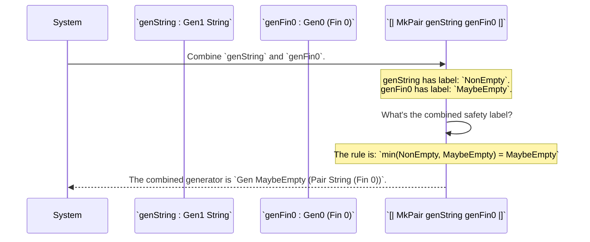
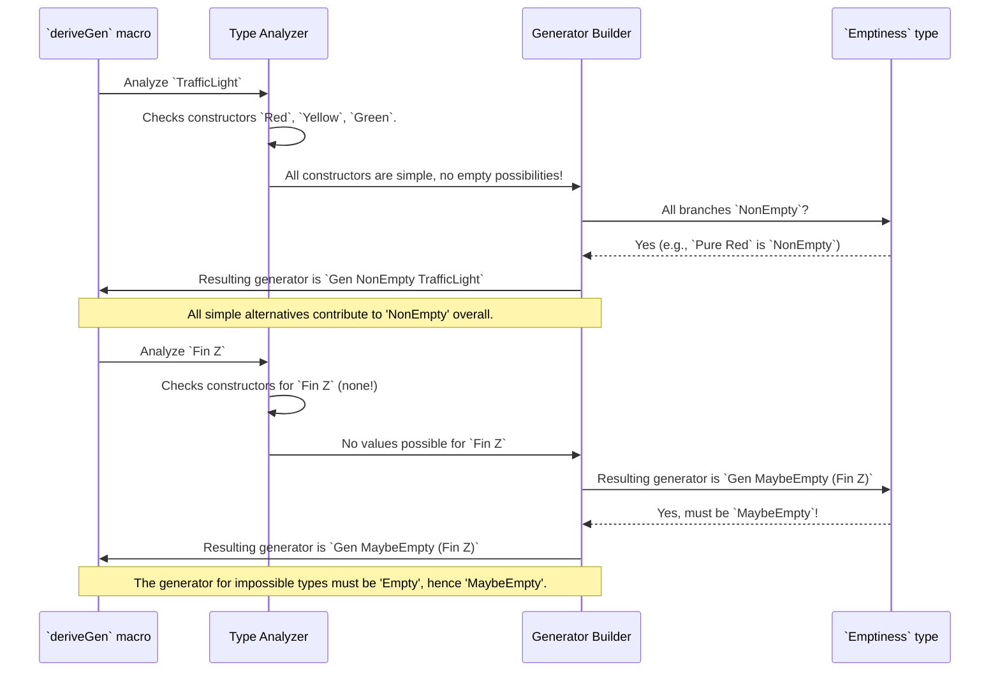

# Chapter 14: Emptiness Tracking

## Introduction to Emptiness Tracking

Welcome to the world of generator emptiness tracking! In this chapter, we'll explore how DepTyCheck ensures that generators can safely handle types that might not have any valid values. This is especially important when working with dependent types, where some type instances are impossible to create.

**What you'll accomplish:**
- Create generators that correctly handle impossible types like `Fin 0`
- Understand when to use `NonEmpty` vs `MaybeEmpty` guarantees
- Combine generators while maintaining proper emptiness tracking
- Use the type system to catch impossible generation tasks at compile time

**In this tutorial, we will:**
- Learn what generator emptiness means and why it matters
- Understand the difference between `NonEmpty` and `MaybeEmpty` generators
- See how emptiness propagates when combining generators
- Discover how the type system prevents impossible generation tasks

By the end, you'll understand how DepTyCheck uses emptiness tracking to create safe, reliable property-based tests.

### Let's Get Started!

Let's begin by understanding the core problem that emptiness tracking solves.

### The Problem: Handling Impossible Types

Imagine you have a magical basket that sometimes carries apples, sometimes oranges, and sometimes it's... completely empty! It's important to know if the basket *will always* contain something, or if it *might* be empty.

In DepTyCheck, this "basket" is our `Gen` (Generator). The `Emptiness` concept tells us if a generator is *guaranteed* to produce a value, or if it *might* fail to produce one (i.e., be "empty"). This is especially vital when working with `dependent types`, where some types simply cannot have any values!

#### The Problem: Impossible Objects

In dependently-typed programming, you can define types that are impossible to create. These are called **uninhabited types**. The simplest example is `Fin 0`, a number that is "less than 0". There are no natural numbers less than 0, so you can never create a value of this type.

Now, imagine we have a data type for a team roster, which must contain at least one player.

```idris
import Data.Vect

-- A team has a name and a non-empty vector of player IDs.
data Team = MkTeam String (Vect 1 (Fin 5))
```

This definition is perfectly valid. But let's ask a question: could DepTyCheck automatically generate a `Team` for us? What if the type was `Vect 1 (Fin 0)` instead?

```idris
-- An IMPOSSIBLE team structure.
data ImpossibleTeam = MkImpossibleTeam String (Vect 1 (Fin 0))
```

To create an `ImpossibleTeam`, the generator would need to create a `Vect` of length 1 containing a `Fin 0`. But we know creating a `Fin 0` is impossible! A naive generator would get stuck in a loop, trying forever to create something that can't exist.

DepTyCheck needs a way to know, *before even trying*, that some generation tasks are doomed to fail. This is what Emptiness Tracking is all about.

Think of it like a safety label on a factory blueprint. The label tells you: "This factory is guaranteed to produce a product" or "Warning: Under certain conditions, this factory might not produce anything."

#### A Basket of Numbers: The `Fin n` Example

Let's look at our `Fin n` example. `Fin n` represents natural numbers *less than* `n`.

- A generator for `Fin 3` (numbers less than 3) will always give you `0`, `1`, or `2`. This generator **cannot** be empty.
- A generator for `Fin 1` (numbers less than 1) will always give you `0`. This generator **cannot** be empty.
- A generator for `Fin 0` (numbers less than 0) **cannot give you anything**! There are no numbers less than `0` (if we're considering natural numbers starting from `0`). This generator **must** be empty.

So, a generator for `Fin n` cannot be simply `NonEmpty`. Its emptiness depends on `n`. This is exactly the kind of situation `Emptiness` is designed to handle.

## Core Concepts: The Emptiness Type System

### The Emptiness Data Type

DepTyCheck uses a simple but powerful data type called `Emptiness` to represent these guarantees:

```idris
-- src/Test/DepTyCheck/Gen/Emptiness.idr
public export
data Emptiness = NonEmpty | MaybeEmpty
```

Think of `Emptiness` as a traffic light system for generators:

- **`NonEmpty` (Green Light)**: This generator is guaranteed to always produce at least one value. It will never fail.
- **`MaybeEmpty` (Yellow Light)**: This generator might produce a value, but it might also produce nothing. It's not guaranteed.

Think of `NonEmpty` as giving a stronger "promise" than `MaybeEmpty`. If a generator is `NonEmpty`, you know for sure you'll get a value. If it's `MaybeEmpty`, you might or might not.

### Convenient Shorthands: Gen1 and Gen0

To make our code cleaner, DepTyCheck provides two simple aliases:

- `Gen1 a` is just a nickname for `Gen NonEmpty a`
- `Gen0 a` is a nickname for `Gen MaybeEmpty a`

```idris
-- This generator is GUARANTEED to work.
genGuaranteed : Gen1 Nat
genGuaranteed = pure 42

-- This generator MIGHT fail.
genRisky : Gen0 (Fin 0)
genRisky = empty
```

When you see a `Gen1`, you can be confident. When you see a `Gen0`, you must be careful and handle the possibility of failure.

### The Empty Generator

So how do we represent a blueprint for a factory that we *know* will fail? DepTyCheck provides a special generator for this: `empty`.

The `empty` generator is the ultimate `MaybeEmpty` generator. It never produces a value. It's the blueprint for an impossible task.

Let's look at the `Gen` data type definition to see how this fits in:

```idris
-- Simplified from: src/Test/DepTyCheck/Gen.idr

data Gen : Emptiness -> Type -> Type where
  -- A blueprint for a factory that is guaranteed to fail.
  -- Notice its Emptiness is hard-coded to `MaybeEmpty`!
  Empty : Gen MaybeEmpty a

  -- Other constructors like Pure, Raw, OneOf...
  Pure  : a -> Gen em a
```

The `Empty` constructor can *only* create a `Gen` with the `MaybeEmpty` label. This is enforced by the type system itself.

## Practical Examples and Use Cases

### Fin n Generator Example

Let's see `Emptiness` in action with our `genFin` example:

```idris
genFin : (n : Nat) -> Gen MaybeEmpty $ Fin n
genFin Z     = empty
genFin (S n) = elements' $ Data.List.allFins n
```

Let's break down how `Emptiness` plays out here:

1. **`genFin : (n : Nat) -> Gen MaybeEmpty $ Fin n`**: Notice the `MaybeEmpty` here. This tells us from the start that `genFin` *might* not give a value. This is important because the type `Fin n` itself can be empty if `n` is `0`.

2. **`genFin Z = empty`**:
   - If `n` is `Z` (which means `0`), we use `empty`. `empty` is a special generator that *always* produces nothing.
   - Its type is `empty : Gen0 a`, where `Gen0` is just a shortcut for `Gen MaybeEmpty`. So, `empty` explicitly says: "I will never yield a value."

3. **`genFin (S n) = elements' $ Data.List.allFins n`**:
   - If `n` is `S n'` (which means `1` or more), then `Fin (S n')` definitely has values (like `0`, `1`, ..., `n'`).
   - `elements'` takes a list of values and creates a generator that picks one of them. Since the list `Data.List.allFins n` will definitely contain values when `n` is `S n'`, this part of `genFin` will always generate a value.

So, `genFin` correctly represents the possibility of emptiness. When `n` is `0`, it's truly empty. When `n` is greater than `0`, it provides values.

### Exercise: Understanding Generator Behavior

**Exercise**: What would happen if we tried to write `genFin` with a `NonEmpty` return type instead of `MaybeEmpty`?

**Solution**: The Idris compiler would reject our code! When `n` is `0`, we return `empty`, which has type `Gen MaybeEmpty (Fin 0)`. But our function signature claims to return `Gen NonEmpty (Fin n)`. This creates a type mismatch because `MaybeEmpty` is not the same as `NonEmpty`. The type system prevents us from making false promises about our generator's behavior.

### Exercise: Combining Generators

**Exercise**: What would be the emptiness level of a generator that combines:
- A `Gen NonEmpty Bool` generator
- A `Gen MaybeEmpty (Fin 5)` generator
- Using applicative style: `[| (b, f) |]`

**Solution**: The result would be `Gen MaybeEmpty (Bool, Fin 5)`. This follows the "weakest link" rule - since one of the generators is `MaybeEmpty`, the combined generator must also be `MaybeEmpty`.

### Exercise: Understanding NoWeaker

**Exercise**: Which of these `NoWeaker` relationships are valid?
1. `NonEmpty `NoWeaker` MaybeEmpty`
2. `MaybeEmpty `NoWeaker` NonEmpty`
3. `MaybeEmpty `NoWeaker` MaybeEmpty`

**Solution**:
1. ✅ Valid - `NonEmpty` is stronger than `MaybeEmpty`
2. ❌ Invalid - `MaybeEmpty` cannot be stronger than `NonEmpty`
3. ✅ Valid - `MaybeEmpty` is equally strong as itself

## Emptiness Propagation Rules

### Generator Combination Principles

What happens when we combine generators with different `Emptiness` statuses? DepTyCheck is smart about this. The resulting `Emptiness` will always be the "weakest" (the one that gives the fewest guarantees). `MaybeEmpty` is "weaker" than `NonEmpty`.

Consider these rules for different generator operations:

#### `map` (Transforming values):

If you have a `Gen NonEmpty String` and you `map` a function `length` (which turns a `String` into a `Nat`) over it, you'll get a `Gen NonEmpty Nat`. Why? Because if the original generator always produces a `String`, and you transform that `String` into a `Nat`, it will still always produce a `Nat`. The `Emptiness` doesn't change.

```idris
-- A generator that *always* gives a string
genNonEmptyString : Gen NonEmpty String
genNonEmptyString = elements ["hello"]

-- Map a function that turns String to Nat.
-- Result is still Gen NonEmpty Nat.
genNonEmptyLength : Gen NonEmpty Nat
genNonEmptyLength = map length genNonEmptyString
```

#### `applicative` (Combining values independently):

If you combine two generators, the result's `Emptiness` will be `MaybeEmpty` if *either* of the input generators is `MaybeEmpty`. Both must be `NonEmpty` for the result to be `NonEmpty`.

Let's say we have:
- `genA : Gen MaybeEmpty A`
- `genB : Gen NonEmpty B`

If we combine them using `[| MkX genA genB |]`, the result will be `Gen MaybeEmpty X`. If `genA` could be empty, then the combined generator could also be empty.

```idris
-- A generator that *might* be empty (if n ends up being 0)
myGenFin : (n : Nat) -> Gen MaybeEmpty $ Fin n
myGenFin = genFin -- from previous example

-- A generator that *always* produces a string
myGenString : Gen NonEmpty String
myGenString = elements ["Idris is fun!"]

-- We combine them. Because myGenFin is MaybeEmpty, the result is MaybeEmpty.
data Pair FinNString = MkPair (Fin N) String
genPair : (N : Nat) -> Gen MaybeEmpty (Pair FinNString)
genPair N = [| MkPair (myGenFin N) myGenString |]
```

#### `Monad` (`>>=`, `do` notation for dependent generation):

This is where `Emptiness` gets really interesting! With `Monad`, the *next* generator can depend on the *value* of the previous one. If any part of the chain can be empty, the whole result can be empty.

```idris
genAnyFin : Gen MaybeEmpty Nat => Gen MaybeEmpty (n ** Fin n)
genAnyFin @{genNat} = do
  n <- genNat          -- If genNat produces 0, 'n' is 0
  f <- genFin n        -- If n is 0, genFin 0 will be 'empty'
  pure (n ** f)
```

In this `genAnyFin` example:
1. `n <- genNat`: `genNat` itself could be `MaybeEmpty` or `NonEmpty`. Let's assume it's `NonEmpty` for now, so `n` is always produced.
2. `f <- genFin n`: Now, if `n` happens to be `0`, then `genFin n` becomes `genFin 0`, which we know is `empty`.
3. If `genFin n` is empty for a particular `n`, then this entire `do` block will fail to produce a value – it becomes `MaybeEmpty`.

Therefore, `genAnyFin` must be `Gen MaybeEmpty`. It properly reflects the fact that you might get a `0` from `genNat`, leading to `genFin 0` producing nothing.

### Visualizing Emptiness Propagation

Let's see emptiness propagation in action with a diagram. Imagine we are combining a generator for a `String` (which is `NonEmpty`) and a generator for a `Fin 0` (which is `MaybeEmpty`).



The `MaybeEmpty` label from `genFin0` "infects" the combined generator. The system now knows that `[| MkPair genString genFin0 |]` is a risky blueprint that might fail. This prevents you from accidentally using it in a context that requires a guaranteed `Gen1` generator, catching the error at compile time instead of as a mysterious bug at runtime.

### Underlying Mathematical Foundation

#### The NoWeaker Relation

In DepTyCheck, there's a formal way to describe how `Emptiness` values relate to each other: `NoWeaker`.

```idris
-- src/Test/DepTyCheck/Gen/Emptiness.idr
data NoWeaker : (from, to : Emptiness) -> Type where
  NN : NonEmpty `NoWeaker` NonEmpty
  AS : em       `NoWeaker` MaybeEmpty
```

This mouthful just means:
- `NN : NonEmpty `NoWeaker` NonEmpty`: `NonEmpty` gives no weaker guarantees than `NonEmpty`. (It's the same guarantee).
- `AS : em `NoWeaker` MaybeEmpty`: *Any* `Emptiness` status (`em`) gives no weaker guarantees than `MaybeEmpty`. (Because `MaybeEmpty` is the weakest possible guarantee).

So, `NonEmpty `NoWeaker` MaybeEmpty` is true (because of `AS`).
But `MaybeEmpty `NoWeaker` NonEmpty` is *false* (impossible!). `MaybeEmpty` *is* weaker than `NonEmpty`.

This `NoWeaker` relation is like saying "is at least as strong as" or "gives at least as many guarantees as". This relationship is used internally by DepTyCheck to make sure `Emptiness` is correctly tracked when generators are combined or converted. For example, you can always treat a `NonEmpty` generator as if it were `MaybeEmpty` because it provides *at least* the guarantees of `MaybeEmpty`. This is called `relaxing` the `Emptiness`.

```idris
-- Simplified from src/Test/DepTyCheck/Gen.idr
export
relax : (0 _ : iem `NoWeaker` em) => Gen iem a -> Gen em a
```

`relax` allows you to convert a `Gen iem a` to a `Gen em a` *only if* `iem` is `NoWeaker` than `em`. This is always true if `em` is `MaybeEmpty`. For example, `relax` will let you change `Gen NonEmpty String` to `Gen MaybeEmpty String`, but not the other way around. This makes sense: you can always consider a "guaranteed value" generator as a "possibly value" generator, but you cannot guarantee a value if it was only a "possibly value" generator to begin with.

### Practical Implementation: The Minimum Function

When DepTyCheck combines generators (for example, with the applicative `<*>` operator), it uses the `min` function on the `Emptiness` types to compute the new label, automatically enforcing the "weakest link" rule.

```idris
-- A simplified look at how combining generators works internally
-- The resulting emptiness is `min lem rem`
(<**>) : (g : Gen lem f) -> (h : Gen rem a) -> Gen (min lem rem) b
```

This ensures that emptiness tracking is not just a convention, but a process that is mathematically and automatically verified by the Idris compiler every time you build a generator.

## Best Practices and Patterns

### When to Use NonEmpty vs MaybeEmpty

Understanding when to use each emptiness level is crucial for writing effective generators:

- **Use `NonEmpty` when**: Your generator is guaranteed to always produce a value. This includes generators for:
  - Simple types like `Bool`, `Nat`, `String`
  - Types where all constructors are always available
  - Generators that don't depend on potentially empty inputs

- **Use `MaybeEmpty` when**: Your generator might fail under certain conditions. This includes generators for:
  - Dependent types like `Fin n` where the emptiness depends on parameters
  - Types with constraints that might not be satisfiable
  - Generators that depend on other potentially empty generators

### Debugging Empty Generators

When you encounter empty generators, here are common patterns and diagnostic techniques:

**Common patterns leading to empty generators:**
- Using `Fin 0` or other uninhabited types
- Combining generators where one might be empty
- Using constraints that can't be satisfied

**Diagnostic techniques:**
- Check the type signatures of your generator functions
- Verify that all dependent parameters can produce valid values
- Use the `relax` function to see if emptiness propagation is working correctly

## Advanced Topics

### The Power of `Ord` and `LinearOrder`

The Emptiness module also defines `Ord`, `LinearOrder`, `Reflexive`, `Transitive`, `Antisymmetric`, `Preorder`, `PartialOrder`, `Connex`, and `StronglyConnex` instances for `Emptiness` based on `NoWeaker`. This means `Emptiness` behaves like mathematical "orders" (like numbers where `1 < 2`, `2 > 1`, `1 = 1`).

This allows us to compare `Emptiness` values directly and use functions like `min` (minimum).
For `Emptiness`, `min NonEmpty MaybeEmpty` would be `MaybeEmpty`, because `MaybeEmpty` is the "weaker" (smaller guarantee) one. `min NonEmpty NonEmpty` would be `NonEmpty`.

### NonEmpty Is Maximal Proof

There's a helper function `nonEmptyIsMaximal` which can prove that if `em` is `NoWeaker` than `NonEmpty`, then `em` *must* be `NonEmpty`.

```idris
-- From src/Test/DepTyCheck/Gen/Emptiness.idr

export
nonEmptyIsMaximal : (0 _ : em `NoWeaker` NonEmpty) -> em = NonEmpty
nonEmptyIsMaximal nw = irrelevantEq $ case nw of NN => Refl
```

**Explanation:**
- `(0 _ : em `NoWeaker` NonEmpty)`: This is an *implicit argument*. It means "give me a proof that `em` is not weaker than `NonEmpty`."
- `em = NonEmpty`: The function returns a proof that `em` *must be exactly* `NonEmpty`.
- `case nw of NN => Refl`: The only way `em `NoWeaker` NonEmpty` can be constructed is with `NN`, which implies that `em` *is* `NonEmpty`. So, we can indeed prove `em = NonEmpty`.

This seemingly abstract `nonEmptyIsMaximal` function is used by the `Gen` library to ensure type safety. For example, some higher-order functions over `Gen` might require their input generators to be `NonEmpty`. This function helps the Idris type checker verify such requirements.

### How `Emptiness` Is Used Internally

The `Emptiness` parameter lives directly in the type of `Gen`: `Gen : Emptiness -> Type -> Type`. This is a powerful feature of Idris's dependent types! It means the compiler *knows* at compile time whether a generator might return nothing.

When DepTyCheck generates code (e.g., via `deriveGen`), it tries to infer the strongest possible `Emptiness` guarantee. This involves analyzing the data type:
- If *all* constructors of a data type are guaranteed to produce values, and all arguments to those constructors are also `NonEmpty`, then the derived generator can be `NonEmpty`.
- If *any* constructor is impossible, or any argument to any constructor *might* be empty, then the whole derived generator must be `MaybeEmpty`.

### Sequence Diagram: Emptiness in Derivation

Consider how `Emptiness` works for the `OneOf` constructor during derivation:



The diagram shows that `Emptiness` isn't just an afterthought; it's a fundamental part of the type system that flows through the derivation process. The `deriveGen` macro actively uses knowledge about `Emptiness` to assign the correct type to the generated generator.

## Summary and Key Takeaways

You've just learned the secret sauce that makes DepTyCheck safe and powerful for dependent types!

- **Emptiness Tracking** is a system of safety labels (`NonEmpty`, `MaybeEmpty`) that tell us if a generator might fail.
- Types that are impossible to create (like `Fin 0`) lead to an **`empty`** generator, which has the `MaybeEmpty` label.
- We use the shorthands **`Gen1`** (`NonEmpty`) for guaranteed generators and **`Gen0`** (`MaybeEmpty`) for risky ones.
- When combining generators, the `MaybeEmpty` label propagates. If any part of a generator might fail, the whole generator is marked as potentially failing.
- This allows DepTyCheck to detect impossible generation tasks at **compile time**.

Generator Emptiness, represented by the `Emptiness` data type (`NonEmpty` or `MaybeEmpty`), allows DepTyCheck to explicitly track whether a generator is guaranteed to always produce a value or if it might sometimes fail. This intelligent tracking, enforced by Idris's dependent type system and the `NoWeaker` relation, prevents runtime errors and infinite loops when dealing with types that have no valid inhabitants or when combining generators with varying guarantees. By clearly distinguishing between `NonEmpty` (green light) and `MaybeEmpty` (yellow light) generators, we build more robust and predictable property-based tests.

## Conclusion

`Emptiness` is a simple but powerful concept in DepTyCheck:
- It tells you if a generator *always* produces a value (`NonEmpty`) or *might* fail to (`MaybeEmpty`).
- It's essential for correctly working with `dependent types` like `Fin n`, where some instances simply don't have any values.
- When combining generators, DepTyCheck automatically tracks `Emptiness`, defaulting to `MaybeEmpty` if any part of the combination might fail.
- The `NoWeaker` relation defines how `Emptiness` statuses compare in terms of "guarantees," allowing for safe conversions like `relax`.

Understanding `Emptiness` will help you write more robust property-based tests, especially when types themselves dictate the possibility of a value.

## What You've Accomplished

Congratulations! You've successfully learned how DepTyCheck handles generator emptiness. Here's what you can now do:

✅ **Create safe generators** that correctly handle impossible types
✅ **Distinguish between** `NonEmpty` and `MaybeEmpty` guarantees
✅ **Combine generators** while maintaining proper emptiness tracking
✅ **Use the type system** to catch impossible generation tasks at compile time

## Next Steps

Now that you understand emptiness tracking, you're ready to explore other advanced DepTyCheck features like:
- Coverage tracking to ensure all code paths are tested
- Label management for debugging complex generators
- Derivation pipelines for automatic generator creation

Remember: Emptiness tracking is your safety net when working with dependent types. It ensures your generators are honest about what they can and cannot produce, preventing runtime errors and infinite loops.

**Keep practicing** by creating generators for your own dependent types and observing how emptiness tracking helps you write safer code!