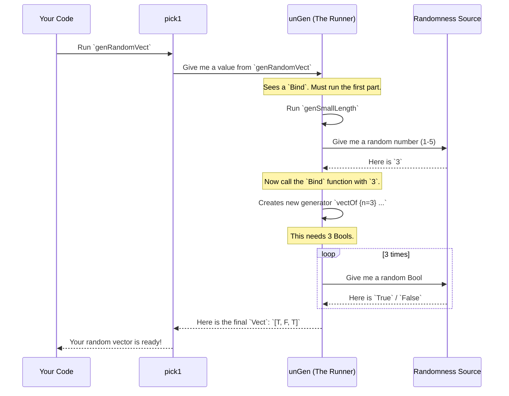

# Generator Monad Tutorial: Creating Test Data with Gen

Welcome to `DepTyCheck`! You're about to learn how to automatically test your programs in powerful new ways. The first step in this journey is learning how to generate random test data. That's where the `Gen` monad comes in.

## What's the Big Idea?

Imagine you've written a function that processes a user profile. How do you test it? You could write a few test cases by hand: one for a typical user, one for a user with an empty name, one for an age of 0, etc.

This is fine, but it's easy to miss edge cases. What if your function crashes for a user with a very long name, or a negative age? Property-based testing helps us find these sneaky bugs by running our tests on *hundreds* of randomly generated inputs.

But to do that, we first need a way to create those random inputs. This is the problem `Gen` solves.

### Property-Based Testing Example

Let's look at a concrete example:

```idris
-- A function to test
double : Nat -> Nat
double n = n + n

-- A unit test
testDouble : double 5 = 10
testDouble = Refl
```

This is great, but what if you miss an edge case? Property-based testing flips this around. Instead of writing individual tests, you state a *property* that should hold true for *all* valid inputs. For example, "for any natural number `n`, `double n` should equal `n + n`."

To check this property, we need a way to generate hundreds of random `Nat` values to throw at our function.

### The Cookbook Analogy

Think of `Gen a` as a **recipe for creating a random value of type `a`**:
- A simple recipe might just say, "pick a random apple from this basket"
- A more complex recipe could be, "make an apple pie," which involves following other recipes for the crust, the filling, and the topping

In `DepTyCheck`, we write these recipes to tell the computer how to generate values of any type we need, from simple `String`s to our own custom data types.

Just like in a kitchen, we can start with simple recipes and combine them to create much more complex and delicious dishes!

## What We'll Accomplish

In this tutorial, we will:
- Create generators for simple types like `Int` and `String`
- Combine generators to build complex data structures
- Handle dependent types safely
- Run generators to get actual test data
- Understand how generators work under the hood

## Our Goal: Generating a User Profile

Throughout this tutorial, our goal will be to create a generator for this simple `UserProfile` data type:

```idris
data UserProfile = MkProfile String Nat
```

A `UserProfile` has a name (a `String`) and an age (a `Nat`). To create a random `UserProfile`, we'll need to learn how to:
1. Create a recipe for random names
2. Create a recipe for random ages
3. Combine these two recipes into a single recipe for `UserProfile`

Let's start by creating our first generator.

## Your First Generator: Creating Simple Values

Let's begin with the simplest generator possible - one that always produces the same value.

```idris
import Test.DepTyCheck.Gen

-- Create a generator that always produces the number 42
genTheAnswer : Gen1 Int
genTheAnswer = pure 42
```

Now let's create a generator that produces random values:

```idris
-- Generate random ages between 18 and 99
genAdultAge : Gen1 Int
genAdultAge = choose (18, 99)

-- Generate a Nat between 1 and 100
genSmallNat : Gen1 Nat
genSmallNat = choose (1, 100)

-- Generate random roles from a list
genRole : Gen1 String
genRole = elements ["Admin", "User", "Guest"]

-- Generate any random Nat
genAnyNat : Gen1 Nat
genAnyNat = chooseAny

-- Generate ANY integer
anyInt : Gen1 Int
anyInt = chooseAny
```

**Notice**: We're using `Gen1` which guarantees the generator will always produce a value. The alternative is `Gen0` which might be empty.

### Simple Generator Aliases

DepTyCheck provides convenient aliases:
- `Gen0 a` = `Gen MaybeEmpty a` (might be empty)
- `Gen1 a` = `Gen NonEmpty a` (always produces values)

These make your code more readable:
```idris
-- The empty generator (produces nothing)
nothingHere : Gen0 String
nothingHere = empty
```

### Transforming Values with `map`

`map` lets you take the value produced by a generator and apply a function to it, transforming it into a new value.

```idris
genNames : Gen1 String
genNames = elements ["Alice", "Bob"]

-- Transform "Alice" into "Hello, Alice!"
genGreetingsWithName : Gen1 String
genGreetingsWithName = map (\name => "Hello, " ++ name ++ "!") genNames
```

This will generate either "Hello, Alice!" or "Hello, Bob!". It's like taking a "name-generating" Lego block and sticking a "prefix/suffix-adding" adapter onto it to make a new, more specific block.

## Combining Generators: Building Complex Data

Now let's create a simple `User` record and generate random instances:

```idris
record User where
  constructor MkUser
  name : String
  age  : Int

-- Combine generators to create random users
genUser : Gen1 User
genUser = MkUser <$> elements ["Alice", "Bob", "Charlie"] <*> choose (18, 65)
```

When you run this generator, it will:
1. Randomly pick a name from `["Alice", "Bob", "Charlie"]`
2. Randomly pick an age between 18 and 65
3. Combine them into a `User` value

Let's try another way to combine generators:

```idris
-- Alternative syntax using applicative style
genUserAlt : Gen1 User
genUserAlt = [| MkUser (elements ["Alice", "Bob"]) (choose (20, 60)) |]
```

This is incredibly powerful! The `[| MkUser genAges genNames |]` line reads like you're building a regular `User`, but you're actually building a *recipe*. When run, this recipe will:
1. Run the `genAges` generator to get a random age (e.g., `42`)
2. Run the `genNames` generator to get a random name (e.g., `"Bob"`)
3. Combine them into a `User`: `MkUser 42 "Bob"`

Both approaches produce the same result - a generator that creates random `User` instances.

## Choosing Between Generators

Sometimes you want to randomly choose between different generation strategies:

```idris
-- Different name generators
genShortNames : Gen1 String
genShortNames = elements ["Ali", "Bob", "Eve"]

genLongNames : Gen1 String
genLongNames = elements ["Alexander", "Roberta", "Evelyn"]

-- Combine them with oneOf
genAnyName : Gen1 String
genAnyName = oneOf [genShortNames, genLongNames]
```

When you run `genAnyName`, it will randomly choose between the short names list and the long names list.

Here's another example showing how `oneOf` works with completely different generators:

```idris
-- A generator that picks from a list
genSomeStrings : Gen1 String
genSomeStrings = elements ["one", "two", "three"]

-- A generator that picks from a different list
genOtherStrings : Gen1 String
genOtherStrings = elements ["alpha", "beta"]

-- A generator that combines the two
genCombined : Gen1 String
genCombined = oneOf [genSomeStrings, genOtherStrings]
```

When we run `genCombined`, it first makes a 50/50 choice: should it use the `genSomeStrings` recipe or the `genOtherStrings` recipe? Once it picks a recipe, it follows it to produce a value.

### Understanding `oneOf` Distribution

`oneOf` treats each generator in its list as a *whole unit*. This means that in `genCombined`, the entire `genSomeStrings` has the same probability of being chosen as the entire `genOtherStrings`. The individual values within `genSomeStrings` (like "one") will be less likely than values within `genOtherStrings` (like "alpha") because `genSomeStrings` has more internal choices.

If you wanted *all* strings to have an equal chance, you'd put them all in one `elements` list:

```idris
genAllStringsUniform : Gen1 String
genAllStringsUniform = elements ["one", "two", "three", "alpha", "beta"]
```

In `genAllStringsUniform`, each of the five strings has a 1/5 chance of being picked. This is different from `genCombined`, where "one" has a (1/2 * 1/3) = 1/6 chance, and "alpha" has a (1/2 * 1/2) = 1/4 chance. Understanding this distribution is key to building good test data!

## Dependent Generation: The Magic of Monads

Here's where `Gen` gets really powerful. What if the recipe for one part of your data **depends on a value created earlier**?

Let's imagine you want to generate a vector of a random length. First, you need to generate a random length `n`, and *then* you need to generate a vector that has exactly `n` elements.

You can't do this with the `<*>` syntax from before. You need to chain the steps. This is the "Monad" part of `Gen`.

### Using the `>>=` Operator

We'll use the `>>=` (pronounced "bind") operator. It works like this:
`generatorA >>= (\valueA => generatorB_that_uses_valueA)`

Let's see it in action. We'll generate a `Nat` between 1 and 5, and then create a `Vect` of that length containing random `Bool`s.

```idris
import Data.Vect

-- A generator for a Nat between 1 and 5
genSmallLength : Gen1 Nat
genSmallLength = cast <$> choose (1, 5)

-- A generator for a Vect of random Bools, where the length is also random
genRandomVect : Gen1 (Vect n Bool)
genRandomVect = genSmallLength >>= \n => vectOf {n=n} (elements [True, False])
```

Step-by-step, here's what happens when this "recipe" is used:
1. `genSmallLength` is run first. It produces a random number, let's say `3`
2. This number `3` is given to the function after `>>=`. So, `n` becomes `3`
3. The function returns a *new* generator: `vectOf {n=3} (elements [True, False])`
4. This new generator is then run. It creates a `Vect` of length 3 by running the `elements [True, False]` generator three times, producing something like `[True, True, False]`

### Using `do` Notation

Idris provides a friendlier syntax for chaining `Bind` operations using `do` notation:

```idris
-- Generate a dependent pair: (n : Nat ** Vect n Bool)
genNatVect : Gen1 (n : Nat ** Vect n Bool)
genNatVect = do
  -- Step 1: Generate a random number from 1 to 5
  n <- choose (1, 5)
  
  -- Step 2: Use that 'n' to generate a vector of booleans of that exact length
  vec <- vectOf n (elements [True, False])
  
  -- Step 3: Package them together into the dependent pair
  pure (n ** vec)
```

Each line in the `do` block is a step on the factory's assembly line. The `<-` symbol means: "Run the blueprint on the right, and give the resulting toy the name on the left." The crucial part is that `vec`'s generator depends on the value of `n` from the previous step.

### Advanced Example with Implicit Generators

Here's a more advanced example using implicit generators:

```idris
import Data.So

-- First, a generator for a Nat from 1 to 3
-- We'll use this as an 'auto' implicit argument
genSmallNat : Gen1 Nat
genSmallNat = elements [1, 2, 3]

-- A recipe for a pair (n, Fin n)
-- The @{...} syntax provides the implicit generator
genAnyFin : Gen1 Nat => Gen1 (n ** Fin n)
genAnyFin @{genNat} = do
  n <- genNat      -- Step 1: Generate a random Nat 'n'
  f <- genFin n    -- Step 2: Use 'n' to generate a Fin n
  pure (n ** f)    -- Combine them into a pair
```

This is incredibly powerful! The choice of which `genFin` recipe to use in Step 2 depends entirely on the random value `n` created in Step 1.

### Generating Ordered Pairs

Here's another practical example: generating a pair of `Nat`s `(a, b)` where `b` must always be greater than `a`.

```idris
-- A generator for a pair of Nats (a, b) where b > a
twoOrderedNats : Gen1 (Nat, Nat)
twoOrderedNats = do
  a <- chooseAny
  offset <- chooseAny
  let b = a + offset + 1
  pure (a, b)
```

This `do` block demonstrates:
- `a <- chooseAny`: Run the `chooseAny` generator and name the result `a`
- `offset <- chooseAny`: Get another random number
- `let b = ...`: Calculate `b` to guarantee it's larger than `a`
- `pure (a, b)`: Wrap the final result

### Dice Rolling Example

Let's create a practical dice roller:

```idris
-- A 6-sided die
dieRoll : Gen1 Int
dieRoll = choose (1, 6)

-- Roll two dice!
twoDice : Gen1 (Int, Int)
twoDice = [| (dieRoll, dieRoll) |]
```

This might produce `(2, 5)`, `(6, 1)`, etc. The `[| ... |]` syntax combines generators.

### Rock-Paper-Scissors Generator

Need to choose between options? Use `oneOf`:

```idris
-- Generate "rock", "paper", or "scissors"
rps : Gen1 String
rps = oneOf [ pure "rock", pure "paper", pure "scissors" ]
```

Each option has equal probability. Run it 10 times and you might get:
`"rock"`, `"paper"`, `"scissors"`, `"paper"`, `"rock"`...

### Weighted Choices with `frequency`

For weighted choices, use `frequency`:

```idris
-- 70% chance of number, 30% chance of boolean
weightedChoice : Gen1 (Either Nat Bool)
weightedChoice = frequency [ (7, Left <$> smallNumbers)
                           , (3, Right <$> randomBool) ]
```

This gives you control over the probability distribution of your generators.

### Complex Type Generation

You can generate complex types like `Either`:

```idris
-- Random number OR random boolean
numberOrBool : Gen1 (Either Nat Bool)
numberOrBool = oneOf [ Left <$> smallNumbers
                     , Right <$> randomBool ]
```

This "adaptive blueprint" is the key to handling the complex constraints of dependent types.

## Handling Empty Types Safely

In regular programming, we usually assume that any type has values. You can always make a `String` or a `Nat`. But in dependently-typed programming, some types might have **no values at all** under certain conditions.

A classic example is `Fin n`, the type of numbers from `0` to `n-1`:
- `Fin 3` has values: `0`, `1`, and `2`
- `Fin 1` has one value: `0`
- What about `Fin 0`? There are no numbers "from 0 to -1". This type is **uninhabited**, or **empty**

If we want to write a function that creates a generator for *any* `Fin n`, we have to handle the `n=0` case. A generator for an empty type must itself be empty—it cannot produce a value.

`DepTyCheck` handles this elegantly with the `Emptiness` type parameter:
- `Gen NonEmpty a`: A generator that is **guaranteed** to produce a value of type `a`
- `Gen MaybeEmpty a`: A generator that **might** produce a value, or it might be empty

Here's how we can write a generator for `Fin n`:

```idris
import Data.Fin

-- A function that returns a generator for a given `n`
genFin : (n : Nat) -> Gen0 (Fin n)
genFin Z     = empty  -- Fin 0 has no values
genFin (S k) = elements' (allFins k)  -- Fin (S k) has k+1 values
```

Look closely:
1. The return type is `Gen MaybeEmpty (Fin n)`. This warns us that the returned generator isn't guaranteed to produce a value
2. If `n` is `Z` (zero), we return `empty`. This is a special generator that produces nothing
3. If `n` is `S k` (a successor, so `n > 0`), we know the type is inhabited. We use `elements'` to create a generator that picks from all possible `Fin (S k)` values

This awareness of "emptiness" is a key feature of `DepTyCheck` that makes it safe and powerful for testing dependent types.

### Filtering with `suchThat`

What if we want to generate a random `Nat` that is less than 10? We could generate any `Nat` and then check if it meets our condition.

```idris
-- A generator for a Nat that must be less than 10
smallNat : Gen0 Nat
smallNat = do
  n <- chooseAny
  suchThat (pure n) (\k => k < 10)
```

Here we introduce `suchThat`, a generator combinator that acts as a filter. `g `suchThat` p` runs the generator `g`, and if the result satisfies the predicate `p`, it returns it. If not, the generation **fails** for that attempt.

Because `suchThat` can cause a failure, the result type must be `Gen0` (`Gen MaybeEmpty`) to tell the compiler that this recipe isn't guaranteed to succeed. If `chooseAny` happens to produce `100`, `suchThat` will reject it, and this specific run of the `smallNat` generator will produce `nothing`.

Here's another example showing an impossible generator:

```idris
-- A recipe that tries to find a number > 10 in a range where none exist
impossibleGen : Gen0 Int
impossibleGen = choose (1, 10) `suchThat` (\x => x > 10)
```

If we try to run this `MaybeEmpty` generator:

```idris
-- This will always print "Nothing" because the generator can't produce a value
testEmptyRun : IO ()
testEmptyRun = do
  result <- pick impossibleGen
  print result
```

**Example Output:**
```
Nothing
```

This `Emptiness` tracking prevents runtime errors by forcing you to handle the case where a generator might not produce a value.

## Running Your Generators

Now let's actually run our generators to get test data:

```idris
main : IO ()
main = do
  -- Run a guaranteed generator
  user <- pick1 genUser
  printLn user
  
  -- Run a maybe-empty generator safely
  finResult <- pick (genFin 3)
  case finResult of
    Just value => printLn value
    Nothing => putStrLn "No value generated (empty type)"
```

Let's try them with our previous examples:

```idris
-- For a NonEmpty generator:
-- > pick1 genUser
-- Result could be: MkUser 42 "Alice"

-- > pick1 genUser  
-- Result could be: MkUser 18 "Charlie"
```

```idris
-- For a MaybeEmpty generator:

-- Let's run our Fin generator for n=2
-- > pick (genFin 2)
-- Result could be: Just 1

-- Now let's run it for n=0
-- > pick (genFin 0)
-- Result is always: Nothing
```

Let's see our generators in action! If you run them in the Idris REPL:

```idris
-- In the Idris REPL, you could try this:
-- (The actual output will be random)

> :exec pick1 genProfile
MkProfile "Bob" 37 : UserProfile

> :exec pick1 genProfile
MkProfile "Alice" 25 : UserProfile
```

Every time you run it, the "recipe" is followed again, producing a new, random result.

When you run your generators, you'll see output like:
```
MkUser "Bob" 42
1
```

Run it multiple times to see different random results!

## How Generators Work Under the Hood

You don't need to know the internals to use `Gen`, but understanding how they work can make things clearer. The `Gen` type is defined in `src/Test/DepTyCheck/Gen.idr`:

```idris
data Gen : Emptiness -> Type -> Type where
  Pure  : a -> Gen em a
  Raw   : RawGen a -> Gen em a
  Bind  : RawGen c -> (c -> Gen biem a) -> Gen em a
  OneOf : GenAlternatives True alem a -> Gen em a
  Empty : Gen MaybeEmpty a
  -- ... and a few others
```

- `Pure x`: Our simple recipe that just holds a value `x`
- `Raw`: This is the primitive that actually interacts with the random number source. `choose` is built using this
- `OneOf`: This represents a choice between several other generators. `elements` is built using this
- `Bind`: This is the structure that holds our monadic "chaining" from the vector example

### The Factory Analogy

Think of a `Gen a` as a **blueprint for a toy factory**. The blueprint contains a set of instructions for making toys of type `a`:
- A simple blueprint might say, "Always produce a red car"
- A more interesting blueprint could say, "50% of the time, produce a red car; 50% of the time, produce a blue truck"
- A truly advanced blueprint might say, "First, build a random chassis. If the chassis has four wheels, build a car body on top. If it has eighteen, build a semi-truck body"

The factory itself—the machinery that reads the blueprint and starts production—is a function called `unGen`. It takes your blueprint, hooks it up to a source of randomness, and produces a stream of toys.

### Running the Factory

When you call `pick1 genRandomVect`, here's what happens internally:



This step-by-step process of resolving one generator at a time, potentially using the result to create the *next* generator, is what makes the system so flexible and powerful.

### Simplified `unGen` Implementation

Here's a very simplified view of how `unGen` works internally:

```idris
-- A highly simplified look at `unGen`
unGen : MonadRandom m => Gen a -> m (Maybe a)
unGen Empty =
  -- This blueprint is a dead end. Fail.
  pure Nothing
unGen (Pure x) =
  -- This blueprint is a specific value. Succeed with it.
  pure (Just x)
unGen (OneOf alts) =
  -- This blueprint is a choice.
  -- 1. Get a random number to pick an alternative.
  -- 2. Recursively call unGen on the chosen alternative.
  ...
```

The core logic of `unGen` is essentially a big `case` statement that inspects the blueprint's structure.

## More Practical Examples

Let's create generators for some common data structures:

### Traffic Light Generator

```idris
data TrafficLight = Red | Amber | Green

genLight : Gen1 TrafficLight
genLight = elements [Red, Amber, Green]
```

### Dependent Pair Generator

```idris
-- Generate pairs where the second value depends on the first
genDependentPair : Gen1 (n : Nat ** Fin n)
genDependentPair = 
  choose (1, 10) >>= \n => 
    elements' (allFins (n-1)) >>= \f => 
      pure (n ** f)
```

### List Generator with Random Length

```idris
genRandomList : Gen1 (List Bool)
genRandomList = 
  choose (0, 10) >>= \length => 
    listOf length (elements [True, False])
```

## Testing Your Generators

Let's create a simple test to verify our generators work:

```idris
-- Test that our user generator produces valid users
testUserGenerator : IO ()
testUserGenerator = do
  user <- pick1 genUser
  -- Verify basic properties
  when (user.age < 18) $ putStrLn "Warning: Generated underage user"
  when (user.name == "") $ putStrLn "Warning: Generated empty name"
  printLn $ "Generated user: " ++ show user
```

## What You've Accomplished

Congratulations! You've learned how to:
- ✅ Create generators for simple values with `pure`, `choose`, `chooseAny`, and `elements`
- ✅ Combine generators using applicative style (`<$>`, `<*>`) and `[| |]` syntax
- ✅ Chain dependent generators using monadic binding (`>>=`) and `do` notation
- ✅ Handle empty types safely with `Gen0`/`MaybeEmpty` and `empty`
- ✅ Run generators with `pick1` and `pick` to get test data
- ✅ Create generators for complex data structures
- ✅ Use `oneOf` for choices and `frequency` for weighted distributions
- ✅ Filter generators with `suchThat` for conditional generation
- ✅ Transform values with `map` for post-processing
- ✅ Understand the internal structure of `Gen` and how `unGen` works

## Key Concepts Mastered

### Core Generator Types
- **`Gen1`/`NonEmpty`**: Always produces values (guaranteed success)
- **`Gen0`/`MaybeEmpty`**: Might fail to produce values (handles empty types)

### Basic Generators
- **`pure x`**: Always returns fixed value `x`
- **`choose (a, b)`**: Random value in range `[a, b]`
- **`chooseAny`**: Completely random value of basic type
- **`elements [x, y, z]`**: Random choice from list
- **`empty`**: Always fails (for impossible types)

### Combinators
- **`oneOf [g1, g2]`**: Random choice between generators
- **`frequency [(w1, g1), (w2, g2)]`**: Weighted choices
- **`g `suchThat` p`**: Filter generator results
- **`map f g`**: Transform generated values

### Running Generators
- **`pick1`**: For `NonEmpty` generators (guaranteed success)
- **`pick`**: For `MaybeEmpty` generators (returns `Maybe a`)

## Next Steps

Now that you understand how to create generators manually, you might be thinking: "This is great, but writing generators for large data types could get repetitive."

You're absolutely right! In the next tutorial, we'll learn about `deriveGen` - a powerful tool that automatically generates generators for your data types.

## Practice Exercise

Try creating a generator for this data structure:

```idris
record Product where
  constructor MkProduct
  name : String
  price : Double
  inStock : Bool
```

Create a `Gen1 Product` that generates random products with:
- Names from a list of product names
- Prices between $1.00 and $1000.00
- Random stock status

---

*Tip: Run your generators multiple times to see the variety of test data they produce!*