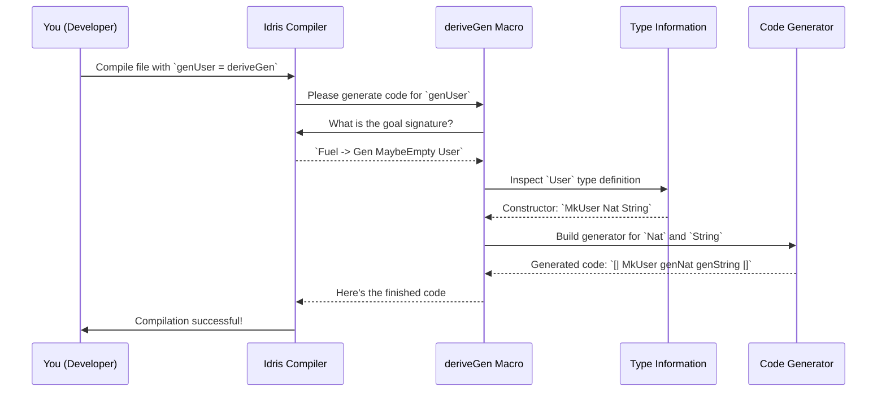
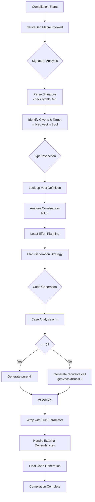

# Automatic Generator Derivation with deriveGen

In this tutorial, we will learn how to use `deriveGen` to automatically create test data generators for complex data types. We will build generators step by step, starting with simple types and progressing to advanced dependent types.

## What We Will Build

In this tutorial, we will create generators for:
- Simple record types like `User`
- Sum types like `Protocol` with multiple constructors
- Recursive types like `MyList`
- Dependent types like `Vect n Nat`
- Constrained types like `SortedList`

## Prerequisites

Before starting, make sure you have:
- Idris 2 installed
- The `DepTyCheck` library available
- Basic familiarity with Idris syntax

## Step 1: Setting Up Your Environment

First, we need to enable the metaprogramming features that `deriveGen` uses. Add this line at the top of your file:

```idris
%language ElabReflection
```

And import the generator module:

```idris
import Deriving.DepTyCheck.Gen
import Data.Fuel
```

### Alternative Entry Point: `deriveGenFor`

`DepTyCheck` provides two main derivation entry points:

1. **`deriveGen`**: Uses the function's type signature
2. **`deriveGenFor`**: Takes the signature as an explicit argument

Example using `deriveGenFor`:

```idris
genTrafficLightFor : Fuel -> Gen MaybeEmpty TrafficLight
genTrafficLightFor = deriveGenFor (Fuel -> Gen MaybeEmpty TrafficLight)
```

Both achieve the same result, but `deriveGenFor` can be useful when you want to specify the signature explicitly.

## Understanding the Fuel Parameter

The `Fuel` parameter is a safety mechanism that prevents infinite recursion. Think of it as a "generation budget" - each recursive call consumes one unit of fuel. When fuel reaches zero, the generator stops recursing.

You can create fuel values using:
- `limit n` - Creates fuel with `n` units
- Or just use a natural number like `5`

### Why Fuel is Necessary

Consider a recursive data type:

```idris
data MyList = MyNil | MyCons Nat MyList
```

Without fuel, if `deriveGen` randomly chose `MyCons` repeatedly, it could try to build an infinitely long list and crash your program. Fuel prevents this by limiting recursion depth.

### Fuel Mechanism in Action

When you run `pick (genMyList 5)`:
- Generator starts with fuel budget of 5
- If it chooses `MyCons`, it spends one unit of fuel
- Recursively calls `genMyList 4` for the inner list
- When fuel reaches 0, generator must pick `MyNil`

This guarantees the generator always finishes.

### Generated Code Example

For `Nat`, `deriveGen` generates code similar to:

```idris
-- Conceptual generated code for genNat
case fuel of
  Dry => pure Z
  More subFuel => oneOf [pure Z, [| S (genNat subFuel) |]]
```

Each recursive call consumes fuel, ensuring termination.

## Step 2: Your First Derived Generator

Let's start with a simple `UserProfile` record:

```idris
data UserProfile = MkProfile String Nat
```

### Manual Approach (for comparison)

Before `deriveGen`, you would write generators manually:

```idris
genName : Gen NonEmpty String
genName = elements ["Alice", "Bob", "Charlie"]

genAge : Gen NonEmpty Nat
genAge = choose (18, 65)

-- Manual combination
genProfileManual : Gen NonEmpty UserProfile
genProfileManual = [| MkProfile genName genAge |]
```

### Automatic Approach with `deriveGen`

With `deriveGen`, this becomes much simpler:

```idris
genProfile : Fuel -> Gen MaybeEmpty UserProfile
genProfile = deriveGen
```

Let's test it:

```idris
-- Generate some user profiles
main : IO ()
main = do
  let fuel = limit 10
  profiles <- pickN 5 (genProfile fuel)
  printLn profiles
```

You should see output like:
```
[MkProfile "Alice" 42, MkProfile "Bob" 7, MkProfile "Charlie" 15, ...]
```

Notice that `deriveGen` automatically handles:
- Generating `String` values
- Generating `Nat` values
- Combining them with the `MkProfile` constructor
- All the boilerplate code

## Step 3: Handling Multiple Constructors

Now let's try a type with multiple constructors:

```idris
data Protocol = TCP | UDP
```

Create the generator:

```idris
genProtocol : Fuel -> Gen MaybeEmpty Protocol
genProtocol = deriveGen
```

### What `deriveGen` Generates

Behind the scenes, `deriveGen` creates code equivalent to:

```idris
genProtocol_manual : Fuel -> Gen MaybeEmpty Protocol
genProtocol_manual fuel = oneOf [ [| TCP |], [| UDP |] ]
```

Test it:

```idris
main : IO ()
main = do
  let fuel = limit 10
  protocols <- pickN 10 (genProtocol fuel)
  printLn protocols
```

You should see a mix of `TCP` and `UDP` values.

## Step 4: Working with Recursive Types

Recursive types need special handling to avoid infinite loops. Let's create a simple list type:

```idris
data MyList = MyNil | MyCons Nat MyList
```

Create the generator:

```idris
genMyList : Fuel -> Gen MaybeEmpty MyList
genMyList = deriveGen
```

The `Fuel` parameter controls how deep the recursion can go. Let's test with different fuel levels:

```idris
main : IO ()
main = do
  -- Low fuel produces short lists
  shortLists <- pickN 3 (genMyList 2)
  printLn $ "Short lists: " ++ show shortLists

  -- Higher fuel produces longer lists
  longLists <- pickN 3 (genMyList 10)
  printLn $ "Long lists: " ++ show longLists
```

Notice how the `Fuel` parameter acts as a recursion budget.

## Step 5: Generating Dependent Types

Now let's tackle dependent types. We'll generate vectors with specific lengths:

```idris
import Data.Vect

genVectNat : (n : Nat) -> Fuel -> Gen MaybeEmpty (Vect n Nat)
genVectNat = deriveGen
```

### How `deriveGen` Handles Dependent Types

When `deriveGen` analyzes `Vect n Nat`:
- It sees `Nil : Vect 0 a` and `(::) : a -> Vect k a -> Vect (S k) a`
- For `n = 0`: Only `Nil` is valid
- For `n = S k`: Must use `(::)` constructor
- Automatically generates recursive calls for `Vect k Nat`

Test it with different lengths:

```idris
main : IO ()
main = do
  -- Generate vectors of length 3
  vec3 <- pickN 3 (genVectNat 3 (limit 10))
  printLn $ "Vectors of length 3: " ++ show vec3

  -- Generate vectors of length 0
  vec0 <- pickN 3 (genVectNat 0 (limit 10))
  printLn $ "Vectors of length 0: " ++ show vec0
```

Notice that `deriveGen` automatically handles the dependent type constraints.

## Step 5.5: Generating Vectors with Custom Types

Let's generate vectors with custom element types:

```idris
-- Custom data type
data Priority = Low | Medium | High

-- Generator for vectors of Priority values
genVectPriority : (n : Nat) -> Fuel -> Gen MaybeEmpty (Vect n Priority)
genVectPriority = deriveGen
```

Test it:

```idris
main : IO ()
main = do
  priorityVectors <- pickN 3 (genVectPriority 4 (limit 10))
  printLn $ "Priority vectors: " ++ show priorityVectors
```

`deriveGen` automatically creates generators for custom types like `Priority`.

## Step 6: Advanced Example - Sorted Lists

Let's create a more complex example with constraints. Here's a `SortedList` type:

```idris
data SortedList : Type where
  Nil  : SortedList
  Cons : (x : Nat) -> (xs : SortedList) ->
         (case xs of
               Nil      => True
               Cons y _ => x <= y) ->
         SortedList
```

The third argument to `Cons` is a proof that `x` is less than or equal to the head of the rest of the list, `y`. This guarantees the list stays sorted.

### Manual Approach Would Be Complex

Writing this generator manually would require:
1. Generate `xs` first
2. Inspect its first element `y`
3. Generate `x` in range `0` to `y`
4. Handle the proof constraint

### Automatic Approach with `deriveGen`

With `deriveGen`, it's simple:

```idris
genSortedList : Fuel -> Gen MaybeEmpty SortedList
genSortedList = deriveGen
```

Test it:

```idris
main : IO ()
main = do
  sortedLists <- pickN 5 (genSortedList (limit 10))
  printLn $ "Sorted lists: " ++ show sortedLists
```

`deriveGen` automatically handles the sorting constraint by:
1. Analyzing the `x <= y` constraint
2. Determining that generating `xs` first is the "least effort" path
3. Generating `x` in the valid range based on `y`
4. Handling the proof automatically

### Complex Type Handling

`deriveGen` can handle even more complex types:
- `UniqStrList`: Analyzes `NotIn` constraint to avoid duplicates
- `SortedBinTree`: Handles `AllLT` and `AllGT` constraints for subtree ordering

The same simple process works regardless of complexity.

## Step 7: Generating Dependent Pairs

Let's generate a dependent pair where the second component depends on the first:

```idris
import Data.Fin

-- Manual approach (for comparison)
genAnyFinManual : Gen MaybeEmpty (n ** Fin n)
genAnyFinManual = do
  n <- genNat          -- Step 1: Generate a random number `n`
  f <- genFin n        -- Step 2: Use `n` to generate a `Fin n`
  pure (n ** f)       -- Return the pair

-- Automatic approach with deriveGen
genAnyFin : Fuel -> Gen MaybeEmpty (n ** Fin n)
genAnyFin = deriveGen
```

Test it:

```idris
main : IO ()
main = do
  pairs <- pickN 5 (genAnyFin (limit 10))
  printLn $ "Dependent pairs: " ++ show pairs
```

`deriveGen` automatically handles the dependency by generating `n` first, then generating a `Fin n`. It writes the correct `do` block logic automatically.

## Step 8: Custom Type with Multiple Fields

Let's create a more realistic example with multiple fields:

```idris
data BlogPost = MkPost
  { title : String
  , author : String
  , content : String
  , tags : List String
  , isPublished : Bool
  }

genBlogPost : Fuel -> Gen MaybeEmpty BlogPost
genBlogPost = deriveGen
```

Test it:

```idris
main : IO ()
main = do
  posts <- pickN 3 (genBlogPost (limit 10))
  printLn $ "Blog posts: " ++ show posts
```

## Step 9: Working with Complex Constraints

Let's try a type with uniqueness constraints. First, we need to define the uniqueness proof:

```idris
import Data.Vect

-- A proof that a vector has no duplicate elements
data Uniq : Vect n a -> Type where
  UNil  : Uniq []
  UCons : Uniq xs -> {auto prf : Not (x `Elem` xs)} -> Uniq (x :: xs)
```

The constraint `{auto prf : Not (x `Elem` xs)}` means `x` cannot already be in the list `xs`.

Now create the generator for unique vectors:

```idris
genUniqStrVect : (n : Nat) -> Fuel -> Gen MaybeEmpty (Vect n String ** Uniq _)
genUniqStrVect = deriveGen
```

Look at the return type: `Gen MaybeEmpty (Vect n String ** Uniq _)`. This `**` syntax creates a **dependent pair**. It means `deriveGen` will produce:
1. A `Vect n String`
2. A `Uniq` proof that depends on the vector

Test it:

```idris
main : IO ()
main = do
  uniqueVectors <- pickN 3 (genUniqStrVect 3 (limit 10))
  printLn $ "Unique vectors: " ++ show uniqueVectors

  -- Verify uniqueness by checking the elements
  case uniqueVectors of
    Just (vec ** _) => do
      let hasDuplicates = length vec /= length (nub vec)
      printLn $ "Vector has duplicates: " ++ show hasDuplicates
    Nothing => printLn "Generation failed"
```

`deriveGen` automatically handles the uniqueness constraint by ensuring no duplicate elements are generated.

## Step 10: Putting It All Together

Let's create a comprehensive example that combines multiple concepts:

```idris
data UserProfile = MkProfile
  { name : String
  , age : Nat
  , email : String
  , preferences : List String
  }

data MessageType = Text | Image | Video | File

data Message =
    TextMsg String
  | FileMsg String Nat MessageType

data Conversation = MkConversation UserProfile (List Message)

genConversation : Fuel -> Gen MaybeEmpty Conversation
genConversation = deriveGen
```

Test it:

```idris
main : IO ()
main = do
  conversations <- pickN 3 (genConversation (limit 10))

  case conversations of
    Just convs => do
      printLn $ "Generated " ++ show (length convs) ++ " conversations:"
      for_ convs $ \conv => do
        printLn $ "- Conversation with " ++ show (length (messages conv)) ++ " messages"
    Nothing => printLn "Generation failed"

  where
    messages : Conversation -> List Message
    messages (MkConversation _ msgs) = msgs
```

This example combines:
- Record types with multiple fields
- Sum types with multiple constructors
- Recursive structures (List Message)
- Complex nested data

`deriveGen` handles all these complexities automatically.

## How `deriveGen` Works Internally

`deriveGen` is a compile-time macro that runs during compilation, not when your program executes. Here's what happens when the compiler sees `genUser = deriveGen`:

### Compilation Process



1. **Compilation Trigger**: You compile your file with `genUser = deriveGen`
2. **Macro Invocation**: Idris compiler calls the `deriveGen` macro
3. **Type Inspection**: `deriveGen` examines the `User` type definition
4. **Recursive Analysis**: It determines it needs generators for `Nat` and `String`
5. **Code Generation**: Creates equivalent code to `[| MkUser genNat genString |]`
6. **Type Checking**: Generated code is verified and inserted

### Internal Implementation

The core logic lives in `src/Deriving/DepTyCheck/Gen.idr`:

```idris
export %macro
deriveGen : DeriveBodyForType => Elab a
deriveGen = do
  Just signature <- goal
     | Nothing => fail "The goal signature is not found..."
  tt <- deriveGenExpr signature
  check tt
```

Key components:
- `%macro`: Marks `deriveGen` as a compile-time macro
- `Elab a`: Operates in the elaboration monad for compile-time code generation
- `goal`: Retrieves the function signature being implemented
- `deriveGenExpr`: Core engine that analyzes types and builds generator code
- `check`: Verifies and inserts the generated code

### Detailed Derivation Process

When `deriveGen` processes a signature like `(n : Nat) -> Fuel -> Gen MaybeEmpty (Vect n Bool)`:



#### Step 1: Signature Analysis (`checkTypeIsGen`)
- Parses the function signature
- Identifies givens (`n : Nat`) and target (`Vect n Bool`)
- Validates the signature structure
- Returns `checkResult` containing parsed signature details

#### Step 2: Type Inspection
- Looks up the `Vect` data type definition
- Analyzes constructors: `Nil : Vect 0 a` and `(::) : a -> Vect k a -> Vect (S k) a`
- Understands constructor constraints
- Determines constructor applicability based on given parameters

#### Step 3: "Least Effort" Planning

The `LeastEffort` strategy analyzes constructor arguments to determine the optimal generation order by identifying dependencies between them.

`LeastEffort` is the default "brain" or "manager" for the `deriveGen` factory. Its job is to figure out the simplest possible order to generate the fields of a data structure.

**Dependency Analysis Example:**

```idris
data SizedMessage = MkMsg (len : Nat) (message : Vect len Char)
```

`LeastEffort` performs this analysis:

1. **Examine `len : Nat`**: It sees that the type `Nat` doesn't depend on any other fields in the `MkMsg` constructor. It labels this as an "easy" field that can be generated first.
2. **Examine `message : Vect len Char`**: It sees that its type mentions `len`, another field in the constructor. This means it *depends* on `len`. It labels this as a "harder" field that must be generated later.

Based on this analysis, it creates a build plan: "Step 1: Generate `len`. Step 2: Generate `message`." This strategy of doing the easiest, most independent parts first is why it's called `LeastEffort`.

When `deriveGen` asks for the generator body for `MkMsg`, `LeastEffort` does the following:

1.  **Dependency Mapping:** It creates an internal data structure for each argument of the constructor. Let's call this a `DependencyInfo` record (the real name is `Determination`).

    For `len : Nat`, the record would look like this:
    ```
    // Simplified DependencyInfo for 'len'
    {
      name: "len",
      depends_on: [] // empty list!
    }
    ```

    For `message : Vect len Char`, it would look like this:
    ```
    // Simplified DependencyInfo for 'message'
    {
      name: "message",
      depends_on: ["len"] // depends on 'len'!
    }
    ```

2.  **Searching for an Order:** It then runs an algorithm to find the generation order. The real function is called `searchOrder`. Conceptually, it works like this:

    ```idris
    -- A very simplified idea of the searchOrder logic
    function searchOrder(remaining_fields):
      -- Find all fields that have NO dependencies left in `remaining_fields`
      let candidates = find_fields_with_zero_dependencies(remaining_fields);

      if candidates is empty:
        -- This means there's a circular dependency! Error.
        return error;
      else:
        -- Pick the best candidate (LeastEffort just picks the first one it finds)
        let chosen = pick_one(candidates);

        // Recursively find the order for the rest of the fields
        return [chosen] ++ searchOrder(remove(chosen, from: remaining_fields));
    ```
    It repeatedly finds an argument that has all of its dependencies met (or has no dependencies to begin with), adds it to the build plan, and then repeats the process until all arguments are planned. For `SizedMessage`, the process is:
    *   **Round 1:** Find fields with 0 dependencies. Only `len` matches. **Plan: `[len]`**.
    *   **Round 2:** Remove `len` from consideration. Now check `message`. Its dependency, `len`, has been planned. So `message` now has 0 *unplanned* dependencies. **Plan: `[len, message]`**.
    *   Done! The final order is `len`, then `message`.

This simple but robust algorithm is the heart of `LeastEffort`, allowing it to untangle even very complex dependency chains in your data types automatically.

**Resulting Plan:**
```idris
-- Generated code follows this order:
do
  len <- genNat fuel        -- Generate length first
  message <- genVect len    -- Then generate vector of that length
  pure (MkMsg len message)
```

**Key Dependency Rules:**
- Arguments with independent types (`Nat`, `String`, etc.) can be generated first
- Arguments with dependent types must wait for their dependencies
- The strategy minimizes "effort" by generating independent arguments first

**For `SortedList`**: Determines generating `xs` before `x` is the path of least resistance
**For `Uniq` vectors**: Plans element generation to avoid duplicates
- Creates optimal generation strategy

The `LeastEffort` strategy can be customized for advanced use cases.

#### Step 4: Code Generation (`callMainDerivedGen`)
- Creates a case analysis on the given `n`
- For `n = 0`: Generates `pure Nil` (only valid constructor)
- For `n = S k`: Generates recursive call `genVectOfBools k`
- Combines steps using applicative style
- Returns `coreGenCode` with local helper functions

#### Step 5: Assembly (`wrapFuel` and `internalGenCallingLambda`)
- Wraps the core generator code with fuel parameter: `\fuel => ...`
- Handles any external generator dependencies
- Ensures proper scoping of local variables
- Builds the complete generator function

### Internal Implementation Details

The core `deriveGenExpr` function (simplified):

```idris
deriveGenExpr : DeriveBodyForType => (signature : TTImp) -> Elab TTImp
deriveGenExpr signature = do
  -- Parse and validate signature
  checkResult@(targetSig ** externals ** _) <- checkTypeIsGen DerivationTask signature

  -- Extract target type
  let targetType = targetSig.targetType

  -- Generate core generator code
  (coreGenCode, localsNeeded) <- callMainDerivedGen targetSig (UN "fuel")

  -- Wrap with fuel argument and other parameters
  wrapFuel (UN "fuel") <$> internalGenCallingLambda checkResult (local localsNeeded coreGenCode)
```

### Compilation Process

When the compiler sees `genNat = deriveGen`:

1. **Macro Activation**: Compiler pauses and runs `deriveGen` macro
2. **Goal Analysis**: `deriveGen` asks "What am I trying to build?" (gets `Fuel -> Gen MaybeEmpty Nat`)
3. **Type Inspection**: Examines `Nat` definition (`Z | S Nat`)
4. **Constructor Analysis**: Plans generation for each constructor
5. **Code Generation**: Creates case expression handling fuel
6. **Insertion**: Generated code becomes `genNat` function body

### External Generator Dependencies

You can specify external generators using auto-implicit arguments:

```idris
-- Generator for vectors with custom element generator
genAnyVect : {auto genInt : Fuel -> Gen MaybeEmpty Int} =>
             Fuel -> Gen MaybeEmpty (n ** Vect n Int)
genAnyVect = deriveGen
```

This tells `deriveGen`: "When you need an `Int`, use the `genInt` generator I'm providing."

### Type Composition

When your types contain other custom types, you can compose generators:

```idris
-- Custom type
data MySpecialType = MkMST Nat String

-- Define generator for custom type
genMySpecialType : Fuel -> Gen MaybeEmpty MySpecialType
genMySpecialType = deriveGen

-- Container type using custom type
data Container = MkContainer Nat (Vect 5 MySpecialType)

-- Provide custom generator as dependency
genContainer : (Fuel -> Gen MaybeEmpty MySpecialType) => Fuel -> Gen MaybeEmpty Container
genContainer = deriveGen
```

The `(Fuel -> Gen MaybeEmpty MySpecialType) =>` syntax tells `deriveGen` to use your custom generator for `MySpecialType` fields.

### Type Analysis Process

When analyzing `(n ** Fin n)`, `deriveGen` performs:

1. **Signature Parsing**: Breaks down `Fuel -> Gen MaybeEmpty (n ** Fin n)`
2. **Target Analysis**: Identifies `(n ** Fin n)` as a dependent pair
3. **Dependency Resolution**: Determines `n` must be generated first
4. **Plan Formation**: Creates logic to generate `n : Nat`, then `f : Fin n`

### Internal Type Analysis (Conceptual)

```idris
-- Conceptual type analysis
checkTypeIsGen : (signature : TTImp) -> Elab ...
checkTypeIsGen sig = do
  -- Step 1: Break signature `Fuel -> Gen MaybeEmpty (n ** Fin n)` apart
  let (args, resultType) = unPi sig

  -- Step 2: Look inside the `Gen` to find the target
  let (gen, target) = unApp resultType

  -- Step 3: Analyze the target. Is it a dependent pair `(**)`?
  let Just (paramsToGen, finalType) = unDPairUnAlt target
    -- `paramsToGen` is now `(n : Nat)`
    -- `finalType` is now `Fin n`

  -- Step 4: Form generation plan based on structure
  ...
```

Key components:
- `TTImp`: Idris's internal type representation
- `checkTypeIsGen`: Validates signature format
- `callMainDerivedGen`: Core derivation logic
- `wrapFuel`: Adds fuel parameter
- `internalGenCallingLambda`: Handles external generators

The process spans multiple files: `Gen.idr`, `ForAllNeededTypes/Impl.idr`, `ForOneType/Impl.idr`.

### Signature Analysis: Givens vs Generatables

`deriveGen` uses your function signature to understand what to generate. The signature acts as an "order form" that specifies:

**Givens**: Arguments that come *before* the `Fuel` argument
**Generatables**: The type parameters described *inside* the `Gen` type at the end

#### Examples:

```idris
-- Generate User values (no givens)
genUser : Fuel -> Gen MaybeEmpty User
genUser = deriveGen

-- Generate vectors with specific length (n is a given)
genVectOfBools : (n : Nat) -> Fuel -> Gen MaybeEmpty (Vect n Bool)
genVectOfBools = deriveGen
```

In the second example:
- `(n : Nat)`: This is a **given** - `deriveGen` receives `n` as input
- `Fuel`: Safety budget
- `Gen MaybeEmpty (Vect n Bool)`: This is the **target** - generate a vector of length `n`

### Signature Analysis Process

When `deriveGen` analyzes your signature:
1. **Parse Signature**: Breaks down `(n : Nat) -> Fuel -> Gen MaybeEmpty (Vect n Bool)`
2. **Identify Givens**: `n : Nat` (comes before `Fuel`)
3. **Identify Target**: `Vect n Bool` (inside `Gen`)
4. **Plan Generation**: Creates logic based on the relationship between givens and target

This analysis happens in `checkTypeIsGen` in `src/Deriving/DepTyCheck/Gen.idr`.

## What You've Learned

In this tutorial, you've learned how to:

- Use `deriveGen` to automatically create generators
- Handle simple types, sum types, and recursive types
- Work with dependent types and constraints
- Generate complex data structures automatically

## Next Steps

Now that you can automatically generate test data, you might want to:

- Learn how to customize the derivation process
- Explore coverage tracking for your generators
- Study the internal mechanics of `deriveGen`

## Common Patterns

Here are the common patterns you'll use with `deriveGen`:

```idris
-- Basic pattern for any type
myGen : Fuel -> Gen MaybeEmpty MyType
myGen = deriveGen

-- Pattern for dependent types with parameters
myGen : Param -> Fuel -> Gen MaybeEmpty (MyType Param)
myGen = deriveGen

-- Pattern for dependent pairs
myGen : Fuel -> Gen MaybeEmpty (param ** MyType param)
myGen = deriveGen
```

## Customizing Derivation with Custom Generators

Sometimes you want to override `deriveGen`'s default behavior. You can provide custom generators using auto-implicit arguments:

```idris
-- Custom generator for positive natural numbers
genPositiveNat : Fuel -> Gen MaybeEmpty Nat
genPositiveNat fuel = map S (deriveGen fuel)  -- Add 1 to generated Nat

-- Use custom generator for Nat fields
genSpecialRecord : (Fuel -> Gen MaybeEmpty Nat) => Fuel -> Gen MaybeEmpty MyRecord
genSpecialRecord @{genForNat} = deriveGen
```

By adding `(Fuel -> Gen MaybeEmpty Nat) =>` to the signature, you tell `deriveGen` to use your custom generator instead of the default one.

## Troubleshooting

If you encounter issues:

1. Make sure `%language ElabReflection` is at the top of your file
2. Check that all types in your data structure have generators available
3. Use sufficient `Fuel` for recursive types
4. Verify that constraints are satisfiable
5. Ensure custom generators have compatible signatures

## Summary

`deriveGen` is a powerful tool that saves you from writing complex generator logic by hand. By following the patterns in this tutorial, you can automatically generate test data for even the most complex Idris types.