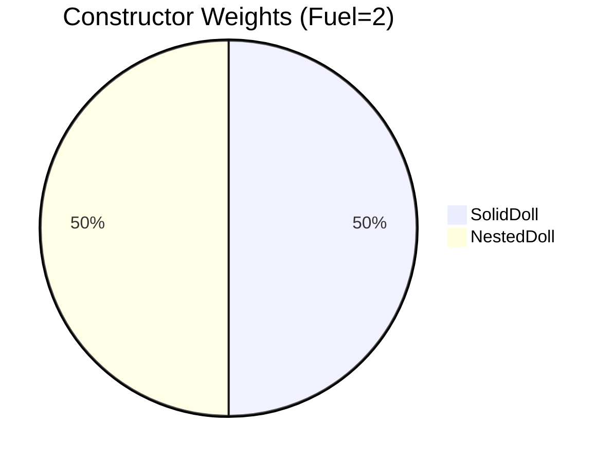
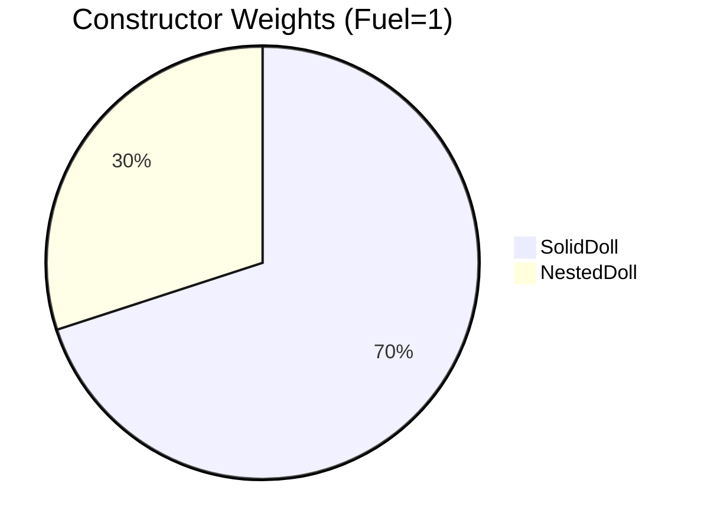
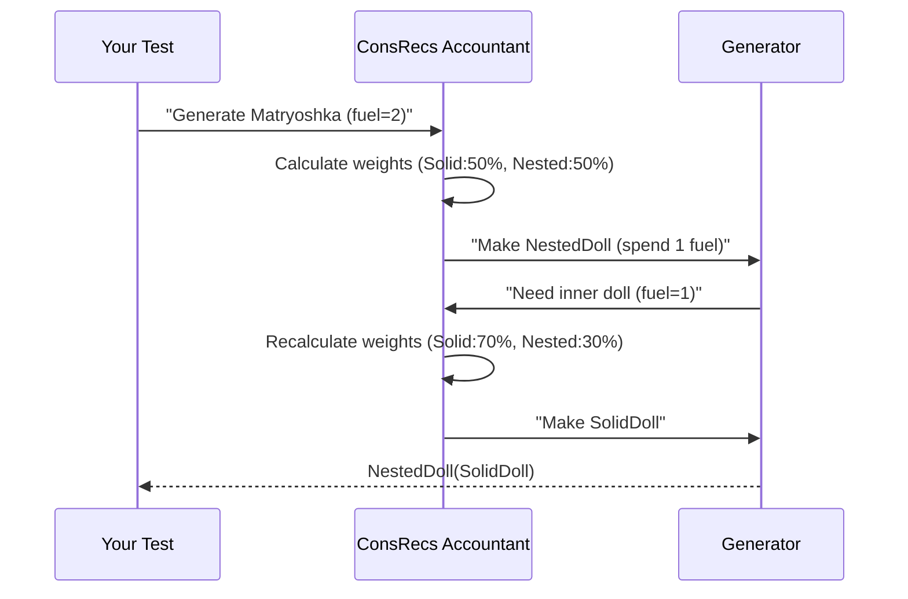
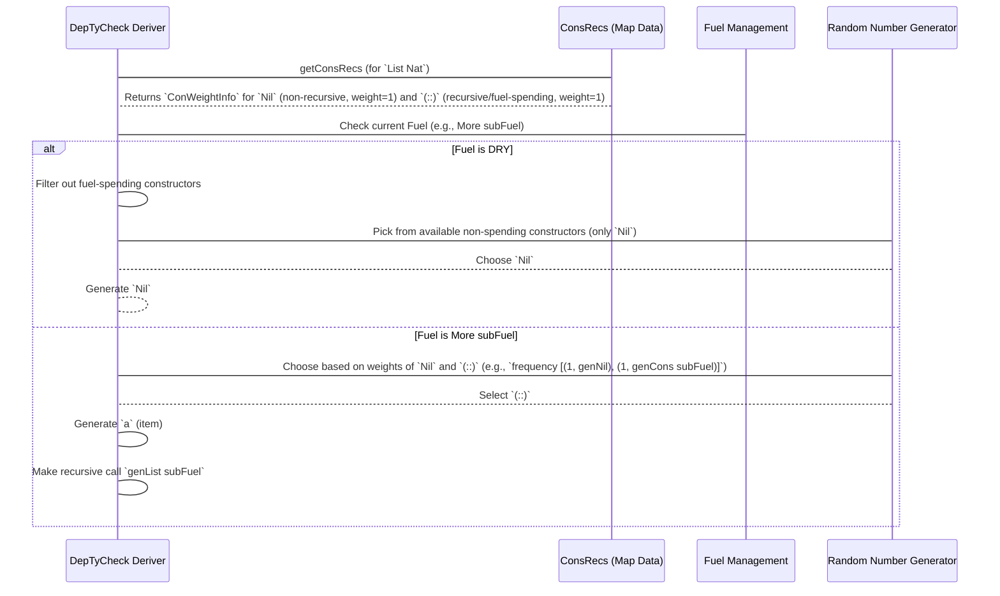
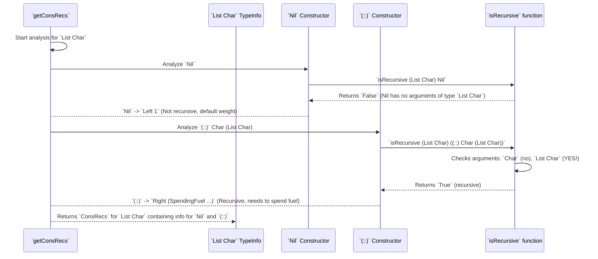
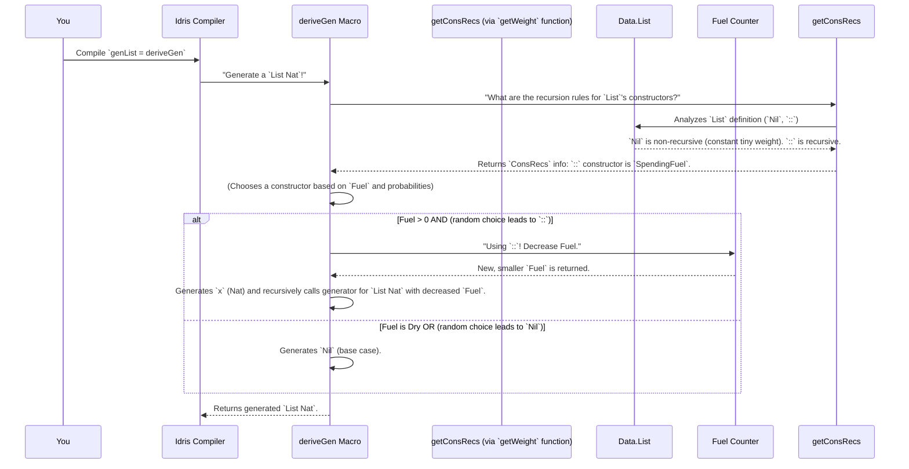

# Recursion Analysis in DepTyCheck

In this tutorial, we'll explore how DepTyCheck handles recursive data types safely and efficiently. You'll learn how the system prevents infinite loops while generating meaningful test data for recursive structures like lists, trees, and other self-referential types.

## What You'll Learn

By the end of this tutorial, you'll be able to:
- Understand how DepTyCheck identifies recursive constructors
- Explain the role of "fuel" in preventing infinite recursion
- Differentiate between fuel-spending and structurally-decreasing recursion
- Customize generation behavior through constructor weighting

## Prerequisites

Before starting, you should be familiar with:
- Basic Idris data types and constructors
- The concept of recursion in programming
- DepTyCheck's basic generator derivation syntax

## The Challenge: Generating Recursive Data

Let's start with a simple recursive data type - a list:

```idris
data List a = Nil | Cons a (List a)
```

If we try to generate values for this type naively, we face a problem: the `Cons` constructor requires generating another `List a`, which could lead to infinite recursion.

### Understanding the Problem

When DepTyCheck analyzes `List a`, it sees:
- `Nil`: A simple base case with no recursion
- `Cons`: A recursive case that contains another `List a`

Without safeguards, repeatedly choosing `Cons` would create an infinite chain:
```idris
Cons 1 (Cons 5 (Cons 10 (Cons 2 ...)))  -- This never stops!
```

### The Fundamental Questions

To build a generator for `List`, DepTyCheck needs to answer two fundamental questions:

1. **Which constructor is the "loopy" one?** The `Cons` constructor contains another `List a` inside it. If we pick `Cons` over and over, we'll get `Cons x (Cons y (Cons z ...))`, potentially forever. The system needs to identify `Cons` as the recursive constructor so it knows to use `Fuel` when calling it.

2. **How often should we pick `Nil` vs. `Cons`?** If the generator always picks `Nil`, we'll only ever get empty lists. If it almost always picks `Cons`, we'll get very long lists and run out of `Fuel` quickly. To generate a nice variety of list lengths, we need a way to balance the choice.

This is the job of the **Recursion and Weight Analysis** component.

Think of it as a safety inspector examining the blueprints for a data type. The inspector's job is to:
- **Find self-references:** Mark any part of the blueprint that refers back to itself (recursion).
- **Assess risk:** Determine if the self-reference is "safe" (e.g., getting smaller each time) or if it needs a safety budget (`Fuel`).
- **Make recommendations:** Suggest how frequently each part of the design should be used (assign "weights").

This analysis happens *before* any generator code is written. It provides the crucial intelligence needed by the other parts of `DepTyCheck`.

### Why We Need Recursion Handling

Consider a more concrete example with Russian nesting dolls:

```idris
data Matryoshka =
  SolidDoll |
  NestedDoll Matryoshka   -- Recursive case!
```

If we tried to generate this naively:
```idris
genMatryoshka fuel = oneOf
  [ pure SolidDoll
  , NestedDoll <$> genMatryoshka fuel  -- Uh oh, infinite loop!
  ]
```

We'd get stuck in an endless loop! ConsRecs solves this by:
1. **Tracking recursion depth** with "fuel" tokens
2. **Adjusting probabilities** to avoid infinite generation
3. **Smartly weighting constructors** based on remaining fuel

### Meet Your Recursion Accountant

Think of ConsRecs as a careful bank manager tracking your recursion "funds":
```
Initial Fuel: 3 tokens

Generate SolidDoll:
  - Cost: 0 tokens (base case)
  - Remaining: 3

Generate NestedDoll:
  - Cost: 1 token
  - Remaining: 2
  - Generate inner doll with remaining fuel
```

The accountant ensures we never overspend our recursion budget!

## The Solution: Fuel-Based Recursion Control

DepTyCheck solves this problem using a "fuel" mechanism. Think of fuel as a limited budget for recursion:

```idris
data Fuel = Dry | More Fuel  -- Like a countdown timer

-- Start with 3 'More' layers
startFuel : Fuel
startFuel = More (More (More Dry))
```

Each recursive call consumes one unit of fuel. When fuel runs out (`Dry`), only non-recursive constructors can be chosen.

### How Fuel Works in Practice

When generating recursive types:
```idris
genMatryoshka : Fuel -> Gen Matryoshka
genMatryoshka Dry = pure SolidDoll  -- Base case when fuel runs out
genMatryoshka (More fuel) = oneOf
  [ pure SolidDoll
  , NestedDoll <$> genMatryoshka fuel  -- Spend one fuel token
  ]
```

When you derive a generator for a recursive type:
```idris
genList : Fuel -> Gen MaybeEmpty (List Nat)
genList = deriveGen
```

The generated code conceptually looks like:
```idris
genList fuel =
  case fuel of
    Dry => oneOf [pure Nil]  -- Only base case allowed
    More subFuel =>
      frequency
        [ (1, pure Nil)
        , (1, [| Cons !(genNat subFuel) !(genList subFuel) |])
        ]
```

Notice how recursive calls use `subFuel` - this ensures the recursion eventually terminates.

### Probability Weights: Fair Constructor Selection

Without ConsRecs, recursive constructors might dominate generation. The system assigns fair weights:



As fuel decreases, weights adjust:


### How ConsRecs Works Step-By-Step

Let's generate a Matryoshka with fuel=2:

1. **Check fuel**: `More (More Dry)` - fuel available!
2. **Calculate weights**:
   - SolidDoll: weight 50
   - NestedDoll: weight 50
3. **Random selection**: Choose NestedDoll
4. **Recurse**:
   - Spend one fuel → now fuel=1
   - Generate inner doll with adjusted weights



### ConsRecs Internal Flow Diagram



The diagram shows how `DepTyCheck` (the `Deriver`) uses the information from `ConsRecsInfo` and the current `Fuel` to decide which constructors are allowed and how to randomly choose among them. The `fuelSpending` behavior of `(::)` is what leads to the recursive call with `subFuel`.

## Constructor Analysis: The Safety Inspector

Before generating any code, DepTyCheck performs a thorough analysis of your data type's constructors. This analysis is stored in a `ConsRecs` (Constructor Recursiveness) structure.

### The Core Analysis Problem

Constructor Recursiveness Analysis solves a fundamental problem: **how can DepTyCheck automatically identify which constructors of a data type are recursive, and which arguments within those constructors refer back to the type being defined?** Once identified, DepTyCheck can make informed decisions about how to generate these recursive calls, ensuring they eventually terminate.

The central goal is to understand how DepTyCheck looks at a data type's constructors and determines if they are "fuel-spending" (involving recursive calls that should reduce fuel) or "structurally decreasing" (recursive but naturally getting smaller, helping with termination). This analysis is crucial for assigning correct weights (probabilities) and ensuring generators produce finite values.

### Key Concepts: Inspection and Assessment

The analysis has three main outcomes for each constructor of a data type. Let's inspect `Cons a (List a)`.

#### 1. Recursion Detection

The inspector's first task is to spot recursion. DepTyCheck does this by looking at the types of all the arguments for a constructor.

- `Nil`: Has no arguments. **Not recursive.**
- `Cons a (List a)`: Has two arguments. The first is `a`. The second is `List a`. DepTyCheck sees that `List a` is the very type it's currently analyzing. **It's recursive!**

This simple check allows the system to partition all constructors into two groups: recursive and non-recursive.

#### 2. Safety Assessment: Fuel-Spending vs. Structurally Decreasing

Once a constructor is marked as recursive, the inspector assesses its risk. Is this a controlled recursion, or an open-ended one that could run forever?

##### The "Unsafe" Default: `SpendingFuel`

For `Cons a (List a)`, the recursive part (the inner `List a`) isn't getting "smaller" in any provable way. It's just another list. DepTyCheck treats this as the standard "unsafe" case. It labels this constructor as `SpendingFuel`, which tells the rest of the system: "If you use this constructor, you *must* decrement the `Fuel` counter."

This is the most common case and the default safety mechanism that prevents infinite loops.

##### The "Safe" Optimization: `StructurallyDecreasing`

Some recursive types are designed to always get smaller. Consider a hand-made `PeanoNat` type:

```idris
data PeanoNat = Z | S PeanoNat
```

We could write a function to measure the "size" of a `PeanoNat`: `size Z = 1` and `size (S n) = 1 + size n`.

DepTyCheck is smart enough to detect these special cases. If it can prove that a recursive argument is "structurally smaller" than the thing it's trying to build, it marks the constructor as `StructurallyDecreasing`.

A constructor marked this way is considered "safe" and **does not need to spend `Fuel`**. This is an advanced optimization that allows for more efficient generation of certain types. For most common types like `List` and `Tree`, `SpendingFuel` is the norm.

#### 3. Assigning Weights

Finally, the inspector makes a recommendation on how often to use each design. This is its "weight". This weight is used by the `frequency` function to decide which constructor to pick.

- **Default Weight:** By default, every constructor (`Nil` and `Cons`) gets a weight of 1. This means that when `Fuel` is available, `Nil` and `Cons` have an equal chance of being picked.
- **Tuning:** These weights are the primary way you can influence the *shape* of the generated data. If you want shorter lists, you can give `Nil` a higher weight.

### The Core Idea: Looking for Self-References

At its heart, this analysis is about looking for self-references. If a constructor's arguments include the type itself, then that constructor is recursive.

Let's consider `List a`:
- `Nil`: Takes no arguments - not recursive
- `(::) a (List a)`: Second argument `(List a)` is exactly the type being defined - recursive

### RecWeightInfo: How DepTyCheck Categorizes Recursion

When analyzing a constructor, DepTyCheck assigns it a `ConWeightInfo` which contains a `RecWeightInfo` if the constructor is recursive. This `RecWeightInfo` categorizes how the recursion should be handled:

```idris
-- From src/Deriving/DepTyCheck/Gen/ConsRecs.idr
public export
data RecWeightInfo : Type where
  SpendingFuel : ((leftFuelVarName : Name) -> TTImp) -> RecWeightInfo
  StructurallyDecreasing : (decrTy : TypeInfo) -> (wExpr : TTImp) -> RecWeightInfo
```

**Detailed Explanation:**

- **`SpendingFuel`**: Applies to constructors where DepTyCheck needs to explicitly spend `Fuel`. If this constructor is chosen, the `fuel` argument must be reduced for recursive calls. The `TTImp` represents the code for *how* to spend the fuel. This is the default for most recursive types like `List`.

- **`StructurallyDecreasing`**: Applies to special cases where the recursive argument is guaranteed to get "smaller" in a way that doesn't need explicit `Fuel` reduction. `decrTy` is the `TypeInfo` for the structurally decreasing argument, and `wExpr` is the `TTImp` for its weight expression. This applies to types like `Fin n` where `k` is smaller than `S k`.

A constructor that is *not* recursive (like `Nil`) doesn't get a `RecWeightInfo` at all; it just gets a `Nat1` weight.

### getConsRecs: The Analysis Mastermind

The `getConsRecs` function (in `src/Deriving/DepTyCheck/Gen/ConsRecs.idr`) is the core function that performs this analysis. It's called by `canonicBody` to gather all constructor information.

Let's examine the detailed logic of `getConsRecs`:

```idris
-- Simplified view of getConsRecs from src/Deriving/DepTyCheck/Gen/ConsRecs.idr
export
getConsRecs : Elaboration m => NamesInfoInTypes => m ConsRecs
getConsRecs = do
  consRecs <- for knownTypes $ \targetType => do
    -- Loop through each known type
    crsForTy <- for targetType.cons $ \con => do
      -- Loop through each constructor for the targetType
      tuneImpl <- search $ ProbabilityTuning con.name -- Check for user tuning

      isRec <- isRecursive {containingType=Just targetType} con
      -- The 'isRecursive' function does the actual recursive check!

      w : Either Nat1 (TTImp -> TTImp, SortedSet $ Fin con.args.length) <- case isRec of
        False => -- Not recursive. Just assign weight (maybe tuned)
          pure $ Left $ maybe one (\impl => tuneWeight @{impl} one) tuneImpl
        True  => -- Is recursive!
          -- Complex logic to figure out if it's SpendingFuel or StructurallyDecreasing
          pure (Right (\fuelArg => `(someWeightBasedOn ~fuelArg), directRecArgs))
      pure (con ** w)

    -- Further analysis for StructurallyDecreasing
    -- Checks if recursive arguments are decreasing

  pure $ MkConsRecs finalConsRecs $ deriveW (map (\(_ ** crs) => (fst crs, (snd crs))) consRecs)
```

**Detailed Analysis Process:**

1. **Iterate over known types**: `getConsRecs` iterates over all types that DepTyCheck knows about and might need to derive generators for.

2. **Analyze each constructor**: For each `targetType` (e.g., `List`), it looks at every constructor (`Nil`, `(::)`).

3. **Check for user tuning**: It first checks if the user has provided any custom `ProbabilityTuning` for this constructor, which impacts the base weight.

4. **Recursive detection**: The key function `isRecursive` analyzes the constructor to determine if it's recursive with respect to `targetType`.

5. **Weight assignment**:
   - **Non-recursive**: If `isRecursive` returns `False` (like `Nil`), assigns a simple weight (`Left Nat1`), possibly adjusted by user tuning.
   - **Recursive**: If `isRecursive` returns `True` (like `(::)`), enters complex logic to determine if it's `SpendingFuel` or `StructurallyDecreasing`.

#### The Decision Maker: `finCR`

The complex logic for distinguishing between the two recursion types happens in a helper function called `finCR`. The strategy works as follows:

1. **Assume the worst:** It starts by assuming the recursion is simple `SpendingFuel` recursion.
2. **Look for evidence of improvement:** It then checks all the recursive arguments. For each one, it compares its type parameters to the final type's parameters. For `Vect`, it compares `k` (from the argument `Vect k a`) with `S k` (from the result `Vect (S k) a`).
3. **Make a judgment:** If it finds even one recursive argument where a parameter is getting structurally smaller (like `k` is to `S k`), it changes its verdict to `StructurallyDecreasing`.
4. **File the report:** If it finds no such evidence after checking all arguments, it sticks with its original `SpendingFuel` verdict.

This clever deduction allows `deriveGen` to produce highly optimized generators for a wide range of recursive types, all automatically.

### isRecursive: The Heart of Recursion Detection

The `isRecursive` function is responsible for:
- **Checking arguments**: For each argument of the constructor, compares the argument's type against the `targetType`
- **Direct match**: If an argument's type is exactly the `targetType` (e.g., `List a` in `(::) a (List a)`), it's a direct recursive call
- **Indirect match**: If an argument's type *contains* the `targetType` (e.g., `Maybe (List a)`), it's also considered recursive
- **Dependent parameters**: Analyzes dependent parameters, like identifying `(S n)` as recursive in `Vec n a` constructors

### Analyzing Our List Example

For `List a`, the analysis reveals:
- **`Nil`**: Non-recursive constructor with fixed weight
- **`Cons`**: Recursive constructor that spends fuel

Let's trace this analysis process:



### lookupConsWithWeight: Accessing Analysis Results

Once `getConsRecs` has done its job, `canonicBody` needs to retrieve the results via `lookupConsWithWeight`:

```idris
-- From src/Deriving/DepTyCheck/Gen/ConsRecs.idr
export
lookupConsWithWeight : ConsRecs => GenSignature -> Maybe $ List (Con, ConWeightInfo)
lookupConsWithWeight @{crs} sig = do
  let givs = mapIn finToNat sig.givenParams
  lookup' crs.conWeights sig.targetType.name <&> (`apply` givs)
```

This function:
- Takes the `ConsRecs` (full analysis results) and a `GenSignature`
- Retrieves the list of `(Con, ConWeightInfo)` computed earlier by `getConsRecs`
- Uses the `apply` operator because some `ConsRecs` might be functions of given parameters

This provides the necessary information for `canonicBody` to build the `fuelDecisionExpr`, ensuring recursive constructors appropriately spend fuel.

### The Analysis Data Structures

The analysis results are stored in these key types:

```idris
-- Core analysis structures from src/Deriving/DepTyCheck/Gen/ConsRecs.idr
public export
data RecWeightInfo : Type where
  SpendingFuel : ((leftFuelVarName : Name) -> TTImp) -> RecWeightInfo
  StructurallyDecreasing : (decrTy : TypeInfo) -> (wExpr : TTImp) -> RecWeightInfo

public export
record ConWeightInfo where
  constructor MkConWeightInfo
  weight : Either Nat1 RecWeightInfo
```

- `Left Nat1`: Fixed weight for non-recursive constructors
- `Right RecWeightInfo`: Dynamic weight for recursive constructors

### Breaking Down ConsRecs and ConWeightInfo

`ConsRecs` itself is a record that mainly holds a map (`conWeights`). This map tells us, for each type, how its constructors consume "weight" (or `Fuel`).

```idris
-- From src/Deriving/DepTyCheck/Gen/ConsRecs.idr (Simplified)
public export
record ConsRecs where
  constructor MkConsRecs
  conWeights : SortedMap Name $ (givenTyArgs : SortedSet Nat) -> List (Con, ConWeightInfo)
  -- ... other fields ...
```

The core information is in `ConWeightInfo`:

```idris
-- From ConsRecs.idr (Simplified)
public export
record ConWeightInfo where
  constructor MkConWeightInfo
  weight : Either Nat1 RecWeightInfo
```

This `weight` field is key:

- **`Left Nat1`**: This means the constructor is *not recursive* (or its recursion is otherwise resolved) and just has a constant `Nat1` weight (like `1`). This doesn't consume `Fuel`. `Nat1` means "natural number starting from 1."
- **`Right RecWeightInfo`**: This means the constructor *is recursive*, and `RecWeightInfo` tells us *how* it handles recursion.

### RecWeightInfo: How Recursive Constructors Act

`RecWeightInfo` has two main cases for recursive constructors:

```idris
-- From ConsRecs.idr (Simplified)
public export
data RecWeightInfo : Type where
  SpendingFuel : ((leftFuelVarName : Name) -> TTImp) -> RecWeightInfo
  StructurallyDecreasing : (decrTy : TypeInfo) -> (wExpr : TTImp) -> RecWeightInfo
```

1. **`SpendingFuel : ...`**: This is the most common case for recursive constructors (like `::` for lists). It means: "Yes, this constructor is recursive, and every time I use it, I need to spend a unit of `Fuel`." The `TTImp` is a function that generates an expression to access the remaining `Fuel`.
   - **Analogy**: This is like a train with a limited number of coal shovels. Each time you use the `Cons` carriage, you burn one shovel of coal.

2. **`StructurallyDecreasing : (decrTy : TypeInfo) -> (wExpr : TTImp) -> RecWeightInfo`**: This is a more advanced case. Sometimes, an argument to a constructor *itself* makes the recursion "smaller" or "less deep" without needing to consume `Fuel`. This happens when a type parameter influences the size of the recursive call.
   - **Example**: Imagine a list generator `genVec : (n : Nat) -> Fuel -> Gen (Vec n A)`. If `n` refers to the length, then `(::) x xs` means `xs` has length `n-1`. This `n-1` is "structurally decreasing" compared to `n`. In such cases, `ConsRecs` might decide *not* to consume `Fuel` for that step, because the `n` argument provides a structural guarantee of termination. `decrTy` identifies this decreasing argument, and `wExpr` is an expression to get its value.
   - **Analogy**: This is like building a tower. If one of your building blocks has a number `N` on it, and the next block *must* have `N-1`, you don't need a separate "fuel" counter because the numbers themselves guarantee you'll eventually reach `0` and stop.

### leftDepth: Converting Fuel to Numbers

The `SpendingFuel` option uses `leftDepth : Fuel -> Nat1` internally. This function essentially converts `Fuel` into a `Nat1` value, allowing the `Fuel` to be used in calculations (like probabilities).

```idris
-- From ConsRecs.idr
public export
leftDepth : Fuel -> Nat1
leftDepth = go 1 where
  go : Nat1 -> Fuel -> Nat1
  go n Dry      = n
  go n (More x) = go (succ n) x
```

This `leftDepth` function is used to convert the `Fuel` into a number, so that when a `SpendingFuel` constructor is picked, `deriveGen` can reduce this number, effectively limiting the recursion depth. For example, if `Fuel` is `More (More Dry)`, `leftDepth` would give `3`. `More Dry` would give `2`, and `Dry` would give `1`.

### Inside the Accountant's Ledger

Here's the core structure that tracks recursion weights (simplified):

```idris
record ConWeightInfo where
  constructor MkConWeightInfo
  weight : Either Nat1 RecWeightInfo  -- Weight value or function

||| Recursive weight details
data RecWeightInfo =
  SpendingFuel (Fuel -> Nat1)  -- Fuel-based calculation
  | StructurallyDecreasing TypeInfo TTImp  -- Size-based decrease
```

When processing our Matryoshka:
```idris
-- For SolidDoll (non-recursive)
solidWeight = Left 1  -- Constant weight

-- For NestedDoll (recursive)
nestedWeight = Right $ SpendingFuel $
  \fuel => if fuel == Dry then 0 else 1
```

### Real-World Usage

With DepTyCheck, you get this automatically! Just derive as usual:

```idris
data Matryoshka = SolidDoll | NestedDoll Matryoshka

-- Automatically handles recursion!
genMatryoshka : Fuel -> Gen MaybeEmpty Matryoshka
genMatryoshka = deriveGen
```

DepTyCheck will:
1. Detect recursive constructors
2. Set up fuel tracking
3. Balance probabilities
4. Prevent infinite generation

### How deriveGen Uses ConsRecs

When `deriveGen` needs to create a generator for a `List Nat`, here's how `ConsRecs` guides it:



Every time `deriveGen` makes a choice among constructors for `List`, it consults the `ConWeightInfo` from `ConsRecs`. If it chooses `::` and it's marked `SpendingFuel`, it will pass `More fuel` to generating the internal `List` while consuming `fuel`. If it chooses `Nil`, it just generates `Nil`. When `Fuel` is `Dry`, the probabilities of choosing `SpendingFuel` constructors drop significantly (or become 0) to ensure termination.

### A Glimpse into getConsRecs for List

The `getConsRecs` function (which is quite complex internally) does all this analysis. For our `List` type, here's what it finds (simplified):

```idris
-- Very simplified internal thought process of `getConsRecs` for `List a`

-- For constructor `Nil`:
--   - Is it recursive? No.
--   - ConWeightInfo: Left 1 (a constant, small weight)

-- For constructor `(::) a (List a)`:
--   - Is it recursive? Yes, because of `List a (List a)` within its arguments.
--   - Does it detect a structurally decreasing argument? No, the `a` is just an element, and no specific `Nat` parameter is making it smaller.
--   - ConWeightInfo: Right (SpendingFuel (expression to decrement fuel))
```

The function `isRecursive {containingType=Just targetType} con` within `getConsRecs` is the magic part that identifies if a constructor (`con`) for a specific `targetType` is recursive. It checks if any of the constructor's arguments have the `targetType` itself.

## Two Types of Recursion

DepTyCheck distinguishes between different kinds of recursion for optimization.

### 1. SpendingFuel Recursion (Default)

This is the standard case for types like `List` where recursion isn't guaranteed to terminate naturally:

```idris
data List a = Nil | Cons a (List a)
```

The `Cons` constructor is marked as `SpendingFuel` because there's no structural guarantee that the recursion will stop.

### 2. StructurallyDecreasing Recursion (Optimized)

Some recursive types have built-in termination guarantees. Consider vectors:

```idris
data Vect : Nat -> Type -> Type where
  VNil : Vect Z a
  VCons : a -> Vect k a -> Vect (S k) a
```

Here, `VCons` takes a `Vect k a` and produces a `Vect (S k) a`. The size parameter `k` is structurally smaller than `S k`, guaranteeing termination.

DepTyCheck detects this pattern and marks `VCons` as `StructurallyDecreasing`, allowing it to generate vectors without spending fuel.

## Constructor Weighting and Probability Control

Weights control how likely each constructor is to be chosen during generation.

### Default Weighting Strategy

By default, DepTyCheck assigns:
- Equal weights (1) to all constructors when fuel is available
- Zero weight to recursive constructors when fuel is dry

This creates a balanced distribution that favors termination as fuel decreases.

### Dynamic Weight Adjustment

For recursive constructors, weights can change based on remaining fuel:

```idris
-- When fuel is plentiful, recursive constructors have higher weight
genList (More (More (More Dry))) =  -- Fuel level 3
  frequency
    [ (1, pure Nil)     -- 25% chance
    , (3, genCons ...)  -- 75% chance
    ]

-- When fuel is low, base cases are favored
genList (More Dry) =  -- Fuel level 1
  frequency
    [ (3, pure Nil)     -- 75% chance
    , (1, genCons ...)  -- 25% chance
    ]
```

This dynamic weighting ensures we get a good mix of simple and complex values.

## Practical Examples

Let's see recursion analysis in action with different data types.

### Example 1: Simple List

```idris
data MyList = Empty | Add Nat MyList

genMyList : Fuel -> Gen MaybeEmpty MyList
genMyList = deriveGen
```

DepTyCheck will:
1. Detect `Add` as recursive (`SpendingFuel`)
2. Generate fuel-aware code
3. Balance probabilities automatically

### Example 2: Binary Tree

```idris
data Tree a = Leaf a | Node (Tree a) (Tree a)

genTree : Fuel -> Gen MaybeEmpty (Tree Nat)
genTree = deriveGen
```

Here, both children in `Node` are recursive. DepTyCheck handles this by spending fuel for each recursive call.

### Example 3: Dependent Type with Structural Decrease

```idris
data Fin : Nat -> Type where
  FZ : Fin (S k)
  FS : Fin k -> Fin (S k)

genFin : (n : Nat) -> Fuel -> Gen MaybeEmpty (Fin n)
genFin = deriveGen
```

DepTyCheck recognizes `FS` as `StructurallyDecreasing` because `k < S k`, allowing more efficient generation.

### Advanced Use: Structurally Decreasing

While `List` mostly uses `SpendingFuel`, let's consider another example: a `Tree` where leaves store `Nat` values, and nodes store a `Nat` that must be less than the parent's `Nat`.

```idris
data Tree : Nat -> Type where
  Leaf : Tree 0
  Node : (val : Nat) -> {auto 0 prf : val < n} -> Tree val -> Tree val -> Tree n
```

Here, the `Node` constructor takes `val : Nat` and then two recursive calls `Tree val`. Notice that `val` is *less than* the `n` of the `Tree n`. This `val < n` provides a structural guarantee, meaning `deriveGen` might use `StructurallyDecreasing` here because `val` is strictly smaller than `n`, ensuring eventual termination without solely relying on global `Fuel`.

The `getConsRecs` function also generates `deriveWeightingFun`s for such types, which are specialized helper functions that measure the "size" of the `StructurallyDecreasing` argument.

## Customizing Generation Behavior

You can influence the generated distributions through tuning:

### Adjusting Constructor Weights

Use probability tuning to change default weights:

```idris
%hint
myTuning : ProbabilityTuning
myTuning = MkProbabilityTuning \case
  "Cons" => 5  -- Make Cons 5x more likely than default
  _ => 1       -- Keep other constructors at default
```

### Controlling Recursion Depth

Adjust the initial fuel level to control maximum recursion depth:

```idris
-- Generate lists with maximum length ~5
shortLists = genList (limitFuel 5)

-- Generate lists with maximum length ~20
longLists = genList (limitFuel 20)
```

## Common Patterns and Best Practices

### 3. `ConsRecs`: The Recursion Analyst

`ConsRecs` is the specialized analyst that checks for recursion. When the Derivation Engine looks at a `data` type, it sends each constructor to `ConsRecs` for inspection.

`ConsRecs` answers the question: "Does this constructor build the part by using a smaller version of the same part?"

-   For `data List a = Nil | Cons a (List a)`, it inspects `Cons`. It sees that the second argument is `List a`—the very type it belongs to! It flags `Cons` as **recursive**.
-   For `data UserProfile = MkProfile String Nat`, it inspects `MkProfile`. It sees the arguments are `String` and `Nat`, neither of which is `UserProfile`. It flags `MkProfile` as **not recursive**.

This information is stored in another record:

```idris
-- File: src/Deriving/DepTyCheck/Gen/ConsRecs.idr

-- A simplified view of the information stored for each constructor.
public export
record ConWeightInfo where
  constructor MkConWeightInfo
  weight : Either Nat1 RecWeightInfo -- Either a simple weight...
  -- ...or info about its recursiveness.
```
If a constructor is recursive (`RecWeightInfo`), this tells the engine that it must be careful and use `Fuel` to avoid an infinite generation loop. If it's not recursive (a simple `Nat1` weight), the engine knows it's safe to generate directly.


### When to Use Custom Tuning

Consider tuning weights when:
- Your tests need specific data distributions
- Certain constructor patterns are more important
- You want to stress-test specific code paths

### Handling Complex Recursive Types

For types with multiple recursive paths:
- DepTyCheck handles them automatically
- Each recursive call spends fuel independently
- The system ensures overall termination

### Debugging Generation Issues

If you encounter problems:
- Check that your data type definitions are correct
- Verify that base cases exist for all recursive paths
- Use smaller fuel values for debugging

## Advanced Topics

### Fuel-Free Recursion Analysis

DepTyCheck's structural decrease detection works for:
- Numeric parameters that decrease (like `Fin n`)
- Type indices that follow decreasing patterns
- Any provably terminating recursive structure

### Performance Considerations

- `StructurallyDecreasing` constructors are more efficient
- Complex recursive types may require more fuel
- Consider tuning for performance-critical tests

## Summary

In this tutorial, you've learned how DepTyCheck's recursion analysis enables safe and effective generation of recursive data types. The key concepts are:

1. **Fuel-based termination**: Using limited recursion budgets to prevent infinite loops
2. **Constructor analysis**: Automatically identifying recursive patterns
3. **Dynamic weighting**: Balancing probabilities based on remaining fuel
4. **Structural optimization**: Recognizing provably-safe recursion patterns

These mechanisms work together to ensure that `deriveGen` produces generators that are both terminating and effective for property-based testing.

## Next Steps

Now that you understand recursion analysis, you might want to explore:
- Coverage tracking to ensure your generators exercise all code paths
- Signature analysis for understanding generator requirements
- Derivation tuning for customizing generation behavior

Remember that DepTyCheck handles most recursive patterns automatically, but understanding the underlying mechanisms helps you debug issues and optimize your test generators.