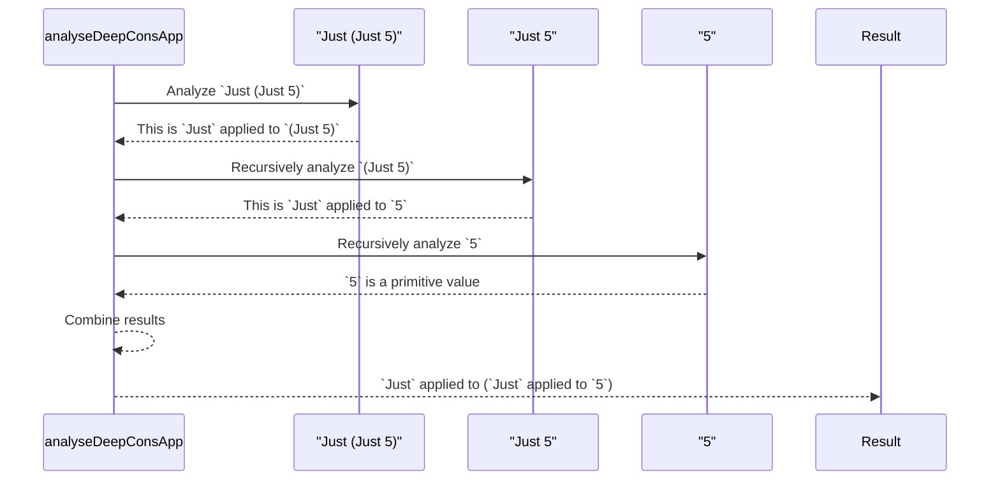
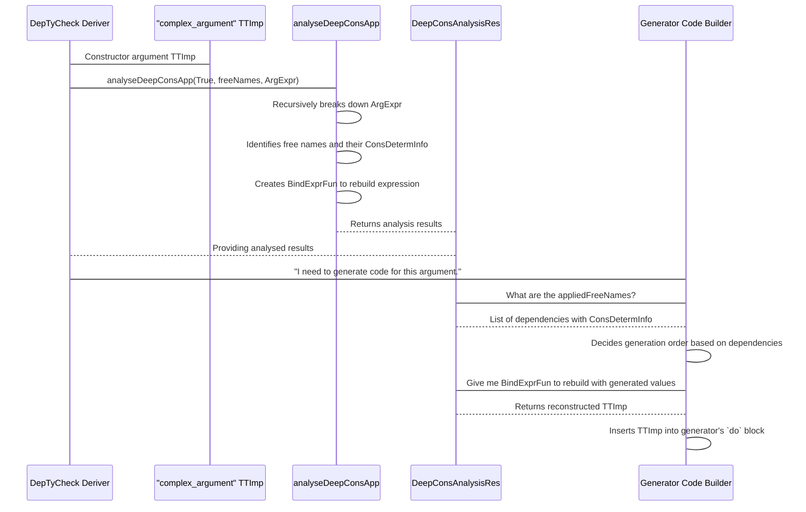
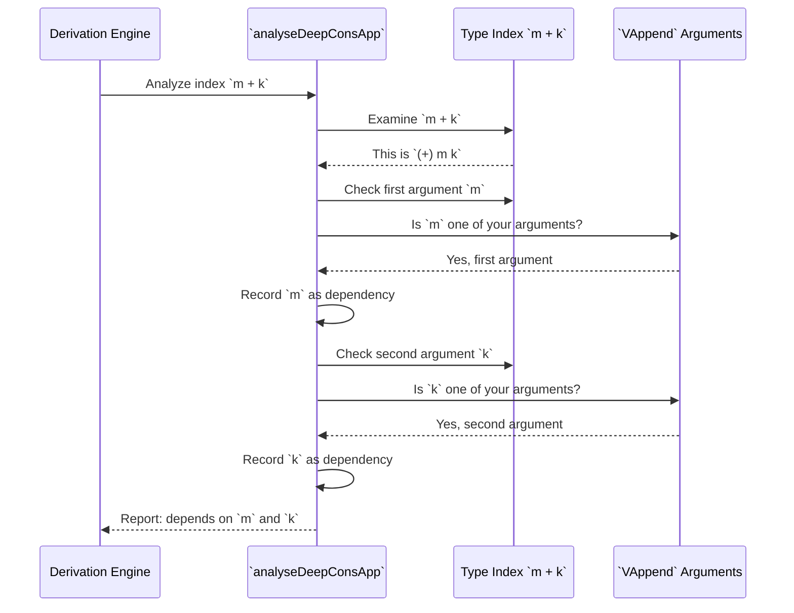

# Deep Constructor Application Analysis

## Introduction

Welcome to this tutorial on **Deep Constructor Application Analysis**! In this learning experience, we'll explore how `DepTyCheck` examines complex type expressions to enable intelligent automatic generator derivation.

**What we'll do together:**
- We'll analyze type expressions step by step
- We'll understand how `DepTyCheck` identifies dependencies in GADTs
- We'll see practical examples that demonstrate the analysis in action
- We'll practice analyzing different types ourselves

**What you'll need:**
- Basic familiarity with Idris syntax
- Some understanding of GADTs and dependent types
- Experience with `DepTyCheck`'s `deriveGen` function

**What you'll achieve:**
By the end of this tutorial, you'll understand how `DepTyCheck` "sees inside" complex type expressions to generate correct generators automatically.

Let's begin by understanding why this analysis is so important.

## Chapter 1: The Problem - Why We Need Deep Analysis

### The Challenge with Complex Type Expressions

Think of Deep Constructor Analysis as archaeological excavation 🧑‍🔬. Imagine you're exploring ancient ruins:

```idris
data Treasure =
  GoldBar |
  JewelBox (List Gem) |
  MysteryChest Treasure
```

To generate test data, `DepTyCheck` needs to:
1. Recognize `MysteryChest` contains another `Treasure`
2. Understand `JewelBox` holds a list of `Gem`
3. Know `GoldBar` stands alone

Similarly, for GADTs:

```idris
data MyGADT : Nat -> Type where
  MkOne :                               MyGADT 1
  MkTwo :                               MyGADT 2
  MkPair : (x : MyGADT n) -> (y : MyGADT m) -> MyGADT (n + m)
```

When `DepTyCheck` tries to generate a `MyGADT (n + m)`, and it wants to use `MkPair`, it needs to understand:
- How does `(n + m)` relate to the arguments `x` and `y`?
- Specifically, how does `n` come from `x` and `m` from `y`?

Without deep analysis, `DepTyCheck` would struggle to connect these internal pieces.

### What Deep Constructor Analysis Solves

Deep Constructor Application Analysis solves this problem: **how can `DepTyCheck` examine a complex expression (likely a GADT index) and figure out which free variables contribute to it, how they are combined using data constructors, and whether these free variables determine the overall type?**

This is crucial for:
1. **Matching GADT patterns** correctly
2. **Generating proper `decEq` checks**
3. **Understanding constructor argument influence** on type indices
4. **Handling nested structures** with multiple constructor applications

Let's see how this analysis works in detail.

## Chapter 2: The Core Tool - `analyseDeepConsApp`

### Meet the Analysis Function

Now let's look at the main function that performs deep constructor analysis:

```idris
export
analyseDeepConsApp : NamesInfoInTypes =>
                     MonadError String m =>
                     MonadWriter (List Name) m =>
                     (collectConsDetermInfo : Bool) ->
                     (freeNames : SortedSet Name) ->
                     (analysedExpr : TTImp) ->
                     m $ DeepConsAnalysisRes collectConsDetermInfo
```

**Understanding the parameters:**
- `collectConsDetermInfo`: Controls whether to gather detailed type determination info
- `freeNames`: The variables we're looking for in the expression
- `analysedExpr`: The type expression we want to examine

### How the Analysis Works Step by Step

Let's trace through analyzing `(n + m)` from our `MkPair` constructor, where `n` and `m` are in `freeNames`:

```idris
-- Analyzing: n + m (which is (+) n m internally)
result <- analyseDeepConsApp True (fromList ["n", "m"]) `(n + m)
```

Here's the detailed internal process:

1. **Step 1**: The function sees `(+) n m` and splits it into `headExpr = (+)` and `args = [n, m]`
2. **Step 2**: Checks if `(+)` is in `freeNames` - it's not
3. **Step 3**: Recognizes `(+)` as a constructor (for `Nat` addition)
4. **Step 4**: Recursively analyzes each argument:
   - **For `n`**: Finds it's in `freeNames`, records it
   - **For `m`**: Finds it's in `freeNames`, records it
5. **Step 5**: Combines results: `[n, m]`

The function works recursively, digging deeper into each level of the expression.

### Detailed Internal Logic

Here's a simplified view of the internal logic:

```idris
isD : TTImp -> m $ DeepConsAnalysisRes ccdi
isD e = do
  let (headExpr, args) = unAppAny e  -- Split expression
  case headExpr of
    IVar _ lhsName =>
      if contains lhsName freeNames
        then do
          tell [lhsName]  -- Record free variable
          if null args
            then pure [lhsName]  -- Simple variable like `n`
            else throwError "applying free name to arguments"
        else
          let Just con = lookupCon lhsName  -- Check if constructor
            | Nothing => throwError "not a constructor or free variable"
          -- Recursively analyze arguments
          deepArgsResults <- for args $ \anArgExp => isD anArgExp
          pure $ flatten deepArgsResults  -- Combine results
```

### Handling Edge Cases

The analysis is designed to handle various edge cases properly:

- **Type literals**: When it encounters `IType`, it returns `noFree e`
- **Primitive values**: For `IPrimVal`, it also returns `noFree e`
- **Invalid applications**: Throws appropriate errors for malformed expressions
- **Free variables with arguments**: Throws error if a free variable has arguments applied

### Recursive Disassembly Example

Let's trace through analyzing `Just (Just 5)`:



This recursive approach allows the analysis to handle arbitrarily complex expressions.

## Chapter 3: Understanding the Analysis Results

### What the Analysis Returns

When `analyseDeepConsApp` completes its work, it returns a `DeepConsAnalysisRes`:

```idris
public export
DeepConsAnalysisRes : (collectConsDetermInfo : Bool) -> Type
DeepConsAnalysisRes False = List Name
DeepConsAnalysisRes True = (appliedFreeNames : List (Name, ConsDetermInfo) ** BindExprFun appliedFreeNames.length)
```

### Breaking Down the Result Components

Let's examine each part of the result:

1. **`appliedFreeNames`**: Lists the variables found in the expression, along with `ConsDetermInfo`
2. **`BindExprFun`**: A template function for rebuilding expressions with different variables
3. **`ConsDetermInfo`**: Information about whether variables determine the type structure

### Understanding `BindExprFun` - The Reconstruction Template

The `BindExprFun` is crucial for code generation. It creates a template where free variables are replaced by bound variables:

```idris
-- For our n + m example:
bindExpr : BindExprFun 2
bindExpr = \f => `(+(~f 0) (~f 1))

-- This template can reconstruct the expression with different variables
reconstructed = bindExpr (\idx => case idx of
  0 => `newN
  1 => `newM)
-- Result: newN + newM
```

### The `DeepConsAnalysisRes` Type Definition

Here's the actual type definition from the source code:

```idris
public export
DeepConsAnalysisRes : (collectConsDetermInfo : Bool) -> Type
DeepConsAnalysisRes False = List Name
DeepConsAnalysisRes True = (appliedFreeNames : List (Name, ConsDetermInfo) ** BindExprFun appliedFreeNames.length)
```

- When `collectConsDetermInfo` is `False`: Returns just a list of names
- When `collectConsDetermInfo` is `True`: Returns detailed analysis with `ConsDetermInfo` and `BindExprFun`

### Understanding Type Determination with `ConsDetermInfo`

The `ConsDetermInfo` tells us how variables influence types:

```idris
public export
data ConsDetermInfo = DeterminedByType | NotDeterminedByType
```

- `DeterminedByType`: The variable's value directly shapes the type (like `n` in `Vect n a`)
- `NotDeterminedByType`: The variable doesn't affect the type structure (like `a` in `Vect n a`)

This distinction helps `DepTyCheck` prioritize generation order and decide when `decEq` checks are needed.

## Chapter 4: Practical Examples - Let's Analyze Some Types

### Example 1: Simple Constructor Application

Let's start with a basic example using the `Pair` type:

```idris
data Pair a b = MkPair a b

-- We'll analyze: Pair Int String
result <- analyseDeepConsApp True emptySet `(Pair Int String)
```

**What we expect to see:**
- The analysis identifies `Pair` as a constructor
- It finds no free variables (since we used `emptySet`)
- The result shows the structure of the `Pair` application

**Expected output (simplified):**
```
Applied free names: [("Pair", DeterminedByType)]
BindExprFun: Template for Pair application
```

### Example 1a: Generator with Free Variables

Now let's see how it works when we have free variables:

```idris
-- Generator that takes specific values: (x : Nat) -> (y : Nat) -> Gen NonEmpty (Pair x y)
genSpecificPair : (x : Nat) -> (y : Nat) -> Fuel -> Gen NonEmpty (Pair x y)
genSpecificPair = deriveGen

-- When analyzing Pair x y with x and y as free variables:
result <- analyseDeepConsApp True (fromList ["x", "y"]) `(Pair x y)
```

**Expected output:**
```
Applied free names: [("x", DeterminedByType), ("y", DeterminedByType)]
BindExprFun: Template for Pair free0 free1
```

This tells `deriveGen` to use the provided `x` and `y` values directly in the `MkPair` constructor.

### Example 2: Proof Analysis - Understanding Constraints

Now let's examine how the analysis handles proof constraints like those in `SortedList`:

```idris
data SortedList : Type where
  Nil  : SortedList
  (::) : (x : Nat) -> (xs : SortedList) -> LTEHead x xs => SortedList

-- Analyzing the proof constraint: LTEHead x xs
result <- analyseDeepConsApp True (fromList ["x", "xs"]) `(LTEHead x xs)
```

**Step-by-step analysis:**
1. **Step 1**: Recognizes `IsSorted` as a constructor
2. **Step 2**: Examines the arguments `x` and `xs`
3. **Step 3**: Finds both `x` and `xs` as free variables
4. **Step 4**: Returns the dependencies

**Expected output (simplified):**
```
Applied free names: [("x", DeterminedByType), ("xs", DeterminedByType)]
BindExprFun: Template for IsSorted free0 free1
```

This tells `DepTyCheck` that to generate the proof `IsSorted x xs`, it needs values for `x` and `xs` first.

### Multiple Perspectives on Deep Analysis

Deep Constructor Analysis can be understood through different metaphors:

**As an Archaeologist 🧑‍🔬:** Carefully excavating layers to reveal hidden structures.

**As a Chemist 🧪:** Breaking down molecules into constituent atoms.

**As a Forensic Specialist 👤:** Examining complex evidence to identify key components.

**As a Detective 🕵️:** Following clues recursively to uncover the full structure.

Each metaphor highlights different aspects of how the analysis works.

### Example 3: Complex Expression Analysis

Let's analyze some complex expressions:

```idris
-- 1. Analyzing: List (Maybe Int)
result1 <- analyseDeepConsApp True emptySet `(List (Maybe Int))

-- 2. Analyzing: plus (S n') m' where n' and m' are free variables
result2 <- analyseDeepConsApp True (fromList ["n'", "m'"]) `(plus (S n') m')
```

**Analysis of `List (Maybe Int)`:**
- Recognizes `List` as constructor
- Analyzes argument `Maybe Int`
- Recognizes `Maybe` as constructor
- Analyzes argument `Int` (primitive type)
- Returns structure: `List` applied to (`Maybe` applied to `Int`)

**Analysis of `plus (S n') m`:**
1. **Step 1**: Recognizes `plus` as a constructor
2. **Step 2**: Examines first argument `(S n')`
   - Recognizes `S` as constructor
   - Finds `n'` as free variable, marks it `DeterminedByType`
3. **Step 3**: Examines second argument `m'`
   - Finds `m'` as free variable, marks it `DeterminedByType`
4. **Step 4**: Combines results

**Expected outputs:**
```
-- List (Maybe Int):
Applied free names: [("List", DeterminedByType), ("Maybe", DeterminedByType)]
BindExprFun: Template for List (Maybe Int)

-- plus (S n') m':
Applied free names: [("n'", DeterminedByType), ("m'", DeterminedByType)]
BindExprFun: Template for plus (S free0) free1
```

### Example 4: Unique List Constraints

Another practical example with uniqueness constraints:

```idris
(::) : (s : String) -> (ss : UniqStrList) -> NotIn s ss => UniqStrList

-- Analyzing: NotIn s ss
result <- analyseDeepConsApp True (fromList ["s", "ss"]) `(NotIn s ss)
```

The analysis identifies that `NotIn` depends on `s` and `ss`, guiding the generation order.

### Example 3: Deeply Nested Structures

Let's try a more complex nested type:

```idris
-- Analyzing: List (Maybe (Either String Int))
result <- analyseDeepConsApp True emptySet `(List (Maybe (Either String Int)))
```

**Expected output (simplified):**
```
Applied free names: [("List", DeterminedByType), ("Maybe", DeterminedByType), ("Either", DeterminedByType)]
BindExprFun: Template for nested constructor application
```

This demonstrates how the analysis handles multiple levels of constructor applications, showing the complete structure of the type.

## Chapter 5: How `deriveGen` Uses This Analysis

### Integration with the Derivation Pipeline

Deep Constructor Analysis is integrated into `DepTyCheck`'s `canonicConsBody` function:

```idris
-- From the derivation pipeline (simplified)
let deepConsApps : Vect _ $ Either (String, TTImp, List Name) _ :=
  sig.givenParams.asVect <&> \idx => do
    let argExpr = conRetTypeArg idx  -- GADT index expression like (n + m)
    let (ei, fns) = runWriter $ runEitherT $
          analyseDeepConsApp True conArgNames argExpr
    -- ei contains analysis results, fns contains found free names
```

### How Analysis Guides Generation

For our `MkPair` example:
- `conRetTypeArg` would be `(n + m)` (the GADT index)
- `conArgNames` would be `{x, y}` (constructor arguments)
- Analysis finds `n` and `m` as free variables driving the type
- This information is used to generate `decEq` checks like `decEq n n_val`

### Sequence of Analysis and Generation



This intelligent dependency resolution makes `deriveGen` much more efficient than random guessing.

### Putting It All Together: Solving Type Equations

Deep Constructor Analysis is crucial for efficiently handling GADTs with complex indices. Consider this vector operation example:

```idris
data VecOp : (len : Nat) -> Type -> Type where
  VAppend : (m : Nat) -> (k : Nat) -> Vect m a -> Vect k a -> VecOp (m + k) a

-- Derive a generator for VecOp 5 String
genVecOp : (len : Nat) -> Fuel -> Gen NonEmpty (VecOp len a)
genVecOp = deriveGen
```

**Without Deep Analysis (inefficient):**
1. Generate random `m` (say, 10)
2. Generate random `k` (say, 12)
3. Check: 10 + 12 = 22 ≠ 5 ❌
4. Try again... and again...

**With Deep Analysis (intelligent):**
1. Analysis reveals `m + k` depends on `m` and `k`
2. Generate `m` that is ≤ 5 (say, 2)
3. Calculate `k` must be 3 (since 2 + 3 = 5) ✅
4. Generate `Vect 2 a` and `Vect 3 a`

This is orders of magnitude more efficient!

### Forensic Analysis Process

Here's how the analysis examines complex type indices like a forensic specialist:



## Chapter 6: Advanced Concepts

### Understanding Type Determination

Let's explore how variables determine types:

```idris
-- In Vect n a:
-- n is DeterminedByType (it affects the vector's length)
-- a is NotDeterminedByType (it's just the element type)
```

This distinction helps `DepTyCheck` prioritize what to generate first.

### Expression Reconstruction with `BindExprFun`

The `BindExprFun` is a powerful feature that lets us rebuild expressions:

```idris
-- After analyzing m + k, we get a BindExprFun
bindExpr : BindExprFun 2
bindExpr = \f => `(+(~f 0) (~f 1))

-- We can use it with different variables
reconstructed = bindExpr (\idx => case idx of
  0 => `newM
  1 => `newK)
-- Result: newM + newK
```

This template-based approach makes code generation more flexible.

### Handling Edge Cases

The analysis is designed to handle various scenarios:
- Invalid constructor applications (throws appropriate errors)
- Unknown free variables (reports what was found)
- Complex nested expressions (handles them recursively)

## Chapter 7: Hands-On Practice

### Exercise 1: Analyze GADT Index Expressions

Let's practice analyzing complex GADT index expressions:

```idris
-- 1. Analyze: S (n + m) where n and m are free variables
result1 <- analyseDeepConsApp True (fromList ["n", "m"]) `(S (n + m))

-- 2. Analyze: n * k where n and k are free variables
result2 <- analyseDeepConsApp True (fromList ["n", "k"]) `(n * k)

-- 3. Analyze: Fin (S n) where n is a free variable
result3 <- analyseDeepConsApp True (fromList ["n"]) `(Fin (S n))
```

**What to look for:** Notice how the analysis handles nested constructor applications.

**Expected patterns:**
- For `S (n + m)`: Should identify `S`, `+`, `n`, and `m`
- For `n * k`: Should identify `*`, `n`, and `k`
- For `Fin (S n)`: Should identify `Fin`, `S`, and `n`

### Exercise 1 Solution

Here's what you should expect from each analysis:

```idris
-- For S (n + m):
-- appliedFreeNames: [("n", DeterminedByType), ("m", DeterminedByType)]
-- BindExprFun: Template for S (free0 + free1)

-- For n * k:
-- appliedFreeNames: [("n", DeterminedByType), ("k", DeterminedByType)]
-- BindExprFun: Template for free0 * free1

-- For Fin (S n):
-- appliedFreeNames: [("n", DeterminedByType)]
-- BindExprFun: Template for Fin (S free0)
```

**Key insight:** Notice how the analysis preserves the structure while identifying the free variables.

### Exercise 2: Proof Constraint Analysis

Let's practice analyzing proof constraints:

```idris
-- 1. Analyze: LTE x y where x and y are free variables
result1 <- analyseDeepConsApp True (fromList ["x", "y"]) `(LTE x y)

-- 2. Analyze: IsSorted head tail where head and tail are free variables
result2 <- analyseDeepConsApp True (fromList ["head", "tail"]) `(IsSorted head tail)

-- 3. Analyze: NotElem x xs where x and xs are free variables
result3 <- analyseDeepConsApp True (fromList ["x", "xs"]) `(NotElem x xs)
```

**Goal:** Understand how the analysis identifies dependencies in proof constraints.

**Expected patterns:** Each analysis should identify the constructor and the free variables it depends on.

### Exercise 2 Solution

Here's what you should expect from each proof analysis:

```idris
-- For LTE x y:
-- appliedFreeNames: [("x", DeterminedByType), ("y", DeterminedByType)]
-- BindExprFun: Template for LTE free0 free1

-- For IsSorted head tail:
-- appliedFreeNames: [("head", DeterminedByType), ("tail", DeterminedByType)]
-- BindExprFun: Template for IsSorted free0 free1

-- For NotElem x xs:
-- appliedFreeNames: [("x", DeterminedByType), ("xs", DeterminedByType)]
-- BindExprFun: Template for NotElem free0 free1
```

**Key insight:** Proof constraints follow the same pattern - the constructor depends on the variables provided to it.

### Exercise 3: Complex Expression Analysis

Let's practice analyzing complex expressions:

```idris
-- 1. Analyze: S (plus n m) where n and m are free variables
result1 <- analyseDeepConsApp True (fromList ["n", "m"]) `(S (plus n m))

-- 2. Analyze: Fin (mult k (S j)) where k and j are free variables
result2 <- analyseDeepConsApp True (fromList ["k", "j"]) `(Fin (mult k (S j)))

-- 3. Analyze: Vect (plus a b) (Maybe c) where a, b, c are free variables
result3 <- analyseDeepConsApp True (fromList ["a", "b", "c"]) `(Vect (plus a b) (Maybe c))
```

**Goal:** Understand how the analysis handles deeply nested constructor applications.

**Expected patterns:** Each analysis should identify all constructors and free variables in the correct order.

### Exercise 3 Solution

Here's what you should expect from each complex expression analysis:

```idris
-- For S (plus n m):
-- appliedFreeNames: [("n", DeterminedByType), ("m", DeterminedByType)]
-- BindExprFun: Template for S (plus free0 free1)

-- For Fin (mult k (S j)):
-- appliedFreeNames: [("k", DeterminedByType), ("j", DeterminedByType)]
-- BindExprFun: Template for Fin (mult free0 (S free1))

-- For Vect (plus a b) (Maybe c):
-- appliedFreeNames: [("a", DeterminedByType), ("b", DeterminedByType), ("c", DeterminedByType)]
-- BindExprFun: Template for Vect (plus free0 free1) (Maybe free2)
```

**Key insight:** The analysis preserves the complete structure while correctly identifying all free variables and their determination status.

## What You've Accomplished

Congratulations! You've successfully explored Deep Constructor Application Analysis. Here's what you've learned:

### Your New Skills

- You can now understand how `DepTyCheck` analyzes complex type expressions
- You've seen how `analyseDeepConsApp` works recursively to examine constructor applications
- You understand the importance of dependency analysis for efficient generator derivation
- You've practiced analyzing different types, from simple to complex GADTs

### Key Insights

1. **Deep Constructor Analysis** is essential for handling complex dependent types
2. The analysis identifies dependencies that guide intelligent value generation
3. Understanding type determination helps prioritize generation order
4. The `BindExprFun` enables flexible code reconstruction

### Next Steps for Your Learning

Now that you understand Deep Constructor Analysis, you might want to explore:
- How `DepTyCheck` handles recursive types (Recursion Analysis)
- The complete generator derivation pipeline
- Advanced type system features in Idris

### Where to Find More Information

- Check the `DepTyCheck` source code in `src/Deriving/DepTyCheck/Util/DeepConsApp.idr`
- Explore Idris documentation on GADTs and dependent types
- Practice with more complex type examples to strengthen your understanding

### 2. `DeepConsApp`: The Blueprint Scanner

`DeepConsApp` is a powerful scanner that can read a type expression and break it down into its fundamental parts. Its main job is to figure out how a type is built from its constructors. The "Deep" in its name means it can look inside nested structures.

For example, if it scans the type `Maybe (List Int)`, it won't just see `Maybe`. It will scan deeply and report back: "This type is built using the constructor `Maybe`, which is applied to another type built with the constructor `List`, which is applied to the type `Int`."

```idris
-- File: src/Deriving/DepTyCheck/Util/DeepConsApp.idr

-- A very simplified idea of what DeepConsApp does.
-- It takes an expression and tells you the names of constructors inside it.
analyseDeepConsApp : (analysedExpr : TTImp) -> List Name
```
*   `TTImp` is the raw representation of a piece of Idris code.
*   The function returns a `List Name` of all the constructors it found.

This utility is how the engine understands dependencies. By scanning an argument's type, it can see if that type uses any of the *other* arguments as parameters, which tells the Planning Station that a `do` block is needed.
