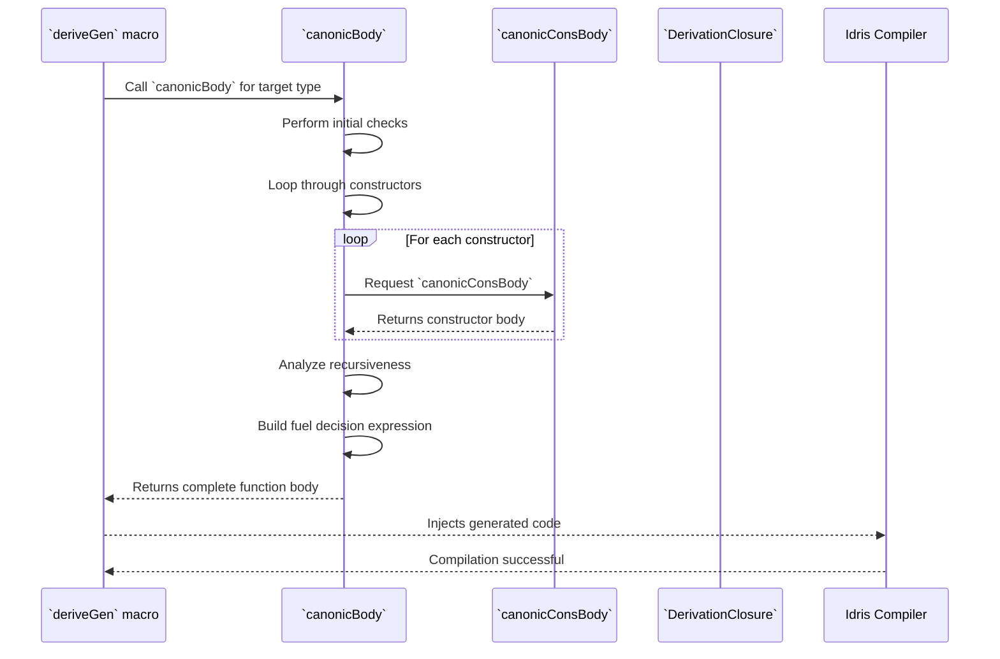
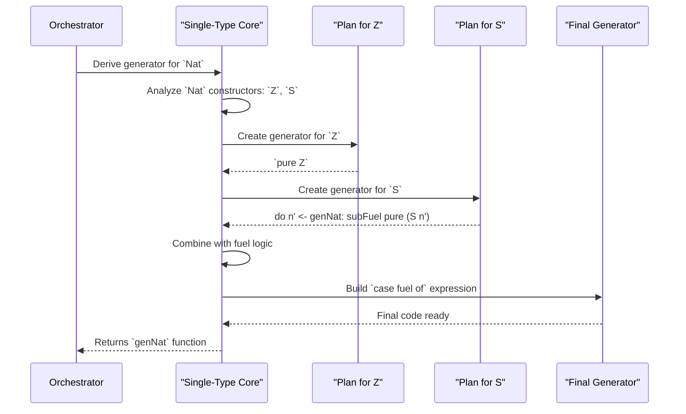
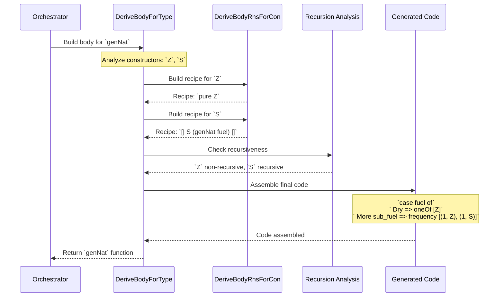
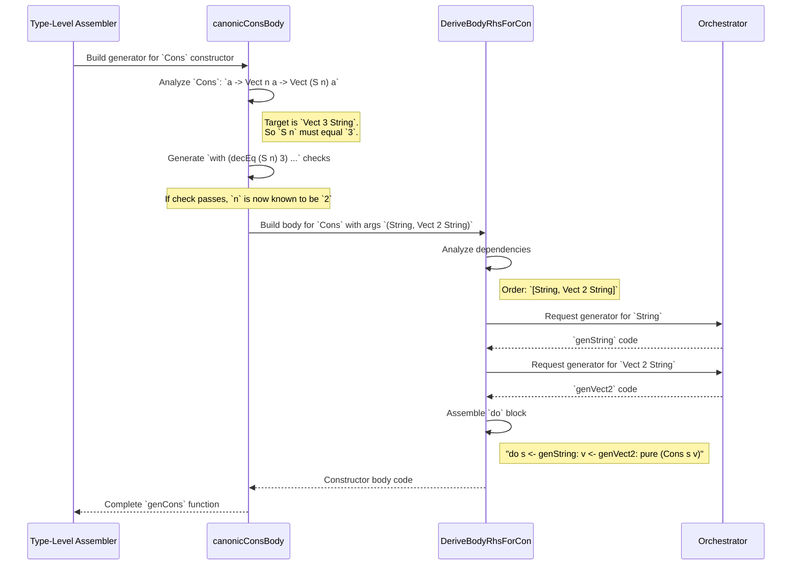

# Single Type Derivation: The Final Assembly Line

## Introduction

Welcome to the final assembly line! Single Type Derivation is where DepTyCheck takes all the individual blueprints for a type's constructors and assembles them into a complete, working generator. Think of this as the factory's main control system that intelligently combines specialized assembly lines.

## What Problem Does Single Type Derivation Solve?

Let's consider a classic recursive type: `List`.

```idris
data List a = Nil | Cons a (List a)
```

The blueprint (`GenSignature`) tells the factory it needs to build a generator for `MyList`. A naive factory might be one single, monolithic machine trying to do everything. This would be hard to maintain, debug, and impossible to customize.

`DepTyCheck` takes a smarter approach. It breaks the job down:
1.  **Workstation 1 (The Dispatcher):** Its job is to look at `MyList` and see it has two constructors: `MyNil` and `MyCons`. It decides that the final generator must make a choice between these two. Its job isn't to build the `MyCons` part itself, just to set up the choice.
2.  **Workstation 2 (The Parts Assembler):** When the Dispatcher needs to figure out how to handle `MyCons`, it sends an order to this workstation. This station's job is to build just the *body* of the `MyCons` generator. It sees that `MyCons` needs a `Nat` and another `MyList`, and it figures out how to generate those parts.

The challenge: how do you design the factory's main control system to intelligently choose between these lines based on available resources?

Single Type Derivation solves exactly this problem: **how does DepTyCheck combine constructor-specific generators into a single, cohesive generator that safely handles recursion?**

A `List` has two "assembly lines":
1. **Nil**: Simple, non-recursive
2. **Cons**: Complex, recursive

The problem: if we keep choosing `Cons`, we could end up in an infinite loop! We need an intelligent controller that:
- Prevents infinite recursion
- Makes smart choices based on available resources (fuel)
- Combines both assembly lines into a single factory

### The Core Mission

When tasked with creating `genNat : Fuel -> Gen MaybeEmpty Nat` for:

```idris
data Nat = Z | S Nat
```

The derivation core must act as the factory's intelligent controller:
1. **Examine the Type**: Identify all constructors (`Z` and `S`)
2. **Plan for Each Constructor**: Design generation logic for each
3. **Combine the Plans**: Create a single generator that can produce either constructor
4. **Manage Resources (Fuel)**: Handle recursion safely using fuel

### The Assembly Strategy: Fuel-Based Decision Making

The core strategy is brilliant in its simplicity: generate a `case` expression that switches on the `Fuel` parameter. This creates two distinct paths for the generator.

Let's imagine we're asking `DepTyCheck` to build `genNat : Fuel -> Gen MaybeEmpty Nat`. The final assembled generator code will look conceptually like this:

```idris
genNat : Fuel -> Gen MaybeEmpty Nat
genNat fuel =
  case fuel of
    Dry =>
      -- Fuel is empty! We MUST choose a non-recursive path.
      oneOf [ genZ ]  -- Only the 'Z' factory is available.

    More subFuel =>
      -- We have fuel to spare! We can choose either path.
      frequency
        [ (2, genZ)     -- Give 'Z' a higher weight (non-recursive)
        , (1, genS subFuel) -- 'S' gets lower weight and the remaining fuel
        ]
```

**Why This Strategy Works Brilliantly:**

1. **Check the Fuel**: The entire logic is wrapped in a `case` statement on the `fuel` argument.
2. **`Dry` Branch (Out of Gas)**: If the fuel is `Dry`, the generator is forced to choose a path that doesn't consume more fuel. It can only call the generator for `Z`, which is a "terminal" constructor (non-recursive). This guarantees the generation will eventually stop.
3. **`More subFuel` Branch (Fuel to Spare)**: If the fuel is `More`, the generator has a choice. It can use `Z` *or* `S`.
   - It uses `frequency` to make a weighted choice, favoring non-recursive cases
   - If it picks `genZ`, it passes the original `fuel` (because `Z` doesn't spend any)
   - If it picks `genS`, it crucially passes the *remaining* fuel, `subFuel`, to the recursive call

This `case` statement is the "intelligent controller" that makes `DepTyCheck`'s generators both productive and safe from infinite loops.

### Constructor Combination Strategies

DepTyCheck uses two primary tools for combining constructors:

**`oneOf`**: Equal probability selection
```idris
oneOf [genZ, genS]  -- 50/50 chance for Z vs S
```

**`frequency`**: Weighted probability selection
```idris
frequency [(2, genZ), (1, genS)]  -- Z twice as likely as S
```

For recursive types like `Nat`, `frequency` is preferred to favor non-recursive cases (`Z`) and prevent infinite recursion.

## Overview

Single Type Derivation orchestrates generator creation through:
- Constructor analysis and delegation
- Recursion analysis and fuel management
- Constructor-specific code generation
- Final assembly with fuel-based decision logic

## The DeriveBodyForType Interface

### Interface Definition

The core interface for single type derivation is `DeriveBodyForType`, which defines the `canonicBody` method:

```idris
-- From src/Deriving/DepTyCheck/Gen/ForOneType/Interface.idr

public export
interface DeriveBodyForType where
  canonicBody : DerivationClosure m => GenSignature -> Name -> m $ List Clause
```

This interface describes the main job: creating the overall body of the generator function for a given type. Its primary responsibility is to look at all the constructors of a data type and create the code that chooses between them.

*   **What it does:** The key function is `canonicBody`. It takes the `GenSignature` blueprint and produces the high-level structure of our generator. For `List`, it would generate code that conceptually looks like this: `oneOf [genForNil, genForCons]`.

### Interface Components

- **`DerivationClosure m`**: Constraint ensuring the monad has derivation capabilities
- **`GenSignature`**: Blueprint containing target type and parameters
- **`Name`**: Internal name assigned to the generator function
- **`m $ List Clause`**: Returns function body clauses within the derivation monad

### Key Responsibilities

- Validates the target type has at least one constructor
- Prevents derivation for `Gen` itself (avoiding infinite recursion)
- Orchestrates derivation for all constructors of the type
- Builds the final fuel-based decision logic
- Returns complete function body clauses

## Derivation Process Steps

### Step 1: Initial Validation

Before derivation begins, `canonicBody` performs essential checks:

```idris
canonicBody sig n = do
  -- Check that there is at least one constructor
  Prelude.when .| null sig.targetType.cons .|
    fail "No constructors found for the type `\{show sig.targetType.name}`"

  -- Check that desired `Gen` is not a generator of `Gen`s
  Prelude.when .| sig.targetType.name == `{Test.DepTyCheck.Gen.Gen} .|
    fail "Target type of a derived `Gen` cannot be a `Gen`"
```

**Purpose:**
- Prevents derivation for empty types like `Void`
- Avoids infinite recursion when deriving `Gen` itself
- Ensures valid generator signature

### Step 2: Constructor-Specific Generator Claims

For each constructor, generate type signatures and delegate body derivation:

```idris
-- Generate claims for generators per constructors
let consClaims = sig.targetType.cons <&> \con =>
  export' (consGenName con) (canonicSig sig)

-- Derive bodies for generators per constructors
consBodies <- for sig.targetType.cons $ \con =>
  logBounds {level=Info} "deptycheck.derive.consBody" [sig, con] $
    canonicConsBody sig (consGenName con) con <&> def (consGenName con)
```

**Process:**
- Creates unique names for each constructor generator
- Delegates to `canonicConsBody` for constructor-specific logic
- Wraps results into full function definitions

### Step 3: Recursion Analysis

Analyze constructor recursiveness using `lookupConsWithWeight`:

```idris
let Just consRecs = lookupConsWithWeight sig
  | Nothing => fail "INTERNAL ERROR..."
```

**Analysis:**
- Identifies which constructors are recursive
- Determines fuel spending requirements
- Assigns weights for frequency-based selection

### Step 4: Fuel Decision Logic

Build the core `case fuel of` expression using `fuelDecisionExpr`:

```idris
fuelDecisionExpr : (fuelArg : Name) -> List (Con, Either TTImp (Name -> TTImp)) -> TTImp
fuelDecisionExpr fuelAr consRecs = do
  iCase .| var fuelAr .| var `{Data.Fuel.Fuel} .| [
    -- Case 1: fuel is Dry
    let nonSpendCons = mapMaybe (\(con, w) => (con,) <$> getLeft w) consRecs in
    var `{Data.Fuel.Dry} .= callConstFreqs "\{logPosition sig} (dry fuel)".label
      (var fuelAr) nonSpendCons,

    -- Case 2: fuel is More
    let subFuelArg = UN $ Basic $ "^sub" ++ show fuelAr in
    var `{Data.Fuel.More} .$ bindVar subFuelArg .= callFrequency
      "\{logPosition sig} (non-dry fuel)".label
      (consRecs <&> \(con, rec) => let (f, w) = weightAndFuel rec in (w, callConsGen f con))
  ]
```

**Fuel State Handling:**

**Dry Fuel (No Energy Left):**
- Generator must stop recursion
- Only non-recursive constructors are available
- Uses `callConstFreqs` for frequency-based selection

**More Fuel (Energy Available):**
- Can choose from all constructors
- Recursive constructors use reduced fuel (`subFuel`)
- Non-recursive constructors use original fuel
- Uses `callFrequency` for weighted selection

**Simplified Logic Concept:**
```idris
fuelDecisionExpr fuelArg constructors = do
  let (recursive, nonRecursive) = partition isRecursive constructors

  if null recursive
    then pure (oneOf allConstructors)  -- Simple case: no recursion
    else iCase (var fuelArg) [
      Dry .= oneOf nonRecursive,      -- Dry: only non-recursive
      More subFuel .= frequency [      -- More: weighted selection
        (2, oneOf nonRecursive),      -- Non-recursive with original fuel
        (1, oneOf recursive subFuel)  -- Recursive with reduced fuel
      ]
    ]
```

## Implementation Details

### The canonicBody Function

The main implementation resides in `src/Deriving/DepTyCheck/Gen/ForOneType/Impl.idr`:

```idris
canonicBody sig n = do
  -- Initial validation
  Prelude.when .| null sig.targetType.cons .| fail "No constructors found..."
  Prelude.when .| sig.targetType.name == `{Test.DepTyCheck.Gen.Gen} .| fail "Cannot derive Gen for Gen"

  -- Constructor-specific derivation
  let consClaims = sig.targetType.cons <&> \con => export' (consGenName con) (canonicSig sig)
  consBodies <- for sig.targetType.cons $ \con =>
    canonicConsBody sig (consGenName con) con <&> def (consGenName con)

  -- Recursion analysis
  let Just consRecs = lookupConsWithWeight sig | Nothing => fail "Internal error"

  -- Build final fuel decision
  let outmostRHS = fuelDecisionExpr fuelArg consRecs

  -- Return complete function definition
  pure [MkClause (var n) [var fuelArg] outmostRHS]
```

### Fuel Decision Expression Details

The `fuelDecisionExpr` function handles the core logic:

**Input Parameters:**
- `fuelArg`: The fuel argument name
- `consRecs`: List of constructor recursiveness information

**Internal Logic:**
- Separates constructors into recursive (`Right`) and non-recursive (`Left`)
- Builds appropriate case branches for `Dry` and `More` fuel states
- Uses `callConstFreqs` for dry fuel (non-recursive only)
- Uses `callFrequency` for non-dry fuel (all constructors)
- Manages fuel consumption for recursive constructors

## Constructor-Specific Derivation

### canonicConsBody Function

The `canonicConsBody` function handles constructor-specific generation:

```idris
-- Delegates to DeriveBodyRhsForCon interface
canonicConsBody sig conName con = do
  -- Performs GADT index checking
  -- Determines argument generation order
  -- Calls consGenExpr for final code generation
```

### Key Responsibilities

- **GADT Index Checking**: Uses `decEq` for type-level constraint validation
- **Argument Order Analysis**: Determines optimal generation sequence based on dependencies
- **Body Generation**: Delegates to `DeriveBodyRhsForCon` interface

### GADT Index Checking

For dependent types like `Vect`, performs equality checks:

```idris
-- Conceptual GADT checking code
genConsVect3String given_n given_a =
  with (decEq (S given_n) 3)
    Yes Refl => -- Constraints satisfied, proceed
                ... build generator body ...
    No _     => empty  -- Dead end
```

**Purpose:** Ensures type-level constraints are satisfied before generation.

### Argument Generation Order

Analyzes dependencies between constructor arguments:

```idris
data SizedPair = MkPair (n : Nat) (Fin n)
```

**Dependency Analysis:**
- `Fin n` depends on `n`
- `n` depends on nothing
- **Plan:** Generate `n` first, then `Fin n`

### DeriveBodyRhsForCon Interface

The interface responsible for constructor body generation:

```idris
interface DeriveBodyRhsForCon where
  consGenExpr : ... -> m TTImp
```

This interface handles the detailed generation logic for individual constructors.
This interface describes a more specialized job: building the generator for the "right-hand side" (RHS) of a *single* constructor.

*   **What it does:** The `consGenExpr` function gets the blueprint and information about one specific constructor (like `MyCons`). Its job is to create the code that generates all the arguments for *that constructor*. For `MyCons Nat MyList`, it would produce code that is equivalent to `[| MyCons (deriveGen {for=Nat} ...) (deriveGen {for=MyList} ...) |]`. It assembles the parts.

### Implementation Example

For `MkPair`, generates:
```idris
do
  n <- callGen Nat ...      -- Generate Nat first
  fin <- callGen (Fin n) ... -- Then Fin n using n
  pure (MkPair n fin)       -- Assemble final value
```

## Practical Examples

### Example 1: Simple Type - TrafficLight

```idris
data TrafficLight = Red | Yellow | Green

genTrafficLight : Fuel -> Gen MaybeEmpty TrafficLight
genTrafficLight = deriveGen
```

**Derivation Process:**
1. **Initial Validation**: Passes (has constructors, not Gen itself)
2. **Constructor Analysis**: Three non-recursive constructors
3. **Constructor Bodies**: Simple `pure` generators for each
4. **Recursion Analysis**: All constructors non-recursive
5. **Fuel Decision**: Simple `oneOf` selection (no fuel dependency)

**Generated Code Concept:**
```idris
genTrafficLight fuel = oneOf [pure Red, pure Yellow, pure Green]
```

**Constructor-Specific Details:**
- Each constructor gets simple `pure` generator
- No GADT constraints to check
- No argument dependencies to analyze

### Example 2: Recursive Type - Nat

```idris
data Nat = Z | S Nat

genNat : Fuel -> Gen MaybeEmpty Nat
genNat = deriveGen
```

**Derivation Process:**
1. **Initial Validation**: Passes
2. **Constructor Analysis**: `Z` (non-recursive), `S` (recursive)
3. **Constructor Bodies**:
   - `Z`: `pure Z`
   - `S`: Recursive call to `genNat` with reduced fuel
4. **Recursion Analysis**: `S` identified as recursive
5. **Fuel Decision**: Complex `case fuel of` with frequency weighting

**Generated Code Concept:**
```idris
genNat fuel = case fuel of
  Dry => pure Z                    -- Only base case when fuel dry
  More subFuel => frequency [      -- Weighted selection with fuel
    (2, pure Z),                   -- Non-recursive: higher weight
    (1, do n' <- genNat subFuel    -- Recursive: reduced fuel
           pure (S n'))
  ]
```

**Fuel Management Logic:**
- **Dry**: Only `Z` available (safe termination)
- **More**: Both constructors available, with `S` using reduced fuel
- **Weights**: `Z` gets higher probability to favor termination

**Delegation Strategy:**
- `DeriveBodyForType` delegates constructor work to `DeriveBodyRhsForCon`
- Each constructor gets specialized generator
- Final assembly uses fuel-based decision logic

## Error Handling

### Common Failure Cases

- **No Constructors**: `data Void` - fails with "No constructors found"
- **Recursive Gen Derivation**: `deriveGen @Gen` - fails with "Target type cannot be Gen"
- **GADT Constraint Violations**: Impossible type combinations return `empty`
- **Dependency Resolution Failures**: Invalid argument orders fail gracefully

### Recovery Mechanisms

- **Graceful Error Reporting**: Clear error messages for common failures
- **Empty Generator Generation**: Impossible paths return `empty` instead of crashing
- **Compile-time Detection**: Most errors caught during derivation

## Best Practices

### Efficient Derivation

- **Minimize Type Checks**: Only validate essential constraints
- **Optimize Analysis**: Cache constructor recursiveness results
- **Reuse Generators**: Leverage derivation closure for shared types

### Type Safety

- **Proper Fuel Management**: Always reduce fuel for recursive calls
- **Dependency Validation**: Ensure argument generation order respects dependencies
- **Edge Case Handling**: Handle empty types and singleton types appropriately

## Hands-On Exercise

### Exercise: Trace the Derivation

Try tracing the derivation process for this type:

```idris
data Tree a = Leaf a | Node (Tree a) (Tree a)
```

**Questions to Answer:**
1. How many constructors does it have?
2. Which constructors are recursive?
3. What would the fuel decision logic look like?
4. What weights might be assigned?
5. How does delegation work for each constructor?
6. What GADT checks are needed?

### Solution

1. **Constructors**: 2 (`Leaf`, `Node`)
2. **Recursive**: `Node` is recursive (contains `Tree a`)
3. **Fuel Logic**:
   - Dry: Only `Leaf` available
   - More: Both available, `Node` with reduced fuel
4. **Weights**: Higher weight for `Leaf` to favor termination
5. **Delegation**: Each constructor gets specialized generator
6. **GADT Checks**: None (simple recursive type)

**Generated Code Concept:**
```idris
genTree fuel aGen = case fuel of
  Dry => [| Leaf (aGen fuel) |]
  More subFuel => frequency [
    (3, [| Leaf (aGen fuel) |]),
    (1, do left <- genTree subFuel aGen
            right <- genTree subFuel aGen
            pure (Node left right))
  ]
```

**Explanation:**
- `Leaf` is non-recursive and always available
- `Node` requires two recursive calls with reduced fuel
- Higher weight for `Leaf` ensures termination probability
- Fuel reduction prevents infinite recursion
- Delegation ensures each constructor gets appropriate generator

### Advanced Exercise: Complex Type

Trace derivation for:
```idris
data Expr = Lit Int | Add Expr Expr | Mul Expr Expr
```

**Expected Process:**
1. 3 constructors (`Lit`, `Add`, `Mul`)
2. `Lit` non-recursive, `Add`/`Mul` recursive
3. Fuel logic favors `Lit` when dry
4. Delegation creates specialized generators for each

**Constructor-Specific Details:**
- `Lit`: Simple `pure` generator for `Int`
- `Add`: Requires two `Expr` generators with reduced fuel
- `Mul`: Requires two `Expr` generators with reduced fuel
- No GADT constraints (simple recursive type)

### GADT Exercise: Vect Type

Trace derivation for:
```idris
data Vect : Nat -> Type -> Type where
  Nil  : Vect 0 a
  Cons : a -> Vect n a -> Vect (S n) a
```

**Expected Process:**
1. GADT index checking for `Cons` constructor
2. Argument dependency analysis
3. Specialized generators for each constructor
4. Fuel-based recursion management

## Workflow Sequence

### Single Type Derivation Process



### Internal Processing Flow



### Detailed Assembly Process



### Constructor-Specific Derivation Process



## Conclusion

Single Type Derivation is the foundation of DepTyCheck's automatic generator creation. The `canonicBody` function orchestrates the entire process, delegating to constructor-specific derivation and implementing crucial fuel-based decision logic. This ensures generators terminate for recursive types while maintaining type safety.

**Key Takeaways:**
- Single type derivation converts type blueprints into working generators
- Fuel-based logic prevents infinite recursion through careful fuel management
- Constructor-specific derivation handles individual constructor logic
- The process ensures type safety and termination guarantees
- Uses `oneOf` for simple types, `frequency` for recursive types with weighting
- Delegates detailed work to specialized components while orchestrating the overall process
- Acts as master craftsman focusing on one type at a time
- Combines specialized generator recipes with fuel-based decision logic

**Derivation Pipeline Benefits:**
1. **Automates generator creation** - No manual generator writing needed
2. **Handles complex cases** - Dependent types, recursion, GADTs
3. **Ensures correctness** - Type safety and termination guarantees
4. **Provides coverage tracking** - Built-in labeling and monitoring

**Usage Pattern:**
```idris
-- Define your type
data MyType = Constructor1 | Constructor2

-- Automatically derive generator
myGen : Fuel -> Gen MyType
myGen = deriveGen
```

An implementation of `DeriveBodyForType` and `DeriveBodyRhsForCon` is called a **derivation strategy**.

`DepTyCheck` comes with a default, built-in strategy called `LeastEffort`. It's a team of workers who follow a simple set of rules:
*   `DeriveBodyForType`: "Give every constructor an equal chance."
*   `DeriveBodyRhsForCon`: "For each argument, just call `deriveGen` on it."

But what if you wanted a different strategy? What if you wanted a `Smart` strategy that gives a higher chance of picking the non-recursive `MyNil` constructor to create smaller lists more often?

Because of the interface-based design, you could write your own `Smart` implementations of the interfaces and tell `DepTyCheck` to use them instead. Your `Smart` workers would plug right into the assembly line, no other changes needed!