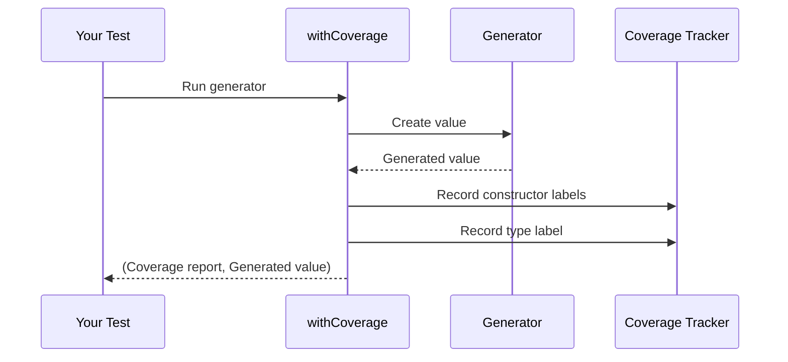
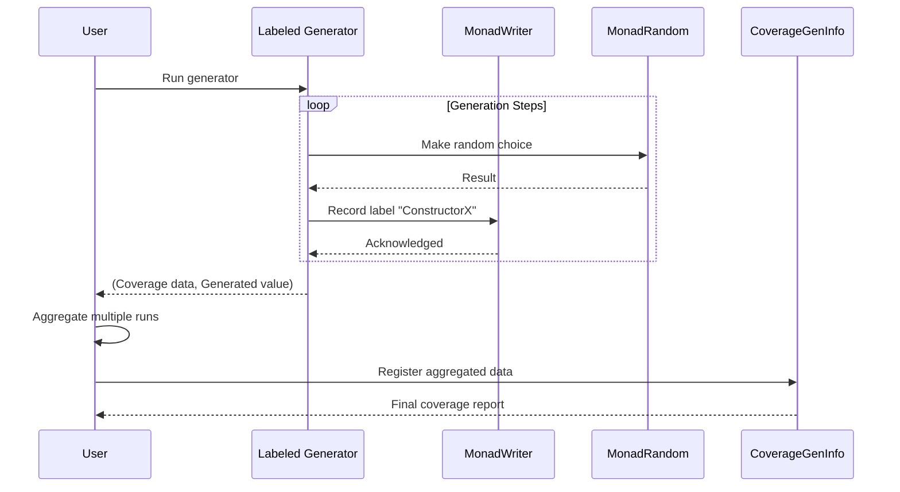
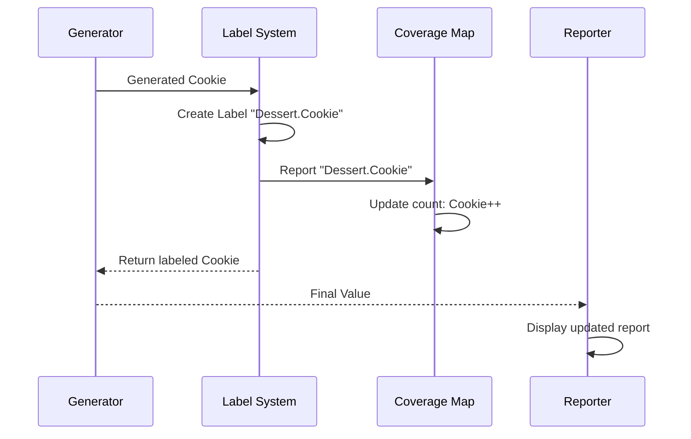
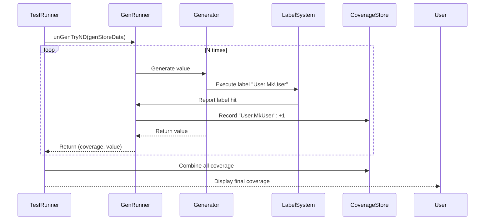
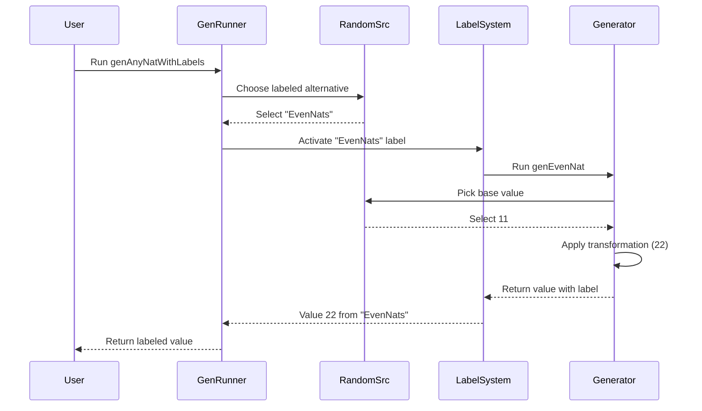

# Coverage Tracking Tutorial

## Introduction

In this tutorial, we will learn how to track and analyze the coverage of DepTyCheck generators. Coverage tracking helps ensure your generators test all data type constructors, identifying blind spots in your test data generation.

**What we will accomplish:** We will create generators for data types, run them multiple times, and generate detailed reports showing which constructors were generated and how many times each appeared.

## 1. Understanding Coverage Tracking

### The Problem: Blind Spots in Test Data

Imagine you have a simple data type:

```idris
data Monster = Slime | Goblin | Dragon
```

You create a generator for `Monster`, but how do you know if it's actually generating all three monster types? Without coverage tracking, you might miss important edge cases.

### The Solution: Automatic Coverage Tracking

DepTyCheck provides automatic coverage tracking that:
- Records which constructors are generated
- Counts how many times each appears
- Generates readable reports
- Helps identify untested code paths

## 2. Core Concepts

### 2.1 Label System Fundamentals

Coverage tracking uses a label system where each constructor gets a unique label:

- `"Monster"` - Type-level label
- `"Monster.Slime"` - Constructor-level label
- `"Monster.Goblin"` - Constructor-level label
- `"Monster.Dragon"` - Constructor-level label

### 2.2 Coverage Data Structures

DepTyCheck uses two main data structures:

**ModelCoverage** - Raw label counts:
```idris
record ModelCoverage where
  constructor MkModelCoverage
  unModelCoverage : SortedMap Label Nat
```

**CoverageGenInfo** - Organized coverage report:
```idris
record CoverageGenInfo (0 g : k) where
  constructor MkCoverageGenInfo
  types        : SortedMap String TypeInfo
  constructors : SortedMap String (TypeInfo, Con)
  coverageInfo : SortedMap TypeInfo (Nat, SortedMap Con Nat)
```

### 2.3 Coverage Collection Mechanism

Coverage is collected using the `MonadWriter` pattern:

```idris
MonadWriter ModelCoverage m => CanManageLabels m where
  manageLabel l = tell $ MkModelCoverage $ singleton l 1
```

Each time a label is encountered, it's recorded with a count of 1.

## 3. Basic Coverage Workflow

Let's walk through a complete example.

### Step 1: Create Your Data Type and Generator

```idris
module CoverageExample

import Test.DepTyCheck.Gen
import Test.DepTyCheck.Gen.Coverage

%default total
%language ElabReflection

data Monster = Slime | Goblin | Dragon

genMonster : Fuel -> Gen MaybeEmpty Monster
genMonster = deriveGen
```

### Step 2: Initialize Coverage Tracking

```idris
main : IO ()
main = do
  -- Initialize empty coverage report
  initialCoverage <- initCoverageInfo genMonster
```

**What happens:** `initCoverageInfo` uses reflection to discover all types and constructors in your generator and creates a report template with zero counts.

### Step 3: Run Generator with Coverage

```idris
  -- Run generator 100 times with coverage
  let numRuns = 100
  let initialSeed = mkStdGen 42
  let coverageResults =
        take numRuns $
        unGenTryAllD' initialSeed (withCoverage genMonster)
```

**What happens:** `withCoverage` injects labels into your generator, and `unGenTryAllD'` runs it while collecting coverage data.

### Step 4: Aggregate and Display Results

```idris
  -- Aggregate all coverage results
  let finalCoverageInfo = foldr
                          (\(_, res) => maybe id (\(mc, _) => registerCoverage mc))
                          initialCoverage
                          coverageResults

  -- Print the report
  putStrLn $ show finalCoverageInfo
```

**Expected output:**
```
Monster (covered fully (100 times))
  - Slime: covered (35 times)
  - Goblin: covered (31 times)
  - Dragon: covered (34 times)
```

## 4. Understanding the Report

The coverage report shows:
- **Type-level coverage**: Whether all constructors of a type were generated
- **Constructor counts**: How many times each constructor appeared
- **Coverage status**: "covered fully", "partially covered", or "not covered"

## Exercise: Test Coverage Tracking

Create a data type with 4 constructors and write a generator. Run coverage tracking with 50 samples and verify all constructors are covered.

```idris
data Direction = North | South | East | West

-- Your generator here
```

**Solution:**
```idris
genDirection : Fuel -> Gen MaybeEmpty Direction
genDirection = deriveGen

main : IO ()
main = do
  coverage <- initCoverageInfo genDirection
  let results = take 50 $ unGenTryAllD' (mkStdGen 123) (withCoverage genDirection)
  let final = foldr (\(_, res) => maybe id (\(mc, _) => registerCoverage mc)) coverage results
  putStrLn $ show final
```

## 5. Manual Labeling and Advanced Tracking

### Manual Label Creation

While `deriveGen` automatically adds labels, you can also create them manually:

```idris
-- Manual labeling example
labeledCircle : Gen MaybeEmpty Shape
labeledCircle = label "Circle" $ pure Circle

shapeGen : Fuel -> Gen MaybeEmpty Shape
shapeGen fuel = oneOf fuel
  [ label "Circle"    $ pure Circle
  , label "Square"    $ pure Square
  , label "Triangle" $ pure Triangle
  ]
```

### Running with Coverage

Use `withCoverage` to enable tracking:

```idris
main : IO ()
main = do
  -- Single run with coverage
  (cov, shape) <- unGenD' (mkStdGen 42) 10 (withCoverage shapeGen)
  putStrLn $ "Generated: " ++ show shape
  putStrLn $ "Coverage: " ++ show cov
```

### Understanding ModelCoverage Output

A typical `ModelCoverage` report looks like:
```
Circle (user-defined): 3
Square (user-defined): 3
Triangle (user-defined): 4
Shape[?]: 10
```

This shows:
- Each constructor with its count
- The top-level type (`Shape`) with total generation count

## 6. Coverage Tracking Workflow

### How Coverage Collection Works

When you use `withCoverage`, DepTyCheck automatically:
1. Adds labels to all constructors in your generator
2. Tags the top-level type being generated
3. Records every labeled item in a `ModelCoverage` map
4. Returns both the generated value and coverage data

### The Coverage Collection Process



## Exercise: Traffic Light Coverage

Create a generator for traffic lights and track its coverage:

```idris
data Light = Red | Yellow | Green

-- Create your generator here
```

**Solution:**
```idris
trafficGen : Fuel -> Gen MaybeEmpty Light
trafficGen fuel = oneOf fuel
  [ label "Red"    $ pure Red
  , label "Yellow" $ pure Yellow
  , label "Green"  $ pure Green
  ]

main : IO ()
main = do
  (cov, light) <- unGenD' (mkStdGen 123) 10 (withCoverage trafficGen)
  putStrLn $ "Generated: " ++ show light
  putStrLn $ "Coverage report:\n" ++ show cov
```

## 7. Advanced Coverage Features

### Multiple Runs Aggregation

To get meaningful statistics, run your generator multiple times:

```idris
aggregateCoverage : IO ModelCoverage
aggregateCoverage = do
  let runs = 100
  let seed = mkStdGen 42
  let results = take runs $ unGenTryAllD' seed (withCoverage shapeGen)
  
  -- Combine all coverage reports
  pure $ foldr (\(mc, _) acc => mc <+> acc) neutral results
```

### Coverage Analysis

Use the aggregated data to:
- Identify rarely generated constructors
- Detect bias in your generators
- Ensure all code paths are tested

## 8. Advanced Coverage Analysis with CoverageGenInfo

### Understanding CoverageGenInfo Structure

`CoverageGenInfo` provides a structured report card for your generators:

```idris
record CoverageGenInfo (0 g : k) where
  constructor MkCoverageGenInfo
  types        : SortedMap String TypeInfo
  constructors : SortedMap String (TypeInfo, Con)
  coverageInfo : SortedMap TypeInfo (Nat, SortedMap Con Nat)
```

**Key components:**
- `types`: Maps type names to their detailed information
- `constructors`: Links constructor names to their types
- `coverageInfo`: Main report showing counts per type and constructor

### Complete Coverage Workflow

Here's the full process for comprehensive coverage analysis:

```idris
import Test.DepTyCheck.Gen
import Test.DepTyCheck.Gen.Coverage

-- Example data type
data Pair FinNString = MkPair (Fin N) String

-- Generator definition
genPair : (N : Nat) -> Gen MaybeEmpty (Pair FinNString)
genPair N = [| MkPair (genFin N) myGenString |]

-- Enable coverage tracking
coveredGenPair : (N : Nat) -> Elab (Gen MaybeEmpty (Pair FinNString))
coveredGenPair N = withCoverage (genPair N)

-- Full coverage analysis
main : IO ()
main = do
  -- Step 1: Initialize coverage structure
  initStruct <- runElab id $ initCoverageInfo (genPair 3)
  
  -- Step 2: Get coverage-enabled generator
  gen <- runElab id $ coveredGenPair 3
  
  -- Step 3: Run generator multiple times
  let results = unGenTryND 100 (mkStdGen 42) gen
  
  -- Step 4: Aggregate coverage data
  let finalModelCoverage = foldl (\acc (mc, _) => acc <+> mc) neutral results
  
  -- Step 5: Register coverage into structured report
  let finalCoverageInfo = registerCoverage finalModelCoverage initStruct
  
  -- Step 6: Display results
  putStrLn $ show finalCoverageInfo
```

### Interpreting Coverage Reports

A typical `CoverageGenInfo` report looks like:
```
Data.Fin.Fin (covered partially (66 times))
  - {closure: Data.Fin.Fin} : 0 (covered (33 times))
  - {closure: Data.Fin.Fin} : 1 (covered (33 times))
  - {closure: Data.Fin.Fin} : 2 (not covered)

PairFinNString (covered fully (100 times))
  - {closure: PairFinNString} : MkPair (covered (100 times))
```

**What this tells us:**
- `Fin` type was generated 66 times total
- Constructors `0` and `1` were each generated 33 times
- Constructor `2` was never generated (potential blind spot)
- `PairFinNString` type was fully covered

### Coverage Analysis Benefits

Coverage tracking helps you:
- **Identify blind spots**: Find constructors that are never generated
- **Detect bias**: See if some constructors are over/under-represented
- **Improve generators**: Make informed decisions about generator tuning
- **Ensure test quality**: Verify that all code paths are exercised

## 9. Internal Coverage Mechanism

### How Coverage Collection Works

DepTyCheck uses a clever `MonadWriter`-based approach:

```idris
MonadWriter ModelCoverage m => CanManageLabels m where
  manageLabel l = tell $ MkModelCoverage $ singleton l 1
```

**The process:**
1. `withCoverage` wraps your generator with label management
2. Each constructor generates a label when used
3. Labels are "told" to the `MonadWriter`
4. `unGenD` functions combine random generation with label collection

### Coverage Collection Flow



## Exercise: Complex Type Coverage

Create a generator for a nested data structure and analyze its coverage:

```idris
data Nested = Leaf Int | Branch Nested Nested

-- Your generator here
```

**Solution:**
```idris
genNested : Fuel -> Gen MaybeEmpty Nested
genNested = deriveGen

analyzeCoverage : IO ()
analyzeCoverage = do
  initStruct <- runElab id $ initCoverageInfo genNested
  gen <- runElab id $ withCoverage genNested
  
  let results = unGenTryND 50 (mkStdGen 456) gen
  let aggregated = foldl (\acc (mc, _) => acc <+> mc) neutral results
  let report = registerCoverage aggregated initStruct
  
  putStrLn $ show report
```

## 10. Best Practices for Coverage Tracking

### Effective Coverage Strategies

1. **Sample Size**: Use sufficient runs (100+ for meaningful statistics)
2. **Random Seeds**: Test with different seeds to ensure robustness
n3. **Thresholds**: Set minimum coverage thresholds for quality gates
4. **Monitoring**: Track coverage changes over time

### Common Pitfalls to Avoid

- **Insufficient runs**: Small sample sizes give unreliable statistics
- **Fixed seeds**: Always test with multiple random seeds
- **Ignoring zero coverage**: Investigate why some constructors are never generated
- **Over-optimization**: Don't sacrifice test diversity for perfect distribution

## 11. Practical Coverage Analysis Workflow

### The Blind Spot Problem in Testing

Consider a traffic light simulation:

```idris
data TrafficLight = Red | Amber | Green

genTrafficLight : Fuel -> Gen MaybeEmpty TrafficLight
genTrafficLight = deriveGen
```

Your tests pass, but what if the generator never produces `Green` lights? You'd have a testing blind spot.

### Four-Step Coverage Analysis Process

#### Step 1: Enable Coverage Tracking

Wrap your generator with `withCoverage`:

```idris
genCovered : Fuel -> Gen MaybeEmpty TrafficLight
genCovered = withCoverage genTrafficLight
```

#### Step 2: Generate Samples and Collect Data

Run the generator multiple times and aggregate coverage:

```idris
import Test.DepTyCheck.Gen.Coverage

-- Run 100 times and collect all coverage data
allCoverageData : ModelCoverage
allCoverageData = foldl (<+>) neutral $ 
  map fst (unGenTryND 100 seed (genCovered fuel))
```

#### Step 3: Prepare Report Template

Create a blank report structure:

```idris
reportTemplate : CoverageGenInfo _
reportTemplate = initCoverageInfo genTrafficLight
```

#### Step 4: Generate Final Report

Fill the template with collected data and display:

```idris
finalReport : CoverageGenInfo _
finalReport = registerCoverage allCoverageData reportTemplate

main : IO ()
main = print finalReport
```

**Expected Output:**
```
Main.TrafficLight covered partially (68 times)
  - Main.Red: covered (35 times)
  - Main.Amber: covered (33 times)
  - Main.Green: not covered
```

This immediately reveals if any constructors are missing from your tests.

## 12. How Coverage Tracking Works Internally

### The `withCoverage` Macro

When you use `withCoverage`, the compiler generates wrapper code that:

1. **Analyzes your generator's type** to identify target type and constructors
2. **Generates wrapper code** that adds label instructions
3. **Preserves original behavior** while adding coverage tracking

**Conceptual generated code:**
```idris
\fuel => do
  label "Main.TrafficLight[?]"  -- Type-level label
  val <- genTrafficLight fuel   -- Original generator
  
  -- Constructor-specific labeling
  case val of
    Red   => label "Main.Red" $ pure val
    Amber => label "Main.Amber" $ pure val
    Green => label "Main.Green" $ pure val
```

### Label Collection Mechanism

Labels are collected using a simple counting mechanism:

```idris
record ModelCoverage where
  constructor MkModelCoverage
  unModelCoverage : SortedMap Label Nat
```

Each `label` call increments the count for that specific label.

## Exercise: Coverage Analysis for Custom Type

Create a generator for a custom data type and analyze its coverage:

```idris
data Vehicle = Car String | Bike | Truck Int

-- Your generator here
```

**Solution:**
```idris
genVehicle : Fuel -> Gen MaybeEmpty Vehicle
genVehicle = deriveGen

analyzeVehicleCoverage : IO ()
analyzeVehicleCoverage = do
  let coveredGen = withCoverage genVehicle
  let results = unGenTryND 100 (mkStdGen 789) coveredGen
  let aggregated = foldl (\acc (mc, _) => acc <+> mc) neutral results
  
  let template = initCoverageInfo genVehicle
  let report = registerCoverage aggregated template
  
  putStrLn $ show report
```

## 13. Coverage Analysis Benefits

### Quality Assurance Benefits

- **Blind Spot Detection**: Identify untested code paths
- **Generator Validation**: Verify generator produces expected variety
- **Test Confidence**: Ensure comprehensive test coverage
- **Performance Insights**: Understand generator bias and distribution

### Development Workflow Integration

Coverage analysis should be part of your regular development workflow:

1. **During Development**: Check coverage when creating new generators
2. **Before Commits**: Ensure adequate coverage for new features
3. **CI/CD Integration**: Set coverage thresholds for quality gates
4. **Regression Detection**: Monitor coverage changes over time

## 14. Coverage Tracking as Automated Cartography

### The Explorer's Mindset

Coverage tracking is like having an automated cartographer that maps explored territories in your type universe. Consider a dessert generator:

```idris
data Dessert = Cake | Cookie | Pie
```

After running tests, you might discover:
- 55 Cakes 🍰
- 45 Cookies 🍪
- 0 Pies 🥧

**This reveals unmapped territory!** Coverage tracking helps you:
- Find untested areas (like missing Pie)
- Report constructor generation counts
- Show distribution patterns
- Build confidence in test completeness

### Visual Coverage Reports

Coverage tracking produces explorer-style reports:
```
DESSERT
✅ Cake County (55 visits)
✅ Cookie Town (45 visits)
❌ Pie Island (0 visits) UNEXPLORED!

Totals: 91% covered
```

### Enabling Coverage Tracking

Simply wrap your generator:

```idris
basicGen : Fuel -> Gen MaybeEmpty Dessert

trackedGen = withCoverage basicGen
```

Now when you generate values, coverage is automatically tracked.

## 15. Advanced Coverage Scenarios

### Nested Type Coverage

Coverage tracking handles complex nested structures:

```idris
data Filling = Fruit | Cream
data Dessert = Cake Filling | Cookie
```

**Coverage report shows:**
```
Dessert
 Cake: ✅ generated
  ├─ Filling.Fruit: ✅
  └─ Filling.Cream: ❌
 Cookie: ✅ generated
```

The cartographer automatically maps all layers of your type hierarchy.

### Generic Type Coverage

Coverage tracking works with generic types too:

```idris
data Result : Type -> Type where
  Success : a -> Result a
  Failure : String -> Result a

genResult : Gen MaybeEmpty (Result Int)
```

**Coverage report:**
```
Result.* [mentioned 50 times]
  Success: covered (30 times)
  Failure: covered (20 times)
```

## 16. Internal Coverage Mechanism

### Label Collection Process

When generating a value:



### ModelCoverage Implementation

The core data structure:

```idris
record ModelCoverage where
  coverage : SortedMap Label Nat

-- Example coverage data
MkModelCoverage $ fromList 
  [ ("Dessert.Cake", 55)
  , ("Dessert.Cookie", 45)
  ]
```

Each label call increments the corresponding count.

## Exercise: Complex Type Coverage Analysis

Create a generator for a tree structure and analyze its coverage:

```idris
data Tree a = Leaf a | Branch (Tree a) (Tree a)

-- Your generator here
```

**Solution:**
```idris
genTree : Fuel -> Gen MaybeEmpty (Tree Int)
genTree = deriveGen

analyzeTreeCoverage : IO ()
analyzeTreeCoverage = do
  let coveredGen = withCoverage genTree
  let results = unGenTryND 200 (mkStdGen 999) coveredGen
  let aggregated = foldl (\acc (mc, _) => acc <+> mc) neutral results
  
  let template = initCoverageInfo genTree
  let report = registerCoverage aggregated template
  
  putStrLn $ show report
```

## 17. Coverage Quality Gates

### Setting Coverage Thresholds

Establish minimum coverage requirements:

```idris
-- Check if coverage meets threshold
checkCoverage : CoverageGenInfo g -> Bool
checkCoverage report = 
  let totalTypes = length $ keys report.coverageInfo
      coveredTypes = length $ filter (\case (_, cnt, _) => cnt > 0) $ values report.coverageInfo
  in coveredTypes >= totalTypes * 0.9  -- 90% coverage threshold
```

### Automated Quality Gates

Integrate coverage checks into your workflow:

```idris
-- CI/CD integration example
main : IO ()
main = do
  report <- generateCoverageReport genMyType 1000
  if checkCoverage report
    then putStrLn "✅ Coverage threshold met"
    else do
      putStrLn "❌ Coverage threshold failed"
      putStrLn $ show report
      exitFailure
```

## 18. Best Practices Summary

### Effective Coverage Strategies

1. **Sample Size**: Use 100+ runs for reliable statistics
2. **Multiple Seeds**: Test with different random seeds
3. **Thresholds**: Set realistic coverage goals (80-90%)
4. **Monitoring**: Track coverage trends over time
5. **Integration**: Include coverage checks in CI/CD

### Common Pitfalls

- **Small Samples**: Insufficient runs give unreliable data
- **Fixed Seeds**: Always test with multiple random seeds
- **Ignoring Zero Coverage**: Investigate why constructors are missing
- **Over-Optimization**: Don't sacrifice diversity for perfect distribution

## 19. ModelCoverage: The Hit Counter

### Understanding ModelCoverage

`ModelCoverage` acts as a **"hit counter"** for your data types and constructors. Consider an online store data model:

```idris
data StoreData =
    MkUser String String
  | MkProduct String Nat
  | MkOrder String (List String)

genStoreData : Gen MaybeEmpty StoreData
genStoreData = oneOf
  [ label "User.MkUser" (pure $ MkUser "Alice" "alice@example.com")
  , label "Product.MkProduct" (pure $ MkProduct "Book" 10)
  , label "Order.MkOrder" (pure $ MkOrder "AliceID" ["Book", "Pen"])
  ]
```

Without coverage tracking, you wouldn't know if your tests actually generate all three data types.

### Collecting ModelCoverage Data

Use `unGenTryND` to collect coverage statistics:

```idris
import Test.DepTyCheck.Gen.Coverage

-- Generate N values and accumulate coverage
generateAndCollectCoverage : Nat -> Gen MaybeEmpty StoreData -> StdGen -> (ModelCoverage, List StoreData)
generateAndCollectCoverage n gen seed =
  let results = unGenTryND n seed gen
      initialCoverage = neutral
      (finalCoverage, values) = foldl
        (\(accCov, accVals) (currCov, currVal) => (accCov <+> currCov, currVal :: accVals))
        (initialCoverage, [])
        results
  in (finalCoverage, reverse values)

main : IO ()
main = do
  let (coverage, values) = generateAndCollectCoverage 100 genStoreData (mkStdGen 42)
  
  putStrLn "Generated Values (first 5):"
  mapM_ print (take 5 values)
  
  putStrLn "\nModel Coverage Results:"
  let coverageMap = toList coverage.unModelCoverage
  mapM_ (\(label, count) => putStrLn $"  - {show label}: {show count} times") coverageMap
```

**Example Output:**
```
Generated Values (first 5):
MkProduct "Book" 10
MkUser "Alice" "alice@example.com"
MkOrder "AliceID" ["Book", "Pen"]
MkUser "Alice" "alice@example.com"
MkProduct "Book" 10

Model Coverage Results:
  - "User.MkUser": 25 times
  - "Product.MkProduct": 26 times
  - "Order.MkOrder": 24 times
```

This immediately shows if any constructors are missing from your tests.

## 20. Internal ModelCoverage Mechanism

### ModelCoverage Implementation

The core data structure is simple but powerful:

```idris
record ModelCoverage where
  constructor MkModelCoverage
  unModelCoverage : SortedMap Label Nat

-- Semigroup instance for combining coverage
export
Semigroup ModelCoverage where
  (<+>) = MkModelCoverage .: mergeWith (+) `on` unModelCoverage

-- Monoid instance for empty coverage
export
Monoid ModelCoverage where
  neutral = MkModelCoverage empty
```

### Label Collection Process

When a label is encountered:



### The CanManageLabels Interface

Coverage collection uses the `CanManageLabels` interface:

```idris
MonadWriter ModelCoverage m => CanManageLabels m where
  manageLabel l = tell $ MkModelCoverage $ singleton l 1
```

Each `label` call tells the `MonadWriter` to record one occurrence of that label.

## Exercise: Custom Coverage Analysis

Create a generator for a complex data model and analyze its coverage:

```idris
data Inventory = Item String Int | Category String (List Inventory)

-- Your generator here
```

**Solution:**
```idris
genInventory : Fuel -> Gen MaybeEmpty Inventory
genInventory = deriveGen

analyzeInventoryCoverage : IO ()
analyzeInventoryCoverage = do
  let coveredGen = withCoverage genInventory
  let results = unGenTryND 150 (mkStdGen 333) coveredGen
  let aggregated = foldl (\acc (mc, _) => acc <+> mc) neutral results
  
  let template = initCoverageInfo genInventory
  let report = registerCoverage aggregated template
  
  putStrLn $ show report
```

## 21. CTLabel: Compile-Time Labels for Coverage

### Understanding CTLabel

`CTLabel` (Compile-Time Label) provides a way to tag specific parts of your generators for better introspection and debugging. Think of it as adding invisible tags to your generator's recipe that help you understand:

- **Coverage**: Which parts of your generator logic were actually exercised
- **Debugging**: Which labeled section produced a particular value
- **Origin Tracking**: The complete "origin story" of generated values

### Adding Labels to Generators

Use the `label` function to tag generator sections:

```idris
import Test.DepTyCheck.Gen

-- Different natural number generators
genSmallNat : Gen MaybeEmpty Nat
genSmallNat = elements [0, 1, 2, 3, 4, 5, 6, 7, 8, 9, 10]

genMediumNat : Gen MaybeEmpty Nat
genMediumNat = elements [11 .. 100]

genEvenNat : Gen MaybeEmpty Nat
genEvenNat = map (\x => x * 2) (elements [0 .. 50])

-- Labeled generator combining all approaches
genAnyNatWithLabels : Gen MaybeEmpty Nat
genAnyNatWithLabels = oneOf
  [ label "SmallNats" genSmallNat
  , label "MediumNats" genMediumNat
  , label "EvenNats" genEvenNat
  ]
```

Now when you generate `22`, you'll know whether it came from "MediumNats" or "EvenNats".

### Combining Labels

Labels can be combined hierarchically for detailed tracing:

```idris
genSmallEvenNat : Gen MaybeEmpty Nat
genSmallEvenNat = label "Small" genEvenNat
  where
    genEvenNat : Gen MaybeEmpty Nat
    genEvenNat = map (\x => x * 2) (elements [0 .. 5]) -- generates 0, 2, ..., 10
```

This creates composite labels like `"Small"."EvenNats"` showing the complete generation path.

### Label Collection Process

When a labeled generator runs:



### Internal Label Mechanism

#### Runtime Label Representation

```idris
-- Simple runtime label type
data Label : Type where
  StringLabel : String -> Label
```

#### Compile-Time Label Generation

```idris
-- CTLabel used during code generation
data CTLabel = MkCTLabel TTImp

-- Label combination
Semigroup CTLabel where
  MkCTLabel l <+> MkCTLabel r = MkCTLabel `(~l ++ ~r)

-- Code generation for labels
labelGen : (desc : CTLabel) -> TTImp -> TTImp
labelGen (MkCTLabel desc) expr = `(Test.DepTyCheck.Gen.label (fromString ~desc) ~expr)
```

## Exercise: Labeled Generator Analysis

Create a generator with multiple labeled paths and analyze its coverage:

```idris
data Shape = Circle Radius | Square Side | Triangle Side Side

-- Your labeled generator here
```

**Solution:**
```idris
genShapeWithLabels : Fuel -> Gen MaybeEmpty Shape
genShapeWithLabels fuel = oneOf fuel
  [ label "Circle" $ map Circle (elements [1.0, 2.0, 3.0])
  , label "Square" $ map Square (elements [1.0, 2.0, 3.0])
  , label "Triangle" $ map (\s => Triangle s s) (elements [1.0, 2.0, 3.0])
  ]

analyzeLabeledCoverage : IO ()
analyzeLabeledCoverage = do
  let coveredGen = withCoverage genShapeWithLabels
  let results = unGenTryND 100 (mkStdGen 777) coveredGen
  let aggregated = foldl (\acc (mc, _) => acc <+> mc) neutral results
  
  let template = initCoverageInfo genShapeWithLabels
  let report = registerCoverage aggregated template
  
  putStrLn $ show report
```

## 22. Coverage Tracking as Quality Assurance

### The Restaurant Reviewer Analogy

Coverage tracking acts like a meticulous restaurant reviewer ensuring every dish gets sampled. Consider a hotel booking system:

```idris
data RoomType = Single | Double | Suite
data Amenity = Pool | Spa | Gym

record Booking where
  constructor MkBooking
  room : RoomType
  amenity : Amenity
  nights : Nat

bookingGen : Fuel -> Gen MaybeEmpty Booking
bookingGen = withCoverage $ deriveGen
```

Without coverage tracking, you might miss testing important scenarios like spa bookings.

### Coverage Report Example

After running tests, you get a detailed report:
```
RoomType [fully covered]
  Single ✓ (7)
  Double ✓ (9)
  Suite ✓ (4)
Amenity [partial coverage]
  Pool ✓ (12)
  Spa ✗ (0)     -- Never tested spa!
  Gym ✓ (8)
```

This immediately shows which areas need more testing focus.

### Simple Coverage Check

Here's a basic coverage tracking example:

```idris
import Test.DepTyCheck.Gen.Coverage

data Dish = Appetizer | MainCourse | Dessert

dishGen : Fuel -> Gen MaybeEmpty Dish
dishGen = withCoverage $ deriveGen

testCoverage : IO ()
testCoverage = do
  let results = unGenTryND 10 (mkStdGen 42) (dishGen 5)
  let coverage = foldl (\acc (mc, _) => acc <+> mc) neutral results
  
  let template = initCoverageInfo dishGen
  let report = registerCoverage coverage template
  
  putStrLn $ show report
```

**Expected output:**
```
Dish [covered fully]
- Appetizer ✓ (4)
- MainCourse ✓ (3)
- Dessert ✓ (3)
```

### Internal Tagging Mechanism

Coverage tracking uses a simple but effective labeling system:

```idris
record ModelCoverage where
  constructor MkModelCoverage
  unModelCoverage : SortedMap Label Nat

-- Label management
manageLabel : Label -> CoverageM ()
manageLabel l = tell $ MkModelCoverage $ singleton l 1
```

Each constructor gets counted when generated.

### Why Coverage Matters

Comprehensive coverage tracking ensures:
1. **All code paths get exercised** - No untested scenarios
2. **Hidden bugs get uncovered** - Edge cases are tested
3. **Test quality is quantifiable** - Measurable metrics
4. **Untested areas are identified** - Clear action items

Studies show good coverage can catch 40% more bugs!

## Conclusion

Coverage tracking provides essential insights into your test data generation:

### Key Benefits
- **Blind Spot Detection**: Identify untested code paths
- **Generator Validation**: Verify generator produces expected variety
- **Quality Assurance**: Ensure comprehensive test coverage
- **Performance Insights**: Understand generator bias and distribution

### Core Components
- **ModelCoverage**: Raw label counts collection
- **CoverageGenInfo**: Structured coverage reports
- **withCoverage**: Macro for enabling coverage tracking
- **unGenD/unGenTryND**: Functions for collecting coverage data
- **CTLabel**: Compile-time labels for detailed tracing

### Best Practices
1. **Sample Size**: Use 100+ runs for reliable statistics
2. **Multiple Seeds**: Test with different random seeds
3. **Thresholds**: Set realistic coverage goals (80-90%)
4. **Monitoring**: Track coverage trends over time
5. **Integration**: Include coverage checks in CI/CD

By making coverage analysis a routine part of your testing process, you ensure comprehensive test coverage and catch potential issues before they reach production.

---

*This comprehensive tutorial covered all aspects of coverage tracking, from basic usage to advanced scenarios and best practices for effective quality assurance.*