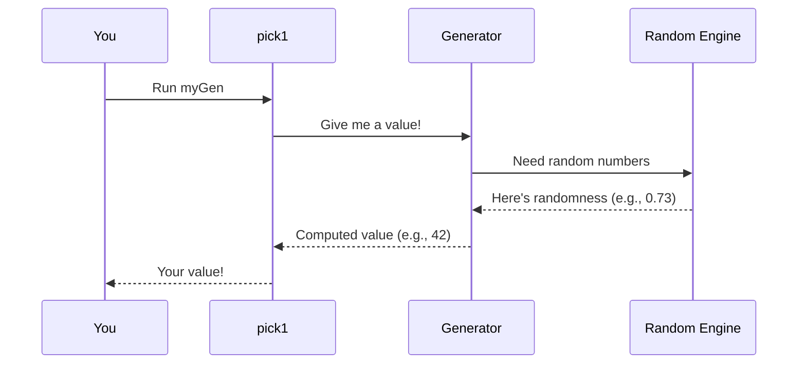

# Chapter 1: Generator (Gen)

Welcome to DepTyCheck! Today we'll learn about the heart of test data generation: **Generators (Gen)**. Think of generators as recipe books 📖 that tell the computer how to cook up random test values. Need random numbers? Random lists? Even complex custom data structures? Generators handle it all!

## Why do we need generators?

Imagine testing a function that calculates discounts. You'd want to test with:
- Random prices (like $10, $25.99, $100)
- Random quantities (like 1, 5, 100)
- Different combinations

Writing these manually is tedious! Generators automate this by creating random values on demand.

## Meet the `Gen` type

At its core, `Gen` is a recipe for creating values. Here's a simplified view:

```idris
-- A generator for type `a` that might be empty
Gen0 : Type -> Type

-- A generator that ALWAYS produces values (non-empty)
Gen1 : Type -> Type
```

Think of `Gen1 Int` as a recipe that *always* produces integers, while `Gen0 String` *might* produce strings (or might not).

## Your first generators

Let's create simple generators. We'll use these building blocks throughout:

```idris
-- Always generates the value 42
always42 : Gen1 Int
always42 = pure 42

-- Generates ANY integer
anyInt : Gen1 Int
anyInt = chooseAny

-- Generates integers between 1-10
oneToTen : Gen1 Int
oneToTen = choose (1, 10)

-- The empty generator (produces nothing)
nothingHere : Gen0 String
nothingHere = empty
```

Try using them:
- `always42` → Always returns `42`
- `anyInt` → Could return `-3`, `0`, `1000`...
- `oneToTen` → Returns numbers like `3`, `7`, `10`
- `nothingHere` → Produces no values

## Combining generators

Real power comes from combining generators. Let's make a dice roller:

```idris
-- A 6-sided die
dieRoll : Gen1 Int
dieRoll = choose (1, 6)

-- Roll two dice!
twoDice : Gen1 (Int, Int)
twoDice = [| (dieRoll, dieRoll) |]
```

This might produce `(2, 5)`, `(6, 1)`, etc. The `[| ... |]` syntax combines generators (more in later chapters).

## Picking from options

Need to choose between options? Use `oneOf`:

```idris
-- Generate "rock", "paper", or "scissors"
rps : Gen1 String
rps = oneOf [ pure "rock", pure "paper", pure "scissors" ]
```

Each option has equal probability. Run it 10 times and you might get:
`"rock"`, `"paper"`, `"scissors"`, `"paper"`, `"rock"`...

## Running generators

Time to see generators in action! Use `pick1` for guaranteed values:

```idris
-- Get one random value from a Gen1
roll : IO Int
roll = pick1 dieRoll  -- Could return 4

-- Get one random RPS move
gameMove : IO String
gameMove = pick1 rps   -- Could return "scissors"
```

For possibly-empty generators (`Gen0`), use `pick`:

```idris
-- Returns Nothing since nothingHere is empty
result : IO (Maybe String)
result = pick nothingHere  -- Always returns Nothing
```

## Behind the scenes: How Gen works

When you run `pick1`, here's what happens:



The generator uses the random engine to make decisions, then constructs your value step-by-step.

## Key takeaways

- **Generators are recipes** for random data
- `Gen1` always produces values, `Gen0` might not
- Combine small generators to build complex ones
- Use `pick1`/`pick` to run generators

Ready to track how often your generators produce certain values? Let's learn about [Coverage Tracking →](02_coverage_tracking_.md) in Chapter 2!

---

Generated by [AI Codebase Knowledge Builder](https://github.com/The-Pocket/Tutorial-Codebase-Knowledge)