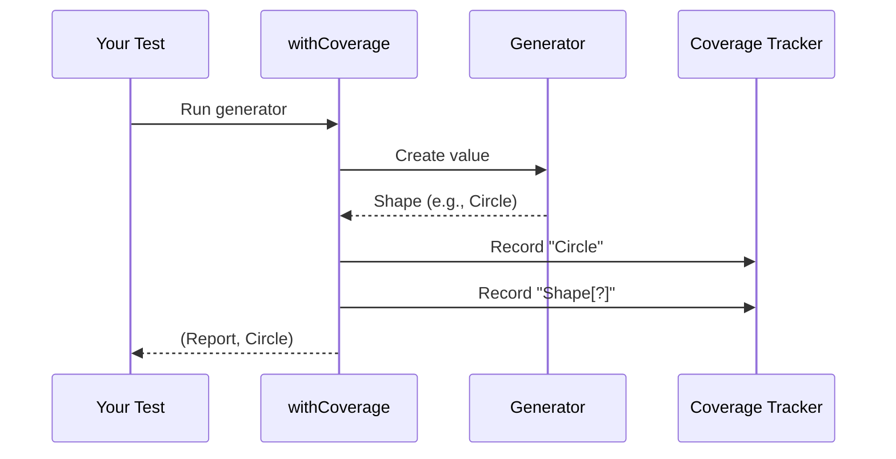

# Chapter 2: Coverage Tracking

Welcome to Chapter 2! In our [previous chapter](01_generator__gen__.md), we learned how to cook up test data using **Generators**. But how do we know if our generators are testing all the right ingredients? Today we'll learn about **Coverage Tracking** - your kitchen dashboard that shows what's being tested!

## Why track coverage?

Imagine baking cookies 🍪:
- You have different types: chocolate chip, oatmeal, sugar
- Your testers (generators) should try ALL types
- But how can you tell if oatmeal cookies never got tested?

This is what coverage tracking solves! It tracks:
1. Which data types get tested
2. Which variants (constructors) appear in tests
3. How often each appears

Without it, you might miss important test cases. With it, you get a "dashboard" showing what's missing!

## Meet the Label System

The secret sauce is **labels** - little tags attached to generated values. Think of them like sticky notes on your test data:

```idris
-- Labeling a circle value
labeledCircle : Gen1 Shape
labeledCircle = label "Circle" $ pure Circle
```

When this runs:
- Generates `Circle`
- Records: "Circle - Generated 1 time"

## Creating a Coverage Report

Let's create a generator that tracks shape types:

```idris
data Shape = Circle | Square | Triangle

shapeGen : Gen1 Shape
shapeGen = oneOf
  [ label "Circle"    $ pure Circle
  , label "Square"    $ pure Square
  , label "Triangle" $ pure Triangle
  ]

-- Run with coverage tracking
covReport : IO ModelCoverage
covReport = do
  result <- pick1 $ withCoverage shapeGen
  pure $ fst result  -- Get the coverage part
```

If you run this 10 times, you might get:
- Circle: 3 times
- Square: 3 times
- Triangle: 4 times

## Viewing The Dashboard

Let's see what a coverage report looks like:

```idris
main : IO ()
main = do
  cov <- covReport
  putStrLn $ show cov
```

Sample output:
```
Circle (user-defined): 3
Square (user-defined): 3
Triangle (user-defined): 4
Shape[?]: 10
```

This shows:
- How many times each constructor was used
- The top-level `Shape` was generated 10 times

## How It Works: Behind the Scenes

When you use `withCoverage`, DepTyCheck automatically:
1. Adds labels to all constructors
2. Tags the top-level type
3. Records every labeled item in a `ModelCoverage` map

The magic happens in:



## Inside ModelCoverage

The tracking map is simple:

```idris
-- Simplified from Coverage.idr
record ModelCoverage where
  constructor MkModelCoverage
  unModelCoverage : SortedMap Label Nat

-- Label = String wrapper
data Label = StringLabel String
```

It's just a dictionary counting each label occurrence!

## Try It Yourself!

Create a generator for traffic lights 🚦:

```idris
data Light = Red | Yellow | Green

trafficGen : Gen1 Light
trafficGen = ?yourCodeHere  -- Add labels!

main : IO ()
main = do
  (cov, light) <- pick1 $ withCoverage trafficGen
  putStrLn "Generated: \{show light}"
  putStrLn "Coverage report:\n\{show cov}"
```

Run multiple times to see counts grow!

## What We Covered Today

You've learned:
- Why coverage tracking is important
- How to label generated values
- How to use `withCoverage` to track usage
- How to view coverage reports

Now you'll never miss testing important data variants! Want to learn how to format and use coverage reports? Head to [Chapter 3: Output Pipelines](03_output_pipelines_.md)!

---

Generated by [AI Codebase Knowledge Builder](https://github.com/The-Pocket/Tutorial-Codebase-Knowledge)