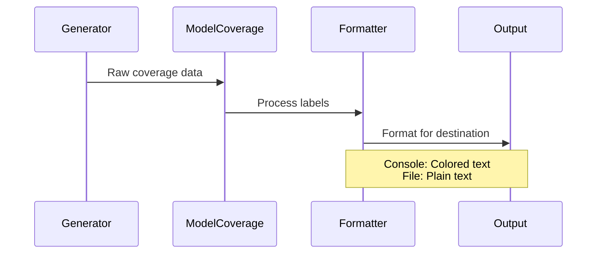

# Chapter 3: Output Pipelines

Welcome back! In [Chapter 2: Coverage Tracking](02_coverage_tracking_.md), you learned how to track which parts of your data types get tested. Now it's time to learn about **Output Pipelines** - how to format and display your test results beautifully! 🎨

## Why Output Pipelines?

Think of generators as factories that produce test data. Just like a real factory packages its products differently for different stores ([supermarket 🛒 vs. online store 📦](https://examples.com)), we need different ways to display:
1. Test results for humans to read (`putStrLn`)
2. Coverage reports for analysis (`showCoverage`)
3. Log files for debugging (`writeFile`)

Output pipelines are like special packaging machines that prepare your results for different destinations!

## Basic Usage: Showing Values

The simplest output pipeline formats values for console display. Let's start with our traffic light generator from Chapter 2:

```idris
-- Our traffic light data type
data Light = Red | Yellow | Green

-- Generator with coverage tracking
trafficGen : Gen1 Light
trafficGen = oneOf 
  [ label "Red"    $ pure Red
  , label "Yellow" $ pure Yellow
  , label "Green"  $ pure Green
  ]

-- Generate AND format a light value
showLight : IO String
showLight = do
  (cov, light) <- pick1 $ withCoverage trafficGen
  pure $ "Generated: " ++ show light
```

Run this with:
```idris
> :exec showLight
"Generated: Green"
```
Simple! But what about our coverage report?

## Formatting Coverage Reports

Let's create a proper coverage report pipeline:

```idris
formatReport : ModelCoverage -> String
formatReport cov = 
  "Coverage Report:\n" ++ 
  "----------------\n" ++
  showLabels cov

showLabels : ModelCoverage -> String
showLabels = join "\n" . map formatLabel . SortedMap.toList . unModelCoverage

formatLabel : (Label, Nat) -> String
formatLabel (label, count) = 
  "\{show label}: generated \{show count} times"
```

Now let's generate both a value and a report:

```idris
runTest : IO ()
runTest = do
  (cov, light) <- pick1 $ withCoverage trafficGen
  putStrLn $ "Generated: " ++ show light
  putStrLn $ formatReport cov
```

Sample output:
```
Generated: Yellow
Coverage Report:
----------------
"Red": generated 2 times
"Yellow": generated 5 times
"Green": generated 3 times
"Light[?]": generated 10 times
```

## Colored Reports ✨

For better readability, use the `CoverageGenInfo` colored reporter:

```idris
import Test.DepTyCheck.Gen.Coverage

showColoredReport : ModelCoverage -> IO ()
showColoredReport cov = do
  cgi <- %runElab initCoverageInfo {a=Light} trafficGen
  putStrLn $ CoverageGenInfo.toStringWith CoverageGenInfo.Colourful $
    registerCoverage cov cgi
```

Now reports will show red for uncovered items and green for covered ones!

## Behind the Scenes

What happens when formatting coverage reports? It's like a packaging line:



Let's peek at the real implementation:

1. **Label Processing** (from `Coverage.idr`):
   ```idris
   record ModelCoverage where
     unModelCoverage : SortedMap Label Nat
   ```
   This stores each label and how many times it appeared

2. **Formatter Selection** (simplified):
   ```idris
   formatFor : Destination -> ModelCoverage -> String
   formatFor Console = coloredReport
   formatFor File    = plainTextReport
   ```

3. **Color Implementation**:
   ```idris
   coloredReport : ModelCoverage -> String
   coloredReport cov = 
     if count == 0 
        then show (colored Red label)
        else show (colored Green label)
   ```

## Try It Yourself!

Let's build a complete test pipeline:

```idris
fullPipeline : IO ()
fullPipeline = do
  -- Generate test data
  (cov, light) <- pick1 $ withCoverage trafficGen
  
  -- Convert to readable formats
  let valueOutput = "Test value: " ++ show light
  let reportOutput = formatReport cov
  
  -- Send to destinations
  putStrLn valueOutput
  putStrLn "================"
  putStrLn reportOutput
  writeFile "coverage.log" reportOutput
```

Run this to see:
1. Test value in console
2. Coverage report in console
3. Same report saved to `coverage.log`

## Key Takeaways

- **Output pipelines** format results for different destinations
- Use `show` for simple value formatting
- Create custom formatters with `formatReport`
- Make colorful reports with `CoverageGenInfo.Colourful`
- Combine multiple outputs in a pipeline

You've learned how to package your test results! Next, we'll explore how to [manage labels efficiently](04_label_management_.md) in Chapter 4.

---

Generated by [AI Codebase Knowledge Builder](https://github.com/The-Pocket/Tutorial-Codebase-Knowledge)