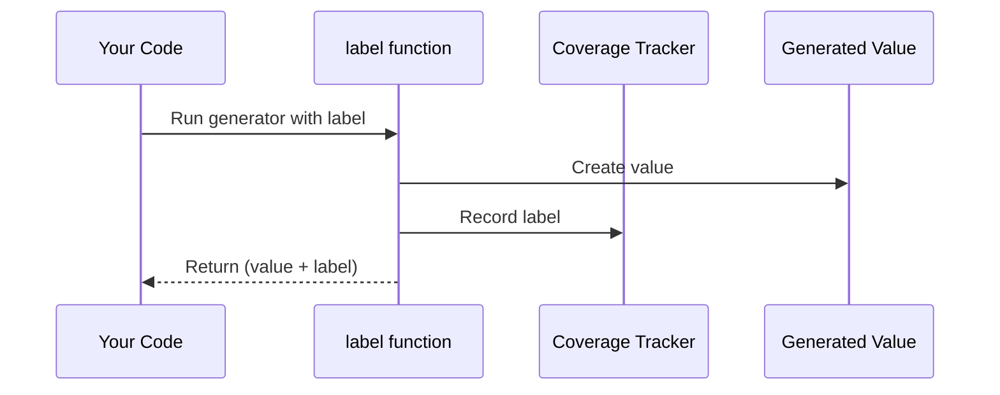

# Chapter 4: Label Management

Welcome back! In our [last chapter](03_output_pipelines_.md), we learned how to format beautiful coverage reports. But have you ever wondered *how* DepTyCheck knows where each test value came from? Today we'll explore **Label Management** - the secret tracking system that stamps every generated value with its origin! 🏷️

## Why Label Management?

Imagine you're a detective 🔍 investigating where test data was created. Without labels, you'd have clues like:
- This `Circle` shape appeared 5 times
- This `Red` traffic light appeared 3 times

But you wouldn't know *which part of your generator code* created them! Labels solve this by attaching "origin stamps" to values:

```idris
-- Without label: Mystery origin
circleGen = pure Circle

-- With label: Clear origin!
labeledCircle = label "Circle Maker" $ pure Circle
```

Now coverage reports show:
```
"Circle Maker": generated 5 times
```

Label management is like a factory stamping machine that tracks exactly where each test value was produced!

## Your First Labels

Let's create a simple labeled generator:

```idris
import Test.DepTyCheck.Gen

-- Labeled number generator
labeledNumber : Gen1 Int
labeledNumber = label "My Favorite Number" $ pure 42
```

When you run this:
1. Generates the number `42`
2. Attaches the label `"My Favorite Number"`
3. Records this label in coverage reports

Try it with coverage tracking:

```idris
main : IO ()
main = do
  (cov, num) <- pick1 $ withCoverage labeledNumber
  putStrLn "Number: \{show num}"
  putStrLn "Coverage: \{show cov}"
```

Output:
```
Number: 42
Coverage: [("My Favorite Number", 1)]
```

## How Labels Work Internally

When you call `label`, DepTyCheck does this:



The label travels with the value through the entire generation process!

## Managing Multiple Labels

What if you have nested generators? Each level can add its own label:

```idris
data Point = MkPoint Int Int

pointGen : Gen1 Point
pointGen = label "Point Factory" $ 
  [| MkPoint 
      (label "X Coordinate" anyInt) 
      (label "Y Coordinate" anyInt) 
  |]
```

Now when a point is generated:
1. `"X Coordinate"` recorded for the first integer
2. `"Y Coordinate"` recorded for the second integer
3. `"Point Factory"` recorded for the whole point

Coverage report shows all three labels!

## The Label Management System

DepTyCheck uses a special interface `CanManageLabels` to handle labels. Here's a simplified version:

```idris
interface Monad m => CanManageLabels m where
  manageLabel : Label -> m ()
```

This means any computation that:
1. Runs in some context `m`
2. Implements `CanManageLabels`
Can record labels!

## Default Behavior: Ignore Labels

By default, generators run with `IgnoreLabels` mode:

```idris
IgnoreLabels : CanManageLabels m where
  manageLabel _ = pure ()  -- Do nothing with labels!
```

This is why basic generators work without setup - labels are safely ignored unless you use `withCoverage`.

## Try It Yourself: Printing Labels

Let's create a custom label manager that prints every label:

```idris
customLabelManager : Gen1 a -> IO ()
customLabelManager gen = do
  (_, value) <- pick1 $ withCoverage gen
  pure value

-- But we want to SEE labels as they're created!
```

We'll implement `PrintAllLabels`:

```idris
[PrintAllLabels] HasIO io => CanManageLabels io where
  manageLabel lbl = putStrLn $ "Recording: " ++ show lbl
```

Now run with our custom manager:

```idris
main : IO ()
main = do
  let gen = label "Test Label" $ pure 42
  result <- customLabelManager gen
  putStrLn $ "Value: " ++ show result
```

Output:
```
Recording: "Test Label"
Value: 42
```

## Behind the Scenes: Label Implementation

Labels are simple wrappers around strings:

```idris
data Label = StringLabel String

Eq Label where
  (StringLabel s1) == (StringLabel s2) = s1 == s2
```

The coverage tracker uses a dictionary to count labels:

```idris
record ModelCoverage where
  constructor MkModelCoverage
  unModelCoverage : SortedMap Label Nat  -- Label → Count
```

When a label is recorded:
1. Look up the label in the map
2. If exists: increment count
3. If new: add with count=1

## Real-World Example: Traffic Light Factory

Let's build a complete labeled generator:

```idris
data Light = Red | Yellow | Green

trafficGen : Gen1 Light
trafficGen = label "Traffic Light Factory" $ oneOf
  [ label "Red Maker"    $ pure Red
  , label "Yellow Maker" $ pure Yellow
  , label "Green Maker"  $ pure Green
  ]

runFactory : IO ()
runFactory = do
  (cov, light) <- pick1 $ withCoverage trafficGen
  putStrLn $ "Produced: " ++ show light
  putStrLn $ "Coverage: " ++ show cov
```

Sample output:
```
Produced: Green
Coverage: [("Green Maker", 1), ("Traffic Light Factory", 1)]
```

## Key Takeaways

1. **Labels are origin stamps** for generated values
2. Use `label "name" $ generator` to attach labels
3. **Label management** happens through `CanManageLabels`
4. Default mode ignores labels (`IgnoreLabels`)
5. Coverage reports show which labels were recorded

You've mastered the labeling system! Now you know exactly where every test value comes from. Ready to see how generators build complex data? Let's explore [Derivation Pipeline →](05_derivation_pipeline_.md) in Chapter 5!

---

Generated by [AI Codebase Knowledge Builder](https://github.com/The-Pocket/Tutorial-Codebase-Knowledge)