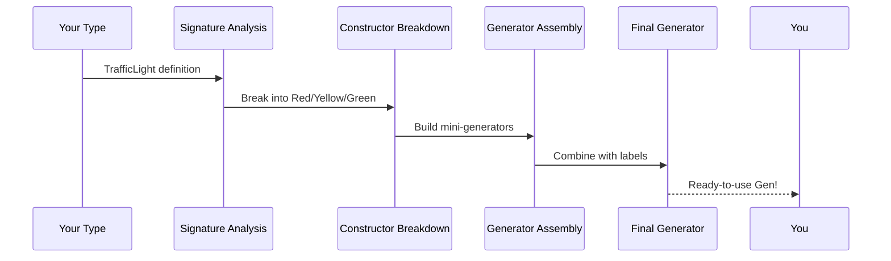

# Chapter 5: Derivation Pipeline

Welcome back! In our [last chapter](04_label_management_.md), you learned how labels act like origin stamps for test values. But what if you could automate generator creation? Today we'll explore **Derivation Pipeline** - DepTyCheck's automatic generator factory! 🏭

## Why Derivation Pipeline?

Imagine you're baking cookies 🍪:
1. You have cookie cutters (type definitions)
2. You need to bake many cookies (test values)
3. Doing it manually takes forever!

Derivation Pipeline solves this by:
- Analyzing your data types at compile-time
- Automatically building generators
- Handling complex cases like dependent types

It's like having a cookie factory that designs its own cookie cutters!

## Meet the Magic Macro

The secret sauce is `deriveGen` - a magical command that builds generators automatically:

```idris
-- Define a data type
data TrafficLight = Red | Yellow | Green

-- Automatically create generator!
lightGen : Fuel -> Gen TrafficLight
lightGen = deriveGen
```

That's it! DepTyCheck will:
1. Analyze `TrafficLight`
2. Build generators for each constructor
3. Handle all labeling internally

## How It Works: The Assembly Line

Derivation Pipeline works like a factory assembly line:



Let's break down each station:

### Station 1: Signature Analysis
DepTyCheck examines your type signature to understand:
- What needs to be generated
- What parameters are required
- How types depend on each other

*(See simplified code in `src/Deriving/DepTyCheck/Gen.idr`)*

### Station 2: Constructor Breakdown
Each constructor gets its own mini-generator:

```idris
-- For Red constructor
redGen : Gen TrafficLight
redGen = label "Red" $ pure Red

-- Similar for Yellow/Green
```

### Station 3: Generator Assembly
DepTyCheck combines mini-generators:

```idris
lightGen = oneOf [ redGen, yellowGen, greenGen ]
```

### Station 4: Final Generator
Labels are added automatically, and everything is packaged neatly!

## Try It Yourself!

Let's create a generator for shapes:

```idris
data Shape = Circle | Square | Triangle

-- Automatic generator!
shapeGen : Fuel -> Gen Shape
shapeGen = deriveGen

-- Test it!
main : IO ()
main = do
  shape <- pick1 $ shapeGen moreFuel
  putStrLn $ "Generated: " ++ show shape
```

Run this multiple times to see different shapes!

## Behind the Scenes

Let's peek at how DepTyCheck handles dependent types. Suppose we have:

```idris
data Box : Type -> Type where
  MkBox : (content : a) -> Box a
```

Derivation Pipeline will:
1. Notice `a` is a type parameter
2. Require a generator for `a`
3. Build the generator accordingly:

```idris
boxGen : Fuel -> Gen a => Gen (Box a)
boxGen fuel = [| MkBox (genForA fuel) |]
```

*(Implementation details in `src/Deriving/DepTyCheck/Gen/ForOneType/Impl.idr`)*

## Real-World Example: Traffic Light Factory

Let's see Derivation Pipeline in action:

```idris
data Light = Red | Yellow | Green

lightGen : Fuel -> Gen Light
lightGen = deriveGen

runFactory : IO ()
runFactory = do
  (cov, light) <- pick1 $ withCoverage $ lightGen moreFuel
  putStrLn $ "Produced: " ++ show light
  putStrLn $ "Coverage: " ++ show cov
```

Sample output:
```
Produced: Green
Coverage: [("Green", 1), ("Light", 1)]
```

## Key Takeaways

1. **Derivation Pipeline** automates generator creation
2. Use `deriveGen` to build generators instantly
3. Works like a factory assembly line:
   - Signature analysis
   - Constructor breakdown
   - Generator assembly
   - Final packaging
4. Handles dependent types automatically

You've unlocked automatic generator creation! Ready to learn about the basic building blocks? Let's explore [Generator Primitives →](06_generator_primitives_.md) in Chapter 6!

---

Generated by [AI Codebase Knowledge Builder](https://github.com/The-Pocket/Tutorial-Codebase-Knowledge)