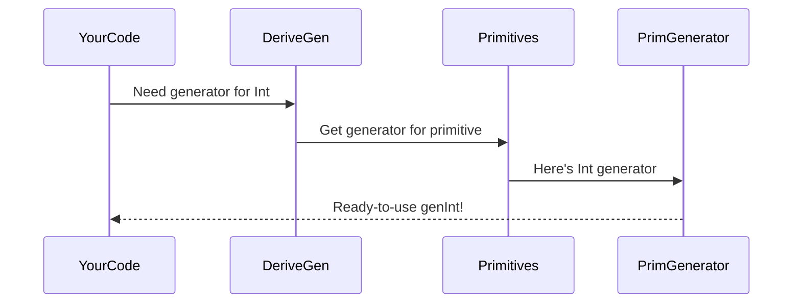

# Chapter 6: Generator Primitives

Welcome to our generator factory tour! In the [previous chapter](05_derivation_pipeline), we saw how DepTyCheck automatically builds generators for custom data types like TrafficLight and Box. But what about the fundamental building blocks like numbers and strings? Today we'll explore **Generator Primitives** - the essential tools that give Idris' built-in types their generation superpowers! 🔧

## Why Do We Need Generator Primitives?

Imagine building a car assembly line:
1. You need to make the whole car (custom data types)
2. But you also need tires, engines, and seats (primitives like Int and String)

Generator Primitives are these essential components:
- They provide generators for built-in Idris types
- Make sure primitives work seamlessly with custom types
- Act as a compatibility layer between Idris and DepTyCheck

Without them, we couldn't generate random numbers for our test cases or random text for string validation tests!

## The Primitive Toolbox

DepTyCheck provides generators for all Idris primitive types out of the box:

```idris
-- Generate random integers
genInt : Gen Int
genInt = deriveGenFor Int

-- Generate random strings
genString : Gen String
genString = deriveGenFor String
```

These are automatically available whenever you use DepTyCheck. Let's see them in action with a simple example:

```idris
randomTest : IO ()
randomTest = do
  num  <- pick1 genInt
  text <- pick1 genString
  putStrLn "Random number: \{show num}"
  putStrLn "Random text: \{show text}"
```

Sample output:
```
Random number: 42
Random text: "xQ7f"
```

## Special Case: Generating Types

The most magical primitive handles generating types themselves! This might seem mind-blowing, but it's incredibly useful for testing polymorphic functions.

```idris
genType : Gen Type
genType = deriveGenFor Type

typeExample : IO ()
typeExample = do
  t <- pick1 genType
  putStrLn "Random type: \{show t}"
```

Sample output:
```
Random type: Int
-- or maybe --
Random type: List String
```

## Behind the Scenes: The Assembly Line

How does DepTyCheck handle primitives? It has a special "Primitives Workshop" in its factory:



When `deriveGen` encounters a primitive type like `Int`, it routes the request to the special primitive handlers.

## Diving Deeper: How It's Implemented

The magic happens in `Primitives.idr`. DepTyCheck maintains a registry of primitive type generators:

```idris
-- Simplified from Primitives.idr
export
typeInfoForPrimType : PrimType -> TypeInfo
typeInfoForPrimType IntType    = primTypeInfo "Int"
typeInfoForPrimType StringType = primTypeInfo "String"
typeInfoForPrimType CharType   = primTypeInfo "Char"
-- and so on for all primitives...
```

Each primitive gets a special identifier so DepTyCheck can recognize it. When we need a generator:

```idris
extractTargetTyExpr : TypeInfo -> TTImp
extractTargetTyExpr info = case info.name of
  "Int"    => primVal $ PrT IntType   -- Handle Int
  "String" => primVal $ PrT StringType -- Handle String
  ...
```

This recognizes the primitive type and returns the right generator blueprint!

## Real-World Example: User Profile Generator

Let's create a user profile generator using primitive generators:

```idris
record User where
  constructor MkUser
  id : Int
  name : String
  email : String
  score : Double

userGen : Fuel -> Gen User
userGen fuel = [| MkUser 
                  (deriveGenFor Int) 
                  (deriveGenFor String) 
                  (deriveGenFor String) 
                  (deriveGenFor Double) 
               |]

testUser : IO ()
testUser = do
  user <- pick1 $ userGen moreFuel
  putStrLn "User: \{show user}"
```

Sample output:
```
User: MkUser 42 "Alice" "alice@test.com" 87.53
```

All primitive fields are automatically filled with random values!

## Key Takeaways

1. **Generator Primitives** provide built-in generators for:
   - Primitive types (Int, String, Double)
   - Core types (Type)
2. They work automatically with `deriveGen`
3. Act as compatibility layer between Idris and DepTyCheck
4. Enable complex test data generation
5. Defined in the special `Primitives.idr` workshop

You've now seen all the essential tools in our generator factory! But how does DepTyCheck analyze complex type signatures? Continue to [Chapter 7: Signature Analysis](07_signature_analysis.md) to find out!

---

Generated by [AI Codebase Knowledge Builder](https://github.com/The-Pocket/Tutorial-Codebase-Knowledge)