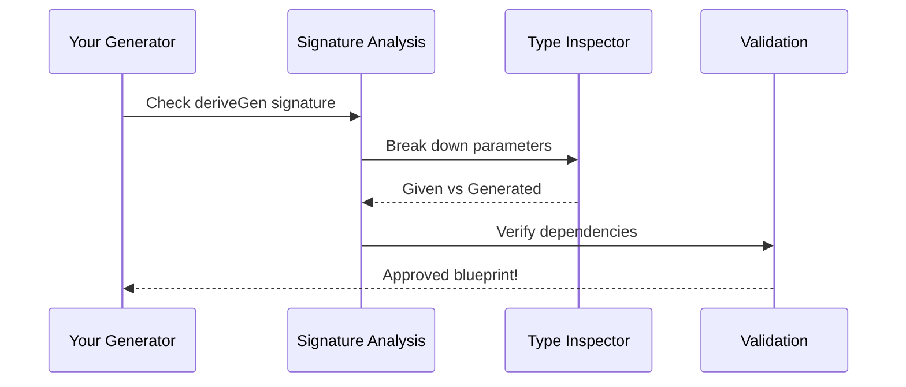

# Chapter 7: Signature Analysis

Welcome back! In our [last chapter](06_generator_primitives_.md), we learned how DepTyCheck uses primitive generators to build basic test values. But how does it know how to assemble complex generators? Meet **Signature Analysis** - DepTyCheck's type inspector that acts like a customs officer 🛃 verifying generator blueprints before construction begins!

## Why Signature Analysis?

Imagine you're building a car 🚗:
1. You have all the parts (primitives like wheels and engines)
2. You need instructions to assemble them correctly
3. But what if the instructions are wrong? You might build a car with 3 wheels!

Signature Analysis prevents this by:
- Checking generator function signatures
- Verifying dependencies between parameters
- Ensuring all required inputs are provided

It's like a blueprint inspector making sure your generator recipe is complete before cooking begins!

## Your First Signature Analysis

Let's create a generator for a simple data type:

```idris
data Person = MkPerson String Int

personGen : Gen Person
personGen = deriveGen
```

DepTyCheck will analyze `MkPerson`'s signature:
1. Requires a `String` and an `Int`
2. Both must be generated (no parameters given)
3. Creates a generator that produces random persons

But what if we want to control one parameter? Let's modify:

```idris
personGenWithName : String -> Gen Person
personGenWithName name = deriveGen
```

Now Signature Analysis sees:
1. `name : String` is provided (given parameter)
2. `Int` must still be generated
3. Creates a generator that uses your name

## How It Works: The Customs Process

Signature Analysis works like a customs checkpoint:



Let's see what happens step-by-step with `personGenWithName`:

1. **Break down parameters**:
   - Given: `name : String`
   - Generated: `Int` for age

2. **Verify dependencies**:
   - Does `Int` depend on `name`? No ✅
   - All required types can be generated ✅

3. **Approve blueprint** 🟢

## Key Concepts: Given vs Generated

Signature Analysis distinguishes between two types of parameters:

| Parameter Type | Description | Example |
|----------------|-------------|---------|
| **Given** | Values YOU provide | `name` in `personGenWithName` |
| **Generated** | Values DepTyCheck creates | Random `Int` for age |

This distinction helps DepTyCheck know what to expect from you and what it needs to create automatically.

## Behind the Scenes: The Inspector's Toolkit

DepTyCheck uses special tools to analyze signatures. Here's a simplified version from `Signature.idr`:

```idris
record GenSignature where
  targetType : TypeInfo       -- Type being generated
  givenParams : Set Fin       -- Positions of given parameters
  generatedParams : Set Fin   -- Positions of generated values

-- Example analysis for personGenWithName
sig : GenSignature
sig = MkGenSignature 
  { targetType = Person
  , givenParams = {0}        -- First parameter (name)
  , generatedParams = {1}    -- Second parameter (age)
}
```

This signature tells DepTyCheck:
- We're generating a `Person`
- Parameter 0 (`String`) is given
- Parameter 1 (`Int`) must be generated

## Real-World Example: Dependent Types

Signature Analysis really shines with dependent types. Consider this user profile:

```idris
record User where
  constructor MkUser
  name : String
  age : Nat
  email : String

userGen : (name : String) -> Gen User
userGen name = deriveGen
```

Signature Analysis:
1. Given: `name : String`
2. Generated: `age : Nat` and `email : String`
3. Verifies no dependencies between them ✅

Now try a dependent version:

```idris
data Account : Type where
  MkAccount : (balance : Nat) -> (owner : User) -> Account

accountGen : User -> Gen Account
accountGen owner = deriveGen
```

Analysis:
1. Given: `owner : User`
2. Generated: `balance : Nat`
3. Verifies `balance` doesn't depend on `owner` ✅

## Try It Yourself!

Create a generator for messages:

```idris
data Message = MkMsg String String -- sender, content

-- Version 1: Generate both
msgGenFull : Gen Message
msgGenFull = deriveGen

-- Version 2: Provide sender
msgGenWithSender : String -> Gen Message
msgGenWithSender sender = deriveGen
```

DepTyCheck will automatically:
1. For `msgGenFull`: Generate both strings
2. For `msgGenWithSender`: Use your sender string + generate content

## What Happens If Verification Fails?

If dependencies can't be satisfied, Signature Analysis rejects the blueprint:

```idris
data Broken = MkBroken (n : Nat) (Vect n String)

brokenGen : Gen Broken
brokenGen = deriveGen
```

Here:
- `n : Nat` must be generated first
- `Vect n String` depends on `n`
- But DepTyCheck can't guarantee valid `n` → Error! ❌

## Key Takeaways

1. **Signature Analysis** verifies generator blueprints
2. Distinguishes between:
   - **Given parameters** (you provide)
   - **Generated values** (DepTyCheck creates)
3. Acts like a customs officer 🛃 checking dependencies
4. Prevents impossible generator configurations
5. Defined in `Signature.idr` with `GenSignature` records

You've learned how DepTyCheck validates generator recipes! Ready to see how it analyzes complex data structures? Let's explore [Deep Constructor Analysis →](08_deep_constructor_analysis_.md) in Chapter 8!

---

Generated by [AI Codebase Knowledge Builder](https://github.com/The-Pocket/Tutorial-Codebase-Knowledge)