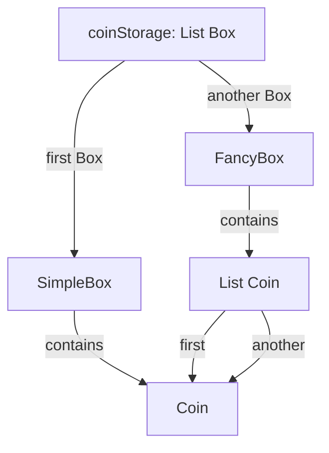
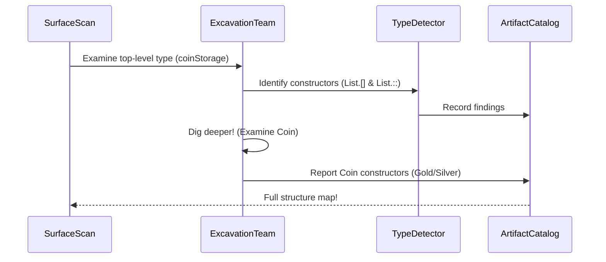
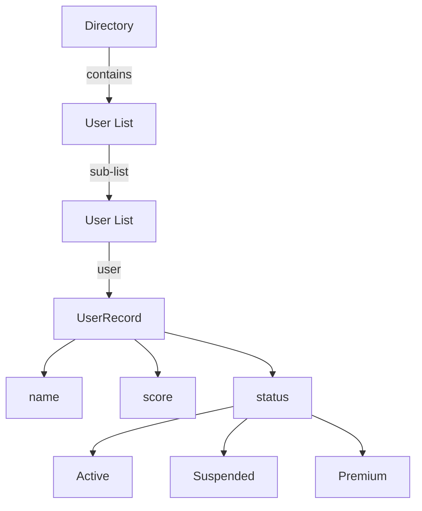

# Chapter 8: Deep Constructor Analysis

Welcome to the world of type exploration! 🧭 In [Chapter 7: Signature Analysis](07_signature_analysis.md), we learned how DepTyCheck validates generator blueprints like a customs officer checking passports. Today we'll discover **Deep Constructor Analysis** - DepTyCheck's type archeology tool that carefully excavates nested data structures! 🔍

## Why Deep Constructor Analysis?

Imagine you're an archeologist 🕵️‍♂️ exploring ancient ruins:
1. On the surface, you see a simple structure (like `Box`)
2. But digging deeper reveals complex artifacts inside (a `List` of `User` records)
3. Each layer requires careful handling

Deep Constructor Analysis solves this for generated values:
- Excavates nested constructors in complex types
- Handles GADTs and dependent types
- Guides value generation like a treasure map

Without it, DepTyCheck couldn't build generators for complex types!

## The Ancient Coin Collection

Let's explore a nested data type - imagine coins in storage containers:

```idris
data Coin = Gold | Silver

data Box = SimpleBox Coin
         | FancyBox (List Coin)

coinStorage : Type
coinStorage = List Box
```

Generating test data for `coinStorage` requires understanding that:
1. Top level is a `List`
2. Each list item is a `Box`
3. Boxes contain either:
   - A single `Coin` (SimpleBox)
   - Or a list of `Coins` (FancyBox)

Deep Constructor Analysis maps this excavation like an archeology diagram!



## How Deep Analysis Works

DepTyCheck examines types layer-by-layer like an archeologist brushing away dirt:



The process:
1. **Surface Scan**: Identify top-level constructors
2. **Excavation Team**: Dig into each constructor's arguments
3. **Type Detector**: Identify nested constructors
4. **Artifact Catalog**: Build complete structure map

## Behind-the-Scenes: The Toolbox

DepTyCheck uses special tools in `DeepConsApp.idr`:

```idris
-- Simplified from DeepConsApp.idr
analyseDeepConsApp : 
    (freeNames : SortedSet Name) -> -- Known names at this level
    (analysedExpr : TTImp) ->      -- Type expression to analyze
    List Name                      -- Found constructors and dependencies

-- How we record findings
record ConsDetermInfo where
    determinedByType : Bool   -- Is this determined by type info?
```

The key function `analyseDeepConsApp` works like:

```idris
analyseDeepConsApp freeNames expression =
    case expression of
        -- Primitive? Stop digging
        IVar n => [n]
        
        -- Found a constructor? Dig deeper!
        IApp func arg => 
            analyseDeepConsApp freeNames func ++ 
            analyseDeepConsApp freeNames arg
        
        -- Complex structure? Resume digging
        _ => ... -- More special cases
```

For our `FancyBox (List Coin)` it would:
1. Identify `FancyBox`
2. Find nested `List`
3. Discover buried `Coin`

## Real-World Example: User Directory

Let's examine a complex type structure:

```idris
record User where
    constructor MkUser
    name : String
    score : Int
    status : UserStatus

data UserStatus = Active | Suspended | Premium

-- Our nested directory
Directory : Type
Directory = List (List User)
```

Running Deep Constructor Analysis would discover:


## Handling Special Cases: GADTs

Deep Constructor Analysis is crucial for GADTs (Generalized Algebraic Data Types). Consider:

```idris
data Shape : Type where
    Circle : (radius : Double) -> Shape
    Rectangle : (width : Double) -> (height : Double) -> Shape
```

The analysis:
1. Sees Shape has two constructors
2. Notes each has different arguments
3. Guides generator to create proper values:
   - Circles get one double
   - Rectangles get two doubles

## Try It Yourself!

Imagine a file system structure:

```idris
data File = TextFile String | ImageFile String

data Folder = MkFolder String (List FileSystemItem)

data FileSystemItem = ItemFile File | ItemFolder Folder
```

What would Deep Constructor Analysis find? 
1. Top-level FileSystemItem
2. Then two cases:
   - File (TextFile/ImageFile)
   - Folder (which contains more FileSystemItems)

This reveals the recursive nature - which we'll explore in [Chapter 9: Recursion Analysis](09_recursion_analysis.md)!

## Key Takeaways

1. **Deep Constructor Analysis** excavates nested type structures:
   - Identifies all constructors in complex types
   - Handles GADTs and dependent types
2. Works like an archeological dig:
   - Surface scan then deeper excavations
   - Builds a complete structure map
3. Implemented in `DeepConsApp.idr`:
   - `analyseDeepConsApp` is the main tool
   - `ConsDetermInfo` tracks findings
4. Essential for generating values in nested structures

You've unearthed the secrets of deep type analysis! Ready to explore how DepTyCheck handles recursive structures? Continue digging with [Chapter 9: Recursion Analysis →](09_recursion_analysis.md)! ⛏️

---

Generated by [AI Codebase Knowledge Builder](https://github.com/The-Pocket/Tutorial-Codebase-Knowledge)