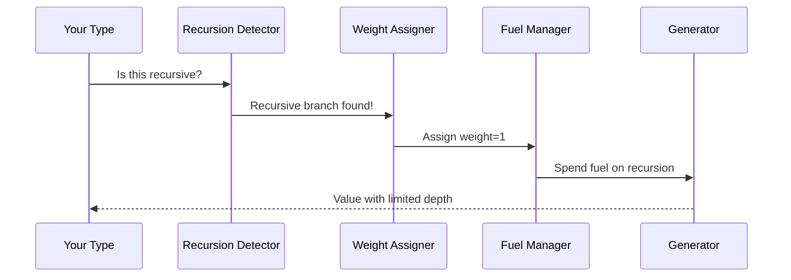

# Chapter 9: Recursion Analysis

Welcome back! In our [last chapter](08_deep_constructor_analysis_.md), we explored how DepTyCheck digs deep into nested data structures like an archeologist uncovering ancient artifacts. But what happens when we encounter a structure that references itself? Meet **Recursion Analysis** - DepTyCheck's guardian against infinite loops that acts like a resource accountant carefully managing your generation "fuel"! ⛽

## Why Recursion Analysis?

Imagine you're building a Russian nesting doll 🪆:
1. Each doll contains a smaller doll inside
2. If you keep opening forever, you'll never finish!
3. You need a stopping rule (e.g., "stop after 5 dolls")

Recursion Analysis solves this for recursive data types:
- Detects self-referential structures
- Prevents infinite recursion during generation
- Manages "fuel" to control depth

Without it, generating recursive types could run forever!

## The Infinite List Problem

Let's see recursion in action with a simple linked list:

```idris
data MyList = Empty | Node Int MyList
```

If we generate values naively:
1. Start with `Node`
2. Generate an Int (e.g., 42)
3. Generate another `MyList` → Back to step 1!

This could create infinite chains:
```
Node 42 (Node 17 (Node 99 (Node 3 ... )))
```

Recursion Analysis prevents this by:
1. Detecting recursive branches (`MyList` inside `Node`)
2. Assigning "weights" to recursive calls
3. Using "fuel" to limit recursion depth

## Fuel: Your Recursion Budget

Think of fuel as coins 💰 you spend on recursive calls:
- Start with fuel = 5 coins
- Each recursive call costs 1 coin
- When fuel runs out → stop recursing!

DepTyCheck manages this automatically:

```idris
myListGen : Fuel -> Gen MyList
myListGen fuel = deriveGen
```

When you run it:
```idris
main : IO ()
main = do
  list <- pick1 $ myListGen (limit 3)  -- Fuel=3
  print list
```

Possible output:
```
Node 42 (Node 17 Empty)  -- Only 2 nodes!
```

## How Recursion Analysis Works

DepTyCheck examines types like a resource accountant:



For our `MyList` example:
1. **Detects** `MyList` inside `Node` constructor
2. **Assigns** weight=1 to recursive branch
3. **Manages** fuel: Each `Node` costs 1 fuel
4. **Stops** when fuel=0 (returns `Empty`)

## Behind the Scenes: Weight Assignment

DepTyCheck uses special weight rules defined in `ConsRecs.idr`:

```idris
-- Simplified from ConsRecs.idr
data RecWeightInfo = 
  SpendingFuel (Fuel -> Nat1)  -- Cost function
  | StructurallyDecreasing TypeInfo  -- Safe recursion

record ConWeightInfo where
  weight : Either Nat1 RecWeightInfo  -- Weight value
```

For each constructor:
- Non-recursive: Fixed weight (e.g., `Empty` = 1)
- Recursive: Dynamic weight based on fuel

## Real-World Example: Directory Tree

Let's generate a filesystem with folders that can contain other folders:

```idris
data File = TextFile String

data Folder = 
  SimpleFolder String (List File) 
  | NestedFolder String (List Folder)

fileSystemGen : Fuel -> Gen Folder
fileSystemGen = deriveGen
```

DepTyCheck will:
1. Detect `Folder` inside `NestedFolder`
2. Assign weight=1 to recursive branch
3. Use fuel to limit nesting depth

Try it with different fuel levels:
```idris
testSystem : IO ()
testSystem = do
  system <- pick1 $ fileSystemGen (limit 2)
  print system
```

Possible output with fuel=2:
```
NestedFolder "Docs" [
  SimpleFolder "Images" [TextFile "logo.png"]
]
```

## Customizing Recursion Behavior

You can adjust recursion weights using `GenOrderTuning`:

```idris
import Deriving.DepTyCheck.Gen.Tuning

GenOrderTuning "NestedFolder" where
  deriveFirst _ _ = [`{contents}]  -- Focus on contents first
  tuneWeight original = original * 2  -- Make recursion costlier
```

Now:
- Contents are generated before folder name
- Each recursive call costs 2 fuel instead of 1

## Try It Yourself!

Create a binary tree generator:

```idris
data Tree = Leaf | Branch Int Tree Tree

treeGen : Fuel -> Gen Tree
treeGen = deriveGen

testTree : IO ()
testTree = do
  tree <- pick1 $ treeGen (limit 3)
  print tree
```

Sample output with fuel=3:
```
Branch 42 
  (Branch 17 Leaf Leaf) 
  (Branch 99 Leaf Leaf)
```

## Key Takeaways

1. **Recursion Analysis** prevents infinite generation loops
2. Uses **fuel** as recursion budget:
   - Each recursive call spends fuel
   - Stops when fuel runs out
3. **Weights** manage recursion cost:
   - Non-recursive: Fixed weight
   - Recursive: Dynamic fuel-based weight
4. Customize with `GenOrderTuning`
5. Implemented in `ConsRecs.idr` and `Tuning.idr`

You've mastered recursion control! Ready to see how DepTyCheck wraps up generation? Let's explore [Derivation Closure →](10_derivation_closure_.md) in Chapter 10!

---

Generated by [AI Codebase Knowledge Builder](https://github.com/The-Pocket/Tutorial-Codebase-Knowledge)