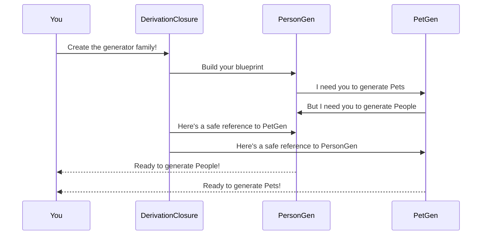

# Chapter 10: Derivation Closure

**Previous Chapter**: In [Chapter 9: Recursion Analysis](09_recursion_analysis_.md), we learned how DepTyCheck prevents infinite loops with carefully managed fuel budgets. But what happens when multiple generators depend on each other like friends helping friends? 🤝 Let's explore how DepTyCheck creates safe collaboration circles! 

## Why Derivation Closure?

Imagine you're organizing a group project:
1. Alice needs Bob's help to finish her task
2. Bob needs Alice's help to finish his task
3. How can they ever complete anything? 🔄

**Derivation Closure** solves this for mutually dependent generators:
- Creates a safe "collaboration space" where generators can reference each other
- Resolves circular dependencies automatically
- Acts like a switchboard connecting interdependent components

Without it, mutually recursive generators would deadlock! ❌

## The Data Structure Family 👨‍👩‍👧‍👦

Let's meet a family of structures that depend on each other:

```idris
data Person = Adult String | Child Pet

data Pet = Dog String | Cat Person
```

Notice:
- `Person` might contain a `Pet` (Child has a pet)
- `Pet` might reference a `Person` (Cat has an owner)

This mutual dependency creates a closed loop! Let's build generators for them:

```idris
personGen : Fuel -> Gen Person
personGen = deriveGen

petGen : Fuel -> Gen Pet
petGen = deriveGen
```

But wait: `personGen` needs `petGen` which in turn needs `personGen`... How do we escape this infinite recursion?

## The Magic Circle ⭕

Derivation Closure creates a "closed ecosystem" where all generators are defined together:



The Derivation Closure acts as a coordinator that:
1. Takes all interdependent generators
2. Creates safe references between them
3. Packages them into a closed system

Now you can generate values without infinite loops!

### Behind the Scenes: The Closure Switchboard

Here's what Derivation Closure does internally:

```idris
-- Simplified view from ForAllNeededTypes/Impl.idr
createClosure : List Generator -> ClosureState
createClosure generators = do
  let dependencies = findDependencies generators
  closureMap = buildReferenceMap dependencies
  forEach generator $ replaceCalls closureMap
```

## Key Players in Derivation Closure

### 1. The Derivation Closure Interface 🧩

This interface coordinates everything:

```idris
interface DerivationClosure m where
  callGen : GenSignature -> Fuel -> Args -> GeneratedValue
  --            ^ Generator   ^ Fuel  ^ Arguments  ^ Result
```

This allows generators to request others ("call for help") safely.

### 2. The Safe Call System 📞

When generators need each other, they use `callGen`:

```idris
-- When generating a Child value
childGen : Gen Person
childGen = do
  pet <- callGen petGenSignature fuel []  -- Safe call!
  pure $ Child pet
```

`callGen` ensures this reference is resolved through the closure system rather than direct recursion.

### 3. The Dependency Graph 📊

DepTyCheck builds a map of all dependencies:

```idris
dependencyMap : SortedMap Name Generator
dependencyMap = fromList
  [ ("Person", personGen)
  , ("Pet", petGen)
]
```

This prevents duplication - each generator is created only once, then reused!

## Trying It Yourself: Family Simulator

Let's generate some families and pets:

```idris
makeFamily : IO ()
makeFamily = do
  person <- pick1 $ personGen (limit 3)
  pet    <- pick1 $ petGen (limit 3)
  putStrLn "Person: \{show person}"
  putStrLn "Pet: \{show pet}"
```

Sample output with fuel=3:
```
Person: Adult "Parent"
Pet: Dog "Spot"

-- Or occasionally --
Person: Child (Cat (Adult "Grandma"))
Pet: Cat (Adult "Grandma")
```

Notice how relationships stay within fuel limits!

## How It Solves Recursion Safely

The closure system uses the same fuel tracking we saw in Chapter 9:

1. **Initial call**: `personGen fuel=3`
2. **Internal calls**:
   ```mermaid
   graph TD
       A[personGen<br>fuel=3] -->|"call petGen(2)"| B[petGen]
       B --> |"call personGen(1)"| C[personGen]
       C --> |Fuel=1, no deeper calls| D[Return Adult]
   ```

Each nested call decrements fuel just like regular recursion, but through safe references!

## Real Case: Code Intro

Here's the real closure handler from `ForAllNeededTypes/Impl.idr`:

```idris
callGen : (sig : GenSignature) -> (fuel : Fuel) -> Args -> m GeneratedValue
callGen sig fuel values = do
  if externalGeneratorExists sig
     then callExternal sig fuel values    -- Use if available
     else callInternal sig fuel values    -- Create internally

  where
    callInternal sig fuel values = do
      closureMap <- getClosureMap
      case lookup sig closureMap of
        Just genRef => ...  -- Use existing reference
        Nothing => ...      -- Create new generator
```

This ensures each generator:
1. Is created only once (no duplicates)
2. Is reused through references
3. Respects fuel budgets consistently

## Key Takeaways

1. **Derivation Closure handles mutual dependencies**:
   - Creates a safe group for interdependent generators
   - Resolves circular references without infinite loops
2. Acts like a **telephone switchboard operator** connecting generators
3. Uses **safe call references** via `callGen`
4. Maintains a **dependency map** for efficiency
5. Reuses the **fuel system** to control depth

You've just unlocked the secret to managing complex generator relationships! This completes our beginner tour of DepTyCheck. Start applying your new skills or [return to Chapter 1](01_generator__gen__.md) to reinforce the fundamentals! 🎓

---

Generated by [AI Codebase Knowledge Builder](https://github.com/The-Pocket/Tutorial-Codebase-Knowledge)