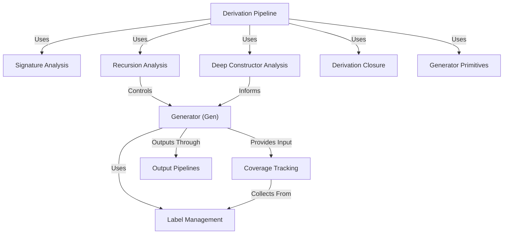

# Tutorial: DepTyCheck

**DepTyCheck** is a property-based testing library for Idris 2 that specializes in *automatic generator derivation* and dependent type handling. It:
- Creates **test data generators** through compile-time analysis of type definitions
- Tracks **coverage** of data constructors during testing to identify untested code paths
- Supports **dependent types** and recursive structures via fuel-based generation to prevent infinite loops
- Provides primitives for built-in types while allowing customization for user-defined types

**Source Repository:** [None](None)

## Chapters

1. [Generator (Gen)
](01_generator__gen__.md)
2. [Coverage Tracking
](02_coverage_tracking_.md)
3. [Output Pipelines
](03_output_pipelines_.md)
4. [Label Management
](04_label_management_.md)
5. [Derivation Pipeline
](05_derivation_pipeline_.md)
6. [Generator Primitives
](06_generator_primitives_.md)
7. [Signature Analysis
](07_signature_analysis_.md)
8. [Deep Constructor Analysis
](08_deep_constructor_analysis_.md)
9. [Recursion Analysis
](09_recursion_analysis_.md)
10. [Derivation Closure
](10_derivation_closure_.md)

---

Generated by [AI Codebase Knowledge Builder](https://github.com/The-Pocket/Tutorial-Codebase-Knowledge)