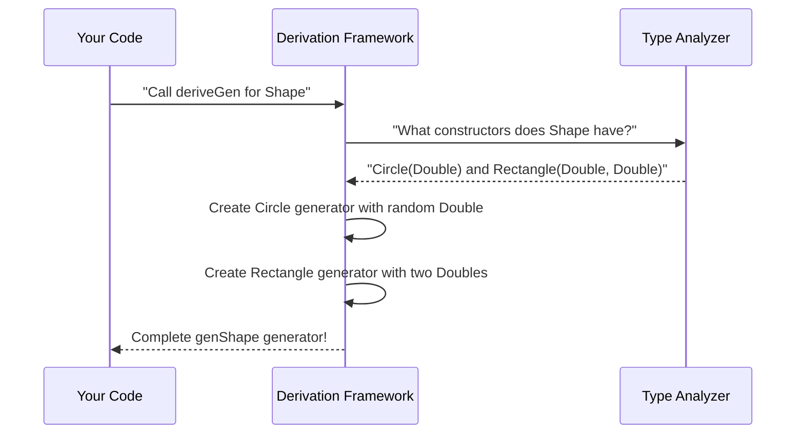

# Chapter 1: Derivation Framework

Are you tired of writing test data generators by hand every time you create a new data type? Meet DepTyCheck's **Derivation Framework** - your new automatic test data chef! 🍪

Imagine you're a baker with endless ingredients (data types) and need recipes (generators) to create test treats. The Derivation Framework is your magic kitchen assistant that automatically creates recipes for any ingredient you give it. Let's learn how this magic works!

## Why Do We Need This?

When we create data types in Idris, we need ways to generate example values for testing:
```idris
data Shape = Circle Double | Rectangle Double Double
```

Manually creating generators gets tedious:
```idris
genShape : Fuel -> Gen MaybeEmpty Shape
genShape fuel = oneOf 
  [ Circle <$> genDouble fuel
  , Rectangle <$> genDouble fuel <*> genDouble fuel
]
```

**The Derivation Framework solves this**: it automatically creates generators like `genShape` by analyzing your type definitions. Let's see it in action!

## Your First Generated Generator

Using our framework is simpler than making instant noodles 🍜. Just define your type and use `deriveGen`:

```idris
data Shape = Circle Double | Rectangle Double Double

genShape : Fuel -> Gen MaybeEmpty Shape
genShape = deriveGen   -- Magic happens here!
```

That's it! DepTyCheck will automatically:
1. Detect that `Shape` has two constructors
2. See that `Circle` takes one `Double`
3. Notice `Rectangle` takes two `Double`s
4. Generate appropriate random data

## Two Ways to Derive

Prefer type signatures? Use `deriveGen`:

```idris
-- Using with explicit type signature
genCircle : Fuel -> Gen MaybeEmpty Shape
genCircle = deriveGen
```

Prefer one-liners? Use `deriveGenFor`:
```idris
-- Automatically derives signature too!
genRect = deriveGenFor $ Fuel -> Gen MaybeEmpty Shape
```

## Behind the Kitchen Doors

How does our framework work? Think of it as a baking robot with special vision:

```
1. Receives type definition (ingredient)
2. Inspects type shape (examine ingredient)
3. Creates recipe skeleton (draft recipe)
4. Fills in generator steps (add instructions)
5. Outputs ready-to-use generator (complete recipe)
```

Here's what happens when you call `deriveGen` for `Shape`:



## A Taste of Implementation

The framework's core lives in `src/Deriving/DepTyCheck/Gen.idr`. Here's the chef's secret recipe drawer:

```idris
||| The entry-point function
export %macro
deriveGen : DeriveBodyForType => Elab a
deriveGen = do
  Just signature <- goal
     | Nothing => fail "Signature needed!"
  tt <- deriveGenExpr signature  -- Generate magic here
  check tt
```

Key components:
1. `checkTypeIsGen`: Verifies valid generator signature
2. `generateInternal`: Creates generators for each constructor
3. `callMainDerivedGen`: Combines them into final output

## What's Next?

You've just met your new automated test data chef! The Derivation Framework eliminates the drudgery of hand-writing generators. In our next lesson, we'll unpack what happens during **[Signature Analysis](02_signature_analysis_.md)** - where our framework examines type definitions like a master sommelier inspecting fine wine! 🍷

Happy generating! 💫

---

Generated by [AI Codebase Knowledge Builder](https://github.com/The-Pocket/Tutorial-Codebase-Knowledge)