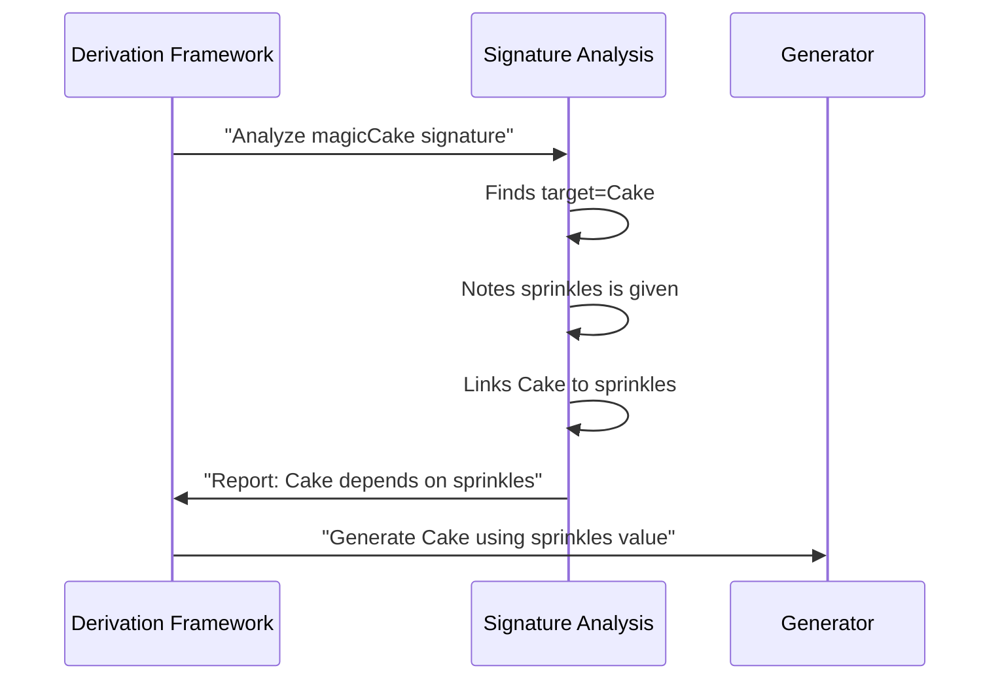

# Chapter 2: Signature Analysis

Welcome back! In our last chapter ([Derivation Framework](01_derivation_framework_.md)), we met DepTyCheck's automatic generator chef 🧑‍🍳 that cooks up test data recipes. But how does it know what ingredients to use? That's where **Signature Analysis** comes in! Think of it as the chef's recipe detective 🕵️‍♂️ who examines function blueprints to solve generation mysteries.

## Why We Need Signature Analysis

Imagine you're baking cookies 🍪 with this recipe:
```idris
makeCookie : (chips : Int) -> (size : Double) -> Cookie
```

When generating test data, we need to know:
- Which ingredients must be provided (`chips` and `size`)
- What needs to be generated (`Cookie`)
- How ingredients depend on each other

Signature Analysis solves this by examining function signatures like a detective examining clues! Let's see it in action.

## The Detective's Toolkit

Signature Analysis answers three key questions about any generator function:

1. **What's being generated?** (The main dish)
2. **What ingredients are provided?** (Pre-measured items)
3. **What needs to be cooked?** (Ingredients to generate)

Here's how we'd analyze our cookie recipe:

```idris
-- Function signature blueprint:
Generator Signature: (chips : Int) -> (size : Double) -> Gen Cookie

-- Signature Analysis Report:
- Generated Type: Cookie
- Given Parameters: chips (Int), size (Double)
- Dependency Chain: None (simple recipe)
```

## How Signature Analysis Works

Let's break down the detective work step-by-step with a sandwich example 🥪:

```idris
makeSandwich : (bread : String) -> (filling : Filling) -> Sandwich
```

### Step 1: Identify the Target
The detective looks for the final output type (here `Sandwich`)

### Step 2: Catalog Ingredients
All parameters before the final type are ingredients:
- `bread : String` (provided)
- `filling : Filling` (provided)

### Step 3: Check Dependencies
If ingredients depend on each other (like `cheese` depending on `dairyAvailable`), the detective maps these relationships.

## Inside the Detective's Notebook

Here's the simplified code from `Signature.idr` that captures this analysis:

```idris
record GenSignature where
  constructor MkGenSignature
  targetType : TypeInfo       -- What we're generating
  givenParams : SortedSet Fin -- Positions of provided params
```

When analyzing `(chips:Int)->(size:Double)->Gen Cookie`:
- `targetType` = `Cookie`
- `givenParams` = `[0,1]` (positions of chips/size)

## Solving Generation Mysteries

What about complex recipes with dependencies? Consider:

```idris
magicCake : (sprinkles: Int) -> Gen (Cake sprinkles)
```

Signature Analysis detects:
- `sprinkles` is provided
- Generated `Cake` depends on `sprinkles`
- Must generate different cakes for different sprinkle counts!

Here's how this looks in our system:



## Real Code Investigation

Let's peek at the actual analysis code (simplified for clarity):

```idris
-- From Signature.idr
canonicSig : GenSignature -> TTImp
canonicSig sig = 
  piAll returnTy $ [fuelArg] ++ givenArgs
  where
    givenArgs = map arg sig.givenParams     -- Collect given params
    returnTy = `(Gen MaybeEmpty ~target)    -- Generation target
```

Key components:
1. `piAll`: Builds the function type
2. `givenArgs`: Collects user-provided parameters
3. `returnTy`: Sets up the generation target

## What's Next?

Congratulations! You've learned how Signature Analysis acts as DepTyCheck's type detective 🕵️‍♂️, examining function blueprints to solve generation mysteries. Now that we understand the recipe, our next step is **[Deep Constructor Analysis](03_deep_constructor_analysis_.md)** - where we'll explore how DepTyCheck examines ingredient lists in complex data types!

Ready to become a generation master chef? Let's keep cooking! 👨‍🍳🔥

---

Generated by [AI Codebase Knowledge Builder](https://github.com/The-Pocket/Tutorial-Codebase-Knowledge)