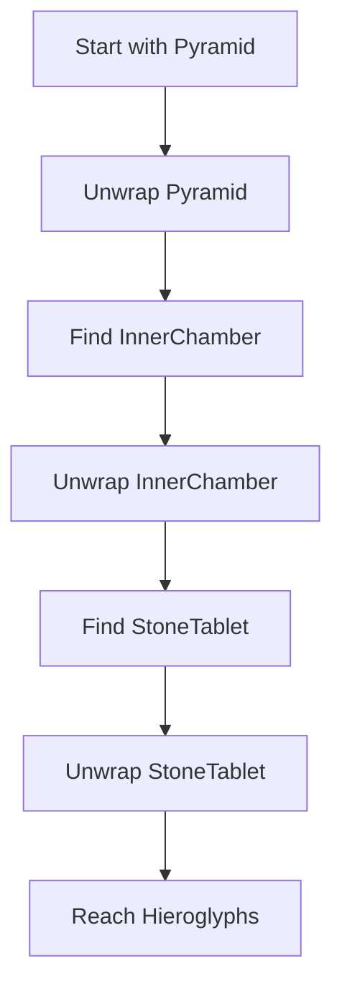

# Chapter 3: Deep Constructor Analysis

Welcome back! In our last adventure ([Signature Analysis](02_signature_analysis_.md)), we learned how DepTyCheck examines function signatures like a detective 🕵️‍♂️. Now imagine you've discovered an ancient artifact (a complex data type) with multiple layers. How do we uncover its secrets? Meet **Deep Constructor Analysis** - DepTyCheck's inner archaeologist! 🧑‍🔬

## Why We Need This

Imagine we have a nested data type like this treasure chest:
```idris
data Treasure = 
  GoldBar | 
  JewelBox (List Gem) | 
  MysteryChest Treasure
```

To generate test data, we need to:
1. Recognize `MysteryChest` contains another `Treasure`
2. Understand `JewelBox` holds a list of `Gem`
3. Know `GoldBar` stands alone

Deep Constructor Analysis digs through these layers like an archaeologist carefully brushing away dirt to reveal hidden structures!

## Meet Our Type Archaeologist

Imagine you're excavating a pyramid:
```
Pyramid (InnerChamber (StoneTablet Hieroglyphs))
```

Our archaeologist would:
1. Identify `Pyramid` as the outer structure
2. Discover `InnerChamber` inside
3. Find `StoneTablet` within that
4. Finally reveal `Hieroglyphs`

Similarly, Deep Constructor Analysis:


## How It Works in DepTyCheck

Let's see Deep Constructor Analysis in action with our `Treasure` type:

```idris
analyseDeepConsApp : 
  (freeNames : SortedSet Name) -> 
  (analysedExpr : TTImp) -> 
  List Name
```

This function:
- Takes a set of available names (like excavation tools)
- Examines an expression (the artifact)
- Returns which names were actually used

Example usage:
```idris
-- Analyse MysteryChest (GoldBar)
usedNames <- analyseDeepConsApp ["GoldBar"] `(MysteryChest GoldBar)

-- Result: ["GoldBar"] was used!
```

## Step-by-Step Excavation

Let's break down how our archaeologist examines `MysteryChest GoldBar`:

1. **Identify the outermost constructor**: `MysteryChest`
2. **Check its contents**: Finds `GoldBar`
3. **Verify `GoldBar` is valid**: Confirms it's in our name set
4. **Record findings**: Adds `GoldBar` to used names list

The process in code:
```idris
let (IVar _ lhsName, args) = unAppAny e  -- Unwrap application
case lhsName of
  "MysteryChest" => 
    -- Examine arguments (here: GoldBar)
    subResult <- analyseDeepConsApp freeNames (getExpr arg)
    -- Return subResult + current findings
```

## Handling Complex Artifacts

What about nested structures like `MysteryChest (JewelBox [Ruby])`? Our archaeologist digs deeper:

```idris
analyseDeepConsApp ["Ruby"] `(MysteryChest (JewelBox [Ruby]))
```
1. Unwrap `MysteryChest` → finds `JewelBox`
2. Unwrap `JewelBox` → finds `[Ruby]`
3. Recognize `Ruby` is in our name set
4. Return `["Ruby"]`

The recursive magic happens here:
```idris
deepArgs <- for each argument in constructor:
  subResult <- analyseDeepConsApp freeNames argument
  -- Combine results
```

## Inside the Archaeologist's Toolkit

Let's peek at the core implementation (simplified):

```idris
analyseDeepConsApp freeNames e = do
  -- Unwrap application like MysteryChest(...)
  (constructor, args) <- unAppAny e

  -- Check if constructor is valid
  unless (isConstructor constructor) $
    throwError "Not a constructor!"

  -- Recursively analyze arguments
  results <- mapM (analyseDeepConsApp freeNames) args

  -- Combine all findings
  pure (concat results)
```

Key components:
1. `unAppAny`: Unpacks nested applications
2. Recursive calls: Handle each argument layer
3. Result combining: Merge findings from all levels

## What's Next?

Congratulations! You've learned how Deep Constructor Analysis acts as DepTyCheck's type archaeologist 🧑‍🔬, carefully excavating nested data structures to understand generation dependencies. Now that we can examine complex types, our next challenge is handling recursive structures in **[Recursion Handling (ConsRecs)](04_recursion_handling__consrecs__.md)** - where we'll learn how to avoid infinite digging loops! ⛏️➰

Happy excavating!

---

Generated by [AI Codebase Knowledge Builder](https://github.com/The-Pocket/Tutorial-Codebase-Knowledge)