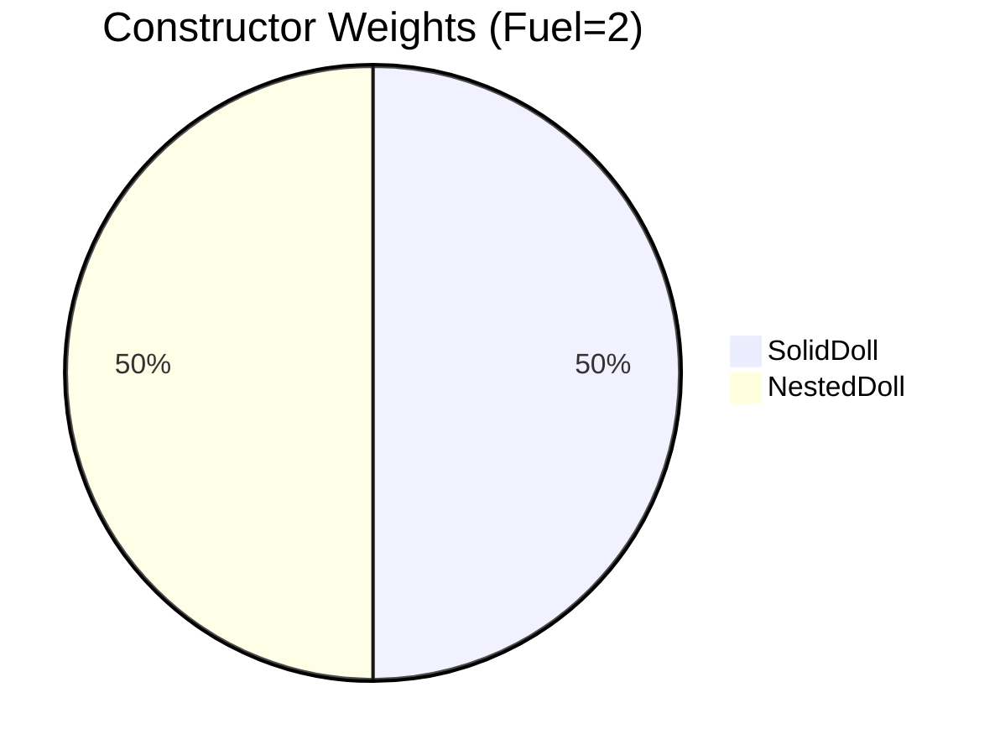
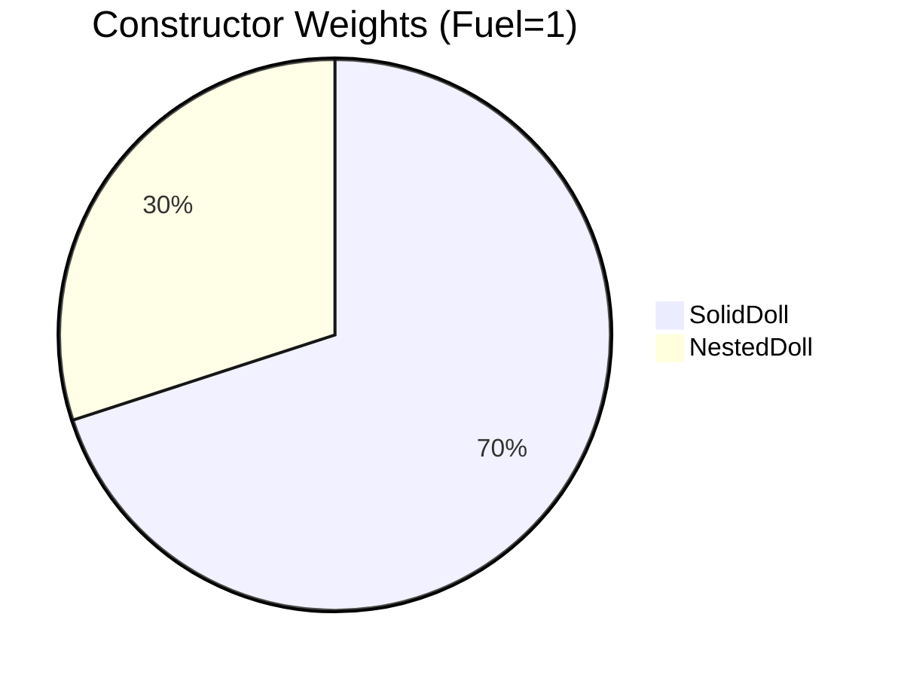
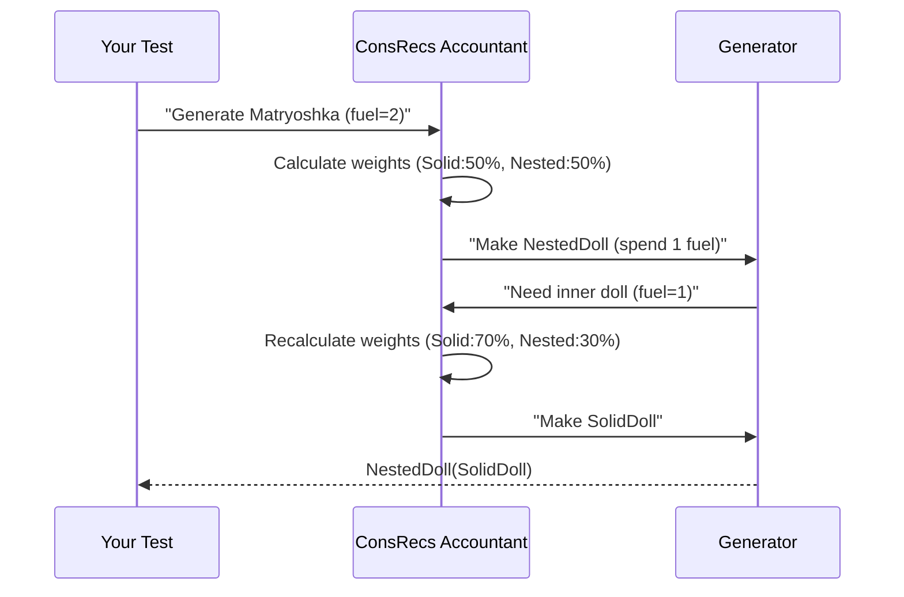

# Chapter 4: Recursion Handling (ConsRecs)

Welcome back! In our last adventure ([Deep Constructor Analysis](03_deep_constructor_analysis_.md)), we learned how DepTyCheck examines nested data structures like an archaeologist 🧑‍🔬 uncovering ancient artifacts. But what happens when we encounter data types that reference *themselves*? That's where **Recursion Handling (ConsRecs)** comes in - DepTyCheck's recursion accountant! 🧮

## Why We Need Recursion Handling

Imagine you're baking a Russian nesting doll cake 🎂 where each doll contains a smaller version of itself:
```idris
data Matryoshka = 
  SolidDoll | 
  NestedDoll Matryoshka   -- Recursive case!
```

If we tried to generate this naively:
```idris
genMatryoshka fuel = oneOf
  [ pure SolidDoll
  , NestedDoll <$> genMatryoshka fuel  -- Uh oh, infinite loop!
  ]
```

We'd get stuck in an endless baking loop! ConsRecs solves this by:
1. **Tracking recursion depth** with "fuel" tokens
2. **Adjusting probabilities** to avoid infinite generation
3. **Smartly weighting constructors** based on remaining fuel

## Meet Your Recursion Accountant

Think of ConsRecs as a careful bank manager tracking your recursion "funds":
```
Initial Fuel: 3 tokens

Generate SolidDoll: 
  - Cost: 0 tokens (base case)
  - Remaining: 3

Generate NestedDoll: 
  - Cost: 1 token 
  - Remaining: 2
  - Generate inner doll with remaining fuel
```

The accountant ensures we never overspend our recursion budget!

## Fuel: Your Recursion Currency

Fuel is our counter that decreases with each recursive call. Here's how we define it:

```idris
data Fuel = Dry | More Fuel  -- Like a countdown timer

-- Start with 3 'More' layers
startFuel : Fuel
startFuel = More (More (More Dry))
```

When generating recursive types:
```idris
genMatryoshka : Fuel -> Gen Matryoshka
genMatryoshka Dry = pure SolidDoll  -- Base case when fuel runs out
genMatryoshka (More fuel) = oneOf
  [ pure SolidDoll
  , NestedDoll <$> genMatryoshka fuel  -- Spend one fuel token
  ]
```

## Probability Weights: Fair Constructor Selection

Without ConsRecs, recursive constructors might dominate generation. Our accountant assigns fair weights:



As fuel decreases, weights adjust:


## How ConsRecs Works Step-By-Step

Let's generate a Matryoshka with fuel=2:

1. **Check fuel**: `More (More Dry)` - fuel available!
2. **Calculate weights**: 
   - SolidDoll: weight 50
   - NestedDoll: weight 50
3. **Random selection**: Choose NestedDoll
4. **Recurse**: 
   - Spend one fuel → now fuel=1
   - Generate inner doll with adjusted weights



## Inside the Accountant's Ledger

Here's the core structure that tracks recursion weights (simplified):

```idris
record ConWeightInfo where
  constructor MkConWeightInfo
  weight : Either Nat1 RecWeightInfo  -- Weight value or function

||| Recursive weight details
data RecWeightInfo = 
  SpendingFuel (Fuel -> Nat1)  -- Fuel-based calculation
  | StructurallyDecreasing TypeInfo TTImp  -- Size-based decrease
```

When processing our Matryoshka:
```idris
-- For SolidDoll (non-recursive)
solidWeight = Left 1  -- Constant weight

-- For NestedDoll (recursive)
nestedWeight = Right $ SpendingFuel $ 
  \fuel => if fuel == Dry then 0 else 1
```

## Real-World Usage

With DepTyCheck, you get this automatically! Just derive as usual:

```idris
data Matryoshka = SolidDoll | NestedDoll Matryoshka

-- Automatically handles recursion!
genMatryoshka : Fuel -> Gen MaybeEmpty Matryoshka
genMatryoshka = deriveGen
```

DepTyCheck will:
1. Detect recursive constructors
2. Set up fuel tracking
3. Balance probabilities
4. Prevent infinite generation

## What's Next?

Congratulations! You've learned how ConsRecs acts as DepTyCheck's recursion accountant 🧮, carefully tracking fuel expenditure and balancing constructor probabilities for recursive types. Now that we can handle self-referential data, our next stop is **[Argument Permutation](05_argument_permutation_.md)** - where we'll learn how DepTyCheck intelligently reorders generation steps for maximum efficiency! 🔄

Keep your recursion funds secure, and happy generating! 💸

---

Generated by [AI Codebase Knowledge Builder](https://github.com/The-Pocket/Tutorial-Codebase-Knowledge)