# Chapter 5: Argument Permutation

Welcome back! In our last chapter on [Recursion Handling (ConsRecs)](04_recursion_handling__consrecs__.md), you learned how DepTyCheck manages recursive types like a careful accountant 🧮. Now imagine you've gathered all your baking ingredients, but they're in the wrong order for your recipe! Meet **Argument Permutation** 🔄 - DepTyCheck's dependable sous-chef that perfectly reorders values to satisfy complex recipes.

## The Out-of-Order Problem

Imagine your recipe expects: `(sugar, flour, eggs)` but your automatic generator provides: `(eggs, sugar, flour)`. See the problem?

```idris
data Dessert = Cake Double Double Double  -- Needs (sugar, flour, eggs)

-- We generate:
(eggs, sugar, flour) = (2, 0.5, 2.0)

-- But we need:
(sugar, flour, eggs) = (0.5, 2.0, 2)
```

Without proper ordering:
1. 🧁 Your cake gets salt instead of sugar
2. 🥚 Eggs end up where flour should be
3. 💥 Generation fails even with correct values!

## Meet Your Sorting Sous-Chef

Argument Permutation acts like a master organizer that rearranges ingredients:
```
Generator Output: [🥚, 🍬, 🧂] 

Sous-Chef reshuffles: 
    Move 🍬 to position 0 
    Move 🧂 to position 1 
    Move 🥚 to position 2

Final Order: [🍬, 🧂, 🥚] ✅
```

This automatic reorganization happens behind the scenes via dependency analysis!

## How It Works: The Two-Step Process

### Step 1: Identify Correct Position Map
Create a "recipe card" mapping ingredient types to positions:
```idris
Cake constructor expects: 
  position 0: Double (sugar) 
  position 1: Double (flour) 
  position 2: Double (eggs)
```

### Step 2: Rearrange Generated Values
Using the map, reorder values to match expected positions:
```idris
Generated:          [2, 0.5, 2.0]   -- (eggs, sugar, flour)
Permutation Map:    [1, 2, 0]        -- sugar@1→0, flour@2→1, eggs@0→2

Result:             [0.5, 2.0, 2]    -- (sugar, flour, eggs)
```

## Peek Into the Kitchen Code

Here's the core reshuffling logic (simplified for clarity):

```idris
reorder : (perm : Vect n Fin) -> Vect n a -> Vect n a
reorder perm original = 
  map (index original) perm  -- Apply permutation
```

Let's use it with our cake example:
```idris
ingredients = [2, 0.5, 2.0]   -- eggs, sugar, flour
perms       = [1, 2, 0]        -- new positions

reordered = reorder perms ingredients 
-- Result: [0.5, 2.0, 2] 
```

`index original` fetches values from positions 1, then 2, then 0.

## Automatic Position Mapping

How does DepTyCheck know the correct order? With position mapping:

```idris
orderIndices : List String -> Vect n (Fin n)
orderIndices types = ...  -- Creates position map based on types
```

Example usage:
```idris
types = ["Sugar", "Flour", "Eggs"]
permMap = orderIndices types -- [0,1,2]

changedTypes = ["Eggs", "Sugar", "Flour"]
newPermMap = orderIndices changedTypes -- [1,2,0]
```

## Real Kitchen Example

Watch argument permutation magic in action:

```mermaid
sequenceDiagram
    participant Gen as Generator
    participant AP as Argument Permutation
    participant Output
    
    Gen->>AP: Produces (2, 0.5, 2.0) 
    Note over AP: Types = ["Egg","Sugar","Flour"]
    AP->>AP: Calculate permutation [1,2,0]
    AP->>AP: Reorder: position 1 → 0 (Sugar=0.5)
    AP->>AP: position 2 → 1 (Flour=2.0)
    AP->>AP: position 0 → 2 (Egg=2)
    AP->>Output: (0.5, 2.0, 2) 🎉
```



## Behind the Mixing Bowls

Let's see the full operation from `ArgsPerm.idr`:

```idris
reorderGend : (direct : Bool) -> Vect n Fin -> TTImp -> TTImp
reorderGend direct perm genExpr = 
  `( (original) => 
      case original of
          (a, b, c) => (b, c, a)  -- Rearrange values
    ) genExpr
```

This builds a wrapper that:
1. Takes generated values (`original`)
2. Pattern matches as tuple
3. Reorders elements per `perm`
4. Returns correctly ordered tuple

## Real-World Cooking

With DepTyCheck, this happens automatically:
```idris
data Meal = Dinner Appetizer Main Dessert

genMeal : Fuel -> Gen Meal
genMeal = deriveGen  -- Automatic permutation included!
```

The framework:
1. Analyzes `Dinner`'s expected parameter order
2. Checks generated component order
3. Rearranges automatically if needed
4. Perfect meal every time! 🍽️

## What's Next?

Congratulations! You've mastered Argument Permutation - DepTyCheck's invaluable sous-chef that automatically reorganizes generated values 🧑‍🍳↔️. Now that we can perfectly arrange our data types, our next adventure explores **[External Generator Management](06_external_generator_management_.md)** where we'll learn how DepTyCheck coordinates custom generators like a master chef delegating specialty dishes! 👨‍🍳👨‍🍳

Happy reordering! 🔄✨

---

Generated by [AI Codebase Knowledge Builder](https://github.com/The-Pocket/Tutorial-Codebase-Knowledge)