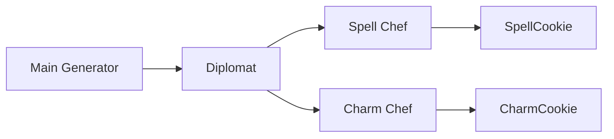
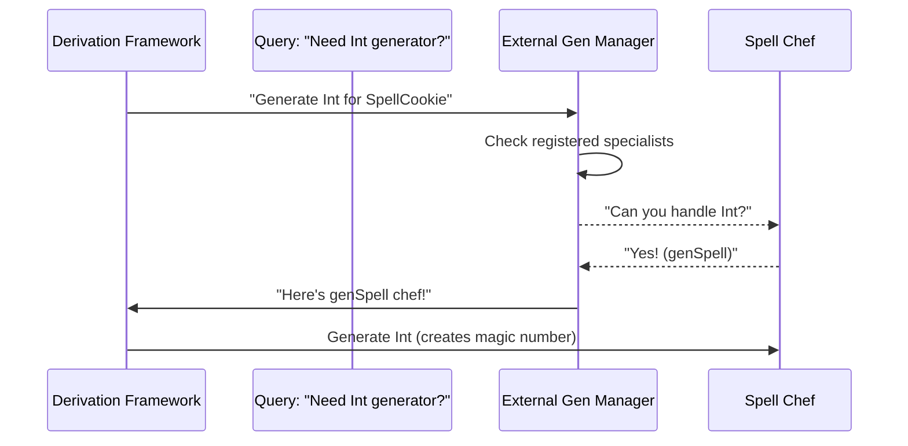

# Chapter 6: External Generator Management

Welcome back! In our last adventure, we learned about **[Argument Permutation](05_argument_permutation_.md)**, where DepTyCheck acts like a kitchen organizer rearranging ingredients to perfectly match recipes. Now imagine you're hosting an international cooking show 👨‍🍳🌎 with guest chefs preparing special dishes. How do you coordinate everyone's unique recipes? Meet **External Generator Management** - DepTyCheck's generator diplomat! 🤝

## Why We Need External Coordinators

Imagine you have specialized requirements:
```idris
data MagicCookie = SpellCookie Int | CharmCookie String
```

You already have custom generators:
```idris
-- By a guest spell chef
genSpell : Fuel -> Gen MaybeEmpty Int

-- By a charm specialist
genCharm : Fuel -> Gen MaybeEmpty String
```

How does DepTyCheck automatically coordinate these external chefs? Our diplomat ensures:
1. 🪄 **Specialists' knowledge** integrates with automatic generation
2. 🤝 **Dependencies are resolved** without duplication
3. ⚡ **Everything works seamlessly** together

Without this coordination:
- Magic cookies might not be "spelled" correctly
- Duplicate recipe work slows things down
- Generated cookies lack specialized charm!

## Meet Your Diplomat Chef

Think of External Generator Management as the show's head coordinator:
1. Invites guest chefs (external generators)
2. Understands their specialties (custom recipes)
3. Coordinates timing (dependency ordering)
4. Integrates everything into the menu (complete generation)



## Basic Integration: Registering Chefs

Here's how you tell DepTyCheck about your specialists:

```idris
magicCookieGen : Fuel -> Gen MaybeEmpty MagicCookie
magicCookieGen = deriveGen
  `{ externalGens := 
      [ (Fuel -> Gen MaybeEmpty Int, `genSpell)
      , (Fuel -> Gen MaybeEmpty String, `genCharm)
      ] }
```

Our diplomat will:
- Recognize needs for `Int` and `String`
- Map them to `genSpell` and `genCharm`
- Insert these into generation workflow

## Automatic Menu Integration

When generating a `SpellCookie`:
```idris
genSpellCookie : Fuel -> Gen MaybeEmpty MagicCookie
genSpellCookie fuel = SpellCookie <$> genSpell fuel
```

Our diplomat coordinator:
- Detects `genSpell` matches required type
- Substitutes it automatically
- Guarantees correct flavor profile!

## Lookup Process Behind Scenes 

When DepTyCheck needs a type:


## Inside the Diplomat's Briefcase

Let's peek at the coordination logic (simplified):

```idris
findExternalGen : GenSignature -> Map GenSignature Name -> Maybe Name
findExternalGen requiredSig registeredGens = 
  lookup requiredSig registeredGens
```

When checking for our `Int` generator:
```idris
required = (Fuel -> Gen MaybeEmpty Int)
registered = Map.fromList [((Fuel -> Gen MaybeEmpty Int), `genSpell)]

genName = findExternalGen required registered
-- Returns Just `genSpell`
```

## Full Coordination Workflow

Here's how DepTyCheck orchestrates everything:

```idris
callGen : 
  (required : GenSignature) -> 
  (fuel : Fuel) -> 
  (values : List TTImp) -> 
  EitherT String Elab TTImp
callGen required fuel values = 
  -- First check external chefs
  case lookupExternal required of
    Just chefName => callExternalGen chefName fuel values
    Nothing => -- Generate internally
```

Critical steps:
1. Check external registry
2. Call external if found
3. Fallback to internal generation

## Real Kitchen Example

Watch how our diplomat coordinates making a MagicCookie:

```idris
-- Coordinated generation:
genMagicCookie = deriveGen 
  `{ externalGens = [(genType Int, `genSpell)] }

-- Production:
> genMagicCookie (More Dry)
SpellCookie 42   -- From genSpell!
```

## What's Next?

Congratulations! You've learned how External Generator Management acts as DepTyCheck's diplomatic coordinator 🤝, seamlessly integrating custom generators like special guest chefs into the automatic generation kitchen. Now that we can coordinate specialized helpers, our next stop is **[Generator Core (Gen)](07_generator_core__gen__.md)** 🔥 - where we'll explore the heart of DepTyCheck's data generation engine!

Keep coordinating your generators like a culinary ambassador! 🍪👨‍🍳

---

Generated by [AI Codebase Knowledge Builder](https://github.com/The-Pocket/Tutorial-Codebase-Knowledge)