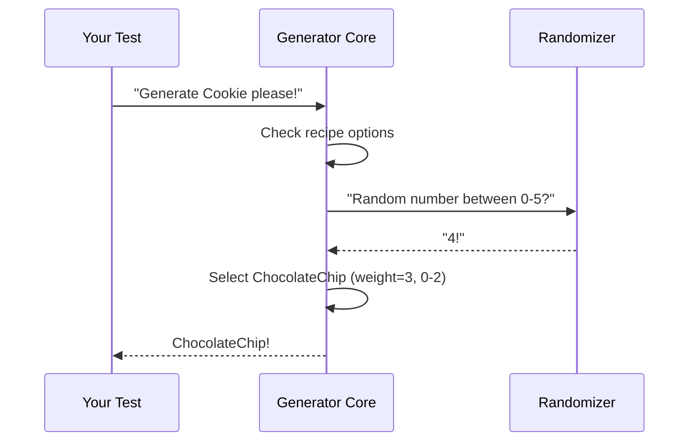

# Chapter 7: Generator Core (Gen)

Welcome back! In our last chapter on [External Generator Management](06_external_generator_management_.md), we learned how DepTyCheck coordinates custom generators like a head chef delegating specialty dishes. Now imagine you're in a magical kitchen where recipe books randomly create new dishes - that's essentially the **Generator Core (Gen)**! 🪄📚

## Meet Your Magical Cookbook

The `Gen` type is DepTyCheck's magical recipe book that:
1. Creates random test values on demand ("dishes")
2. Handles complex recipes through a special "monadic" structure
3. Intelligently chooses between different variations
4. Avoids creating impossible ("empty") recipes

In code terms, `Gen` looks like this simplified definition:
```idris
data Gen : Emptiness -> Type -> Type where
  Empty  : Gen MaybeEmpty a   -- "No recipe available"
  Pure   : a -> Gen em a       -- "Pre-made dish"
  Raw    : RawGen a -> Gen em a -- "Simple random recipe"
  OneOf  : GenAlternatives True em a -> Gen em a -- "Choose between options"
```

Think of `Gen` as your probabilistic baking assistant. Give it a flour type, and it generates cookies, cakes, or bread - each with different probabilities!

## Basic Baking: Your First Generator

Let's create a generator for cookies using three ingredients:
```idris
-- Our data type
data Cookie = ChocolateChip | SugarCookie | OatmealRaisin

-- Generator using `Gen`
genCookie : Gen NonEmpty Cookie
genCookie = OneOf 
  [ (3, delay $ pure ChocolateChip)
  , (2, delay $ pure SugarCookie)
  , (1, delay $ pure OatmealRaisin)
]
```

This recipe book decides:
- 🍪 Chocolate Chip appears most often (60% chance)
- 🍬 Sugar Cookie appears sometimes (40%)
- 🥕 Oatmeal Raisin appears rarely (20%)

Try generating values:
```idris
> pick1 genCookie
ChocolateChip
> pick1 genCookie
SugarCookie
> pick1 genCookie
ChocolateChip
```

## Secret Spices: Key Features

### 1. Probability Mixer
The `OneOf` constructor blends generators with adjustable weights:
```idris
oneOf [ genA, genB ]             -- Equal probability
frequency [ (3, genA), (1, genB) ]  -- genA 3x more likely
```

### 2. Empty Recipe Prevention
The `Emptiness` flag tracks whether generation can fail:
```idris
Gen NonEmpty Cookie   -- Always produces cookies
Gen MaybeEmpty Cookie -- Might fail occasionally
```

### 3. Dependency Mixing
Bind lets subsequent steps depend on previous results:
```idris
genSandwich = do
  bread    <- genBread       -- Random bread
  filling  <- genFilling bread -- Filling depends on bread!
  pure (bread, filling)
```

## Kitchen Magic: How Generation Works

When you ask for a value, `Gen` performs this dance:


The actual generation happens via:

```idris
unGen1 : Gen1 a -> IO a
unGen1 (Pure x)     = pure x
unGen1 (OneOf opts) = pickWeighted opts   -- Random selection
unGen1 (Bind gen f) = gen >>= unGen1 . f -- Combine steps
```

Where:
1. `pickWeighted` converts weights to probabilities
2. `Bind` sequences generation steps
3. `Pure` returns simple values directly

## Combining Ingredients: The Monadic Chef

`Gen` works as a monad - meaning you can combine generators like cooking steps:
```idris
genGourmetCookie : Gen1 Cookie
genGourmetCookie = do
  base     <- genCookie
  frosting <- if base == SugarCookie 
              then genFrosting 
              else pure None
  pure $ Frosted base frosting
```

This recipe:
1. Bakes a random cookie
2. Adds frosting ONLY to sugar cookies
3. Returns the final creation

## Smart Substitutions: The Relax Trick

DepTyCheck can make stricter generators more flexible:
```idris
strictGen : Gen NonEmpty Cookie -- Always succeeds
flexibleGen : Gen MaybeEmpty Cookie  -- Might fail

-- Convert strict to flexible (safe!)
relax strictGen -> Gen MaybeEmpty Cookie 

-- But not vice-versa (might fail!)
relax flexibleGen -- Still MaybeEmpty!
```

The `relax` operation acts like adapting a recipe for restricted diets - you might need to omit certain ingredients!

## Label Your Recipes

Track which generator produced what with labels:
```idris
genLabCookie = label "chocolate" $ pure ChocolateChip

-- During test failures you'll see:
Failed at: chocolate
Value: ChocolateChip
```

## What's Next?

Congratulations! You've learned how `Gen` acts as DepTyCheck's magical recipe book 📖✨ - combining probabilistic generation, dependency handling, and emptiness tracking to cook up perfect test values. Next we'll explore **[Coverage Tracking](08_coverage_tracking_.md)** - where DepTyCheck ensures your test kitchen leaves no recipe untasted! 🧑‍🍳🔍

Keep experimenting - your test generation journey just got delicious! 🍽️

---

Generated by [AI Codebase Knowledge Builder](https://github.com/The-Pocket/Tutorial-Codebase-Knowledge)