# Chapter 8: Coverage Tracking

Welcome back! After exploring how DepTyCheck's core generator works in [Chapter 7: Generator Core (Gen)](07_generator_core__gen__.md), let's discuss a crucial question: "How do we ensure we're testing *all possible scenarios*?" Meet **Coverage Tracking** 🗺️ - DepTyCheck's automated cartographer that maps explored territories in your type universe!

## Why Map Your Coverage?

Imagine you're testing a dessert generator:
```idris
data Dessert = Cake | Cookie | Pie
```

Ran 100 tests and got:
- 55 Cakes 🍰
- 45 Cookies 🍪
- 0 Pies 🥧

**Unmapped territory!** Coverage Tracking helps you:
- Find untested areas (like our missing Pie)
- Report which constructors have been generated
- Show distribution counts for each type
- Build confidence in your test suite

Without it, you're sailing blind - you might be missing critical cases!

## Meet Your Coverage Cartographer

Coverage Tracking is like an automated mapmaker for your types:
```
Explored Land of Dessert
✅ Cake County (55 visits)
✅ Cookie Town (45 visits)
❌ Pie Island (0 visits)

Totals: 91% covered
```

It creates this by:
1. Tagging each generated constructor
2. Counting each type occurrence
3. Building a real-time coverage map
4. Highlighting uncovered areas

## Basic Example: Enable Tracking

Just wrap your generator in `withCoverage`:
```idris
-- Your generator
basicGen : Fuel -> Gen MaybeEmpty Dessert

-- Track its coverage!
trackedGen = withCoverage basicGen
```

Now when you generate:
```idris
> generated <- pick1 trackedGen
Cake

-- Coverage report shows:
Dessert
 Cake: ✅ generated
 Cookie: ❌ not generated
 Pie: ❌ not generated
```

## How Labeling Works

Internally, DepTyCheck adds metadata labels to generation:


The actual labeling happens through the `CanManageLabels` interface:
```idris
-- In Labels.idr
manageLabel : Label -> m ()
```

For our `Dessert` type:
```idris
manageLabel "Dessert.Cake"    -- Added when Cake is generated
manageLabel "Dessert.Cookie"  -- When Cookie appears
manageLabel "Dessert.Pie"     -- When Pie is generated
```

## Tracking Deeper Structures

What about nested types?
```idris
data Filling = Fruit | Cream
data Dessert = Cake Filling | Cookie
```

Coverage tracking handles this too:
```
Dessert
 Cake: ✅ generated
  ├─ Filling.Fruit: ✅
  └─ Filling.Cream: ❌
 Cookie: ✅ generated
```

The cartographer automatically maps layers!

## Generating Reports

After running many tests, collect stats:
```idris
coverInfo <- runSuite trackedGen 1000
```

Output might look like:
```
-- Type Coverage Report --
✅ Dessert [mentioned 1000 times]
  Cake: covered (500 times)
    ✅ Filling.Fruit (200 times)
    ✅ Filling.Cream (300 times)
  Cookie: covered (500 times)
❌ Pie: not covered (user-defined)

Summary:
26% of Types Fully Covered
2 Constructors Not Tested
```

## How It Works Step-By-Step

When generating `Cookie`:
1. Generator produces `Cookie`
2. Label system adds "Dessert.Cookie"
3. Value is wrapped with coverage tag
4. Stats collector records the event
5. Coverage map updates counts:

```mermaid
sequenceDiagram
    participant Gen as Generator
    participant LabelSys
    participant Map as Coverage Map
    participant Reporter
    
    Gen->>LabelSys: Generated Cookie
    LabelSys->>LabelSys: Create Label "Dessert.Cookie"
    LabelSys->>Map: Report "Dessert.Cookie"⌗
    Map->>Map: Update count: Cookie++
    LabelSys-->>Gen: Return labeled Cookie
    Gen-->>Reporter: Final Value (Cookie)
    Reporter->>Reporter: Display updated report
```



## Inside the Map Room

The `ModelCoverage` type records all finds:
```idris
-- In Coverage.idr
record ModelCoverage where
  coverage : SortedMap Label Nat

MkModelCoverage $ fromList 
  [ ("Dessert.Cake", 55)
  , ("Dessert.Cookie", 45)
  ]
```

These counts update during generation:
```idris
-- When a label appears:
updateCoverage : Label -> ModelCoverage -> ModelCoverage
updateCoverage label coverage = 
  { coverage $= addCount label }
```

Where `addCount` increments a label's number.

## Viewing Your Exploration Map

The real magic is in reporting:
```idris
-- Generate colored reports!
showCoverage : CoverageGenInfo -> String
showCoverage cgi = ...
```

This produces explorer-style reports:
```
DESSERT
✅ Cake County (55 visits)
    🟢 Fruit Grove (20 visits)
    🟢 Cream Fields (35 visits)
✅ Cookie Town (45 visits)
❌ Pie Island (0 visits) UNEXPLORED!
```

## Advanced Mapping

Track generic function coverage:
```idris
data Result : Type -> Type where
  Success : a -> Result a
  Failure : String -> Result a

genResult : Gen em (Result Int)
```

Coverage report shows:
```
Result.* [mentioned 50 times]
  Success: covered (30 times)
  Failure: covered (20 times)
```

## What's Next?

Congratulations! 🎉 You've mastered Coverage Tracking - DepTyCheck's automated cartographer that maps explored territories in your type space. Now you'll always know which test territory remains unexplored! Next in **[Chapter 9: Primitive Type Handling](09_primitive_type_handling_.md)**, we'll see how DepTyCheck handles basic types like numbers and strings that are the building blocks of your data structures. 

Keep exploring - no unmapped land left behind! 🧭🗺️

---

Generated by [AI Codebase Knowledge Builder](https://github.com/The-Pocket/Tutorial-Codebase-Knowledge)