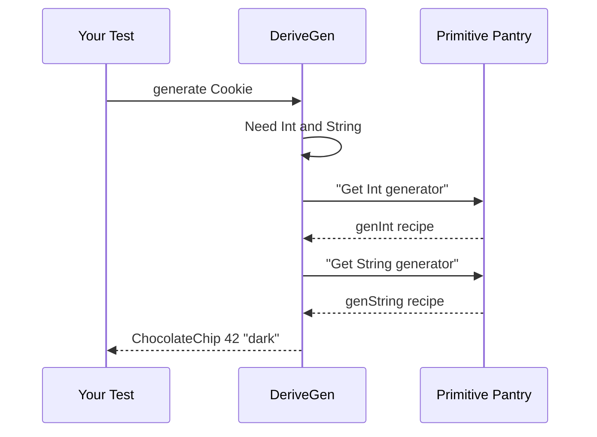

# Chapter 9: Primitive Type Handling

Welcome back! After our adventure with [Coverage Tracking](08_coverage_tracking_.md) where we mapped our test coverage territory, we arrive at the foundation of every data structure: **primitive types**. Think of these as the basic building blocks - like flour, eggs, and sugar in baking 🧁. In this chapter, we'll explore how DepTyCheck handles primitive types like `Int`, `String`, and `Char`.

## Why Handle Primitives Differently?

Imagine you're baking cookies (creating test data): 
```idris
data Cookie = ChocolateChip Int String  -- Quantity and flavor
```

To generate a `Cookie`, we need:
- A random `Int` (how many chips, e.g., 5, 10, 20)
- A random `String` (flavor, e.g., "dark chocolate", "milk")

Primitives are special because:
1. They're built into Idris (not user-defined)
2. They need efficient generation methods
3. They act as the foundation for complex types
4. They have special representations in the compiler

Without proper primitive handling, we couldn't even generate something as simple as a cookie!

## Meet Your Primitive Pantry 🍞

DepTyCheck has a dedicated "pantry" of primitive generators:

| Primitive Type | Example Values | Special Notes |
|----------------|----------------|---------------|
| `Int`          | 0, 42, -7      | Whole numbers |
| `String`       | "hello", ""    | Text |
| `Double`       | 3.14, -0.5     | Decimal numbers |
| `Char`         | 'a', 'Z', '7'  | Single characters |
| `Bool`         | True, False    | Yes/No values |

These are the fundamental ingredients DepTyCheck uses to build more complex data structures.

## How DepTyCheck Cooks Primitives

### Basic Generation Example
When you use `deriveGen`:
```idris
data Cookie = ChocolateChip Int String

genCookie : Fuel -> Gen MaybeEmpty Cookie
genCookie = deriveGen
```

DepTyCheck automatically:
1. Detects `Int` and `String` are primitives
2. Selects appropriate generators
3. Feeds them into `ChocolateChip` constructor



### The Primitive Registry

DepTyCheck maintains special identification for primitive types. Here's how it recognizes them internally:

```idris
typeInfoForPrimType : PrimType -> TypeInfo
typeInfoForPrimType IntType = primTypeInfo "Int"
typeInfoForPrimType StringType = primTypeInfo "String"
-- ... and others ...
```

Here's what `primTypeInfo` does:
```idris
primTypeInfo "Int" = MkTypeInfo 
  (NS (MkNS ["^prim^"]) (UN $ Basic "Int")) 
  [] [] -- Special namespace identifies primitives
```

This creates a unique signature that shouts: "I'm a primitive!"

## Inside the Primitive Generator

When DepTyCheck encounters a primitive type, it uses special generating expressions:

```idris
extractTargetTyExpr : TypeInfo -> TTImp
extractTargetTyExpr ti = case ti.name of
  NS (MkNS ["^prim^"]) (UN (Basic "Int")) => 
    primVal $ PrT IntType  -- Signals Int generation
  NS (MkNS ["^prim^"]) (UN (Basic "Double")) =>
    primVal $ PrT DoubleType
  -- Other primitive cases...
```

For `Int`, this would generate:
```idris
primVal PrT IntType
```

Which tells the generator to use Idris's built-in random number production for integers.

## Real-World Example

Let's see primitive handling in action with a contact list:

```idris
data Contact = Person String Int  -- Name and age

-- Automatic primitive generation!
genContact : Fuel -> Gen MaybeEmpty Contact
genContact = deriveGen
```

Generated values might look like:
1. Person "Alice" 30
2. Person "" (-5)  -- Empty name and negative age
3. Person "Bob" 0

Even though `String` and `Int` aren't defined in your code, DepTyCheck knows how to handle them.

## Special Case: World Type

DepTyCheck even handles the special `%World` type (used in Idris for IO operations):

```idris
typeInfoForPrimType WorldType = primTypeInfo "%World"
```

This ensures world-dependent operations can be properly simulated during testing.

## Customizing Primitive Generation

While primitive generators come built-in, you can customize their behavior through [External Generators](06_external_generator_management_.md):

```idris
genTimeLimitedInt : Fuel -> Gen MaybeEmpty Int
genTimeLimitedInt _ = choose (0, 100)  -- Only 0-100

deriveGen `{ externalGens = [(genType Int, `genTimeLimitedInt)] }`
```

Now all `Int` generators will use your custom range!

## Why This Matters

Primitive Type Handling is the "core ingredient supplier":
- Provides generators for fundamental types
- Enables composition of complex generators
- Handles special compiler representations
- Forms the base of all generated test data

Without this foundation, we couldn't generate meaningful test cases for even simple types.

## What's Next?

Congratulations! You've learned how DepTyCheck handles primitive types - the fundamental building blocks of test data generation 🧱. Like flour in baking or pixels on a screen, these primitives make all higher-level structures possible. 

Now that we understand data generation from primitive to complex types, our final chapter will explore **[Build System Integration](10_build_system_integration_.md)**, where you'll learn to effortlessly incorporate DepTyCheck into your Idris projects! 🚀

Keep experimenting - your testing recipes are now complete from ingredients to finished dish! 🍽️

---

Generated by [AI Codebase Knowledge Builder](https://github.com/The-Pocket/Tutorial-Codebase-Knowledge)