# Chapter 10: Build System Integration

After mastering DepTyCheck's core features like generator derivation and coverage tracking in [Chapter 9: Primitive Type Handling](09_primitive_type_handling_.md), we face one final challenge: How do we set everything up and automate the magic? Meet **Build System Integration** - DepTyCheck's construction crew 🏗️⛑️ that handles the tools and infrastructure for your testing project!

## Why We Need Construction Crews

Imagine you've designed the blueprint for the perfect house (your test suite):

- Beautiful generators (✅)
- Coverage tracking (✅)
- Error handling (✅)

But without an actual construction team to build it:
- No foundation is poured 🚧
- Materials stay in storage 📦
- Testing never actually runs 🚫

Build System Integration solves this by:
1. Creating project configuration files
2. Setting up build pipelines ⚙️
3. Automating testing workflows 🤖
4. Preparing distributions for deployment 🚀

## Meet Your Construction Crew

Think of DepTyCheck's build system as specialized construction roles:

| Role          | Function                  |
|---------------|---------------------------|
| **Foreman**   | `.ipkg` config file       |  
| **Carpenter** | Build scripts             |
| **Surveyor**  | Documentation generation  |
| **Plumber**   | CI/CD pipelines           |

Together they transform your code sketches into a running test suite!

## Toolbox Tour: Key Files

Let's inspect your project's essential files:

1. **deptycheck.ipkg** - Project blueprint:
```idris
package deptycheck        -- Project name

sourcedir = "src"         -- Code location
builddir = ".build"       -- Assembly area
test = "tests/tests.ipkg" -- Testing setup

depends =                 -- Required libraries:
  contrib
  ansi
  best-alternative
```

2. **pack.toml** - Materials list:
```toml
[custom.all.deptycheck]
type = "local"  # Our local project
path = "."       # Current directory

[custom.all.docs]     # Documentation helper
type = "local"  
path = "docs"
```

3. **.readthedocs.yaml** - User manual plans:
```yaml
sphinx: 
  configuration: docs/source/conf.py  # Docs config
  builder: dirhtml
```

## Construction Process: Building + Testing

Three simple steps to build your testing suite:

1. Prepare materials (install dependencies):
```bash
> pack install
```

2. Build project components:
```bash
> pack build deptycheck
```

3. Run quality checks (execute tests):
```bash
> pack test deptycheck
```

Wow! Your construction crew handled:
- 🧱 Library installations
- 🔨 Code compilation
- 🧪 Test execution
- ✅ Reporting results

## Automation Station: CI/CD Pipelines

Automate your construction with these workflows:

1. **Nightly Builds** - Where your secret construction happens regularly
2. **CI Testing** - Quality assurance inspections:

```mermaid
sequenceDiagram
    participant You as Developer
    participant GitHub as GitHub Actions
    participant Builder as Build Server
    
    You->>GitHub: Push code changes
    GitHub->>Builder: Start build job!
    Builder->>Builder: pack install && pack build
    Builder->>Builder: pack test deptycheck
    Builder->>GitHub: 📊 Test results
    GitHub->>You: ✅ Success / ❌ Failure
```



## Documentation Housekeeping

Your surveyor ensures everything is well-documented by generating manuals:
```bash
> cd docs
> make html
```

This builds beautiful HTML documentation 📚 automatically!

## Inside the Construction Yard

Let's peek at key elements of our `.ipkg` file:

```idris
modules =                   -- Important modules:
  Deriving.DepTyCheck.Gen      # Generation core
  Test.DepTyCheck.Gen          # Testing interface
  Deriving.DepTyCheck.Util.*   # Tools
```

This tells the build system exactly what to compile and how to link pieces together.

## DIY Construction: Customizing Your Build

Modify your test settings in `tests/tests.ipkg`:
```idris
test = "all_tests"          -- Main test module
sourcedir = "tests"         -- Tests location
depends = deptycheck        -- Use our project!
```

Add custom build scripts in `build.sh`:
```bash
#!/bin/bash

# Build and test with one click!
idris2 --build deptycheck.ipkg && \
idris2 --testpkg tests/tests.ipkg
```

## Real Construction Site

Observe a typical build workflow:


## Daily Construction Routine

Combine everything in simple commands:
```
# Full restart
> pack clean && pack build && pack test

# Documentation update
> cd docs && make clean && make html

# CI simulation
> pack test --report=summary
```

## Construction Completed!

Congratulations! 🎉 You've successfully navigated DepTyCheck's **Build System Integration**. You're now equipped to:

1. Configure projects with `.ipkg` files
2. Automate builds with scripts
3. Run tests via CI pipelines
4. Generate documentation

Your journey through DepTyCheck is complete! From deriving generators in [Chapter 1](01_derivation_framework_.md) to automating builds now, you've mastered the full spectrum of automated test generation.

Go forth and build incredible, well-tested Idris applications with confidence! Remember - good tests are the foundation of great software🏗️

---

Generated by [AI Codebase Knowledge Builder](https://github.com/The-Pocket/Tutorial-Codebase-Knowledge)