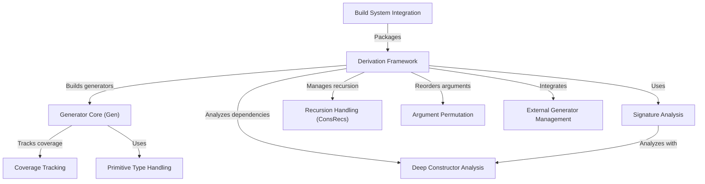

# Tutorial: DepTyCheck

DepTyCheck is an Idris 2 framework for **property-based testing** with dependent types. 
Its core automatically *derives test data generators* for custom data types using **meta-programming**. 
Key features include: tracking recursion depth via *fuel patterns*, reporting **test coverage** for types/values, 
handling primitive types, and reordering dependent arguments. The system supports external generators 
and integrates with Idris' build system.

**Source Repository:** [None](None)

## Chapters

1. [Derivation Framework
](01_derivation_framework_.md)
2. [Signature Analysis
](02_signature_analysis_.md)
3. [Deep Constructor Analysis
](03_deep_constructor_analysis_.md)
4. [Recursion Handling (ConsRecs)
](04_recursion_handling__consrecs__.md)
5. [Argument Permutation
](05_argument_permutation_.md)
6. [External Generator Management
](06_external_generator_management_.md)
7. [Generator Core (Gen)
](07_generator_core__gen__.md)
8. [Coverage Tracking
](08_coverage_tracking_.md)
9. [Primitive Type Handling
](09_primitive_type_handling_.md)
10. [Build System Integration
](10_build_system_integration_.md)

---

Generated by [AI Codebase Knowledge Builder](https://github.com/The-Pocket/Tutorial-Codebase-Knowledge)