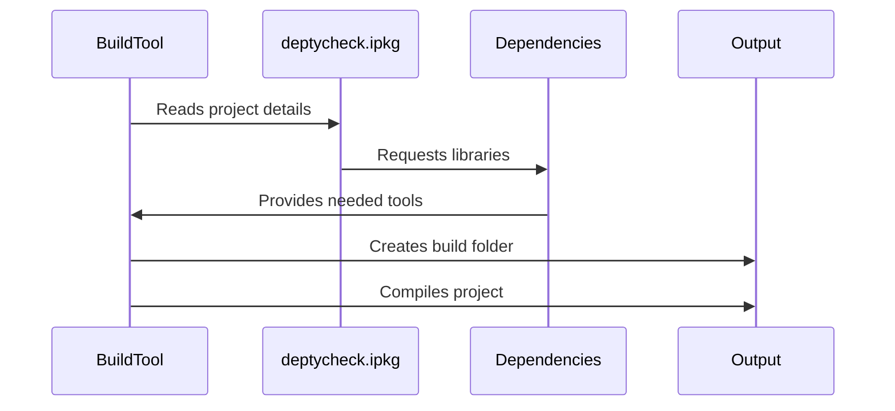

# Chapter 1: Project Configuration

Welcome to the world of DepTyCheck! 🎉 Think of writing software like building a house. Before any construction starts, architects create blueprints that specify materials, measurements, and dependencies between different parts. In programming, **Project Configuration** is your software blueprint - it tells your tools how to build your project, what external libraries to use, and how everything connects together.  

## Why Do We Need Configuration?

Imagine you moved into a new coding workshop (your project folder). Before you build anything, you need to tell your tools:

1. **What you're building** (your project details and files)
2. **What tools you need** (dependencies like saws and hammers)
3. **How to organize things** (directory structures and style rules)

Without this blueprint, your tools wouldn't know where to look for materials or how to assemble them!

Let's explore the main configuration files DepTyCheck uses:

### 1. The Project Blueprint: `deptycheck.ipkg`

This is your main project description file. Here's a simplified version:

```idris
package deptycheck

authors = "Denis Buzdalov"
brief = "Property-based testing with dependent types"

sourcedir = "src"
builddir = ".build"

depends = ansi
        , best-alternative
        , dependent-vect
        , positive-nat
        , random-pure
```

Let's break this down:
- `package deptycheck`: The name of your project
- `authors`/`brief`: Basic project info
- `sourcedir`/`builddir`: Folder locations (source files vs build outputs)
- `depends`: All libraries your project needs to run (like tools in your workshop)

### 2. The Style Guide: `.editorconfig`

This ensures consistent formatting across your project - like workshop rules saying "all measurements in inches" or "no coffee cups near keyboards":

```editorconfig
[*]
end_of_line = lf
charset = utf-8
indent_style = space
indent_size = 2
```

Key rules:
- `indent_style = space`: Use spaces for indentation
- `indent_size = 2`: Two spaces per indent level
- Applies to all files (`[*]`) by default

### 3. The Supply Manager: `pack.toml`

When your project needs external libraries, this file tells package managers like `pack` where to find them:

```toml
[custom.all.deptycheck]
type = "local"
path = "."
ipkg = "deptycheck.ipkg"

[custom.all.docs]
type = "local"
path = "docs"
ipkg = "docs.ipkg"
```

What this means:
- Each `[custom...]` section is a package
- `type = "local"`: Use code from our computer
- `path`: Location of the package
- `ipkg`: Which file defines the package (our blueprint!)

### 4. The Documentation Manual: `.readthedocs.yaml`

This configures automated documentation generators - your homeowner's manual factory:

```yaml
build:
  os: ubuntu-22.04
  tools:
    python: "3.10"

sphinx:
  configuration: docs/source/conf.py
```

This says:
- Build on Ubuntu Linux
- Use Python 3.10
- Use Sphinx documentation tools with settings from `conf.py`

## How It All Fits Together

When you run build tools, here's what happens behind the scenes:



1. Your build tool starts 
2. Checks `.ipkg` for instructions
3. Consults `pack.toml` for tools/supplies
4. Uses `.editorconfig` rules during building
5. Generates outputs in the `builddir`

## Real-World Example

Let's say your workshop (`src`) contains these files:
```
src/
  Builder.idr
  Inspector.idr
  SafetyTester.idr
```

When you run `idris --build deptycheck.ipkg`:
1. Tools gather `ansi`, `dependent-vect` etc. from `pack.toml`
2. Format all files with 2-space indents (per `.editorconfig`)
3. Compile everything from `src/`
4. Place results in `.build/`

## Your Project's Foundation 🏗️

Congratulations! You now understand how DepTyCheck's project configuration works. Remember:
- **deptycheck.ipkg** is your main blueprint
- **.editorconfig** is your style guide
- **pack.toml** manages dependencies
- **.readthedocs.yaml** builds documentation

These files might change names in other projects, but their roles remain similar across programming languages.

Ready to see what we build with this foundation? Let's move to Chapter 2 where we'll explore [Automatic Derivation](02_automatic_derivation_.md) - the magic that automatically generates tools based on your specifications! 👷‍♀️➡️🔧

---

Generated by [AI Codebase Knowledge Builder](https://github.com/The-Pocket/Tutorial-Codebase-Knowledge)