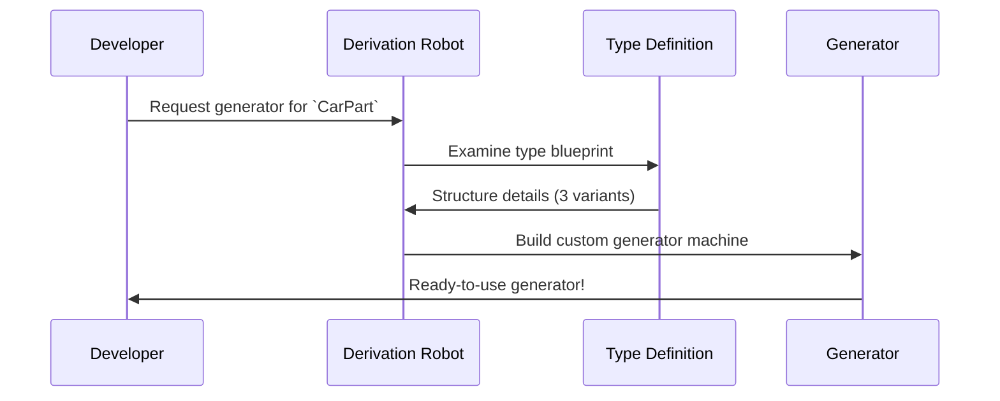

# Chapter 2: Automatic Derivation

Welcome back! In [Chapter 1](01_project_configuration_.md), we learned how project configuration acts like a blueprint for our software workshop. Now let's explore how DepTyCheck automatically builds specialized tools just by looking at your type definitions! 🛠️

## Why Automatic Derivation?

Imagine you're building toy cars 🚗. Each car has different parts (wheels, body, color) defined by types:

```idris
data CarPart = Wheel | Body | Paint
```

Manually creating test data generators for every variation would be tedious:

```idris
-- Manual approach (not ideal!)
testWheel : Gen Wheel
testBody : Gen Body
-- ...and so on for every combination
```

Automatic derivation is like having a robot factory supervisor 🤖 that:
1. Reads your type blueprints (`CarPart`)
2. Builds custom generators automatically
3. Handles all combinations and variations

No more writing repetitive generator code!

## Your First Automatic Generator

Let's create a generator for `CarPart` with just **2 lines** of code:

```idris
carPartGen : Fuel -> Gen CarPart
carPartGen = deriveGen
```

That's it! DepTyCheck automatically:
1. Detects all possible `CarPart` values
2. Creates a generator that produces them randomly
3. Handles the `Fuel` parameter (which controls generation depth)

Try it in a test:
```idris
testCarPart : IO ()
testCarPart = do
  parts <- sample carPartGen 3  -- Generate 3 samples
  print parts
  -- Example output: [Wheel, Body, Paint]
```

## How It Works (The Robot Factory)

Imagine our derivation system as a factory assembly line:



## Under the Hood: The Derivation Process

When you call `deriveGen`, DepTyCheck performs these steps:

1. **Analyze Type Structure**: Examines your type definition
2. **Map Constructors**: Lists all possible values (Wheel/Body/Paint)
3. **Build Generator**: Creates code to randomly select values

Here's a simplified version of what gets generated:

```idris
-- What YOU write:
carPartGen : Fuel -> Gen CarPart
carPartGen = deriveGen

-- What DepTyCheck CREATES:
carPartGen fuel = elements [Wheel, Body, Paint]
```

## Handling Complex Types

Automatic derivation works with more complex types too! Let's add variants to our `CarPart`:

```idris
data CarPart = 
  Wheel Int     -- Wheel with size
  | Body String -- Body with model name
  | Paint Color -- Paint with color

data Color = Red | Blue | Green
```

DepTyCheck automatically handles nested types:
```idris
carPartGen : Fuel -> Gen CarPart
carPartGen = deriveGen  -- Still one line!

-- Generated samples might include:
-- Wheel 18, Body "Sedan", Paint Green
```

The derivation robot recursively analyzes all connected types (like `Color`) and builds appropriate generators for each component.

## Key Benefits

1. **Saves time**: No manual generator writing
2. **Reduces errors**: Automatic coverage of all cases
3. **Handles complexity**: Nested types supported
4. **Consistent**: Follows type definitions exactly

## What's Next?

You've seen how automatic derivation acts as your personal generator factory! Next, in [Chapter 3: Generator (Gen)](03_generator__gen__.md), we'll explore how these generated tools actually work and how to customize their output. Get ready to become a generator power user! 💪

---

Generated by [AI Codebase Knowledge Builder](https://github.com/The-Pocket/Tutorial-Codebase-Knowledge)