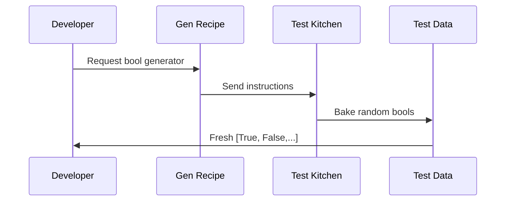

# Chapter 3: Generator (Gen)

Welcome back! In [Chapter 2](02_automatic_derivation_.md), we saw how DepTyCheck automatically creates test data generators from your type definitions. Now let's explore the heart of this system - the Generator (`Gen`) itself! Think of `Gen` as your personal *recipe book* for creating random test data that follows specific rules. 📘🎲

## What is a Generator?

Imagine you're baking cookies 🍪. You need:
1. A recipe (how to make cookies)
2. Ingredients (random variations like chocolate chips or raisins)
3. Dietary restrictions (e.g., no nuts) 

A `Gen` in DepTyCheck works similarly:
```idris
cookieRecipe : Gen NonEmpty Cookie
cookieRecipe = oneOf
  [ plainCookie
  , withChocolateChips
  , withRaisins
  ]
```
- **Recipe** = Code telling how to create data
- **Ingredients** = Random values (chips, raisins)
- **Dietary restrictions** = Ensures valid outputs ("no nuts" = no empty results)

## Your First Generator

Let's create a simple generator that produces random boolean values:

```idris
-- Import the Gen module
import Test.DepTyCheck.Gen

-- Create a boolean generator
boolGen : Gen NonEmpty Bool
boolGen = elements [True, False]

-- Generate samples
testBools : IO ()
testBools = sample boolGen 5
-- Possible output: [True, False, True, True, False]
```

Key components:
- `elements` = Chooses randomly from a list
- `[True, False]` = Possible values
- `NonEmpty` = Guarantees it always produces values

## Inside Gen: The Kitchen Analogy

Imagine this process happening in a magical test kitchen:



## Creating Custom Generators

Let's make a generator for traffic light colors 🚦:

```idris
data TrafficLight = Red | Yellow | Green

lightGen : Gen NonEmpty TrafficLight
lightGen = elements [Red, Yellow, Green]
```

Now let's make it fancier with weighted probabilities (30% Red, 10% Yellow, 60% Green):

```idris
weightedLightGen : Gen NonEmpty TrafficLight
weightedLightGen = frequency
  [ (3, pure Red)
  , (1, pure Yellow)
  , (6, pure Green)
  ]
```

The `frequency` function lets us assign "weights" to control how often values appear.

## Handling Empty Cases

Sometimes generators can't produce values - like a vegan recipe book with no vegan options! DepTyCheck tracks this with:
- `NonEmpty` = Always produces values
- `MaybeEmpty` = Might fail to generate

```idris
-- This generator might be empty
safeDivide : Gen MaybeEmpty (Double, Double)
safeDivide = suchThat chooseAny (\(x,y) => y /= 0)
```

The `suchThat` filter ensures we never get division by zero while changing the emptiness type to `MaybeEmpty`.

## Combining Generators

Generators become powerful when combined, like mixing ingredients to bake new dishes:

```idris
data Dessert = Cake | IceCream | Cookie

dessertGen : Gen NonEmpty Dessert
dessertGen = elements [Cake, IceCream, Cookie]

toppingGen : Gen NonEmpty String
toppingGen = elements ["sprinkles", "chocolate", "fruit"]

-- Combine them!
fancyDessert : Gen NonEmpty (Dessert, String)
fancyDessert = [| dessertGen, toppingGen |]
-- Possible outputs: (Cake, "sprinkles"), (IceCream, "fruit"), etc.
```

## Checking Under the Hood

The real magic happens in how `Gen` handles distribution and emptiness constraints. In `src/Test/DepTyCheck/Gen.idr`, you'll find the core definition:

```idris
data Gen : Emptiness -> Type -> Type where
  Empty : Gen MaybeEmpty a
  Pure  : a -> Gen em a
  Raw   : RawGen a -> Gen em a
  OneOf : (gs : GenAlternatives True alem a) -> ...
```

This simplified view shows how `Gen` is built from basic operations that control randomness and emptiness tracking.

## Real-World Example: User Profiles

Let's generate random user profiles with various properties:

```idris
record User where
  constructor MkUser
  name : String
  age : Nat
  isAdmin : Bool

userGen : Fuel -> Gen NonEmpty User
userGen fuel = [| 
  MkUser 
    (elements ["Alice", "Bob", "Charlie"])
    (choose (18, 99))
    boolGen 
  |]
```

This generator creates complete users with:
1. Random names from a list
2. Random ages between 18-99
3. Random admin status

## Common Generator Operations

| Operation      | Example                         | Purpose                           |
|----------------|----------------------------------|-----------------------------------|
| `elements`     | `elements [A,B,C]`              | Pick from options                 |
| `choose`       | `choose (1,10)`                 | Random number in range            |
| `map`          | `map show (choose (1,10))`      | Transform generated values        |
| `listOf`       | `listOf boolGen`                | Generate lists of values          |
| `suchThat`     | `suchThat chooseNat isEven`     | Filter outputs                   |

## Your Generative Toolkit 🧰

Congratulations! You've now learned:
- What `Gen` is (your recipe book for test data)
- How to create simple generators
- How to combine generators
- How emptiness tracking works
- Real generator examples

Generators are the heart of property-based testing in DepTyCheck. They give you precise control over random data generation while ensuring validity through emptiness tracking.

Ready to dive deeper? In [Chapter 4: Signature Analysis](04_signature_analysis_.md), we'll learn how DepTyCheck analyzes function signatures to automatically test them! ➡️🔍

---

Generated by [AI Codebase Knowledge Builder](https://github.com/The-Pocket/Tutorial-Codebase-Knowledge)