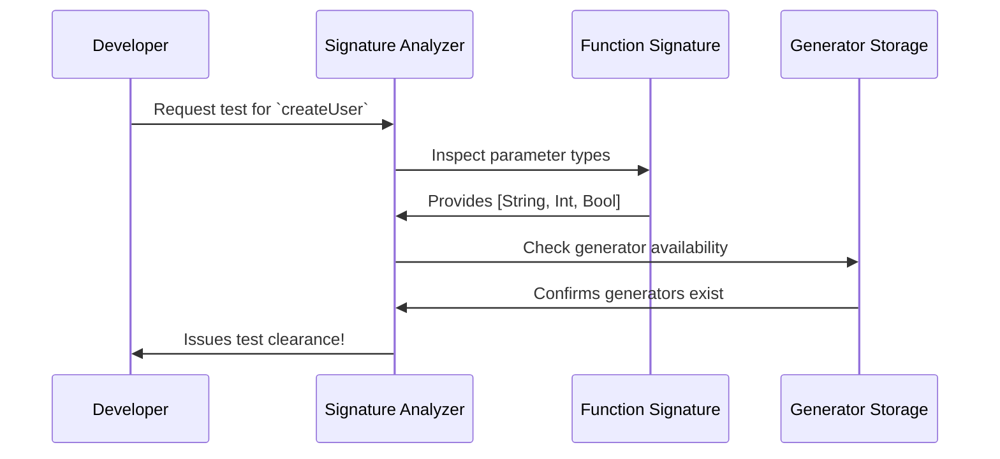

# Chapter 4: Signature Analysis

Welcome back! In [Chapter 3: Generator (Gen)](03_generator__gen__.md), we learned how to create recipes for generating random test data. Now imagine you're ordering supplies from overseas 📦. Before your package arrives, customs officials inspect your order form to determine what can be imported. DepTyCheck's **Signature Analysis** works similarly - it examines function signatures to determine what generators are needed! 🛃

## Why Analyze Signatures?

Imagine you're testing a function that builds toy cars:

```idris
buildCar : Wheel -> Body -> Paint -> Car
```

To test this function, we need generators for:
1. `Wheel` types
2. `Body` styles
3. `Paint` colors

Signature analysis is like a customs inspector who:
1. Reads the function declaration (`buildCar`)
2. Identifies required "imports" (parameter types)
3. Determines what generators are needed

Without this inspection, we wouldn't know what test data to prepare!

## The Customs Inspection Process

Let's see signature analysis in action with a simple example:

```idris
-- Our function to test
createUser : String -> Int -> Bool -> User

-- Signature analysis examines:
-- Parameters: [String, Int, Bool]
-- Return type: User
```

DepTyCheck's signature analyzer will:
1. Recognize we need generators for `String`, `Int`, and `Bool`
2. Verify we have generators for these types (or can create them)
3. Prepare a "customs declaration" listing required generators

## How It Works Step-by-Step

Imagine our signature analyzer as a customs officer processing documents:



## Inside the Analyzer

Let's look at simplified code from DepTyCheck's signature analysis module (`src/Deriving/DepTyCheck/Gen/Signature.idr`):

```idris
-- Simplified signature record
record GenSignature where
  constructor MkGenSignature
  targetType : TypeInfo       -- The function being analyzed
  givenParams : SortedSet Fin -- Positions of known parameters
```

Key components:
- `targetType`: Information about the function
- `givenParams`: Which parameters we already have generators for

## Real-World Example: User Generator

Let's analyze a user profile generator signature:

```idris
userGenerator : Fuel -> Gen User
```

The analyzer would:
1. Identify `Fuel` as a special system parameter
2. Recognize `Gen User` as the target return type
3. Determine we need a generator for `User`

The resulting "customs declaration" might look like:

```idris
MkGenSignature 
  targetType = User          -- What we're generating
  givenParams = [0]          -- Position 0 (Fuel) is provided
```

## Handling Complex Signatures

DepTyCheck can analyze signatures with implicit parameters too! Consider:

```idris
createAdmin : {default False isSuper : Bool} -> User
```

The analyzer:
1. Detects the implicit `isSuper` parameter
2. Recognizes it has a default value
3. Notes we might want to generate `Bool` values for testing

## Why This Matters

Signature analysis enables DepTyCheck to:
1. Automatically detect what generators are needed
2. Handle complex function signatures
3. Ensure all required test data is prepared
4. Simplify test setup for developers

Just like customs inspections keep imports flowing smoothly, signature analysis keeps your tests running smoothly!

## Your Inspection Passport 🛂

Congratulations! You now understand how DepTyCheck's signature analysis works:
- It examines function signatures like customs documents
- Identifies required generators for each parameter
- Handles both explicit and implicit parameters
- Prepares everything needed for testing

Ready to see how DepTyCheck builds generators for complex types? In [Chapter 5: Constructor Handling](05_constructor_handling_.md), we'll explore how DepTyCheck processes type constructors to create sophisticated test data! 🏗️➡️🧱

---

Generated by [AI Codebase Knowledge Builder](https://github.com/The-Pocket/Tutorial-Codebase-Knowledge)