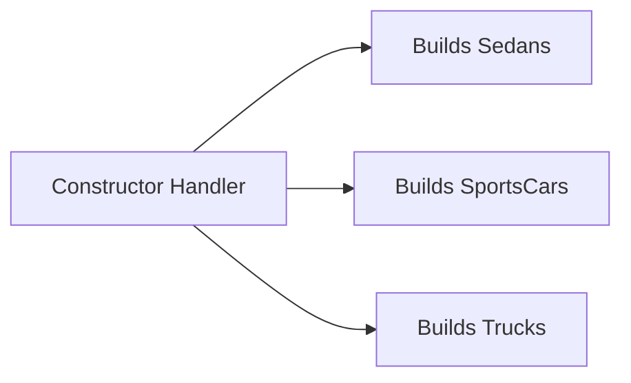
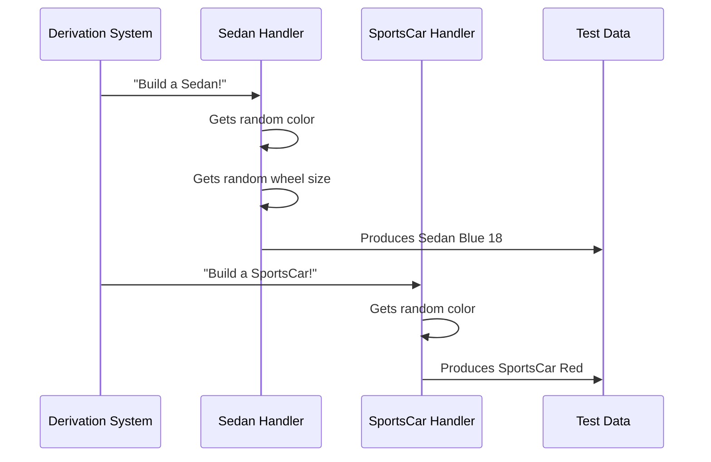

# Chapter 5: Constructor Handling

Welcome back! In [Chapter 4: Signature Analysis](04_signature_analysis_.md), we learned how DepTyCheck analyzes function signatures like a customs inspector to determine what generators are needed. Now imagine you're running a toy factory 🏭 that produces different car models. Each model has unique parts and assembly instructions. DepTyCheck's **Constructor Handling** works like specialized assembly line workers who know exactly how to build each specific car model! 🚗👷

## Why Handle Constructors?

Imagine your toy factory produces three car models:
```idris
data CarModel = 
  Sedan Color WheelSize  -- Family car
  | SportsCar Color      -- Fast two-seater
  | Truck                -- Heavy-duty vehicle
```

To test car-building functions, we need generators that can create:
- `Sedan` with random colors and wheel sizes
- `SportsCar` with random colors
- `Truck` with no extra parts

Constructor handling is like having specialized workers for each model:


Without these specialized handlers, we couldn't efficiently create different car variations!

## Meet Your Assembly Line Workers

Let's see constructor handling in action with our `CarModel` example:

```idris
carModelGen : Fuel -> Gen CarModel
carModelGen fuel = oneOf
  [ sedanHandler
  , sportsCarHandler
  , truckHandler
]
```

Here's what each handler does:
1. **sedanHandler**: Generates `Sedan randomColor randomWheelSize`
2. **sportsCarHandler**: Generates `SportsCar randomColor`
3. **truckHandler**: Always generates `Truck`

DepTyCheck automatically creates these handlers when you use `deriveGen`!

## How Constructor Handlers Work

Imagine our constructor handlers as specialized factory workers:



Each handler knows exactly what components their specific model needs.

## Inside a Constructor Handler

Let's look at a simplified version of how DepTyCheck builds handlers (from `src/Deriving/DepTyCheck/Gen/ForOneTypeCon/Impl.idr`):

```idris
-- Simplified handler creation
createHandler : Con -> GenHandler
createHandler constructor = do
  argGenerators <- for each constructor argument:
    createGeneratorFor argumentType
  return \fuel => 
    combine argGenerators (build constructor)
```

Key steps:
1. **Examine constructor**: Identify its arguments
2. **Create sub-generators**: Build generators for each argument
3. **Combine**: Make a function that builds the final value

## Real-World Example: User Profiles

Let's generate different user types:
```idris
data User = 
  Guest 
  | Member String Nat   -- Name + Age
  | Admin String Bool   -- Name + Superuser status

userGen : Fuel -> Gen User
userGen = deriveGen
```

DepTyCheck automatically creates:
1. **Guest handler**: Produces `Guest` with no arguments
2. **Member handler**: Generates random `String` and `Nat`
3. **Admin handler**: Generates random `String` and `Bool`

## Handling Complex Cases

What if constructors have dependencies? Consider:
```idris
data Vehicle = 
  Car CarModel 
  | Bicycle GearCount

data GearCount = Three | Seven | TwentyOne
```

DepTyCheck's handlers:
1. Recursively create handlers for `CarModel` and `GearCount`
2. Build `Car` using `CarModel` handler
3. Build `Bicycle` using `GearCount` handler

This happens automatically through constructor chaining!

## Your Specialized Workforce

Congratulations! You now understand how DepTyCheck's constructor handling works:
- Each constructor gets its own specialized handler
- Handlers know exactly what components to generate
- Complex dependencies are handled recursively
- Everything works automatically with `deriveGen`

Just like a well-run factory needs specialized workers for different products, DepTyCheck needs constructor handlers to efficiently generate different data variations!

Ready to see how DepTyCheck handles nested constructors? In [Chapter 6: Deep Constructor Analysis](06_deep_constructor_analysis_.md), we'll explore how DepTyCheck processes complex type structures! 🏗️➡️🔍

---

Generated by [AI Codebase Knowledge Builder](https://github.com/The-Pocket/Tutorial-Codebase-Knowledge)