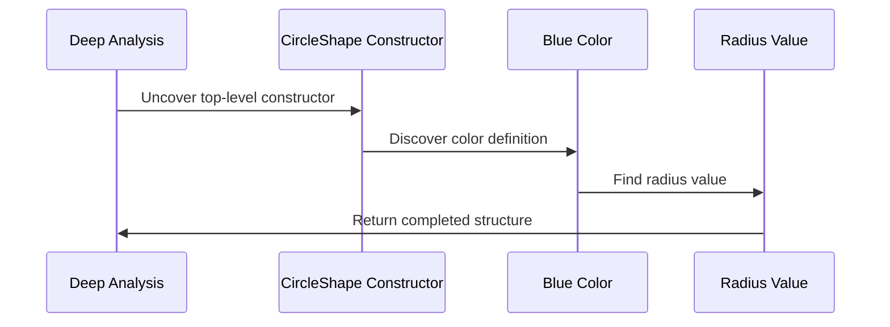

# Chapter 6: Deep Constructor Analysis

Welcome back! In [Chapter 5: Constructor Handling](05_constructor_handling_.md), we learned how DepTyCheck acts like a team of specialized factory workers, building generator handlers for each constructor. Now imagine you're an archaeologist 🧪 excavating ancient ruins. To uncover hidden treasures, you can't just look at the surface - you need to carefully dig through layers of soil and structures! DepTyCheck's **Deep Constructor Analysis** works similarly—it deeply analyzes nested constructors to handle complex dependent types! ⛏️🏺

## Why Dig Deeper?

Imagine building a system that tracks different shapes with rules like:
```idris
data ShapeKind = Circle | Square

data Shape : ShapeKind -> Type where
  CircleShape : Radius -> Shape Circle
  SquareShape : SideLength -> Shape Square
```

To generate a `Circle`, we must:
1. Know we're building for type `Shape Circle`
2. Dig into `CircleShape` to find its structure
3. Generate a `Radius` value

Deep Constructor Analysis is like archaeological excavation:
- Surface level = The top-level constructor (`Shape`)
- Deeper layers = Its nested components (`CircleShape`, `Radius`)

Without carefully excavating these layers, we'd miss important details needed for generating valid GADT instances!

## The Archaeological Dig Process

Let's see how analysis works with a simple example:
```idris
-- Create a BlueCircle with specific radius
blueCircle : Shape Circle
blueCircle = CircleShape blue 5.0
```

DepTyCheck excavates each layer:
1. Top: `CircleShape` (surface constructor)
2. Middle: `blue` (underlying color)
3. Deepest: `5.0` (radius value)

This layered analysis helps generate complete valid values!



## Beginner's Example: Generating Shapes

See how automatic derivation uses deep analysis:
```idris
-- Our type definitions
data ShapeKind = Circle | Square

data Shape : ShapeKind -> Type where
  CircleShape : Double -> Shape Circle
  SquareShape : Double -> Shape Square

-- Generate shapes (magically works!)
shapeGen : (kind: ShapeKind) -> Gen (Shape kind)
shapeGen kind = deriveGen
```

When generating `Circle` shapes:
1. Deep analysis identifies `kind = Circle`
2. Locates corresponding `CircleShape` constructor
3. Generates a `Double` for the radius

All automatically through layered analysis!

## How Excavation Happens Step-By-Step

For a sample call `shapeGen Circle`, DepTyCheck performs:
1. Identify constructor: `CircleShape` (matches `Shape Circle`)
2. Analyze construction: `CircleShape {radius}`
3. Recurse: Generate `Double` for radius
4. Build: Combine into `CircleShape radiusValue`

Here's simplified code from `DeepConsApp.idr` showing this recursion:
```idris
-- Pseudocode - the core recursive analysis
deepAnalyze : Constructor -> Gen
deepAnalyze con = do
  -- Step 2: Create generators for each argument
  argGens <- forEach con.arg $ \arg => 
    deepAnalyze arg.type  -- Recurse deeper!
    
  -- Step 4: Combine into final generator
  pure $ do
    args <- combine argGens
    pure (con.build args)
```

## Solving GADT Mysteries

Deep analysis really shines with dependent types. Imagine this calendar type:
```idris
data Month = Jan | Feb | ... | Dec

data Date : (m: Month) -> Type where
  MkDate : (day: Fin 31) -> {prf: ValidDay m day} -> Date m
```

To generate a `Date Feb`:
1. Analyzes that `m = Feb`
2. Finds `MkDate` is Feb's only constructor
3. Checks valid day range (1-28/29)
4. Generates days with validity proof

The analysis handles nested layers automatically:
- Date ⟶ Month ⟶ Day ⟶ Validity proof

## Real Tomb Discovery: Dependent Car Parts

Let's analyze this complex car part inventory:
```idris
data PartType = Engine | Wheel

data CarPart : PartType -> Type where
  V8Engine : HP -> CarPart Engine
  AlloyWheel : Size -> Material -> CarPart Wheel
```

To generate for `type = Engine`:
1. Analysis looks for matching constructors (only `V8Engine`)
2. Recurses into `HP` generation
3. Builds `V8Engine $generateHP`

This solves GADT dependencies: Only engines can have horsepower!

## Your Archaeological Kit 🧭

Deep Constructor Analysis helps DepTyCheck:
1. Handle nested constructors
2. Resolve GADT indexes
3. Generate valid dependent types
4. Avoid impossible constructions (like all-engine wheels)
5. Maintain type safety through layers

Just like an archaeologist carefully preserves each layer of a dig site, DepTyCheck respects every layer of your type structure.

Ready to take deeper dives? Next chapter, [Recursive Type Handling](07_recursive_type_handling_.md), will show how DepTyCheck handles types that reference themselves! 📦➡️📦

---

Generated by [AI Codebase Knowledge Builder](https://github.com/The-Pocket/Tutorial-Codebase-Knowledge)