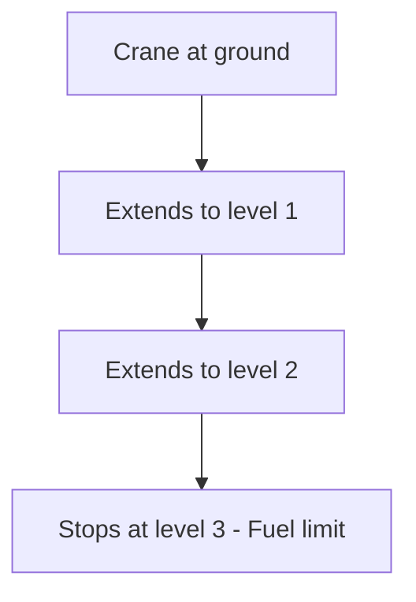
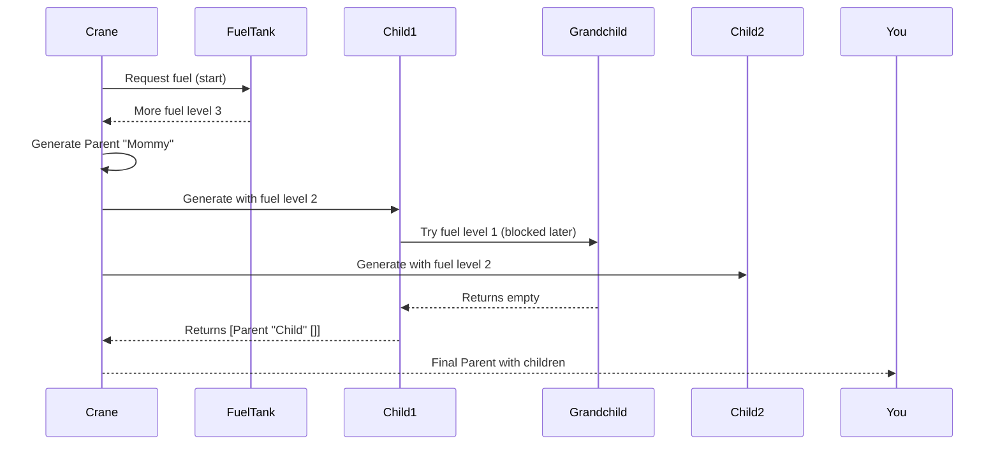

# Chapter 7: Recursive Type Handling

Welcome to Chapter 7! In [Chapter 6: Deep Constructor Analysis](06_deep_constructor_analysis_.md), we explored how DepTyCheck analyzes nested type structures like an archaeologist uncovering layers of ancient ruins. Now imagine building towers with toy blocks 🏗️🧱. If you don't set building limits, you might try making a tower taller than your ceiling! DepTyCheck's **Recursive Type Handling** works similarly—it uses "fuel" to safely control recursions while generating data. Think of it like a construction crane that only extends to permitted heights! 🏗️⛽

## Why Do We Need Recursion Control?

Imagine making a family tree:
```idris
data Person = Parent String (List Person)
```

This type definition is **recursive** because a `Person` contains other `Person`s. Without controls, a generator might try to create:
1. A parent → 
2. With two children → 
3. Each with two children → 
4. and on forever!

We need safety limits, just like construction rules prevent cranes from extending beyond safe heights:



## Fuel: Your Safety Control

**Fuel** is a simple counter that tracks how deep we can generate recursively. It works like this:

```idris
data Fuel = Dry | More Fuel  -- More == Worth one deeper step

personGen : Fuel -> Gen Person
personGen Dry      = stop  -- Fuel empty: stop recursing
personGen (More f) = ...   -- Generate one level using fuel `f`
```

Each recursive step consumes one fuel unit. When we run out, DepTyCheck stops the recursion—just like a crane stops extending when it reaches its maximum permit!

## Beginner's Example: Family Tree Generator

Let's create a simple person generator:

```idris
data Person = Parent String (List Person)

personGen : Fuel -> Gen Person
personGen fuel = case fuel of
  Dry      => elements [Parent "Ancestor" []]  -- Base case
  More f => do 
    name   <- randomName
    numKids <- choose (0, 2)
    kids  <- listOf numKids (personGen f)  -- Use fuel!
    pure $ Parent name kids
```

When we run `personGen (More (More Dry))`:
1. Parent "Mommy" generates →
2. Up to 2 children (possible) →
3. *But* each child can't have grandchildren (fuel exhausted)

Outputs:
```idris
[ Parent "Mommy" []
, Parent "Mommy" 
    [Parent "Child" []]
, Parent "Dad" 
    [Parent "Son" [], Parent "Daughter" []] 
]
```

## How the Crane Extends Safely

Imagine DepTyCheck as a crane operator building your tree:



## Inside the Fuel Mechanism

Let's look at simplified code from `src/Deriving/DepTyCheck/Gen/ConsRecs.idr`:

```idris
leftDepth : Fuel -> Nat1
leftDepth Dry      = 1    -- Base level when out of fuel
leftDepth (More f) = succ (leftDepth f)  -- Recursive step

personGen : Fuel -> Gen Person
personGen fuel = do
  depthLeft = leftDepth fuel  -- Calculate remaining steps
  ...
  when (depthLeft > 1) $ do
    -- Generate children if fuel permits
```

Key variables:
- `leftDepth`: How many levels remain
- `succ`: Increments the depth counter after each level

## Real-World Example: Directory Tree

Generate filesystem directories recursively:

```idris
data FileItem = 
    File String 
  | Dir String (List FileItem)

dirGen : Fuel -> Gen FileItem
dirGen fuel = case fuel of
  Dry => elements [File "readme.txt"]
  More f => oneOf
    [ File <$> filenameGen
    , Dir  <$> dirnameGen 
           <*> listOf f (dirGen f)  -- Use fuel for nested
    ]

-- Sample output with 2 fuel:
[ File "log.txt"
, Dir "Photos" [File "pic1.jpg", File "pic2.jpg"]
]
```

See how:
1. `photos` directory can't nest deeper dirs (fuel limits)
2. `File` values appear at all depths

## Your Recursion Safety System🔒

Congratulations! You now understand DepTyCheck's recursion control:
- **Recursive types** can cause infinite generation loops
- **Fuel** restricts recursion depth like crane height limits
- Each `More fuel` step enables one more recursion level
- Safety mechanisms in `ConsRecs.idr` control the process

Just like construction crews work safely with height limits, DepTyCheck works safely with recursion limits!

Ready to explore how DepTyCheck manages impossible-to-generate cases? Next in [Chapter 8: Emptiness Tracking](08_emptiness_tracking_.md), we'll learn how DepTyCheck avoids "empty" generators where valid data can't be produced! 🚫📦

---

Generated by [AI Codebase Knowledge Builder](https://github.com/The-Pocket/Tutorial-Codebase-Knowledge)