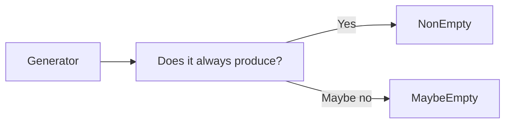
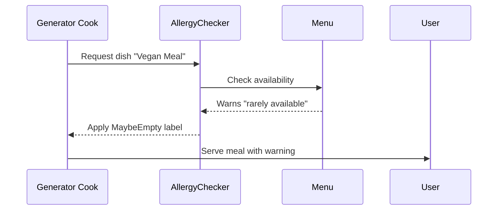

# Chapter 8: Emptiness Tracking

Welcome back! In [Chapter 7: Recursive Type Handling](07_recursive_type_handling_.md), we learned how DepTyCheck uses *fuel* to control recursive depth like a construction crane's height limits. Now imagine ordering from a menu 🍽️ with allergy warnings - some items might be unavailable to certain people. DepTyCheck's **Emptiness Tracking** works similarly - it warns you if generators might be "unavailable" and can't produce values! 🚫🍽️

## Why Track Emptiness?

Imagine you're ordering at a restaurant:
```idris
data Allergy = NutAllergy | DairyFree | Vegan

menuGen : Allergy -> Gen FoodItem
menuGen Vegan = ??? 
```

Some generators won't work in certain situations! Without tracking:
1. `menuGen Vegan` might try serving steak
2. Your generator would fail ("empty")
3. Testing crashes 😨

Emptiness Tracking is the food label that warns: **"May be empty when vegan"**



## The Safety Label System

In DepTyCheck, every generator carries an "allergy warning" label:
```idris
-- Safe if Vegan
veganGen : Gen NonEmpty FoodItem  
-- Warns: Might fail for Vegans
unsafeGen : Gen MaybeEmpty FoodItem 
```

When cooking/test your code:
- `NonEmpty` = Safely served dish 
- `MaybeEmpty` = "Dish may contain nuts" warning

## Your First Food Label

Let's make some food generators with safety labels:

```idris
-- Always produces something
safeGen : Gen NonEmpty String
safeGen = elements ["Apple", "Bread"]

-- Might be "allergic"
filteredGen : Gen MaybeEmpty String
filteredGen = suchThat safeGen (\s => length s > 10)
```

How this works:
1. `safeGen` guarantees output (NonEmpty)
2. `filteredGen` adds "length>10" restriction
3. Now it might be empty (MaybeEmpty)

This is automatically tracked in DepTyCheck's type system!

## How Labeling Works Step-by-Step

Imagine this process in DepTyCheck's kitchen:



## Inside the Kitchen: Emptiness Type

DepTyCheck tracks emptiness through this core type (from `src/Test/DepTyCheck/Gen/Emptiness.idr`):

```idris
public export
data Emptiness = NonEmpty | MaybeEmpty
```

Simple explanation:
- `NonEmpty` = Always yields results
- `MaybeEmpty` = Might return nothing

It also defines safety rules:
```idris
data NoWeaker : Emptiness -> Emptiness -> Type where
  NonEmpty   `NoWeaker` NonEmpty   -- Strong guarantee
  Anything   `NoWeaker` MaybeEmpty -- Weaker guarantee
```

These rules ensure strict labeling - you can't lie about food safety!

## Real-World Menu System

Let's create a full menu generator with safety tracking:

```idris
data Food = Pizza | Salad | Steak

-- Top labels: "Always available" vs "Allergy warnings"
foodGen      : Gen NonEmpty Food
veganFoodGen : Gen MaybeEmpty Food

foodGen      = elements [Pizza, Salad, Steak]
veganFoodGen = suchThat foodGen veganSafe
  where 
    veganSafe Pizza = False
    veganSafe Salad = True
    veganSafe Steak = False
```

When using `veganFoodGen`:
- Safe: Will produce `Salad` only
- Warned as `MaybeEmpty` since many foods excluded

## Why This Matters

Emptiness tracking helps:
1. Prevent runtime crashes in tests
2. Document generator limitations
3. Compose generators safely
4. Ensure realistic test scenarios

Just like food labels keep diners safe, emptiness tracking keeps your tests safe!

## Your Safety Certification 🥇

You've learned DepTyCheck's key safety feature:
- **NonEmpty** = Always produces results
- **MaybeEmpty** = Warns of possible failure
- Tracked automatically through generator operations
- Core rules enforced in `Emptiness.idr`

Now you're ready to explore DepTyCheck's quality control system! In [Chapter 9: Coverage Tracking](09_coverage_tracking_.md), we'll learn how DepTyCheck ensures generators test all cases, like a food inspector verifying menu variety! 🍽️✅

---

Generated by [AI Codebase Knowledge Builder](https://github.com/The-Pocket/Tutorial-Codebase-Knowledge)