# Chapter 9: Coverage Tracking

Welcome back! In [Chapter 8: Emptiness Tracking](08_emptiness_tracking_.md), we learned how DepTyCheck warns us when generators might produce "empty" results, like allergy labels on a menu. Now imagine running a restaurant review service 🍽️📝 - you need to ensure your critics try *every dish* before publishing recommendations! DepTyCheck's **Coverage Tracking** works similarly - it tracks which type constructors get tested, ensuring all aspects of your code get quality verification! ✅🍲

## Why Track Coverage?

Imagine you're reviewing a cafe menu:
```idris
data Dish = Appetizer | MainCourse | Dessert
```

If your reviewer only tries appetizers, they'll miss complaints about:
1. Undercooked `MainCourse` meals
2. Burnt `Dessert` offerings
3. Missing drink pairings

Coverage Tracking acts like a checklist ensuring every dish is sampled:

```mermaid
graph LR
    A[Test Cycle] --> B[Checks Appetizer]
    A --> C[Checks MainCourse]
    A --> D[Checks Dessert]
    E[✅ All Covered] --> F[Safe to Release]
```



Without this tracking, critical bugs might slip through!

## The Restaurant Reviewer System

In DepTyCheck, coverage tracking attaches "review tags" to generated values:
```idris
hotelGen : Gen Hotel
hotelGen = withCoverage $ deriveGen
```

After testing, you get a coverage report:
```txt
Hotel coverage report:
- RoomType [fully covered]
  - Single ✓ (3 times)
  - Double ✓ (5 times)
  - Suite ✓ (1 time)
- Amenity [partial coverage]
  - Pool ✓ (2 times)
  - Spa ✗ (0 times)    -- Uh oh, missed testing spa!
```

This shows exactly what needs more testing focus!

## Your First Coverage Check

Let's track coverage for a simple dish generator:
```idris
import Test.DepTyCheck.Gen.Coverage

data Dish = Appetizer | MainCourse | Dessert

dishGen : Fuel -> Gen Dish
dishGen = withCoverage $ deriveGen  -- Add coverage tracking!

testCoverage : IO ()
testCoverage = do
  (coverage, _) <- generateSamples 10 (dishGen (limit 5))
  print coverage
```

Possible output:
```
Coverage Report:
Dish [covered fully]
- Appetizer ✓ (4)
- MainCourse ✓ (3)
- Dessert ✓ (3)
```

Each constructor gets checked and counted!

## How Review Tags Work

Imagine DepTyCheck as a meticulous restaurant reviewer:


Each generated value gets tagged with its constructor type during creation.

## Inside the Tagging System

DepTyCheck implements coverage labeling in `src/Test/DepTyCheck/Gen/Coverage.idr`:
```idris
public export
record ModelCoverage where
  constructor MkModelCoverage
  unModelCoverage : SortedMap Label Nat
  -- Maps labels (like "MainCourse") to count
```

When generating values:
```idris
manageLabel : Label -> CoverageM ()
manageLabel l = tell $ MkModelCoverage $ singleton l 1
-- Tells tracking system: "Add one count to label"
```

Key components:
- `Label`: The constructor name being tracked
- `tell`: Updates tracking counts
- `SortedMap`: Efficiently stores counts

## Real-World Example: Hotel Booking

Let's track coverage for a hotel booking system:
```idris
data RoomType = Single | Double | Suite
data Amenity = Pool | Spa | Gym

record Booking where
  constructor MkBooking
  room : RoomType
  amenity : Amenity
  nights : Nat

bookingGen : Fuel -> Gen Booking
bookingGen = withCoverage $ deriveGen

-- Test and report
testBooking : IO ()
testBooking = do
  (cov, _) <- generateSamples 20 (bookingGen plentyFuel)
  putStrLn $ prettyPrintCoverage cov
```

Sample report:
```
RoomType [fully covered]
  Single ✓ (7)
  Double ✓ (9)
  Suite ✓ (4)
Amenity [partial coverage]
  Pool ✓ (12)
  Spa ✗ (0)     -- Never tested spa!
  Gym ✓ (8)
```

Immediately shows we're missing Spa tests!

## Why Coverage Matters

Like restaurant reviews should cover every dish, test coverage ensures:
1. All code paths get exercised 💻➡️🛣️
2. Hidden bugs get uncovered 🕵️‍♂️🐞
3. Test quality can be quantified 📊
4. Untested areas are identified promptly 🚨

Studies show good coverage can catch 40% more bugs!

## Your Quality Assurance Badge 🏅

Congratulations! You now understand DepTyCheck's coverage tracking:
- Generators mark values with **constructor labels**
- Coverage reports show **test distribution**
- Untested paths appear as **missing checks**
- Tracking helps achieve **comprehensive testing**

Just like a thorough restaurant review covers every menu item, coverage tracking ensures every part of your code gets tested!

Ready to explore how DepTyCheck efficiently tests different argument orders? Next in [Chapter 10: Argument Permutation](10_argument_permutation_.md), we'll learn how to test parameter sequences automatically! ⏩🔢

---

Generated by [AI Codebase Knowledge Builder](https://github.com/The-Pocket/Tutorial-Codebase-Knowledge)