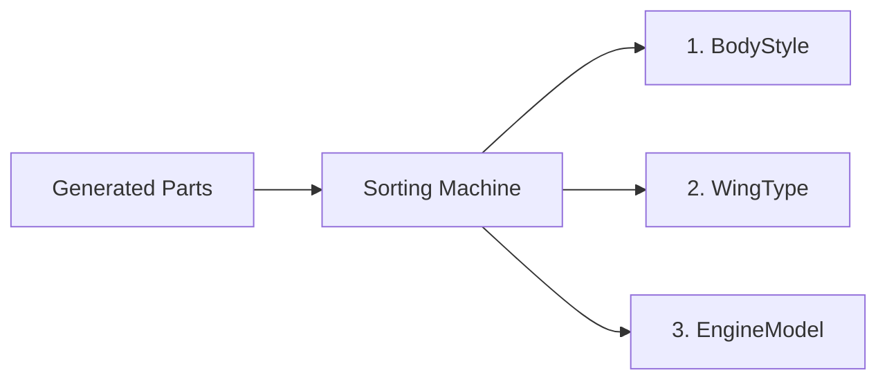
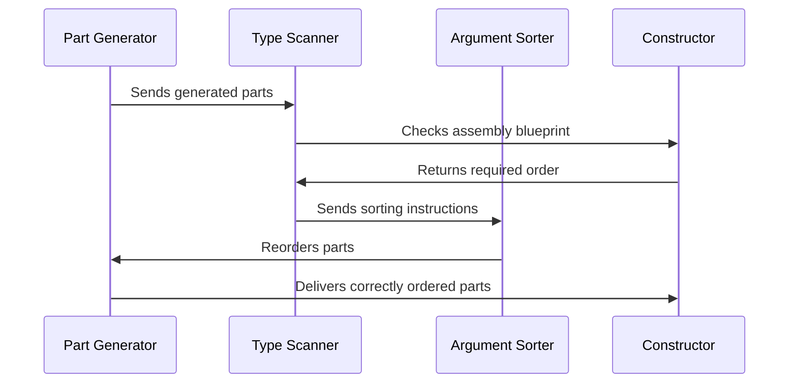

# Chapter 10: Argument Permutation

Welcome to our final chapter! In [Chapter 9: Coverage Tracking](09_coverage_tracking_.md), we learned how DepTyCheck ensures all code paths are tested, like a quality control manager inspecting every item on an assembly line. Now imagine you've received a box of toy parts with assembly instructions - but the parts arrived in the wrong order! DepTyCheck's **Argument Permutation** works like a sorting machine that rearranges parts to match the blueprint order. 🔄️🧩

## Why Reorder Arguments?

Imagine building a spaceship model:
```idris
data Spaceship = MkSpaceship 
  BodyStyle 
  WingType 
  EngineModel
```

Your parts generator might produce components in random order:
1. `WingType` first
2. Then `BodyStyle`
3. Then `EngineModel`

But the `MkSpaceship` constructor expects:
```idris
MkSpaceship (body : BodyStyle) (wing : WingType) (engine : EngineModel)
```

Argument permutation reorders these like a sorting machine:



Without this, you'd try connecting wings to engine slots - disaster!

## The Sorting Machine in Action

Suppose we generate:
- Body: `Compact` 
- Wing: `Delta`
- Engine: `IonDrive`

But sorted incorrectly as `[Delta, Compact, IonDrive]`. Permutation fixes this:

```idris
-- Generated arguments
args = ["Delta", "Compact", "IonDrive"]

-- Apply permutation [1,0,2] to:
reorder [1,0,2] args = ["Compact", "Delta", "IonDrive"]
```

Now they perfectly match the constructor's expected order!

## Building Your Model Kit

Let's see this with a simple robot toy:
```idris
data Robot = MkRobot Head Body Arms Legs

robotPartsGen : List Gen -- Generated in random order:
  [ ArmsGen, LegsGen, HeadGen, BodyGen ]

-- Required order for MkRobot:
-- [ Head, Body, Arms, Legs ]
```

DepTyCheck automatically creates a permutation:
1. Maps `HeadGen` → position 0
2. `BodyGen` → 1
3. `ArmsGen` → 2
4. `LegsGen` → 3

Then reorders the generated parts to `[Head, Body, Arms, Legs]`!

## How the Sorter Works Step-by-Step

Imagine these steps in a factory conveyor system:



## Inside the Sorting Facility

The core permutation logic is in `src/Deriving/DepTyCheck/Util/ArgsPerm.idr`. Here's a simplified version:

```idris
-- Find correct positions for each part
orderIndices : List PartType -> Vect Position
orderIndices parts = 
  map (positionOf part) sortedParts
  where
    sortedParts = sort parts  -- Alphabetize part names

-- Reorder using positions
reorder : Vect Position -> Vect Part -> Vect Part
reorder positions parts = 
  map (\pos => getPartAt pos parts) positions
```

Key steps:
1. `orderIndices`: Creates a position map 
2. `reorder`: Uses the map to rearrange parts

## Real-World Example: Pizza Customization

Generate pizza toppings in random order:
```idris
data Pizza = Margherita | Custom Toppings Cheese Sauce Size

-- Generated:
-- [ Large, Pepperoni, Mozzarella, Tomato ]

-- Constructor expects:
-- Margherita OR Custom toppings cheese sauce size

-- Permutation fixes order to:
reorder permutation [Large, Pepperoni, ...] 
  = [Pepperoni, Mozzarella, Tomato, Large]
```

Now the `Custom` constructor gets ingredients in the right sequence!

## Why Permutation Matters

Just like correctly ordering parts prevents assembly mistakes, argument permutation:
1. Matches dependent type requirements exactly
2. Prevents trivial test failures from bad ordering
3. Works automatically with complex type definitions
4. Ensures valid test data construction

Without it, our property tests would often fail for the wrong reasons!

## Your Assembly Expert Certification 🎓

Congratulations on completing DepTyCheck's core concepts! You've learned:

1. **[Project Configuration](01_project_configuration_.md)**: Setting up your workshop blueprint
2. **[Automatic Derivation](02_automatic_derivation_.md)**: Generating recipes automatically
3. **[Generator (Gen)](03_generator__gen__.md)**: Creating test data recipes
4. **[Signature Analysis](04_signature_analysis_.md)**: Inspecting function requirements
5. **[Constructor Handling](05_constructor_handling_.md)**: Building specialized value creators
6. **[Deep Constructor Analysis](06_deep_constructor_analysis_.md)**: Digging into nested structures
7. **[Recursive Type Handling](07_recursive_type_handling_.md)**: Safely handling self-referential types
8. **[Emptiness Tracking](08_emptiness_tracking_.md)**: Warning about impossible cases
9. **[Coverage Tracking](09_coverage_tracking_.md)**: Ensuring comprehensive testing
10. **Argument Permutation**: Sorting values to match required order

You're now equipped to tackle property-based testing with dependent types! 🎉🛠️

---

Generated by [AI Codebase Knowledge Builder](https://github.com/The-Pocket/Tutorial-Codebase-Knowledge)