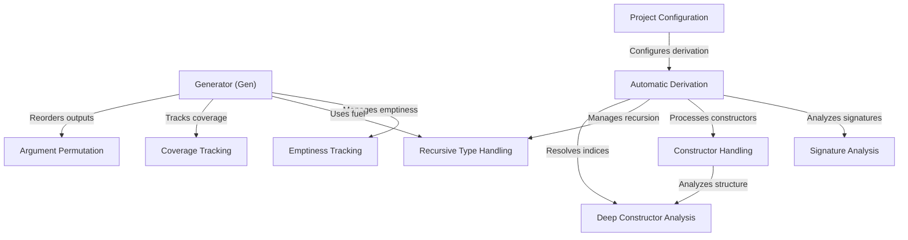

# Tutorial: DepTyCheck

**DepTyCheck** is an Idris library for *property-based testing with dependent types*. 
It automatically derives **generators** for custom data types, enabling randomized testing of properties.
The library tracks *emptiness* (whether a generator can produce no values) and *coverage* (which types and constructors are tested),
handles recursive types with **fuel-based depth limiting**, and uses metaprogramming for automatic derivation.
It also ensures that generated values meet dependent type constraints through **argument permutation** and deep constructor analysis.

**Source Repository:** [None](None)

## Chapters

1. [Project Configuration
](01_project_configuration_.md)
2. [Automatic Derivation
](02_automatic_derivation_.md)
3. [Generator (Gen)
](03_generator__gen__.md)
4. [Signature Analysis
](04_signature_analysis_.md)
5. [Constructor Handling
](05_constructor_handling_.md)
6. [Deep Constructor Analysis
](06_deep_constructor_analysis_.md)
7. [Recursive Type Handling
](07_recursive_type_handling_.md)
8. [Emptiness Tracking
](08_emptiness_tracking_.md)
9. [Coverage Tracking
](09_coverage_tracking_.md)
10. [Argument Permutation
](10_argument_permutation_.md)

---

Generated by [AI Codebase Knowledge Builder](https://github.com/The-Pocket/Tutorial-Codebase-Knowledge)