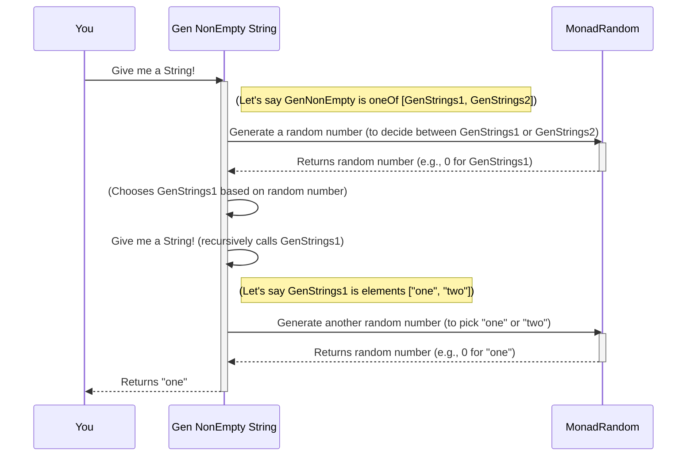

# Chapter 1: Gen (Generator)

Imagine you're trying to test a program that deals with names. You want to make sure your program works correctly for all sorts of names – short ones, long ones, names with numbers, names with special characters, and so on. Manually coming up with all these different names can be tedious and you might miss some important cases. This is where `Gen` comes to the rescue!

Think of a `Gen` (short for Generator) as a smart machine that can automatically create examples of a specific kind of data. In our name example, a `Gen` for `String` would be able to produce lots of different string values for you. This is the central idea behind "property-based testing" – instead of writing tests for specific examples, you write tests about *properties* that should hold true for *any* generated data.

Let's dive into how `Gen` works and how you can use it to create test data.

## What is a `Gen`?

A `Gen` is like a blueprint for creating values. It doesn't give you a value immediately, but it knows *how* to create values when you ask for them.

In `DepTyCheck`, a `Gen` has two important parts:

1.  **Emptiness**: This tells us if the generator *always* produces values, or if it *might sometimes fail* to produce a value. This is especially important for [dependent types](06_gensignature__generator_signature__.md) where some data might be impossible to create (like a list of `Fin 0` – there's no `0`th element!).
    *   `NonEmpty`: Means the generator *always* produces a value.
    *   `MaybeEmpty`: Means the generator *might* sometimes fail to produce a value (it could be "empty").

2.  **Type of Data**: This tells us *what kind* of data the generator produces. For example, a `Gen` for `String` produces `String` values.

So, when you see `Gen NonEmpty String`, it means "a generator that always produces `String` values." And `Gen MaybeEmpty (Fin n)` means "a generator that might produce `Fin n` values."

## Your First Generators: Simple Data

Let's start by making some basic `Gen`s for `String` values, just like in our name example.

```idris
genSomeStrings : Gen NonEmpty String
genSomeStrings = elements ["one", "two", "three"]
```
This code creates a generator named `genSomeStrings`.
*   `Gen NonEmpty String`: Tells us this generator *always* produces `String` values.
*   `elements ["one", "two", "three"]`: This is a helper function that creates a generator from a list of specific values. It will pick one of these strings randomly.

If you were to "run" `genSomeStrings`, it would give you "one", "two", or "three" with equal probability.

### Combining Generators

What if you want more choices? You can combine multiple `Gen`s into a single, larger `Gen`. The `oneOf` function helps us with this.

```idris
genMoreStrings : Gen NonEmpty String
genMoreStrings = oneOf [genSomeStrings, elements ["more", "even more"]]
```
Here, `genMoreStrings` is created by combining `genSomeStrings` (which gives "one", "two", "three") and another generator `elements ["more", "even more"]`.

When `genMoreStrings` is asked for a value, it will first randomly decide *which* of its sub-generators to use (either `genSomeStrings` or `elements ["more", "even more"]`). Then, it will use that chosen sub-generator to produce a value.

Let's visualize this:

```mermaid
graph TD
    A[genMoreStrings] --> B(Pick one sub-generator)
    B --> C{genSomeStrings}
    B --> D{elements ["more", "even more"]}
    C --> E(Return "one" or "two" or "three")
    D --> F(Return "more" or "even more")
```
This means that "one", "two", and "three" are equally likely among themselves, and "more" and "even more" are equally likely among themselves. However, the *group* of "one", "two", "three" has the same chance to be picked as the *group* of "more", "even more".

So, if you pick "one", it means `genSomeStrings` was chosen, and then "one" was chosen from it.

### Generators with Dependent Types: Emptiness Matters!

Now, let's talk about the `MaybeEmpty` part. This becomes crucial when dealing with [dependent types](06_gensignature__generator_signature__.md). A good example is `Fin n`, which represents natural numbers less than `n`.
*   `Fin 3` can be `0`, `1`, `2`.
*   `Fin 1` can be `0`.
*   `Fin 0` cannot be *any* number. It's an empty type! It's impossible to create a `Fin 0` value.

So, a generator for `Fin n` needs to be `MaybeEmpty` because if `n` is `0`, it cannot produce a value.

```idris
genFin : (n : Nat) -> Gen MaybeEmpty $ Fin n
genFin Z     = empty
genFin (S n) = elements' $ Data.List.allFins n
```
Here:
*   `genFin Z = empty`: If `n` is `0` (represented by `Z`), the generator explicitly returns `empty`, meaning it cannot produce a value.
*   `genFin (S n) = elements' $ Data.List.allFins n`: If `n` is greater than `0` (represented by `S n`), it lists all possible `Fin n` values and uses `elements'` to create a generator from them. `elements'` is just a convenient version of `elements` that works with any `Foldable` type.

This shows how the `Emptiness` parameter, covered more deeply in [Chapter 2: Emptiness (of Generators)](02_emptiness__of_generators__.md), is essential for correctly representing the possibility (or impossibility) of generating values for dependent types.

## Performing Actions with `Gen`: `Applicative` and `Monad`

`Gen` values can be powerful on their own, but they become even more useful because they behave like "containers" that you can transform and combine in sophisticated ways thanks to the `Applicative` and `Monad` interfaces. Don't worry if these terms sound advanced; just think of them as ways to "chain" operations on your generators.

### `Applicative` for Combining Structures

The `Applicative` interface allows you to combine the *results* of several generators to build a new data structure. It's like filling in a form where each field is provided by a different generator.

Consider a custom data type `X` that holds two `String`s:

```idris
data X = MkX String String
```

You can create a generator for `X` by combining `genSomeStrings` and `genMoreStrings`:

```idris
genStrPairs : Gen NonEmpty X
genStrPairs = [| MkX genSomeStrings genMoreStrings |]
```
The `[| ... |]` syntax is a special Idris feature that lets you use `Applicative` operations more easily. It means "apply the constructor `MkX` to the values generated by `genSomeStrings` and `genMoreStrings`."

When `genStrPairs` runs, it will:
1.  Ask `genSomeStrings` for a `String`.
2.  Ask `genMoreStrings` for another `String`.
3.  Combine these two `String`s using `MkX` to produce a `MkX String String` value.

### `Monad` for Conditional Generation

The `Monad` interface provides an even more powerful way to combine generators. It allows the *next* generator to depend on the *value* produced by the previous generator. This is super useful for dependent types!

Let's go back to our `Fin n` example. What if we want to generate *any* `Fin` value, not just `Fin` of a specific `n`? This means `n` itself must be generated. We can represent "any `Fin` value" as a pair `(n ** Fin n)`, where `n` is the upper limit and `Fin n` is a number less than `n`.

```idris
genAnyFin : Gen MaybeEmpty Nat => Gen MaybeEmpty (n ** Fin n)
genAnyFin @{genNat} = do
  n <- genNat
  f <- genFin n
  pure (n ** f)
```
This `genAnyFin` is a generator that, given a generator for `Nat` (`genNat`), produces a `(n ** Fin n)` pair. Let's break down the `do` block:
1.  `n <- genNat`: First, run `genNat` to get a natural number `n`.
2.  `f <- genFin n`: Now, *use that specific `n`* to create a `Fin n` generator, and run it to get `f`. This is the crucial part that `Monad` enables: `genFin n` depends on the `n` generated in the previous step.
3.  `pure (n ** f)`: Finally, combine `n` and `f` into the desired pair.

This allows you to generate values where the type itself is part of the generated data! If `genNat` produces `0`, then `genFin 0` will be `empty`, and `genAnyFin` will also effectively be empty for that branch, reflecting the impossibility of generating `Fin 0`.

## Internal Peek: How `Gen` Works (The Machine Analogy)

You've seen how to use `Gen`. Now, let's peek under the hood to understand how this "machine" operates.

At its core, a `Gen` contains a recipe for how to produce a value within a random context. When you ask a generator for a value, it doesn't just `return` one. Instead, it gets the chance to interact with a "randomness manager" to make choices.

Let's imagine the simplest `Gen`: `Raw`.

```idris
record RawGen a where
  constructor MkRawGen
  unRawGen : forall m. MonadRandom m => CanManageLabels m => m a

-- ... later in Gen definition ...
data Gen : Emptiness -> Type -> Type where
  -- ...
  Raw   : RawGen a -> Gen em a
  -- ...
```
`RawGen` directly holds a function `unRawGen`. This function takes a "random environment" `m` (which `MonadRandom` means it can generate random numbers, and `CanManageLabels` means it can deal with tagging operations for insights). When `unRawGen` is called, it performs its random operations and eventually produces a value of type `a`.

Most of the `Gen` combinators (like `oneOf`, `elements`, `map`, `bind`, etc.) build up more complex `Gen` structures that eventually rely on these `RawGen`s or `Pure` values (which are just fixed values).

### A Glimpse at Running a `Gen`

When you "run" a generator, say `unGen1` for a `Gen NonEmpty` (assuming it always produces a value), here's a simplified sequence of events:



This diagram shows that the `Gen` itself doesn't generate randomness; it delegates to the `MonadRandom` environment. The `Gen`'s structure defines *how* that randomness is used to select and combine values.

If the `Gen` was `MaybeEmpty` and happened to be `empty` or if an internal `RawGen` failed (e.g., `genFin 0`), the `unGen` function would throw an error or return `Nothing` instead of a value.

## Conclusion

In this chapter, you learned that `Gen` is the core component for generating test data in `DepTyCheck`.
*   It acts as a blueprint for producing values.
*   It comes with an `Emptiness` parameter (`NonEmpty` or `MaybeEmpty`) to indicate if it always produces a value or might fail, which is crucial for [dependent types](06_gensignature__generator_signature__.md).
*   You can create simple generators using functions like `elements`.
*   You can combine generators using `oneOf` for choice.
*   You can transform and combine generator results using `Applicative` (e.g., `[| ... |]`) and `Monad` (e.g., `do` notation), allowing for powerful, data-dependent generation.
*   Under the hood, `Gen` uses a `MonadRandom` environment to make its random choices.

Understanding `Gen` is your first step into property-based testing with `DepTyCheck`. In the next chapter, we'll delve deeper into the concept of [Emptiness (of Generators)](02_emptiness__of_generators__.md) and why it's so important in a dependent type setting.

[Chapter 2: Emptiness (of Generators)](02_emptiness__of_generators__.md)

---

Generated by [AI Codebase Knowledge Builder](https://github.com/The-Pocket/Tutorial-Codebase-Knowledge)