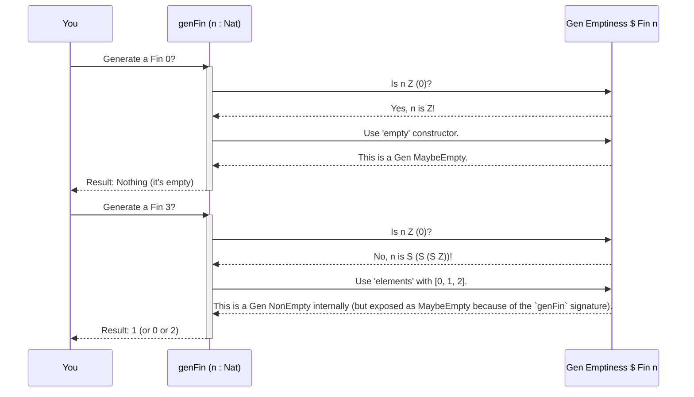

# Chapter 2: Emptiness (of Generators)

Welcome back! In [Chapter 1: Gen (Generator)](01_gen__generator__.md), we learned that a `Gen` (Generator) is a smart machine for making test data. We also got a sneak peek at a crucial part of `Gen`: its "Emptiness" status. This chapter will dive deeper into `Emptiness` and explain why it's so important in `DepTyCheck`.

## What Problem Does Emptiness Solve?

Imagine you have a magical basket that sometimes carries apples, sometimes oranges, and sometimes it's... completely empty! It's important to know if the basket *will always* contain something, or if it *might* be empty.

In `DepTyCheck`, this "basket" is our `Gen` (Generator). The `Emptiness` concept tells us if a generator is *guaranteed* to produce a value, or if it *might* fail to produce one (i.e., be "empty"). This is especially vital when working with `dependent types`, where some types simply cannot have any values!

### A Basket of Numbers: The `Fin n` Example

Let's revisit our `Fin n` example from the previous chapter. `Fin n` represents natural numbers *less than* `n`.

*   A generator for `Fin 3` (numbers less than 3) will always give you `0`, `1`, or `2`. This generator **cannot** be empty.
*   A generator for `Fin 1` (numbers less than 1) will always give you `0`. This generator **cannot** be empty.
*   A generator for `Fin 0` (numbers less than 0) **cannot give you anything**! There are no numbers less than `0` (if we're considering natural numbers starting from `0`). This generator **must** be empty.

So, a generator for `Fin n` cannot be simply `NonEmpty`. Its emptiness depends on `n`. This is exactly the kind of situation `Emptiness` is designed to handle.

## The Two Kinds of Emptiness

In `DepTyCheck`, there are two main categories for `Emptiness`:

*   **`NonEmpty`**: This means the generator is *guaranteed* to produce a value. It's like a basket that always has fruit in it.
*   **`MaybeEmpty`**: This means the generator *might* sometimes fail to produce a value. It's like a basket that *could* be empty.

We have a simple data type to represent these two states:

```idris
-- src/Test/DepTyCheck/Gen/Emptiness.idr
public export
data Emptiness = NonEmpty | MaybeEmpty
```

Think of `NonEmpty` as giving a stronger "promise" than `MaybeEmpty`. If a generator is `NonEmpty`, you know for sure you'll get a value. If it's `MaybeEmpty`, you might or might not.

## Emptiness in Action: The `genFin` Example

In [Chapter 1: Gen (Generator)](01_gen__generator__.md), we saw `genFin`:

```idris
genFin : (n : Nat) -> Gen MaybeEmpty $ Fin n
genFin Z     = empty
genFin (S n) = elements' $ Data.List.allFins n
```

Let's break down how `Emptiness` plays out here:

1.  **`genFin : (n : Nat) -> Gen MaybeEmpty $ Fin n`**: Notice the `MaybeEmpty` here. This tells us from the start that `genFin` *might* not give a value. This is important because the type `Fin n` itself can be empty if `n` is `0`.

2.  **`genFin Z = empty`**:
    *   If `n` is `Z` (which means `0`), we use `empty`. `empty` is a special generator that *always* produces nothing.
    *   Its type is `empty : Gen0 a`, where `Gen0` is just a shortcut for `Gen MaybeEmpty`. So, `empty` explicitly says: "I will never yield a value."

    ```idris
    -- src/Test/DepTyCheck/Gen.idr
    export %inline
    empty : Gen0 a
    empty = Empty
    ```
    `Empty` is an internal constructor of the `Gen` data type, representing a generator that always fails.

3.  **`genFin (S n) = elements' $ Data.List.allFins n`**:
    *   If `n` is `S n'` (which means `1` or more), then `Fin (S n')` definitely has values (like `0`, `1`, ..., `n'`).
    *   `elements'` takes a list of values and creates a generator that picks one of them. Since the list `Data.List.allFins n` will definitely contain values when `n` is `S n'`, this part of `genFin` will always generate a value.

So, `genFin` correctly represents the possibility of emptiness. When `n` is `0`, it's truly empty. When `n` is greater than `0`, it provides values.

Here's how `genFin` would behave internally:



Notice that even though `elements' $ Data.List.allFins n` might *internally* produce a `NonEmpty` generator when `n > 0`, the overall type signature of `genFin` forces its return type to be `Gen MaybeEmpty $ Fin n`. This allows us to keep a consistent type signature while correctly handling types that might not always have values.

## Combining Generators and Emptiness

What happens when we combine generators with different `Emptiness` statuses? `DepTyCheck` is smart about this. The resulting `Emptiness` will always be the "weakest" (the one that gives the fewest guarantees). `MaybeEmpty` is "weaker" than `NonEmpty`.

Consider these rules for different generator operations:

### `map` (Transforming values):

If you have a `Gen NonEmpty String` and you `map` a function `length` (which turns a `String` into a `Nat`) over it, you'll get a `Gen NonEmpty Nat`. Why? Because if the original generator always produces a `String`, and you transform that `String` into a `Nat`, it will still always produce a `Nat`. The `Emptiness` doesn't change.

```idris
-- A generator that *always* gives a string
genNonEmptyString : Gen NonEmpty String
genNonEmptyString = elements ["hello"]

-- Map a function that turns String to Nat.
-- Result is still Gen NonEmpty Nat.
genNonEmptyLength : Gen NonEmpty Nat
genNonEmptyLength = map length genNonEmptyString
```

### `applicative` (Combining values independently):

If you combine two generators, the result's `Emptiness` will be `MaybeEmpty` if *either* of the input generators is `MaybeEmpty`. Both must be `NonEmpty` for the result to be `NonEmpty`.

Let's say we have:
*   `genA : Gen MaybeEmpty A`
*   `genB : Gen NonEmpty B`

If we combine them using `[| MkX genA genB |]`, the result will be `Gen MaybeEmpty X`. If `genA` could be empty, then the combined generator could also be empty.

```idris
-- A generator that *might* be empty (if n ends up being 0)
myGenFin : (n : Nat) -> Gen MaybeEmpty $ Fin n
myGenFin = genFin -- from previous example

-- A generator that *always* produces a string
myGenString : Gen NonEmpty String
myGenString = elements ["Idris is fun!"]

-- We combine them. Because myGenFin is MaybeEmpty, the result is MaybeEmpty.
data Pair FinNString = MkPair (Fin N) String
genPair : (N : Nat) -> Gen MaybeEmpty (Pair FinNString)
genPair N = [| MkPair (myGenFin N) myGenString |]
```

### `Monad` (`>>=`, `do` notation for dependent generation):

This is where `Emptiness` gets really interesting! With `Monad`, the *next* generator can depend on the *value* of the previous one. If any part of the chain can be empty, the whole result can be empty.

```idris
genAnyFin : Gen MaybeEmpty Nat => Gen MaybeEmpty (n ** Fin n)
genAnyFin @{genNat} = do
  n <- genNat          -- If genNat produces 0, 'n' is 0
  f <- genFin n        -- If n is 0, genFin 0 will be 'empty'
  pure (n ** f)
```

In this `genAnyFin` example:
1. `n <- genNat`: `genNat` itself could be `MaybeEmpty` or `NonEmpty`. Let's assume it's `NonEmpty` for now, so `n` is always produced.
2. `f <- genFin n`: Now, if `n` happens to be `0`, then `genFin n` becomes `genFin 0`, which we know is `empty`.
3. If `genFin n` is empty for a particular `n`, then this entire `do` block will fail to produce a value – it becomes `MaybeEmpty`.

Therefore, `genAnyFin` must be `Gen MaybeEmpty`. It properly reflects the fact that you might get a `0` from `genNat`, leading to `genFin 0` producing nothing.

## The `NoWeaker` Relation: Ordering Emptiness

In `DepTyCheck`, there's a formal way to describe how `Emptiness` values relate to each other: `NoWeaker`.

```idris
-- src/Test/DepTyCheck/Gen/Emptiness.idr
data NoWeaker : (from, to : Emptiness) -> Type where
  NN : NonEmpty `NoWeaker` NonEmpty
  AS : em       `NoWeaker` MaybeEmpty
```

This mouthful just means:
*   `NN : NonEmpty `NoWeaker` NonEmpty`: `NonEmpty` gives no weaker guarantees than `NonEmpty`. (It's the same guarantee).
*   `AS : em `NoWeaker` MaybeEmpty`: *Any* `Emptiness` status (`em`) gives no weaker guarantees than `MaybeEmpty`. (Because `MaybeEmpty` is the weakest possible guarantee).

So, `NonEmpty `NoWeaker` MaybeEmpty` is true (because of `AS`).
But `MaybeEmpty `NoWeaker` NonEmpty` is *false* (impossible!). `MaybeEmpty` *is* weaker than `NonEmpty`.

This `NoWeaker` relation is like saying "is at least as strong as" or "gives at least as many guarantees as". This relationship is used internally by `DepTyCheck` to make sure `Emptiness` is correctly tracked when generators are combined or converted. For example, you can always treat a `NonEmpty` generator as if it were `MaybeEmpty` because it provides *at least* the guarantees of `MaybeEmpty`. This is called `relaxing` the `Emptiness`.

```idris
-- Simplified from src/Test/DepTyCheck/Gen.idr
export
relax : (0 _ : iem `NoWeaker` em) => Gen iem a -> Gen em a
```

`relax` allows you to convert a `Gen iem a` to a `Gen em a` *only if* `iem` is `NoWeaker` than `em`. This is always true if `em` is `MaybeEmpty`. For example, `relax` will let you change `Gen NonEmpty String` to `Gen MaybeEmpty String`, but not the other way around. This makes sense: you can always consider a "guaranteed value" generator as a "possibly value" generator, but you cannot guarantee a value if it was only a "possibly value" generator to begin with.

## Conclusion

`Emptiness` is a simple but powerful concept in `DepTyCheck`:
*   It tells you if a generator *always* produces a value (`NonEmpty`) or *might* fail to (`MaybeEmpty`).
*   It's essential for correctly working with `dependent types` like `Fin n`, where some instances simply don't have any values.
*   When combining generators, `DepTyCheck` automatically tracks `Emptiness`, defaulting to `MaybeEmpty` if any part of the combination might fail.
*   The `NoWeaker` relation defines how `Emptiness` statuses compare in terms of "guarantees," allowing for safe conversions like `relax`.

Understanding `Emptiness` will help you write more robust property-based tests, especially when types themselves dictate the possibility of a value. Next, we'll look at [CanManageLabels (Labeling Mechanism)](03_canmanagelabels__labeling_mechanism__.md), which helps us track important information about our generators.

[Chapter 3: CanManageLabels (Labeling Mechanism)](03_canmanagelabels__labeling_mechanism__.md)

---

Generated by [AI Codebase Knowledge Builder](https://github.com/The-Pocket/Tutorial-Codebase-Knowledge)