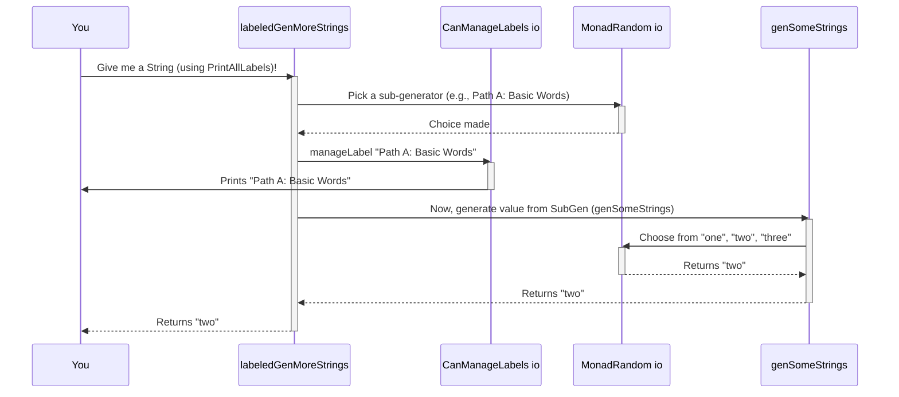

# Chapter 3: CanManageLabels (Labeling Mechanism)

Welcome back! In [Chapter 2: Emptiness (of Generators)](02_emptiness__of_generators__.md), we explored how `DepTyCheck` uses the concept of `Emptiness` to track whether a generator is guaranteed to produce a value or might fail. Now, let's explore another useful tool to understand our generators better: `CanManageLabels`.

## What Problem Does Labeling Solve?

Imagine you're baking a complex cake with many layers. Each layer requires different ingredients and steps. If something goes wrong with the cake, how do you know which layer caused the problem? Was it a bad batch of flour for the first layer, or did you mix the frosting incorrectly for the top layer?

In `DepTyCheck`, your "cake" is the data generated for testing, and each "layer" is a part of your generator. Generators can become quite complex, combining many smaller generators. When a test fails or you need to understand *how* a particular piece of data was generated, it can be like trying to figure out which cake layer went wrong without any notes.

This is where `CanManageLabels` comes in! It's like adding little sticky notes or tags to different parts of your generator. These labels can tell you:
*   Which parts of your generation process were used.
*   How deeply your generator explored certain options.
*   Which specific data constructors (like `MkX` for our `X` type in Chapter 1) were chosen.

Think of it as leaving a trail of breadcrumbs in a maze. If you find something interesting (or problematic) at the end, you can look back at the breadcrumbs to see exactly which path you took to get there.

## Attaching Labels to Generators

The core idea is simple: you can `label` any generator with a `String`, and when that part of the generator is *used* during data generation, its label is recorded.

Let's say we have our `genMoreStrings` from [Chapter 1: Gen (Generator)](01_gen__generator__.md):

```idris
genSomeStrings : Gen NonEmpty String
genSomeStrings = elements ["one", "two", "three"]

genMoreStrings : Gen NonEmpty String
genMoreStrings = oneOf [genSomeStrings, elements ["more", "even more"]]
```

We can add labels to differentiate paths:

```idris
labeledGenMoreStrings : Gen NonEmpty String
labeledGenMoreStrings = oneOf
  [ label "Path A: Basic Words" genSomeStrings
  , label "Path B: Extra Words" $ elements ["more", "even more"]
  ]
```

Here, we've used the `label` function:
*   `label "Path A: Basic Words" genSomeStrings`: Wraps `genSomeStrings` with the label "Path A: Basic Words".
*   `label "Path B: Extra Words" (elements ["more", "even more"])`: Wraps the `elements` generator with "Path B: Extra Words".

Now, when `labeledGenMoreStrings` generates a value, depending on whether it picked `genSomeStrings` or `elements ["more", "even more"]`, the corresponding label will be "managed" (recorded).

## How Labels are "Managed" (Logged)

When we talk about "managing" a label, it means an action is performed with that label. By default, `DepTyCheck` provides different ways to "manage" labels, acting like different types of logging systems.

### 1. Ignoring Labels (The Default)

Often, you might not care about labels, especially when you're just generating data. In this case, labels are simply ignored:

```idris
-- This `IgnoreLabels` is often implicitly used if you don't specify otherwise
-- It just means "do nothing with the label"
CanManageLabels m => Gen NonEmpty String -> m String
exampleGenRun = unGen1 labeledGenMoreStrings @{IgnoreLabels} -- @{IgnoreLabels} is often omitted
```
If you run `exampleGenRun`, you'll get a `String` (like "one" or "more"), but nothing will be printed or stored about which label was hit. This is useful for performance when you don't need the extra information.

### 2. Printing All Labels

For debugging or understanding generator behavior, you can tell `DepTyCheck` to print labels as they are encountered:

```idris
-- This tells the system to use the "PrintAllLabels" strategy for managing labels
-- which will print to your console.
ioExample : HasIO io => io Unit
ioExample = do
  val <- unGen1 labeledGenMoreStrings @{PrintAllLabels}
  putStrLn $ "Generated: " ++ val
```
When you run `ioExample`, you might see something like:
```
Path A: Basic Words
Generated: two
```
or
```
Path B: Extra Words
Generated: even more
```
This clearly tells you which part of your `oneOf` was chosen for that particular generation. This is like watching the breadcrumbs appear as the journey unfolds!

## The `CanManageLabels` Interface

To make this system flexible, `DepTyCheck` uses an interface called `CanManageLabels`:

```idris
-- src/Test/DepTyCheck/Gen/Labels.idr
public export
interface Monad m => CanManageLabels (0 m : Type -> Type) where
  manageLabel : Label -> m ()
```

*   `interface Monad m => CanManageLabels (0 m : Type -> Type)`: This means that `CanManageLabels` is a capability that a `Monad` `m` can have. The `m` here is the "random environment" we talked about in [Chapter 1: Gen (Generator)](01_gen__generator__.md).
*   `manageLabel : Label -> m ()`: This is the core function. It takes a `Label` (which is just a wrapper around a `String`) and performs some action (`m ()` means an action that doesn't return a value).

This powerful setup allows you to plug in *different ways* of handling labels without changing your generators. You just change *which* `CanManageLabels` instance you provide to `unGen` or `unGen1`.

### A Peek at the Implementations

Let's look at the actual `CanManageLabels` implementations provided:

**Ignoring Labels:**

```idris
-- src/Test/DepTyCheck/Gen/Labels.idr
export %defaulthint
IgnoreLabels : Monad m => CanManageLabels m
IgnoreLabels = I where
  [I] CanManageLabels m where
    manageLabel _ = pure ()
```
This instance, `IgnoreLabels`, simply makes `manageLabel` do `pure ()`. In a Monad, `pure ()` means "do nothing and return nothing." This is the simplest way to "manage" a label.

**Printing Labels:**

```idris
-- src/Test/DepTyCheck/Gen/Labels.idr
export
[PrintAllLabels] HasIO io => CanManageLabels io where
  manageLabel = putStrLn . show
```
This instance, `PrintAllLabels`, is for any `Monad` `io` that has `HasIO` (meaning it can perform input/output operations, like printing to the console). Here, `manageLabel` transforms the `Label` into a `String` (using `show`) and then `putStrLn` prints it.

## How `label` Works Internally

Remember from [Chapter 1: Gen (Generator)](01_gen__generator__.md) that the `Gen` data type has various constructors: `Pure`, `Raw`, `OneOf`, `Bind`, and `Labelled`.

```idris
-- Simplified from src/Test/DepTyCheck/Gen.idr
data Gen : Emptiness -> Type -> Type where
  -- ... other constructors ...
  Labelled : Label -> (g : Gen em a) -> (0 _ : IsNonEmpty g) => Gen em a
  -- ...
```

The `label` function you use (`label : Label -> Gen em a -> Gen em a`) actually constructs a `Labelled` generator:

```idris
-- Simplified from src/Test/DepTyCheck/Gen.idr
export
label : Label -> Gen em a -> Gen em a
label l g with (isEmpty g) proof 0 prf
  label _ Empty | True  = Empty
  label l g     | False = Labelled l g
```
This function checks if the generator `g` is `Empty`. If it is, labeling an empty generator doesn't make sense (it won't generate anything, so it can't "manage" a label). If it's not empty, it wraps `g` inside a `Labelled` constructor.

Now, let's trace what happens when `unGen1` (to unwrap a `NonEmpty` generator) encounters a `Labelled` generator:

```idris
-- Simplified from src/Test/DepTyCheck/Gen.idr
export
unGen1 : MonadRandom m => (labels : CanManageLabels m) => Gen1 a -> m a
unGen1 $ Labelled l x   = manageLabel l >> unGen1 x
```

1.  `unGen1 $ Labelled l x`: When `unGen1` gets a `Labelled` generator `Labelled l x`, it sees that it has a label `l` and a smaller generator `x`.
2.  `manageLabel l`: It then calls the `manageLabel` function (from the `CanManageLabels` instance that's currently active) with `l`. This is where the chosen action (like printing or doing nothing) happens.
3.  `>> unGen1 x`: The `>>` is a monadic operator that means "do the first action, then do the second action, and ignore the result of the first." So, after `manageLabel l` is done, it continues to `unGen1 x` to actually generate the value.

This sequence diagram illustrates the flow with `PrintAllLabels`:



## Conclusion

`CanManageLabels` provides a simple yet powerful way to get insights into how your `DepTyCheck` generators work. By attaching `Label`s to parts of your generators, you can:
*   **Debug**: See which paths are being taken during generation.
*   **Understand Coverage**: Later on, this mechanism is crucial for understanding `CoverageGenInfo` (which tells you how thoroughly your generator explored its possibilities).

It separates *what* information to record (the `Label`) from *how* that information is handled (`CanManageLabels` instances like `IgnoreLabels` or `PrintAllLabels`). This flexibility makes your generators more inspectable and easier to reason about.

In the next chapter, we'll see `CanManageLabels` in action as we discuss [CoverageGenInfo (Coverage Information)](04_coveragegeninfo__coverage_information__.md) and how we can use labels to measure how well our generators explore the possible data space.

[Chapter 4: CoverageGenInfo (Coverage Information)](04_coveragegeninfo__coverage_information__.md)

---

Generated by [AI Codebase Knowledge Builder](https://github.com/The-Pocket/Tutorial-Codebase-Knowledge)