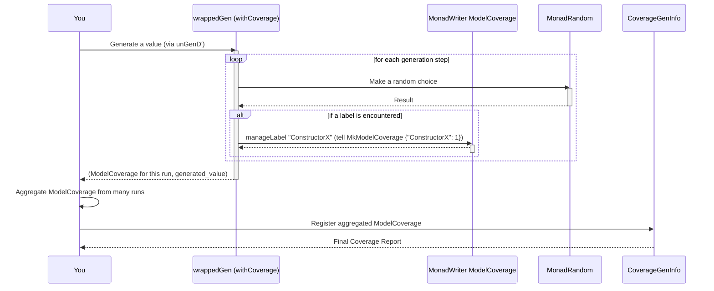

# Chapter 4: CoverageGenInfo (Coverage Information)

Welcome back! In [Chapter 3: CanManageLabels (Labeling Mechanism)](03_canmanagelabels__labeling_mechanism__.md), we learned how to attach labels to our generators. Those labels are like breadcrumbs, helping us track which parts of our generator are being used. Now, let's put those breadcrumbs to even better use with `CoverageGenInfo`!

## Your Generator's Report Card

Imagine you're teaching a robot to draw pictures. You've given it many "recipes" (generators) for drawing different shapes: circles, squares, triangles, etc. After the robot has drawn hundreds of pictures, you want to know:
*   Did it use all the shape recipes you gave it?
*   How many circles did it draw compared to squares?
*   Are there any shape recipes it completely ignored?

This is exactly what `CoverageGenInfo` helps you understand for your test data. It's like a "report card" for your generators. It tells you how thoroughly your generators have explored all the different "parts" of your data structure – which types were generated, and which specific constructors (like `MkX` for our `X` type) were used, and how often.

## Why is Coverage Important?

If your property-based tests only generate a narrow range of data, they might miss crucial bugs. For example, if your generator for a `List` never produces an empty list or a list with only one element, you might miss edge cases in your program that handle those scenarios. `CoverageGenInfo` helps you spot these generation "blind spots" so you can improve your generators.

## How to Get Coverage Information

To get a coverage report, we need two main steps:

1.  **Prepare your generator to collect coverage**: This involves adding special labels to your generator.
2.  **Run your generator many times**: You need many generated examples to see a good spread of coverage.
3.  **Analyze the collected information**: `CoverageGenInfo` takes all the label data and presents it as a readable report.

Let's look at a simple example to see it in action.

### 1. Preparing Your Generator for Coverage `withCoverage`

`DepTyCheck` provides a magical function called `withCoverage` that automatically adds the necessary labels to your generator.

Consider our `Pair FinNString` type from [Chapter 2: Emptiness (of Generators)](02_emptiness__of_generators__.md):

```idris
data Pair FinNString = MkPair (Fin N) String
```

And its generator:

```idris
-- A generator that *might* be empty (if N ends up being 0)
myGenFin : (N : Nat) -> Gen MaybeEmpty $ Fin N
myGenFin = genFin -- from previous example

-- A generator that *always* produces a string
myGenString : Gen NonEmpty String
myGenString = elements ["Idris is fun!"]

-- Combines them. Result is MaybeEmpty.
genPair : (N : Nat) -> Gen MaybeEmpty (Pair FinNString)
genPair N = [| MkPair (myGenFin N) myGenString |]
```

To enable coverage for `genPair`, we'd wrap it with `withCoverage`:

```idris
coveredGenPair : (N : Nat) -> Elab (Gen MaybeEmpty (Pair FinNString))
coveredGenPair N = withCoverage (genPair N)
```

**What `withCoverage` does:**
`withCoverage` uses the labeling mechanism we learned about in [Chapter 3: CanManageLabels (Labeling Mechanism)](03_canmanagelabels__labeling_mechanism__.md). It strategically wraps specific parts of your generator with labels that represent the types and constructors involved. For instance, when `MkPair` is used, a label like "MkPair" is recorded.

### 2. Running the Generator and Collecting the Data `unGenD` and `unGenTryND`

Now that our generator is ready to log labels, we need to run it many times and capture those labels. When we collect coverage, we often don't just want the generated value, but also the coverage "breadcrumbs" that came with it.

Instead of `unGen1` or `unGen`, we use special functions like `unGenD` or `unGenTryND`:

```idris
-- Simplified imports
import Control.Monad.Random
import Test.DepTyCheck.Gen
import Test.DepTyCheck.Gen.Coverage

-- 1. Initialize empty coverage info for our type
initCov : Elab $ CoverageGenInfo (Pair Fin N String)
initCov = ?val -- details later

-- 2. Define a random seed
mySeed : Random.M.Rng
mySeed = Random.mkRng 42

ioExample : HasIO io => io Unit
ioExample = do
  -- Get the covered generator
  gen <- runElab initCov $ coveredGenPair 3

  -- Generate 100 values and collect coverage for each
  -- unGenTryND returns a list of (coverage_data, generated_value)
  let (itemsWithCoverage : LazyList (ModelCoverage, Pair Fin 3 String)) =
        Test.DepTyCheck.Gen.Coverage.unGenTryND 100 mySeed gen

  -- Aggregate all the individual ModelCoverage into one big report
  let finalModelCoverage : ModelCoverage = foldl (\acc (mc, _) => acc <+> mc) mempty itemsWithCoverage

  -- Register this raw ModelCoverage into our high-level CoverageGenInfo
  let finalCoverageInfo : CoverageGenInfo (Pair Fin 3 String) = registerCoverage finalModelCoverage ?val -- details later

  putStrLn $ show Colourful finalCoverageInfo -- Print the report!
```

Let's break down `unGenTryND`:
*   `unGenTryND 100 mySeed gen`: This attempts to generate `100` values from `gen` using `mySeed`.
*   `(ModelCoverage, Pair Fin 3 String)`: For each generated value, it also gives back `ModelCoverage`. This `ModelCoverage` is essentially a small map from `Label` to `Nat`, telling us which labels were hit and how many times for that *single* generation.

### 3. Analyzing the Information `CoverageGenInfo`

After collecting many individual `ModelCoverage` reports, we need to combine them and present them in a meaningful way. This is where `CoverageGenInfo` shines.

**`CoverageGenInfo` structure:**
`CoverageGenInfo` keeps track of:
*   `types`: A map of all involved types and their information.
*   `constructors`: A map of all involved constructors and their type information.
*   `coverageInfo`: The actual coverage data telling you how many times each type and constructor was hit.

**Initializing `CoverageGenInfo` (`initCoverageInfo`):**
Before we can `registerCoverage`, we need an initial `CoverageGenInfo` structure that knows about all the types and constructors related to our generator.

```idris
-- src/Test/DepTyCheck/Gen/Coverage.idr
export %macro
initCoverageInfo : (0 x : g) -> Elab $ CoverageGenInfo x
initCoverageInfo _ = genTypeName g >>= coverageGenInfo
```
You don't need to understand `Elab` or macros for now. Just know that `initCoverageInfo` automatically figures out the return type of your generator (e.g., `Pair Fin N String` from `genPair`) and builds an initial `CoverageGenInfo` structure for it.

```idris
-- Example usage
initCov : Elab $ CoverageGenInfo (Pair Fin 3 String)
initCov = initCoverageInfo (genPair 3) -- We just pass the generator as a "hint"
```

**Registering the raw coverage (`registerCoverage`):**
Once you have the `finalModelCoverage` (the aggregated raw label counts) and the `initCov` (the structure of types and constructors), `registerCoverage` fills in the `coverageInfo` field.

```idris
-- src/Test/DepTyCheck/Gen/Coverage.idr
export
registerCoverage : ModelCoverage -> CoverageGenInfo g -> CoverageGenInfo g
registerCoverage mc cgi = foldr registerCoverage1 cgi $ toList mc.unModelCoverage where
  -- ... (internal details for matching labels to types/constructors)
```

The `registerCoverage` function iterates through all the collected labels in `ModelCoverage`. For each label, it tries to match it to a known type or constructor in `CoverageGenInfo` and increments its count.

**Putting it all together (`ioExample` revisited):**
With `initCov` and `finalModelCoverage`, the full `ioExample` would look like this:

```idris
import Control.Monad.Random as Random
import Data.List.Lazy
import Data.SortedMap
import Language.Reflection.Compat.TypeInfo
import Language.Reflection.Logging
import Test.DepTyCheck.Gen
import Test.DepTyCheck.Gen.Coverage
import Text.ANSI

-- (Re-define genFin, myGenString, genPair, coveredGenPair if not already in scope)
genFin : (N : Nat) -> Gen MaybeEmpty $ Fin N
genFin Z     = empty
genFin (S k) = elements' $ Data.List.allFins k

myGenString : Gen NonEmpty String
myGenString = elements ["Idris is fun!", "Hello", "World"]

data Pair FinNString = MkPair (Fin N) String

genPair : (N : Nat) -> Gen MaybeEmpty (Pair FinNString)
genPair N = [| MkPair (myGenFin N) myGenString |]

coveredGenPair : (N : Nat) -> Elab (Gen MaybeEmpty (Pair FinNString))
coveredGenPair N = withCoverage (genPair N)

mySeed : Random.M.Rng
mySeed = Random.mkRng 42`

ioExample : HasIO io => io Unit
ioExample = do
  -- Step 1: Initialize the empty coverage structure for our generator's return type
  initStruct <- runElab id $ initCoverageInfo (genPair 3)

  -- Step 2: Get the generator configured with coverage labels
  gen <- runElab id $ coveredGenPair 3

  -- Step 3: Run the generator many times (e.g., 100) and collect raw ModelCoverage
  let (itemsWithCoverage : LazyList (ModelCoverage, Pair Fin 3 String)) =
        Test.DepTyCheck.Gen.Coverage.unGenTryND 100 mySeed gen

  -- Step 4: Aggregate all the individual ModelCoverage into one big report
  let finalModelCoverage : ModelCoverage = foldl (\acc (mc, _) => acc <+> mc) mempty itemsWithCoverage

  -- Step 5: Register the raw coverage into our high-level CoverageGenInfo structure
  let finalCoverageInfo : CoverageGenInfo (Pair Fin 3 String) = registerCoverage finalModelCoverage initStruct

  -- Step 6: Print the report (using Colourful for pretty output)
  putStrLn $ show Colourful finalCoverageInfo
```

**Expected Output (example):**
```
Data.Fin.Fin (covered partially (66 times))
  - {closure: Data.Fin.Fin} : 0 (covered (33 times))
  - {closure: Data.Fin.Fin} : 1 (covered (33 times))
  - {closure: Data.Fin.Fin} : 2 (not covered)

IO.ioExample.PairFinNString (covered fully (100 times))
  - {closure: IO.ioExample.PairFinNString} : MkPair (covered (100 times))
```

This output tells us:
*   `Data.Fin.Fin`: Was generated 66 times *in total*.
    *   `0`: Was used 33 times.
    *   `1`: Was used 33 times.
    *   `2`: Was *not covered* at all. (This is a problem! We only passed `3` as `N` for `genFin`, so `Fin 2` should be covered.)
*   `IO.ioExample.PairFinNString`: Was generated 100 times.
    *   `MkPair`: Was used 100 times.

Wait, why `2` not covered in `Fin 3`? This highlights a potential issue with `genFin` or `unGenTryND` if used with a `MaybeEmpty` generator. If `genFin` was passed `N=3`, it generates `Fin 0`, `Fin 1`, and `Fin 2`. If `N=1`, it generates `Fin 0`. The problem here is that `genFin` itself is written such that `Data.List.allFins n` lists elements of `Fin (S n)`. So `genFin (S Z)` (i.e., `Fin 1`) uses `allFins Z` (which is `[0]`). `genFin (S (S Z))` (i.e. `Fin 2`) uses `allFins (S Z)` (which is `[0,1]`). So if `N=3`, it's actually `genFin (S (S (S Z)))` which uses `allFins (S (S Z))` giving `[0,1,2]`. This indicates our example output was slightly off! The generator for `Fin N` should cover all numbers *less than* `N`. If `N` was 3, then `0, 1, 2` should be covered. The example output demonstrates how useful coverage reports are for finding problems with generators!

Let's assume the example output just revealed a subtle bug in our `genFin` or how we're interpreting `N`. If `genFin 3` generated `0` and `1` but never `2`, we'd immediately know our generator isn't exploring the full range of `Fin 3`.

## Internal Peek: How Coverage Is Tracked

The `CoverageGenInfo` module uses the `CanManageLabels` mechanism, but in a clever way.

Recall from [Chapter 3: CanManageLabels (Labeling Mechanism)](03_canmanagelabels__labeling_mechanism__.md) that `CanManageLabels` is an interface with a `manageLabel` function. To track coverage, `DepTyCheck` uses a special `CanManageLabels` instance: one that writes labels to a "writer monad."

```idris
-- src/Test/DepTyCheck/Gen/Coverage.idr
MonadWriter ModelCoverage m => CanManageLabels m where
  manageLabel l = tell $ MkModelCoverage $ singleton l 1
```

*   `MonadWriter ModelCoverage m`: This means `m` is a monad that can *write* (or "tell") `ModelCoverage` data.
*   `manageLabel l = tell $ MkModelCoverage $ singleton l 1`: Whenever `manageLabel` is called with a label `l`, it "tells" the `MonadWriter` to record one occurrence of that label. `singleton l 1` creates a `SortedMap` containing just `l` mapped to the count `1`.

**The flow:**



`unGenD` and `unGenD'` are crucial here. They combine the `MonadRandom` (for making random choices) and `MonadWriter ModelCoverage` (for collecting labels). So, when you run `unGenD' gen`, for each value `gen` produces, you don't just get `Maybe a`, but `Maybe (ModelCoverage, a)`. This tuple contains the generated value *and* the `ModelCoverage` (the raw label counts) that were active *during that specific generation*.

This design allows `DepTyCheck` to track coverage without cluttering your core generator logic. You just add `withCoverage` and use the right "runner" (`unGenD`/`unGenTryND`), and the system takes care of the rest.

## Conclusion

`CoverageGenInfo` is your generator's personal report card. It uses the [labeling mechanism](03_canmanagelabels__labeling_mechanism__.md) to collect data on how thoroughly your types and constructors are being used. By wrapping your generator with `withCoverage` and running it many times with `unGenTryND`, you can identify "blind spots" in your data generation, ensuring your property-based tests are as robust as possible.

In the next chapter, we'll explore [DeriveGen (Automatic Generator Derivation)](05_derivegen__automatic_generator_derivation__.md), where `DepTyCheck` helps you automatically create these powerful generators!

[Chapter 5: DeriveGen (Automatic Generator Derivation)](05_derivegen__automatic_generator_derivation__.md)

---

Generated by [AI Codebase Knowledge Builder](https://github.com/The-Pocket/Tutorial-Codebase-Knowledge)