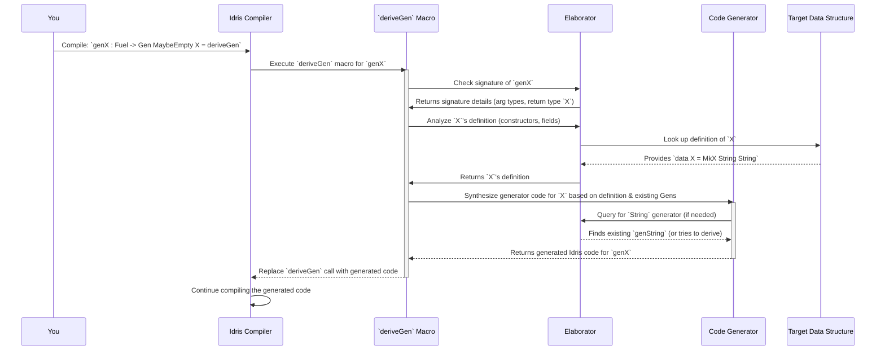

# Chapter 5: DeriveGen (Automatic Generator Derivation)

Welcome back! In [Chapter 4: CoverageGenInfo (Coverage Information)](04_coveragegeninfo__coverage_information__.md), we learned how to get a "report card" for our generators to ensure they explore all possibilities. Now, let's look at `DeriveGen`, an incredibly powerful feature that can write these generators for us automatically!

## The Smart Chef: What is `DeriveGen`?

Imagine you're a chef, and you have a recipe book filled with data type definitions. Each recipe describes how to make a particular "dish" – say, a `Person` data type with a `Name` and `Age`.

Traditionally, if you wanted to prepare many different examples of `Person` (like `MkPerson "Alice" 30`, `MkPerson "Bob" 25`), you'd have to write out a generator for it yourself, like:

```idris
mkGenPerson : Gen NonEmpty Person  -- We'd need to write this ourselves
mkGenPerson = [| MkPerson genName genAge |]
```

This can get tedious and error-prone, especially for complex data types with many fields or nested structures.

`DeriveGen` is like an **intelligent chef** who can look at a recipe (your data type definition) and automatically figure out how to prepare different versions of that dish (generate instances of your data type). Instead of manually writing code for `Gen` to produce examples, `deriveGen` analyzes your type and writes the generator for you using Idris 2's powerful metaprogramming features. It saves a lot of manual effort for complex data structures.

## Why is `DeriveGen` so great?

1.  **Saves Time**: You don't have to write generators manually.
2.  **Reduces Errors**: Automatically generated code is less likely to have typos or logical mistakes than manual code.
3.  **Consistency**: Ensures all parts of your data structure are covered in a uniform way (though you can tune this later).
4.  **Handles Complexity**: Especially useful for nested or recursive data types, where manual generators can be tricky.

## Your First Derived Generator

Let's start with a very simple data type:

```idris
data MyBool = MyTrue | MyFalse
```

Now, let's ask `DeriveGen` to create a generator for `MyBool`s.

```idris
%language ElabReflection -- Needed for macros like `deriveGen`

genMyBool : Fuel -> Gen MaybeEmpty MyBool
genMyBool = deriveGen
```

That's it! Just two lines of code (plus the `language` directive)!

Let's break it down:
*   `%language ElabReflection`: This is a special Idris directive. `deriveGen` uses advanced features of Idris 2 called "Elaborator Reflection" or "metaprogramming." This line tells the Idris compiler that we're going to use those features. Think of it as turning on a special "advanced tools" setting for the compiler.
*   `genMyBool : Fuel -> Gen MaybeEmpty MyBool`: This is the type signature of our generator.
    *   `Fuel`: This is a standard concept in `DepTyCheck` to handle potentially infinite generation, especially for recursive types. Think of `Fuel` as a counter that limits the depth of recursion. It ensures that the generator eventually stops, preventing infinite loops. We'll always include `Fuel` as the first argument in derived generators.
    *   `Gen MaybeEmpty MyBool`: This says our generator produces `MyBool` values and *might* be empty. All derived generators are initially `MaybeEmpty` by default because `deriveGen` generates the most general type possible.
*   `genMyBool = deriveGen`: This is the magic! This tells Idris, "Please, `deriveGen`, write the body of `genMyBool` for me based on its type signature."

When you compile this code, Idris 2 will analyze the `MyBool` data type, see its constructors (`MyTrue`, `MyFalse`), and automatically generate something similar to this for `genMyBool`:

```idris
-- This is what `deriveGen` *might* generate internally (simplified):
genMyBool' : Fuel -> Gen MaybeEmpty MyBool
genMyBool' (MkFuel Z)    = empty -- No fuel left, so generate nothing
genMyBool' (MkFuel (S _)) = oneOf [ pure MyTrue, pure MyFalse ]
```
(The actual generated code is more complex for generality, but the idea is the same: it considers all constructors and uses `oneOf` to pick between them.)

Now, if you were to "run" `genMyBool` (with some `Fuel`), it would randomly give you `MyTrue` or `MyFalse`.

## Handling More Complex Types

Let's try deriving a generator for a slightly more complex type, our `X` type from [Chapter 1: Gen (Generator)](01_gen__generator__.md):

```idris
data X = MkX String String
```

Now, with `deriveGen`:

```idris
genX : Fuel -> Gen MaybeEmpty X
genX = deriveGen
```

Again, `deriveGen` will look at `MkX String String`. It sees that `MkX` takes two `String` arguments. It will then automatically figure out how to generate `String`s.

The generated code will internally look something like:

```idris
-- Simplified internal generation by deriveGen for X
genX' : Fuel -> Gen MaybeEmpty X
genX' (MkFuel Z)    = empty
genX' (MkFuel (S fuel')) = [| MkX (genString fuel') (genString fuel') |]
  where
    -- It needs an internal way to generate String, which is also Fuel-dependent
    genString : Fuel -> Gen MaybeEmpty String
    genString f = -- complex logic for String, e.g., elements ["", "a", "b", ...]
                  -- possibly using another derived generator for simple String types
                  -- or a built-in one.
```

This `deriveGen` works by looking for existing generators for the types it needs (like `String` in this case). If it can't find one, it tries to derive one itself.

## Deriving Generators for Dependent Types

Let's consider our familiar `Fin n` example. We already have `genFin`:

```idris
genFin : (n : Nat) -> Gen MaybeEmpty $ Fin n
genFin Z     = empty
genFin (S n) = elements' $ Data.List.allFins n
```

Suppose we want a generator that generates both the `n` and a `Fin n` value. We saw how to write it manually with `genAnyFin` using the `Monad` instance for `Gen`. `deriveGen` can also do this for us!

Recall the specific structure of the type signature `deriveGen` expects for parameters it should *generate*: a dependent pair, like `(n ** Fin n)`.

```idris
genAnyFinDerived : Fuel -> Gen MaybeEmpty (n ** Fin n)
genAnyFinDerived = deriveGen
```

Here, `deriveGen` will realize:
1.  It needs to generate a `Nat` (for `n`).
2.  It needs to generate a `Fin n`.
3.  The generation of `Fin n` depends on the `n` generated in step 1.

`deriveGen` handles this dependency automatically. It essentially synthesizes a `do` block (if needed) to create such dependent structures. The fuel argument is passed down recursively, ensuring a finite search for suitable `n` values.

## When `deriveGen` Needs Your Help: External Generators

What if your data type has fields of types that `deriveGen` can't automatically handle, or if you want to provide specific generators for certain types? This is where "external generators" come in.

Let's define a new data type `DataWithSpecialString`:

```idris
data DataWithSpecialString = MkDataWithSpecialString MyBool String
```

If we just do `genDataWithSpecialString = deriveGen`, `deriveGen` will use its default mechanism for `String` (which might be simple single-character strings or empty strings). But what if we want to use our *special* `genMoreStrings` (from [Chapter 1: Gen (Generator)](01_gen__generator__.md)) for *all* `String` fields in our `DataWithSpecialString`?

We can provide an external generator in the type signature using the `=>` syntax, similar to type classes:

```idris
-- genMoreStrings : Gen NonEmpty String (from Chapter 1)
-- Let's make it Fuel-aware for deriveGen
myCustomGenString : Fuel -> Gen NonEmpty String
myCustomGenString (MkFuel Z) = empty -- When no fuel left, it becomes empty
myCustomGenString (MkFuel (S _)) = genMoreStrings -- Otherwise, use our existing generator

genDataWithSpecialString : (Fuel -> Gen NonEmpty String) => Fuel -> Gen MaybeEmpty DataWithSpecialString
genDataWithSpecialString = deriveGen
```

`genDataWithSpecialString: (Fuel -> Gen NonEmpty String) => Fuel -> Gen MaybeEmpty DataWithSpecialString`

Here's what changed:
*   `genDataWithSpecialString`: This is the function we want `deriveGen` to fill in.
*   `(Fuel -> Gen NonEmpty String) =>`: This is the **external generator argument**. It tells `deriveGen`: "When you need a `String` generator, please use **this specific generator** (which a `Fuel -> Gen NonEmpty String`) instead of your default one."
    *   Notice `Fuel` is also part of this external generator's signature. This is because all derived generators, and by extension their dependencies, are fuel-dependent.

When `deriveGen` works on `MkDataWithSpecialString MyBool String`, it now knows to look for an implicit argument of type `(Fuel -> Gen NonEmpty String)` to generate the `String` part. It will use `genMyBool` (either derived or manually provided) for `MyBool`.

This mechanism allows you to override `deriveGen`'s default behavior or supply generators for types it wouldn't know how to handle otherwise.

## Internal Peek: How `deriveGen` Works (The Code-Generating Robot)

Understanding what `deriveGen` does internally helps appreciate its power. It's essentially a sophisticated code-generating robot within the Idris 2 compiler.



Let's look at the key parts from the `DepTyCheck` source code, especially `src/Deriving/DepTyCheck/Gen.idr`:

### 1. `deriveGen : DeriveBodyForType => Elab a`

This is the macro you call.
*   `DeriveBodyForType`: This is a constraint that means "there's an implementation for deriving the body of a generator for this type." It's an internal detail that `deriveGen` assumes for correctness.
*   `Elab a`: This indicates that `deriveGen` runs in the `Elab` monad (the elaborator monad), which means it can introspect types, generate code, and interact deeply with the Idris compiler.

The `deriveGen` macro:
1.  `Just signature <- goal`: It first tries to figure out the type signature of the function it's trying to fill. `goal` means "the type the compiler expects for this hole."
2.  `tt <- deriveGenExpr signature`: It then calls `deriveGenExpr` with that signature. This is where the core logic resides. `tt` will contain the generated Idris `TTImp` (term syntax tree) code.
3.  `check tt`: It then "checks" this generated code back into the compiler, making it the body of your function.

### 2. `deriveGenExpr : DeriveBodyForType => (signature : TTImp) -> Elab TTImp`

This function does the heavy lifting:
1.  `checkResult@(signature ** externals ** _) <- checkTypeIsGen DerivationTask signature`: This is where the *analysis* happens.
    *   `checkTypeIsGen`: This function dissects the provided type signature. It confirms that the first argument is `Fuel`, the return type is `Gen MaybeEmpty`, and identifies any target types (like `MyBool`, `X`, or `(n ** Fin n)`), and any `auto`-implicit (external) generators.
    *   `DerivationTask`: This enum indicates that this `checkTypeIsGen` call is for the main derivation, not just finding an external generator.
2.  `callMainDerivedGen signature fuelArg`: Once all the type information and external generators are gathered, this is called. This function, *within the `Elab` monad*, constructs the actual Idris code for the generator's body. It intelligently uses:
    *   `Fuel` argument (recursively passed).
    *   Constructors of the target data type (like `MkX`, `MyTrue`).
    *   `oneOf` for data types with multiple constructors.
    *   `[| ... |]` (Applicative) for constructors with multiple arguments.
    *   `do` notation (Monadic) for dependent types to ensure correct sequencing.
    *   Calls to external generators (if provided) or recursively calls `deriveGenExpr` for nested types.
3.  `wrapFuel fuelArg <$> internalGenCallingLambda checkResult (local locals callExpr)`: Finally, it wraps the entire generated body in the initial `Fuel` argument lambda and any other necessary lambda definitions defined by the original function's arguments.

The `deriveGen` macro effectively "looks" at the type signature, understands the data structure, and then "writes" the generator code into the provided function's body.

## Conclusion

`DeriveGen` is an incredibly powerful feature in `DepTyCheck` that automates the tedious task of writing data generators.
*   You use it by simply writing `FunctionName = deriveGen` with the correct type signature (including `Fuel` and `Gen MaybeEmpty ...`), and providing `Fuel`-aware external generators if you need to override default behavior.
*   It leverages Idris 2's elaborator reflection to analyze your data types and synthesize generator code, saving time and reducing errors.
*   It automatically handles constructors, nested types, and even dependent types by generating appropriate `Gen` combinators (like `oneOf`, `|]`, and `do` blocks).

While it's highly automated, understanding its input requirements (like `Fuel` and `MaybeEmpty`) and how to provide external generators gives you full control.

In the next chapter, we'll dive deeper into [GenSignature (Generator Signature)](06_gensignature__generator_signature__.md), the structured information `deriveGen` extracts from your type signatures to perform its magic.

[Chapter 6: GenSignature (Generator Signature)](06_gensignature__generator_signature__.md)

---

Generated by [AI Codebase Knowledge Builder](https://github.com/The-Pocket/Tutorial-Codebase-Knowledge)