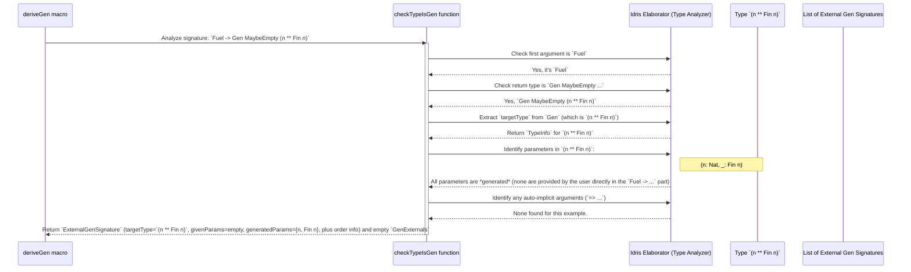

# Chapter 6: GenSignature (Generator Signature)

Welcome back! In [Chapter 5: DeriveGen (Automatic Generator Derivation)](05_derivegen__automatic_generator_derivation__.md), we saw how `deriveGen` can automatically write generators for us. That's pretty amazing, right? But how does it *know* what kind of generator to write? How does it understand your intent from a simple type signature like `Fuel -> Gen MaybeEmpty X`?

This is where `GenSignature` comes in.

## The Architect's Blueprint: What is `GenSignature`?

Imagine `deriveGen` is a brilliant architect. When you ask this architect to build a house (a generator), you give them a detailed blueprint. This blueprint tells the architect:
1.  **What kind of house to build**: This is the final data type you want to generate (e.g., `Person`, `Order`, `Fin n`).
2.  **What materials you'll supply**: These are the input parameters that *you* provide to the generator (e.g., a specific `String` for a name, or a `Nat` for `n` in `Fin n`).
3.  **What the architect needs to figure out**: These are the parts that the architect needs to generate automatically (e.g., a random age, or a `Fin n` value given `n`).
4.  **Any special instructions**: Are there any "guest architects" (external generators) that should handle specific parts (like a special `String` generator)?

In DepTyCheck, the `GenSignature` is exactly this blueprint. It's an internal representation that `deriveGen` creates by analyzing your generator's type signature. It precisely describes the contract between the user (who calls the derived generator) and the generator itself.

## Why is `GenSignature` Important?

`GenSignature` is the central piece of information that makes `deriveGen` work. Without it, `deriveGen` would just see `Fuel -> Gen MaybeEmpty MyType` and wouldn't know anything about `MyType` itself, or how `Fuel` relates to anything, or which parts of `MyType` are given by you and which are generated.

It allows `deriveGen` to:
*   **Understand your intent**: It distinguishes between arguments you supply (like `n` in `genFin n`) and components `deriveGen` should produce.
*   **Generate correct code**: By knowing which parts are inputs and which are outputs, it can use the right `Gen` combinators (like `pure`, `>>=`, `Applicative`).
*   **Handle dependencies**: For dependent types (`Fin n`), it ensures that the `n` generated by `deriveGen` is then used to generate `Fin n`.
*   **Integrate external generators**: It tells `deriveGen` which specific type arguments should use a custom generator you've provided.

## How `deriveGen` Builds a `GenSignature`

Let's revisit our `genAnyFinDerived` from [Chapter 5: DeriveGen (Automatic Generator Derivation)](05_derivegen__automatic_generator_derivation__.md):

```idris
genAnyFinDerived : Fuel -> Gen MaybeEmpty (n ** Fin n)
genAnyFinDerived = deriveGen
```

When you write `genAnyFinDerived = deriveGen`, the `deriveGen` *macro* first looks at the type `Fuel -> Gen MaybeEmpty (n ** Fin n)`. It then extracts key pieces of information to build its internal `GenSignature` blueprint.

Here's how it would build the blueprint for `genAnyFinDerived`:

### 1. Identify the Main Target Type

The core goal of any generator is to produce an instance of a specific type. `deriveGen` looks at the final result of the `Gen` type.

*   In `Gen MaybeEmpty (n ** Fin n)`, the main target type is `(n ** Fin n)`. This is a dependent pair.
*   More generally, this would be a type like `Person String Nat`, or `List (Fin 3)`.

This main target type becomes the `targetType` field in `GenSignature`. `DepTyCheck` uses Idris's `TypeInfo` structure to represent this, which contains detailed information about the data type, its parameters, and its constructors.

```idris
public export
record GenSignature where
  constructor MkGenSignature
  targetType : TypeInfo -- This holds the TypeInfo for (n ** Fin n)
  -- ... other fields
```

### 2. Differentiate "Given" and "Generated" Parameters

This is the most crucial part of `GenSignature`. `deriveGen` needs to know which parts of the `targetType` are provided by *you* as arguments to the generated function, and which parts `deriveGen` should produce on its own.

Consider `(n ** Fin n)`:
*   The `n` here is a `Nat`. This `n` needs to be *generated* by `deriveGen` first.
*   Then, `deriveGen` uses that `n` to generate a `Fin n`.

So, in this case, all the parameters (`n` and the `Fin n`) are *generated* by `deriveGen`. There are no "given" parameters in `genAnyFinDerived`'s signature *after* the `Fuel` argument.

Let's look at `genFin : (N : Nat) -> Gen MaybeEmpty $ Fin N` (this is our handcrafted generator from [Chapter 1: Gen (Generator)](01_gen__generator__.md)). If we were to use `deriveGen` for this, the signature would be:

```idris
-- A hypothetical derived generator for Fig N
deriveGenFin : Fuel -> (N : Nat) -> Gen MaybeEmpty (Fin N)
deriveGenFin = deriveGen
```
For `deriveGenFin`:
*   `N : Nat` is a **given parameter**. You provide the `N`.
*   `Fin N` is the **target type**, and its `N` parameter is supplied by the "given" `N`. The `Fin` value itself is *generated*.

`GenSignature` tracks these using `SortedSet (Fin targetType.args.length)`:

```idris
public export
record GenSignature where
  constructor MkGenSignature
  targetType : TypeInfo
  givenParams : SortedSet $ Fin targetType.args.length -- Indices of parameters *you* provide
  -- ...
```

*   `givenParams`: This `SortedSet` stores the *indices* of the type parameters of `targetType` that are provided as arguments *before* the `Gen` type.
*   `(.generatedParams)`: This is a helper function that tells you which parameters are *generated*. It's simply all parameters *minus* the `givenParams`.

```idris
public export %inline
(.generatedParams) : (sig : GenSignature) -> SortedSet $ Fin sig.targetType.args.length
sig.generatedParams = fromList (allFins sig.targetType.args.length) `difference` sig.givenParams
```

### 3. Handling External Generators: `ExternalGenSignature`

What if you provided an external generator, like our `myCustomGenString` example in [Chapter 5: DeriveGen (Automatic Generator Derivation)](05_derivegen__automatic_generator_derivation__.md)?

```idris
genDataWithSpecialString : (Fuel -> Gen NonEmpty String) => Fuel -> Gen MaybeEmpty DataWithSpecialString
genDataWithSpecialString = deriveGen
```

Here, `GenSignature` captures the `(Fuel -> Gen NonEmpty String)` part as an "external generator." This means `deriveGen` shouldn't try to figure out how to generate `String`s itself; it should use this provided generator instead.

The full internal signature used by `deriveGen` is actually `ExternalGenSignature`, which adds more details to `GenSignature`:

```idris
public export
record ExternalGenSignature where
  constructor MkExternalGenSignature
  targetType : TypeInfo
  givenParams : SortedMap (Fin targetType.args.length) (ArgExplicitness, Name) -- Includes explicitness (implicit/explicit) and name
  givensOrder : Vect givenParams.size $ Fin givenParams.size -- Original order of given parameters
  gendOrder   : Vect gendParamsCnt $ Fin gendParamsCnt -- Original order of generated parameters
```
*   `givenParams`: Now a `SortedMap` that includes whether each given parameter was `ExplicitArg` or `ImplicitArg`, and its user-defined `Name`.
*   `givensOrder` / `gendOrder`: These `Vect`s track the *original order* of arguments. This is important so `deriveGen` can build the generated function with the arguments in the correct order as they appeared in your type signature.

The `deriveGen` macro processes your signature and populates these fields. For `genDataWithSpecialString`, it would find:
*   `targetType`: `DataWithSpecialString`.
*   `ExternalGenSignature` for `(Fuel -> Gen NonEmpty String)`: This is stored separately in `GenExternals`.

## The `checkTypeIsGen` Function: The Signature Analyst

The heart of `deriveGen`'s signature analysis is the internal function `checkTypeIsGen`. This function takes the `TTImp` (the Idris abstract syntax tree representation of your type signature) and dissects it to build the `GenSignature`.

Here's an illustrative sequence of how `checkTypeIsGen` works when `deriveGen` analyzes `Fuel -> Gen MaybeEmpty (n ** Fin n)`:



**Simplified Code Snippet from `src/Deriving/DepTyCheck/Gen.idr`:**

```idris
checkTypeIsGen : (checkSide : GenCheckSide) -> TTImp -> Elab $ CheckResult checkSide
checkTypeIsGen checkSide origsig@sig = do
  sig <- normaliseAsType sig -- Make sure type is fully known and simplified

  let (sigArgs, sigResult) = unPi sig -- Split into arguments and return type

  -- Check `Fuel` argument
  let (firstArg::sigArgs) = sigArgs | [] => failAt (getFC sig) "No fuel arg"
  unless !(firstArgTypeName `isSameTypeAs` `{Data.Fuel.Fuel}) $
    failAt firstArgFC "The first argument must be of type `Fuel`"

  -- Check `Gen MaybeEmpty ...` return type
  let IApp _ (IApp _ (IVar genFC topmostResultName) _) targetType = sigResult
    | _ => failAt (getFC sigResult) "Result type of the generator function must be of type `Gen MaybeEmpty ...`"
  unless !(topmostResultName `isSameTypeAs` `{Test.DepTyCheck.Gen.Gen}) $ ...
  unless (genEmptiness `nameConformsTo` `{Test.DepTyCheck.Gen.Emptiness.MaybeEmpty}) $ ...

  -- Extract the target type (e.g., `(n ** Fin n)`)
  let Just (paramsToBeGenerated, targetType) = unDPairUnAlt targetType
    | Nothing => failAt (getFC targetType) "Unable to interpret type under `Gen` as a dependent pair"
  -- ... more analysis on targetType ...

  -- Analyze the remaining arguments (`sigArgs`) to find given parameters and auto-implicit (external) generators
  (givenParams, autoImplArgs, _) <- map partitionEithersPos $ Prelude.for sigArgs.asVect $ \case
    MkArg MW ImplicitArg (Just $ UN name) type => pure $ Left (Signature.ImplicitArg, name, type)
    MkArg MW ExplicitArg (Just $ UN name) type => pure $ Left (Signature.ExplicitArg, name, type)
    MkArg MW AutoImplicit (Just $ MN _ _) type => pure $ Right type -- This is an external generator
    -- ... error checks for unsupported argument types ...

  -- Build up the final GenSignature and GenExternals based on the collected info
  let genSig = MkExternalGenSignature targetType givenParams givensOrder gendOrder
  -- ... more checks and construction ...

  pure (genSig ** MkGenExternals autoImplArgs ** originalSignatureInfo)
```

This `checkTypeIsGen` function is like a highly sophisticated parser that specializes in understanding generator type signatures. It extracts all the necessary pieces of information from the `TTImp` and turns them into a structured `GenSignature` and `GenExternals` that `deriveGen` can then use to build the actual generator code.

## Conclusion

The `GenSignature` (and its extended version, `ExternalGenSignature`) is the hidden blueprint that powers `deriveGen`. It's the precise specification of what a generated data type looks like, detailing:
*   The ultimate **target type** to be generated.
*   Which parts of the target type are **provided as inputs** to the generated function.
*   Which parts need to be **generated automatically** by `deriveGen`.
*   Any **external (auto-implicit) generators** that `deriveGen` should use for specific types.

By building this `GenSignature` internally, `deriveGen` transforms the abstract type signature you provide into concrete instructions for generating robust test data, saving you immense effort.

Next, we'll look at [DerivationClosure (Derivation Context)](07_derivationclosure__derivation_context__.md), which describes the entire environment that `deriveGen` works within, including how it finds and uses `GenSignatures` and other essential information.

[Chapter 7: DerivationClosure (Derivation Context)](07_derivationclosure__derivation_context__.md)

---

Generated by [AI Codebase Knowledge Builder](https://github.com/The-Pocket/Tutorial-Codebase-Knowledge)