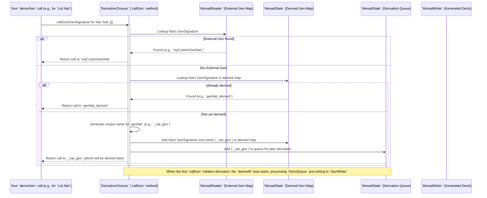

# Chapter 7: DerivationClosure (Derivation Context)

Welcome back! In [Chapter 6: GenSignature (Generator Signature)](06_gensignature__generator_signature__.md), we explored the blueprint (`GenSignature`) that `deriveGen` uses to understand what generator to build. Now, let's step back and look at the bigger picture: `DerivationClosure`. If `deriveGen` is an architect, and `GenSignature` is its blueprint, then `DerivationClosure` is the entire construction company, overseeing all the architects, managing resources, finding materials, and ensuring everything gets built correctly.

## The Construction Manager: What is `DerivationClosure`?

Imagine you're building a vast, complex city. You have many different types of buildings: houses, shops, schools, hospitals. Each building needs its own architect (a `deriveGen` instance) and its own blueprint (`GenSignature`). But the construction of one building might depend on another. For example, you can't build a school without roads leading to it, and roads need raw materials.

`DerivationClosure` is the central coordination entity for all these automatic generator derivations. It's like the main construction manager who:
1.  **Keeps track of building requests**: Which generators (buildings) need to be constructed?
2.  **Manages existing buildings**: Which generators are already available (either handcrafted or previously derived)?
3.  **Avoids redundant work**: If a building type is requested multiple times, it ensures it's only built once.
4.  **Handles dependencies**: If building a "house" needs a "roof generator," it makes sure the "roof generator" is available or initiates its construction.
5.  **Orchestrates the entire process**: It makes sure all sub-generators are created in the right order and eventually delivers the final generator you requested.

The main problem `DerivationClosure` solves is managing the complexity of deriving multiple, potentially interdependent generators. When you call `deriveGen`, it might need to derive generators for other types embedded within your main type. These, in turn, might need to derive even more. `DerivationClosure` is the system that manages this recursive derivation process efficiently and correctly.

## Setting Up a Derivation: `runCanonic`

You, as the user, won't directly interact with `DerivationClosure`'s internal mechanisms very often. Instead, you'll primarily use a function called `runCanonic` to start a derivation process.

Let's illustrate with an example. Suppose you want `DepTyCheck` to derive a generator for a `List Nat`. You already know that `deriveGen` needs a `Fuel` argument and returns a `Gen MaybeEmpty` value.

```idris
%language ElabReflection

import Data.List
import Test.DepTyCheck.Gen

-- Define a custom 'genNat' if you want; otherwise, deriveGen will use a default for Nat
-- For simplicity, let's assume 'deriveGen' knows how to make Nats for now.

deriveGenListNat : Fuel -> Gen MaybeEmpty (List Nat)
deriveGenListNat = deriveGen -- This is what you write
```

When you define `deriveGenListNat` and use `deriveGen`:
1.  The `deriveGen` macro will be triggered.
2.  It needs an *environment* to operate in – where it can find other generators, keep track of what it's deriving, and report results. This environment is `DerivationClosure`.
3.  The macro effectively wraps its internal work within a call to `runCanonic`.

The `runCanonic` function is the entry point for starting a derivation closure. It sets up all the necessary internal `Monad`s (like `Reader`, `State`, `Writer`) that `DerivationClosure` needs to manage its state.

```idris
-- Simplified signature of runCanonic (from src/Deriving/DepTyCheck/Gen/ForAllNeededTypes/Impl.idr)
export
runCanonic : /* ... constraints ... */
             SortedMap ExternalGenSignature Name -> (forall m. DerivationClosure m => m a) -> Elab (a, List Decl)
```

The arguments it takes (simplified):
*   `SortedMap ExternalGenSignature Name`: This is where you can provide any *external generators* you want `deriveGen` to use. For example, if you want it to use `myCustomGenString` for all `String` types, you'd put that here. For now, we can typically pass an empty map if we're relying on `deriveGen`'s defaults.
*   `(forall m. DerivationClosure m => m a)`: This is the core "derivation task." It's a computation that *needs* a `DerivationClosure` environment (`m`) to run. When `deriveGen` processes your signature, it constructs such a computation.
*   `Elab (a, List Decl)`: `runCanonic` returns the result of your derivation task (`a`) and a `List Decl`. The `List Decl` contains all the generated Idris source code (declarations and bodies) for your main generator and any sub-generators it had to derive. This generated code is then "injected" into your Idris program.

So, when you write `deriveGenListNat = deriveGen`, what implicitly happens is something like this during compilation:

```idris
-- This is conceptually what `deriveGen` does using `runCanonic`
deriveGenListNat : Fuel -> Gen MaybeEmpty (List Nat)
deriveGenListNat =
  let (genFunExpr, generatedDecls) =
        runElab id $ runCanonic (empty) $ -- `empty` for external generators if none are provided
          -- Inside this environment, deriveGen generates the code for deriveGenListNat
          -- and collects all generated sub-generators as 'generatedDecls'.
          -- It effectively constructs the computation 'm a' that `runCanonic` needs.
          -- Example: Build a generator for `List Nat`
          buildListNatGenerator (var outmostFuelArg)
  in (genFunExpr : TypeChecking.Term.Raw) -- This term will be type-checked after being generated
```

You usually don't see `runCanonic` directly, as `deriveGen` takes care of this setup behind the scenes.

## The `DerivationClosure` Interface: What it Can Do

`DerivationClosure` is an Idris `interface` (like a type class) that defines the capabilities needed for deriving generators. Any `Monad` `m` that implements this interface can act as a "derivation context."

```idris
-- src/Deriving/DepTyCheck/Gen/ForAllNeededTypes/Interface.idr
public export
interface Elaboration m => NamesInfoInTypes => ConsRecs => DerivationClosure m where
  needWeightFun : TypeInfo -> m ()
  callGen : (sig : GenSignature) -> (fuel : TTImp) -> Vect sig.givenParams.size TTImp -> m (TTImp, Maybe (gend ** Vect gend $ Fin gend))
```

Let's break down these methods:

1.  `needWeightFun : TypeInfo -> m ()`:
    *   **Purpose**: If `deriveGen` encounters a recursive type (like `List` or `Tree`), it needs to decide how to spend `Fuel` to ensure termination. This requires a "weighting function" for that type.
    *   **How it's used**: If `deriveGen` sees a recursive type `T` and doesn't already have a weighting function for it, it calls `needWeightFun T`. This informs the `DerivationClosure` that a weighting function for `T` should also be derived and included in the final generated code.
    *   **Analogy**: "Manager, we need a special crane (weighting function) for this type of building (recursive type) to handle its height (recursion depth)."

2.  `callGen : (sig : GenSignature) -> (fuel : TTImp) -> Vect sig.givenParams.size TTImp -> m (TTImp, Maybe (gend ** Vect gend $ Fin gend))`:
    *   **Purpose**: This is the core method for requesting or using a generator (either externally provided or internally derived).
    *   `sig : GenSignature`: The blueprint of the generator being requested.
    *   `fuel : TTImp`: The `Fuel` argument to pass to the requested generator.
    *   `Vect sig.givenParams.size TTImp`: Any additional arguments that `DerivationClosure` might need to provide to the requested generator (e.g., the `N : Nat` value for `genFin N`).
    *   `m (TTImp, Maybe ...)`: It returns two things:
        *   `TTImp`: The Idris term (actual code) that represents a call to the generator.
        *   `Maybe (...)`: Optional information if this `callGen` actually initiated a new derivation, including the order of generated parameters if any.
    *   **How it's used**: When `deriveGen` is building `deriveGenListNat`, and it needs a generator for `Nat` elements, it calls `callGen` with the `GenSignature` for `Nat`.
        *   If an *external* generator for `Nat` exists (provided in `runCanonic`), it calls that.
        *   Otherwise, it checks if it has *already derived* a generator for `Nat`. If so, it just uses the existing one.
        *   If not, it *initiates the derivation* for `Nat`, adds it to a queue, and returns a call to this soon-to-be-derived `Nat` generator.
    *   **Analogy**: "Manager, I need a 'house' building crew (generator). Is there one ready? Or do I need to hire one (derive it)? Either way, give me the instruction to proceed."

## Internal Peek: The `ClosuringContext`

The actual implementation of `DerivationClosure` is provided by a complex set of `Monad` transformers grouped as `ClosuringContext`. This is where all the construction manager's state is held.

```idris
-- Simplified from src/Deriving/DepTyCheck/Gen/ForAllNeededTypes/Impl.idr
ClosuringContext : (Type -> Type) -> Type
ClosuringContext m =
  ( MonadReader (SortedMap GenSignature (ExternalGenSignature, Name)) m -- Keeps external generators
  , MonadState  (SortedMap GenSignature Name) m                         -- Keeps already derived internal generators
  , MonadState  (List (GenSignature, Name)) m                           -- Queue of generators *to be* derived
  , MonadState  Bool m                                                  -- Flag for starting derivation loop
  , MonadState  (SortedSet Name) m                                      -- Tracks types for which weighting functions are needed
  , MonadWriter (List Decl, List Decl) m                                -- Collects generated declarations and bodies
  )
```

Each line in `ClosuringContext` represents a different "ledger" or "department" that the construction manager needs to keep track of:

*   **`MonadReader` (external gens)**: This is like the list of "pre-approved contractors" that `DerivationClosure` can immediately use for specific jobs (types). These are the `ExternalGenSignature`s you passed to `runCanonic`.
*   **`MonadState` (already derived gens)**: This is the record of "buildings already constructed and available." It maps a `GenSignature` to the `Name` of the Idris function that represents that derived generator. This prevents redundant work.
*   **`MonadState` (queue of gens to be derived)**: This is the "pending orders" list. When `callGen` finds it needs a generator it doesn't have, it adds it to this queue.
*   **`MonadState` (start derivation loop flag)**: A simple flag to make sure the main derivation loop (which processes the queue) is only initiated once by the first `callGen` that requires it.
*   **`MonadState` (weighting functions needed)**: A list of building *types* for which special "weighting criteria" are needed.
*   **`MonadWriter` (generated declarations)**: This is where all the generated Idris code (`Decl`s for declarations and bodies) gets accumulated. This list is returned by `runCanonic` at the very end.

### How `callGen` uses the `ClosuringContext`

When `callGen` is invoked within this `ClosuringContext`, it performs a series of checks:



At the end of the `runCanonic` process, the `DeclWriter` has collected all the `Decl`s for your main generator, its sub-generators, and any required weighting functions. These are then injected into your Idris program, making the `deriveGen` macro produce real, type-checked Idris code.

## Conclusion

`DerivationClosure` is the sophisticated, internal "construction manager" that orchestrates the entire `deriveGen` process. It provides the essential context for `deriveGen` to:
*   Efficiently manage and reuse derived generators.
*   Avoid redundant derivation work.
*   Handle dependencies between generators.
*   Collect all the generated Idris declarations.

You interact with this system indirectly through `deriveGen` and `runCanonic`. Understanding its role helps demystify how `deriveGen` can so cleverly produce complex, interconnected generators from simple type signatures.

Next, we'll delve into [ConsRecs (Constructor Recursiveness)](08_consrecs__constructor_recursiveness__.md), which is part of how `DerivationClosure` figures out how to handle `Fuel` for recursive types.

[Chapter 8: ConsRecs (Constructor Recursiveness)](08_consrecs__constructor_recursiveness__.md)

---

Generated by [AI Codebase Knowledge Builder](https://github.com/The-Pocket/Tutorial-Codebase-Knowledge)